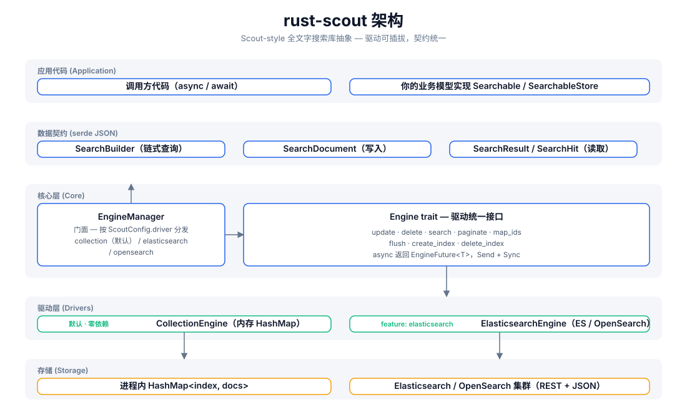
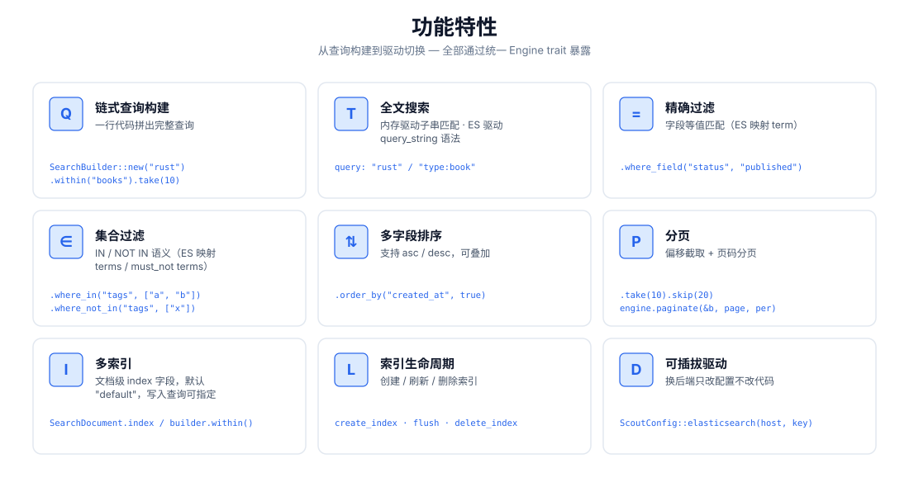
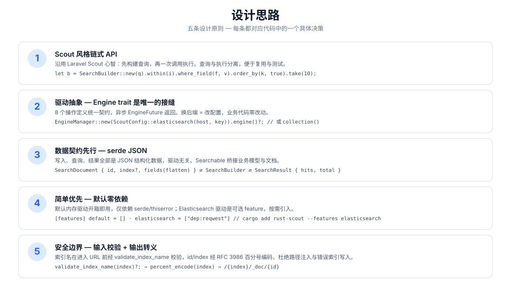
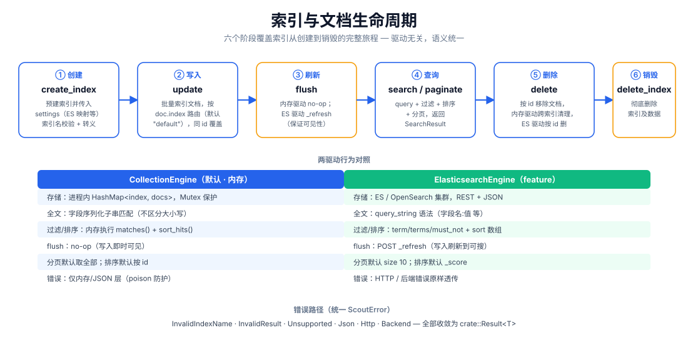

# rust-scout

[](https://crates.io/crates/rust-scout)
[](https://docs.rs/rust-scout)
[](LICENSE)

**Scout-style 全文字搜索库抽象** —— 面向 Rust 的轻量全文搜索接口层。借鉴
[Laravel Scout](https://laravel.com/docs/scout) 的链式查询心智，通过统一的
`Engine` trait 抽象内存与 Elasticsearch/OpenSearch 两类后端：**开发用零依赖内存驱动，
生产无缝切换 ES 集群，业务代码一行不改。**

```rust
let result = engine.search(
    SearchBuilder::new("rust 异步")
        .within("articles")
        .where_field("status", "published")
        .order_by("created_at", true)
        .take(10),
).await?;
```

## 功能特性

| 能力 | 说明 |
|------|------|
| 🔍 全文搜索 | 内存驱动子串匹配；ES 驱动 `query_string` 语法（`字段:值`） |
| ⚙️ 链式查询 | `SearchBuilder`：query / within / where_field / where_in / where_not_in / order_by / take / skip |
| 🎯 精确过滤 | 等值匹配（ES → `term`）、集合匹配（ES → `terms` / `must_not`） |
| 📄 多字段排序 | 可叠加 asc / desc |
| 📃 分页 | `take`/`skip` 偏移截取 + `paginate(page, per_page)` 页码分页 |
| 🗂️ 多索引 | 文档级 `index` 字段路由，默认索引 `"default"` |
| 🔄 索引生命周期 | `create_index` / `flush` / `delete_index` 全流程 |
| 🔌 可插拔驱动 | 默认内存零依赖；`elasticsearch` feature 按需启用 |
| 🔒 安全边界 | 索引名校验（`validate_index_name`）+ RFC 3986 百分号编码，杜绝路径注入 |

## 架构



## 功能总览



## 设计思路



## 生命周期



## 项目结构

```
rust-scout/
├── Cargo.toml            # 依赖与 feature 声明（elasticsearch 可选）
├── src/
│   ├── lib.rs            # crate 根：模块导出 + 公开类型再导出
│   ├── engine.rs         # Engine trait：驱动统一接口（8 个操作）
│   ├── manager.rs        # EngineManager：门面，按配置分发驱动
│   ├── config.rs         # ScoutConfig + validate_index_name
│   ├── builder.rs        # SearchBuilder：链式查询构建与匹配/排序逻辑
│   ├── document.rs       # SearchDocument：写入文档（serde JSON 契约）
│   ├── result.rs         # SearchResult / SearchHit：查询结果
│   ├── searchable.rs     # Searchable / SearchableStore：业务模型桥接
│   ├── error.rs          # ScoutError + Result<T>
│   ├── collection_engine.rs  # 内存驱动（默认）
│   └── elasticsearch_engine.rs # ES/OpenSearch 驱动（feature 可选）
├── tests/                # 集成测试（当前为空）
├── examples/             # 示例（当前为空）
└── docs/
    ├── svg/              # 本 README 引用的架构/功能/设计/生命周期图
    └── superpowers/specs/ # 设计文档
```

## 快速开始

### 1. 添加依赖

```toml
[dependencies]
rust-scout = "0.1"
tokio = { version = "1", features = ["macros", "rt"] }   # 仅示例需要
```

### 2. 最小示例（默认内存驱动）

```rust
use rust_scout::{Engine, EngineManager, ScoutConfig, SearchBuilder, SearchDocument};

#[tokio::main]
async fn main() -> rust_scout::Result<()> {
    // 默认驱动：内存 CollectionEngine，零依赖开箱即用
    let engine = EngineManager::new(ScoutConfig::collection()).engine()?;

    // 写入文档
    let mut book = SearchDocument::new(
        "book-1",
        serde_json::json!({
            "title": "Programming Rust",
            "author": "Blandy & Orendorff",
            "tags": ["rust", "systems"],
            "status": "published",
        }),
    )?;
    book.index = Some("books".to_string());
    engine.update(&[book]).await?;

    // 查询
    let result = engine
        .search(
            SearchBuilder::new("rust")
                .within("books")
                .where_field("status", "published")
                .order_by("title", false)
                .take(10),
        )
        .await?;

    println!("total = {}", result.total);
    for hit in &result.hits {
        println!("  [{}] {:?}", hit.id, hit.source);
    }
    Ok(())
}
```

## 使用说明

### 查询构建（SearchBuilder）

所有查询操作链式拼装，最后交给 `engine.search(&builder)`：

```rust
let builder = SearchBuilder::new("全文关键词")   // 全文搜索（可选，空串 = 匹配全部）
    .within("articles")                          // 指定索引（可选，默认 "default"）
    .where_field("status", "published")          // 等值过滤
    .where_in("tags", ["rust", "async"])         // IN 集合
    .where_not_in("category", ["draft"])         // NOT IN 集合
    .order_by("created_at", true)                // 多字段排序（true = desc）
    .order_by("title", false)
    .take(20)                                    // 每页条数
    .skip(40);                                   // 偏移
```

> `query` 支持 Lucene `query_string` 语法（在 ES 驱动下完整生效）：
> `"rust"`、`"title:rust AND tags:async"`、`"rust~2"`（模糊）。内存驱动按子串匹配处理。

### 分页

```rust
// 方式一：偏移截取
let page2 = SearchBuilder::new("rust").within("books").skip(10).take(10);
// 方式二：页码分页（page 从 1 起）
let page2 = engine.paginate(&SearchBuilder::new("rust").within("books"), 2, 10).await?;
```

### 多索引与生命周期

```rust
engine.create_index("books", serde_json::json!({})).await?;   // 建索引
engine.update(&docs).await?;                                  // 写文档
engine.flush("books").await?;                                 // 刷新可见性
engine.delete(&["book-1".to_string()]).await?;                // 删文档
engine.delete_index("books").await?;                          // 删索引
```

### 切换到 Elasticsearch / OpenSearch

```bash
cargo add rust-scout --features elasticsearch
```

```rust
use rust_scout::{Engine, EngineManager, ScoutConfig};

let config = ScoutConfig::elasticsearch(
    "http://127.0.0.1:9200",      // 或 OpenSearch 地址
    Some("your-api-key".into()),   // 可选：ApiKey 认证
);
let engine = EngineManager::new(config).engine()?;
// —— 之后所有操作与内存驱动完全一致 ——
```

| 对照项 | CollectionEngine（默认） | ElasticsearchEngine |
|--------|--------------------------|---------------------|
| 依赖 | 仅 serde / thiserror | reqwest（feature 启用） |
| 全文 | 序列化子串匹配 | `query_string` |
| 过滤 | 内存 matches() | term / terms / must_not |
| 排序 | 内存 sort_hits() | sort 数组 |
| flush | no-op | `_refresh` |
| 分页默认 | 全部结果 | size 10 |
| 排序默认 | 按 id | 按 _score |

### 错误处理

所有操作返回 `crate::Result<T>`，错误收敛为统一 `ScoutError`：

- `InvalidIndexName` —— 索引名含空白 / `/` / 以 `.` 开头等（写入前校验）
- `InvalidResult` —— 文档字段非 JSON 对象
- `Unsupported` —— feature 未启用等
- `Json` —— serde 错误
- `Http` / `Backend` —— ES 驱动网络与后端错误（feature 启用时）

### 桥接业务模型（Searchable）

实现 `Searchable` 把业务结构映射为可索引文档，实现 `SearchableStore` 封装
`index_documents` / `remove_documents` / `search` 三个操作：

```rust
use rust_scout::{Searchable, SearchableStore, SearchDocument, SearchResult};

struct Article { id: String, title: String, body: String }

impl Searchable for Article {
    fn searchable_id(&self) -> String { self.id.clone() }
    fn to_searchable_json(&self) -> serde_json::Value {
        serde_json::json!({ "title": self.title, "body": self.body })
    }
}
```

## 许可证

MIT License。详见 [LICENSE](LICENSE)。
