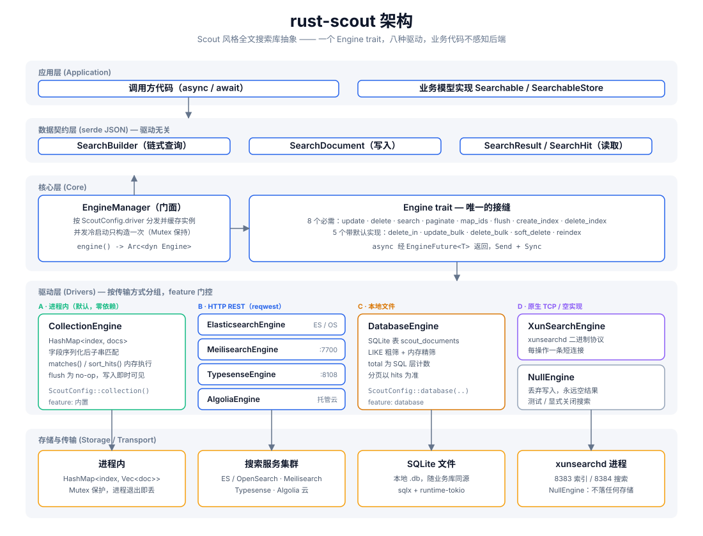
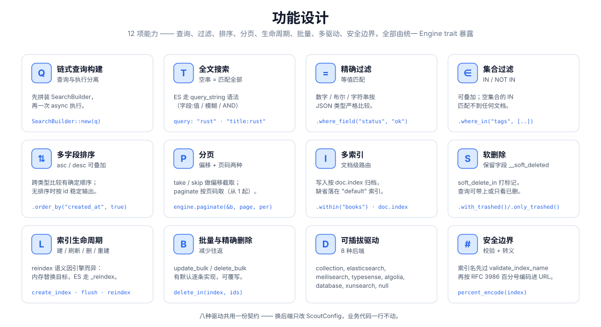
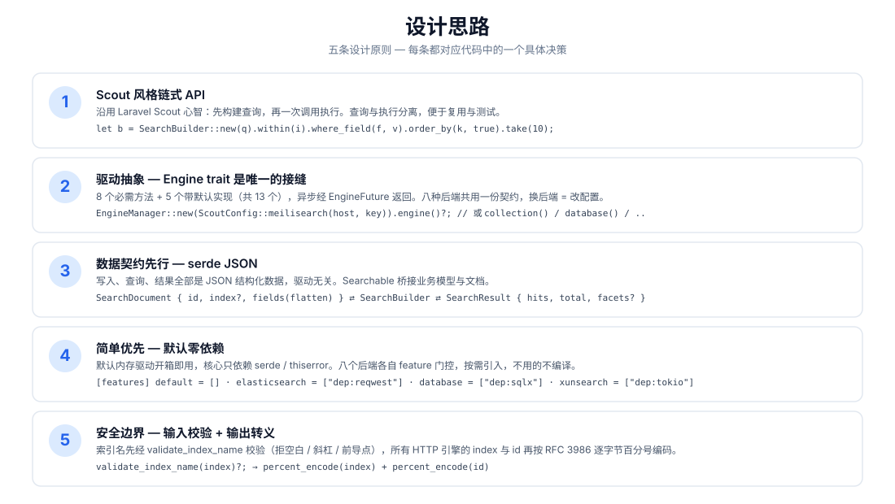
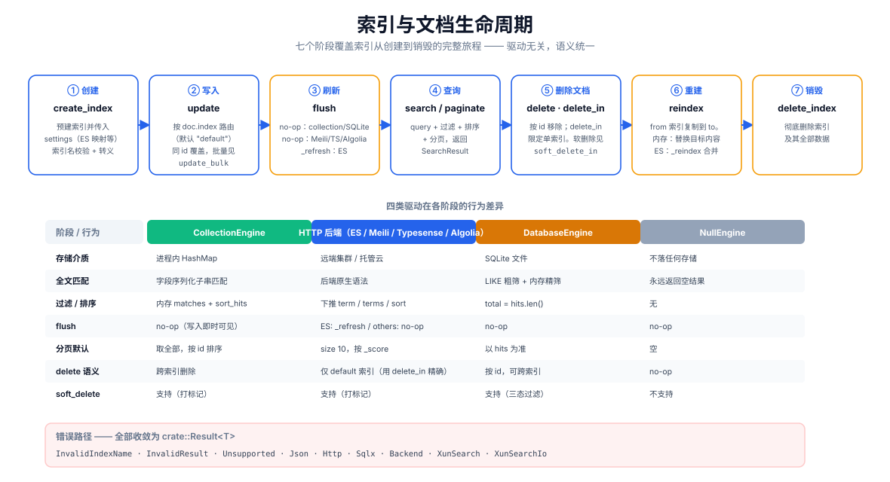

# rust-scout

[](https://crates.io/crates/rust-scout)
[](https://docs.rs/rust-scout)
[](LICENSE)

简体中文 · [English](docs/i18n/en/README.md) · [日本語](docs/i18n/ja/README.md) · [한국어](docs/i18n/ko/README.md) · [Bahasa Indonesia](docs/i18n/id/README.md) · [Русский](docs/i18n/ru/README.md) · [Deutsch](docs/i18n/de/README.md) · [Français](docs/i18n/fr/README.md) · [Español](docs/i18n/es/README.md) · [Português](docs/i18n/pt/README.md) · [हिन्दी](docs/i18n/hi/README.md) · [العربية](docs/i18n/ar/README.md) · [বাংলা](docs/i18n/bn/README.md)

**rust-scout 全文字搜索库抽象** —— 面向 Rust 的轻量全文搜索接口层。借鉴
[Laravel Scout](https://laravel.com/docs/scout) 的链式查询心智，通过统一的
`Engine` trait 抽象 **8 种后端**（内存、Elasticsearch/OpenSearch、Meilisearch、
Typesense、Algolia、SQLite、XunSearch、Null）：**开发用零依赖内存驱动，
生产无缝切换任意后端，业务代码一行不改。**


> 项目宠物 **嗅探猎犬 Scout**（Search Hound）—— 嗅探文档，追踪索引。
> 它不只在文档里：终端横幅和错误提示里都有它，见 [项目宠物](#项目宠物)。

```rust
let result = engine.search(
    SearchBuilder::new("rust 异步")
        .within("articles")
        .where_field("status", "published")
        .order_by("created_at", true)
        .take(10),
).await?;
```

## 功能特性

| 能力 | 说明 |
|------|------|
| 🔍 全文搜索 | 内存驱动子串匹配；HTTP 驱动走后端原生语法（ES 为 `query_string`，`字段:值`） |
| ⚙️ 链式查询 | `SearchBuilder`：query / within / where_field / where_in / where_not_in / order_by / take / skip / option |
| 🎯 精确过滤 | 等值匹配（ES → `term`）、集合匹配（ES → `terms` / `must_not`） |
| 📄 多字段排序 | 可叠加 asc / desc，跨 JSON 类型比较有确定顺序 |
| 📃 分页 | `take`/`skip` 偏移截取 + `paginate(page, per_page)` 页码分页 |
| 🗂️ 多索引 | 文档级 `index` 字段路由，默认索引 `"default"` |
| 🔄 索引生命周期 | `create_index` / `flush` / `reindex` / `delete_index` 全流程 |
| 🗑️ 软删除 | `soft_delete_in(index, ids)` 打 `__soft_deleted` 标记，`with_trashed()` / `only_trashed()` 三态过滤 |
| 📦 批量操作 | `update_bulk` / `delete_bulk` 减少往返；`delete_in` 精确到指定索引删除 |
| 🔌 可插拔驱动 | 默认内存零依赖；8 种后端各自 feature 门控，按需引入不用的不编译 |
| 🔒 安全边界 | 索引名校验（`validate_index_name`）+ RFC 3986 百分号编码，杜绝路径注入 |
| 🐕 项目宠物 | 嗅探猎犬 Scout：终端横幅 + 逐错误的排查提示（`rust_scout::pet`） |

## 架构设计



五层结构：应用层 → 数据契约层（serde JSON）→ 核心层（`EngineManager` + `Engine` trait）
→ 驱动层（按传输方式分四组，共 8 个驱动）→ 存储层。跨层的只有 `Engine` trait 一个接缝。

## 功能设计



12 项能力：链式查询、全文、精确/集合过滤、排序、分页、多索引、软删除、
索引生命周期、批量与精确删除、可插拔驱动、安全边界。

## 设计思路



## 生命周期



七个阶段：创建 → 写入 → 刷新 → 查询 → 删除文档 → 重建 → 销毁。图下半部分是
四类驱动在各阶段的行为差异对照。

## 项目结构

```
rust-scout/
├── Cargo.toml              # 依赖与 feature 声明（默认 default = []，零依赖）
├── src/
│   ├── lib.rs              # crate 根：模块导出 + feature 门控的公开类型再导出
│   │
│   ├── engine.rs           # Engine trait：唯一的驱动契约（8 必需 + 5 默认实现）
│   ├── manager.rs          # EngineManager：门面，按 driver 分发并缓存 Arc<dyn Engine>
│   ├── config.rs           # ScoutConfig（8 个构造器）+ validate_index_name + percent_encode
│   │
│   ├── builder.rs          # SearchBuilder / Where / Order / TrashedFilter：链式查询
│   ├── document.rs         # SearchDocument：写入文档（serde JSON 契约）
│   ├── result.rs           # SearchResult / SearchHit：查询结果
│   ├── searchable.rs       # Searchable / SearchableStore：业务模型桥接
│   ├── error.rs            # ScoutError + Result<T> + pet_hint()
│   ├── pet.rs              # 项目宠物：嗅探猎犬 Scout（横幅 + 错误提示）
│   │
│   ├── collection_engine.rs    # 内存驱动（默认，零依赖）
│   ├── null_engine.rs          # 空驱动：丢弃写入、永远空结果        [null]
│   ├── elasticsearch_engine.rs # ES / OpenSearch（REST）            [elasticsearch]
│   │   └── query.rs            #   query_string 构造与响应解析
│   ├── meilisearch_engine.rs   # Meilisearch（REST）                [meilisearch]
│   ├── typesense_engine.rs     # Typesense（REST）                  [typesense]
│   │   └── typesense_query.rs  #   搜索参数与 filter_by 构造
│   ├── algolia_engine.rs       # Algolia（托管云 REST）              [algolia]
│   ├── database_engine.rs      # SQLite（sqlx，LIKE 粗筛 + 内存精筛） [database]
│   ├── xunsearch_engine.rs     # XunSearch：xunsearchd 原生 TCP 协议  [xunsearch]
│   │   ├── xunsearch_query.rs  #   封包编解码 + ini 字段方案
│   │   └── xunsearch_tests.rs  #   带 mock server 的端到端测试
│   │
│   └── (单元测试内联在各模块底部 #[cfg(test)] mod tests)
├── tests/                  # 集成测试（当前为空，测试内联在 src）
├── examples/
│   └── pet.rs              # cargo run --example pet：宠物横幅 + 错误提示演示
└── docs/
    ├── svg/                # 项目宠物 + 架构 / 功能 / 设计 / 生命周期图
    ├── i18n/               # 12 种语言的 README 与对应 SVG
    ├── coin/               # 打赏二维码
    └── superpowers/specs/  # 设计文档
```

> `[feature]` 标注的是该驱动所需的 Cargo feature；未启用时
> `EngineManager` 会返回 `ScoutError::Unsupported`，而不是静默降级。

### 驱动能力差异

默认内存驱动是语义基准；下列后端做不到的部分会**显式报错**，而不是静默给出错误结果：

| 驱动 | 限制 | 表现 |
|------|------|------|
| Algolia | 排序需预先建 replica index，客户端无法临时指定 | `order_by` **被忽略**（结果仍返回，只是顺序不保证） |
| XunSearch | `where_in` / `where_not_in` 无对应协议命令 | 返回 `Unsupported`，请用 `where_field` |
| XunSearch | 服务端只支持单字段排序 | 多个 `order_by` 返回 `Unsupported` |
| XunSearch | 未实现软删除 | `soft_delete` / `only_trashed` 返回 `Unsupported` |
| XunSearch | 建索引需要字段方案 ini | `create_index` 返回 `Unsupported`（改用 `XunSearchEngine::new` 传 ini） |

另外两处刻意的语义对齐：

- **ES 收到畸形查询语法**（如 `"("`、`"foo AND"`）时返回空结果而非报错 ——
  内存驱动对同样输入是子串匹配，报 400 会破坏「换后端不改代码」。
- **`delete` 与 `soft_delete` 不带索引信息**，跨索引与否因后端而异；
  要精确到某个索引请一律用 `delete_in` / `soft_delete_in`。

## 快速开始

### 1. 添加依赖

```toml
[dependencies]
rust-scout = "0.6"
tokio = { version = "1", features = ["macros", "rt"] }   # 仅示例需要
```

### 2. 最小示例（默认内存驱动）

```rust
use rust_scout::{Engine, EngineManager, ScoutConfig, SearchBuilder, SearchDocument};

#[tokio::main]
async fn main() -> rust_scout::Result<()> {
    // 默认驱动：内存 CollectionEngine，零依赖开箱即用
    let engine = EngineManager::new(ScoutConfig::collection()).engine()?;

    // 写入文档
    let mut book = SearchDocument::new(
        "book-1",
        serde_json::json!({
            "title": "Programming Rust",
            "author": "Blandy & Orendorff",
            "tags": ["rust", "systems"],
            "status": "published",
        }),
    )?;
    book.index = Some("books".to_string());
    engine.update(&[book]).await?;

    // 查询
    let result = engine
        .search(
            SearchBuilder::new("rust")
                .within("books")
                .where_field("status", "published")
                .order_by("title", false)
                .take(10),
        )
        .await?;

    println!("total = {}", result.total);
    for hit in &result.hits {
        println!("  [{}] {:?}", hit.id, hit.source);
    }
    Ok(())
}
```

## 使用说明

### 查询构建（SearchBuilder）

所有查询操作链式拼装，最后交给 `engine.search(&builder)`：

```rust
let builder = SearchBuilder::new("全文关键词")   // 全文搜索（可选，空串 = 匹配全部）
    .within("articles")                          // 指定索引（可选，默认 "default"）
    .where_field("status", "published")          // 等值过滤
    .where_in("tags", ["rust", "async"])         // IN 集合
    .where_not_in("category", ["draft"])         // NOT IN 集合
    .order_by("created_at", true)                // 多字段排序（true = desc）
    .order_by("title", false)
    .take(20)                                    // 每页条数
    .skip(40)                                    // 偏移
    .option("highlight", true)                   // 驱动相关的透传选项
    .with_trashed();                             // 软删除三态：默认排除 / 带上 / 只看
```

> `query` 支持 Lucene `query_string` 语法（在 ES 驱动下完整生效）：
> `"rust"`、`"title:rust AND tags:async"`、`"rust~2"`（模糊）。其余驱动按各自
> 原生语法或子串匹配处理。

### 分页

```rust
// 方式一：偏移截取
let page2 = SearchBuilder::new("rust").within("books").skip(10).take(10);
// 方式二：页码分页（page 从 1 起）
let page2 = engine.paginate(&SearchBuilder::new("rust").within("books"), 2, 10).await?;
```

### 多索引与生命周期

```rust
engine.create_index("books", serde_json::json!({})).await?;    // 建索引
engine.update(&docs).await?;                                   // 写文档
engine.update_bulk(&docs).await?;                              // 批量写（后端支持则走 bulk 接口）
engine.flush("books").await?;                                  // 刷新可见性
engine.search(&builder).await?;                                // 查询
engine.delete_in("books", &["book-1".to_string()]).await?;     // 精确到索引删文档
engine.soft_delete_in("books", &["book-2".to_string()]).await?;  // 软删除（打标记）
engine.reindex("books", "books_v2").await?;                    // 重建索引
engine.delete_index("books").await?;                           // 删索引
```

> `delete` 不带索引信息，语义因引擎而异（内存驱动跨索引删，ES 只看 `default`
> 索引）。要精确到某个索引请用 `delete_in`。
>
> 软删除同理：**`soft_delete_in(index, ids)` 是跨引擎都可靠的那个**。
> 不带索引的 `soft_delete` 只有同步后端（`collection` / `database`）能跨索引标记；
> HTTP 后端做不到，会返回 `ScoutError::Unsupported`（而不是静默什么都不做）。
>
> `flush` 的契约是「刷新写入可见性」，**任何驱动都不会清空索引**：ES 走
> `_refresh`，其余驱动写入即时可见，为 no-op。要清空索引请用 `delete_index`。

### 切换到 Elasticsearch / OpenSearch

```bash
cargo add rust-scout --features elasticsearch
```

```rust
use rust_scout::{Engine, EngineManager, ScoutConfig};

let config = ScoutConfig::elasticsearch(
    "http://127.0.0.1:9200",      // 或 OpenSearch 地址
    Some("your-api-key".into()),   // 可选：ApiKey 认证
);
let engine = EngineManager::new(config).engine()?;
// —— 之后所有操作与内存驱动完全一致 ——
```

| 对照项 | CollectionEngine（默认） | ElasticsearchEngine |
|--------|--------------------------|---------------------|
| 依赖 | 仅 serde / thiserror | reqwest（feature 启用） |
| 全文 | 序列化子串匹配 | `query_string` |
| 过滤 | 内存 matches() | term / terms / must_not |
| 排序 | 内存 sort_hits() | sort 数组 |
| flush | no-op | `_refresh` |
| 分页默认 | 全部结果 | size 10 |
| 排序默认 | 按 id | 按 _score |

### 切换到 Meilisearch

```bash
cargo add rust-scout --features meilisearch
```

```rust
use rust_scout::{Engine, EngineManager, ScoutConfig};

let config = ScoutConfig::meilisearch(
    "http://127.0.0.1:7700",   // Meilisearch 服务地址
    "your-master-key",          // 可选：API 密钥
);
let engine = EngineManager::new(config).engine()?;
// —— 之后所有操作与内存驱动完全一致 ——
```

### 引擎对照

| 引擎 | driver | feature | 传输 | 状态 |
|------|--------|---------|------|------|
| 内存（默认） | `collection` | 内置 | 进程内 | 完整 |
| Elasticsearch / OpenSearch | `elasticsearch` / `opensearch` | `elasticsearch` | HTTP REST | 完整 |
| Meilisearch | `meilisearch` | `meilisearch` | HTTP REST | 完整 |
| Typesense | `typesense` | `typesense` | HTTP REST | 完整 |
| Algolia | `algolia` | `algolia` | HTTP REST | 完整 |
| SQLite | `database` | `database` | 本地文件 | 完整 |
| XunSearch | `xunsearch` | `xunsearch` | 原生 TCP | 完整 |
| Null（测试/禁用搜索） | `null` | `null` | — | 完整 |

其余引擎的配置构造器见 [docs.rs](https://docs.rs/rust-scout)：`ScoutConfig::typesense(host, api_key)`、`ScoutConfig::algolia(app_id, api_key)`、`ScoutConfig::database(url, fields)`、`ScoutConfig::null()`、`ScoutConfig::xunsearch(host, project)`。

> SQLite 引擎（`database`）的 `total` 是**过滤后**的命中数（与 `CollectionEngine`
> 一致）：SQL 只做索引 + LIKE 粗筛把候选集取回，wheres / 软删 / 排序 / 分页都在
> 内存完成。分页不能下推到 SQL 的 `LIMIT/OFFSET`——那样窗口外的匹配行会永远
> 取不回来。

### 保留字段

`__soft_deleted` 是软删除功能（`Engine::soft_delete_in`、`SearchBuilder::with_trashed()`
/ `only_trashed()`）使用的保留字段名，引擎据此过滤软删除文档。用户文档**不应**
使用该字段名作为业务字段。

### 错误处理

所有操作返回 `crate::Result<T>`，错误收敛为统一 `ScoutError`：

| 变体 | 触发场景 | feature |
|------|----------|---------|
| `InvalidIndexName` | 索引名含空白 / `/` / `\`，或以 `.` 开头，或为空；或含 `*` `?` `,` `+` 等通配/多索引字符，或以前导 `-` `_` 开头（写入前校验） | 内置 |
| `InvalidResult` | 文档字段不是 JSON 对象 | 内置 |
| `Unsupported` | 驱动所需 feature 未启用、缺少必需配置、引擎不支持该操作 | 内置 |
| `Json` | serde 序列化 / 反序列化错误 | 内置 |
| `Http` | HTTP 请求失败（连接、超时、状态码） | HTTP 四引擎 |
| `Sqlx` | SQLite 错误 | `database` |
| `Backend` | 后端返回了错误响应，原始信息透传 | HTTP 四引擎 / `xunsearch` |
| `XunSearch` / `XunSearchIo` | 协议解析失败 / TCP I/O 失败 | `xunsearch` |

每个变体都带一条排查提示，见 [`ScoutError::pet_hint()`](#项目宠物)。

### 桥接业务模型（Searchable）

实现 `Searchable` 把业务结构映射为可索引文档，实现 `SearchableStore` 封装
`index_documents` / `remove_documents` / `search` 三个操作：

```rust
use rust_scout::{Searchable, SearchableStore, SearchDocument, SearchResult};

struct Article { id: String, title: String, body: String }

impl Searchable for Article {
    fn searchable_id(&self) -> String { self.id.clone() }
    fn to_searchable_json(&self) -> serde_json::Value {
        serde_json::json!({ "title": self.title, "body": self.body })
    }
}
```

## 项目宠物


**Scout · 嗅探猎犬**（Search Hound）—— 嗅探文档，追踪索引，哪里有查询，哪里就有它。
图形版见 [`docs/svg/pet.svg`](docs/svg/pet.svg)；终端里长这样：

```console
$ cargo run --example pet
```

```

      ___              ___
     /   \            /   \
    |     |__________|     |
    |     /          \     |
    |    |   o    o   |    |
    |    |     __     |    |
    |     \   /  \   /     |
     \     \  \__/  /     /
      \     \________/    /
       \_________________/
         \   ~~~~~~   /
          \__________/
        +----------------+
        |  [] [] [] []   |
        |  [] [] [] []   |
        +----------------+
           ||      ||
           ||      ||
          (__)    (__)


   ,^.     ,^.     ,^.     ,^.

  Scout · 嗅探猎犬 · rust-scout
  嗅探文档，追踪索引 —— 哪里有查询，哪里就有它
```

宠物住在 [`rust_scout::pet`](src/pet.rs) 模块里，**不引入任何依赖**：

| 项 | 说明 |
|----|------|
| `pet::NAME` / `pet::SPECIES` / `pet::TAGLINE` | 名牌信息 |
| `pet::ART` | ASCII 形象（刻意只用 7 位 ASCII，CJK 终端里不会歪） |
| `pet::banner()` | 终端横幅，纯文本无转义序列，可安全写进日志 |
| `pet::hint(&err)` | 逐错误的排查提示，返回 `&'static str` |
| `pet::format_error(&err)` | 原始错误 + 提示，渲染成给人看的样子 |
| `ScoutError::pet_hint()` | 同上提示，直接挂在错误类型上 |

```rust
use rust_scout::{pet, ScoutError};

println!("{}", pet::banner());

let err = ScoutError::Unsupported("缺少 feature".into());
eprintln!("{}", pet::format_error(&err));
// error: unsupported operation: 缺少 feature
//
//   [o_o] Scout：这个后端我还没找到路 —— Cargo.toml 里对应的 feature 启用了吗？
```

> **为什么错误提示不直接塞进 `Display`？** `ScoutError` 的 `Display` 保持单行、
> 机器可读 —— `?` 传播、日志采集、CI 里 grep 错误串都依赖它。要带宠物提示的
> 人类可读输出，走 `pet::format_error()`。

## 支持与打赏

如果这个项目对你有帮助，欢迎打赏支持 ☕ —— 您的支持是持续维护的动力！

### 微信 / 支付宝


微信扫码 · 支付宝扫码

### 虚拟币打赏

| 主网 | 钱包地址 | 二维码 |
|------|----------|--------|
| BNB Smart Chain (BEP20) | `0x355d429f97511897ccb4e271ec888205f9ab6629` |  |
| Tron (TRC20) | `TEdDHWLajt1XvqtPDWmQctdrJaC3pzZZzz` |  |
| Ethereum (ERC20) | `0x355d429f97511897ccb4e271ec888205f9ab6629` |  |
| Aptos | `0x836e3780edfc3f7b2372b39e2a1a3a5d7adfaccd96c726f21cfde1b50dd68030` |  |
| Plasma | `0x355d429f97511897ccb4e271ec888205f9ab6629` |  |
| Polygon POS | `0x355d429f97511897ccb4e271ec888205f9ab6629` |  |
| Solana | `2hfhboHdmdrYsY25XfQSsEWxq5ip4EQsR7f4AzSRMUyr` |  |
| The Open Network (TON) | `UQB9kFQohzmXUir9QSSZq01iwl9aQZIDdBpNmDklljRtCoGK` |  |
| Arbitrum One | `0x355d429f97511897ccb4e271ec888205f9ab6629` |  |
| AVAX C-Chain | `0x355d429f97511897ccb4e271ec888205f9ab6629` |  |

### 全球转账（银行汇款）

**收款人信息**

- 收款人姓名：WANG KEXUN
- 收款账户号码：881015918251

**收款银行（ZA Bank）**

- SWIFT Code：`AABLHKHHXXX`
- 银行名称：ZA Bank Limited
- 银行编号：387
- 银行地址：Core F, Cyberport 3, 100 Cyberport Road, Hong Kong

> 跨境汇款代理银行（中转银行）信息，非收款银行信息。请向汇款银行查询是否需要提供。

- 汇入港元、人民币及美元的代理银行为 **Citibank**：
  - 银行名称：Citibank N.A. Hong Kong
  - SWIFT Code：`CITIHKHXXXX`
  - 银行编号：006 / 分行编号：391
  - 分行名称：Hong Kong Branch
  - 银行地址：Citibank Tower, Citibank Plaza, 3 Garden Road, Central, Hong Kong
- 汇入其他币种时的代理银行为 **BNY Mellon**：
  - 银行名称：THE BANK OF NEW YORK MELLON
  - SWIFT Code：`IRVTUS3NXXX`
  - 银行地址：THE BANK OF NEW YORK MELLON, 240 GREENWICH STREET, NEW YORK, United States

## 许可证

MIT License。详见 [LICENSE](LICENSE)。
