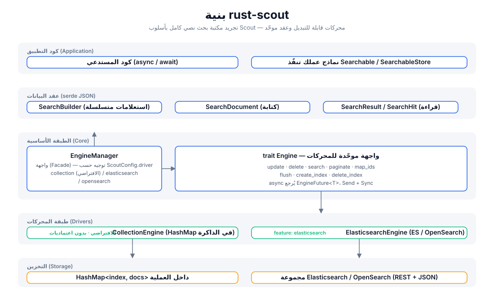
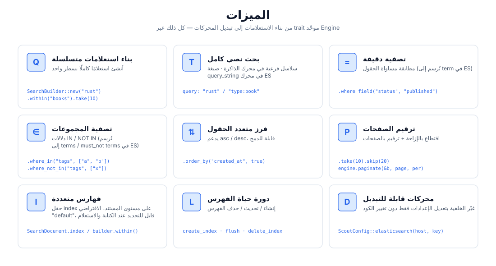
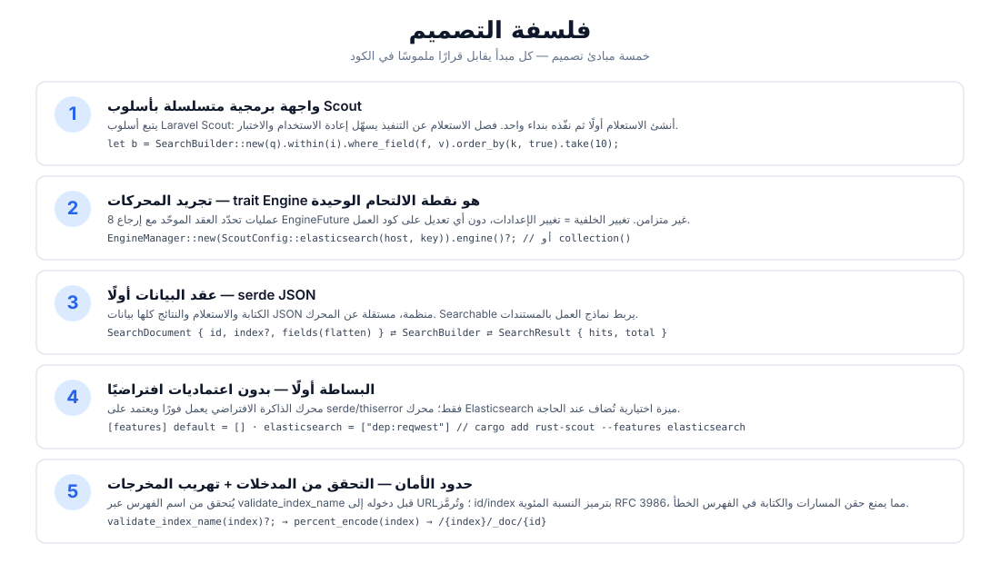
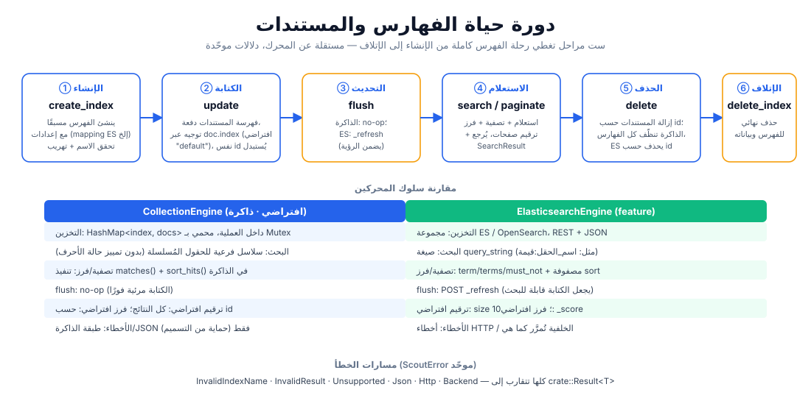

# rust-scout

[](https://crates.io/crates/rust-scout)
[](https://docs.rs/rust-scout)
[](../../../LICENSE)

[简体中文](../../../README.md) · [English](../en/README.md) · [日本語](../ja/README.md) · [한국어](../ko/README.md) · [Русский](../ru/README.md) · [Deutsch](../de/README.md) · [Français](../fr/README.md) · [Español](../es/README.md) · [Português](../pt/README.md) · [हिन्दी](../hi/README.md) · العربية · [বাংলা](../bn/README.md) · [Bahasa Indonesia](../id/README.md)

**rust-scout — تجريد مكتبة بحث نصي كامل** — طبقة واجهة بحث نصي كامل خفيفة للغة Rust. مستوحاة من أسلوب الاستعلامات المتسلسلة في [Laravel Scout](https://laravel.com/docs/scout)، تجرّد عدة خلفيات (Backends) عبر trait موحّد `Engine`: الذاكرة، Elasticsearch/OpenSearch، Meilisearch، Typesense، Algolia، SQLite وغيرها: **في التطوير استخدم محرك الذاكرة بدون أي اعتماديات، وفي الإنتاج انتقل إلى أي خلفية بسلاسة دون تغيير سطر واحد من كود العمل.**

```rust
let result = engine.search(
    SearchBuilder::new("rust 异步")
        .within("articles")
        .where_field("status", "published")
        .order_by("created_at", true)
        .take(10),
).await?;
```

## الميزات

| القدرة | الوصف |
|------|------|
| 🔍 بحث نصي كامل | مطابقة السلاسل الفرعية في محرك الذاكرة؛ صيغة `query_string` في محرك ES (`حقل:قيمة`) |
| ⚙️ استعلامات متسلسلة | `SearchBuilder`: query / within / where_field / where_in / where_not_in / order_by / take / skip |
| 🎯 تصفية دقيقة | مطابقة المساواة (ES ← `term`)، مطابقة المجموعات (ES ← `terms` / `must_not`) |
| 📄 فرز متعدد الحقول | يمكن دمج asc / desc |
| 📃 ترقيم الصفحات | اقتطاع بالإزاحة عبر `take`/`skip` + ترقيم بالصفحات عبر `paginate(page, per_page)` |
| 🗂️ فهارس متعددة | توجيه عبر حقل `index` على مستوى المستند، الفهرس الافتراضي `"default"` |
| 🔄 دورة حياة الفهرس | العملية الكاملة لـ `create_index` / `flush` / `delete_index` |
| 🔌 محركات قابلة للتبديل | الذاكرة افتراضيًا بدون اعتماديات؛ ميزات `elasticsearch` / `meilisearch` / `typesense` / `algolia` / `database` / `null` تُفعَّل عند الحاجة؛ `xunsearch` عبارة عن stub مؤقت |
| 🔒 حدود الأمان | التحقق من اسم الفهرس (`validate_index_name`) + ترميز النسبة المئوية RFC 3986، لمنع حقن المسارات |

## البنية



## نظرة عامة على الميزات



## فلسفة التصميم



## دورة الحياة



## هيكل المشروع

```
rust-scout/
├── Cargo.toml            # 依赖与 feature 声明（elasticsearch 可选）
├── src/
│   ├── lib.rs            # crate 根：模块导出 + 公开类型再导出
│   ├── engine.rs         # Engine trait：驱动统一接口（8 个操作）
│   ├── manager.rs        # EngineManager：门面，按配置分发驱动
│   ├── config.rs         # ScoutConfig + validate_index_name
│   ├── builder.rs        # SearchBuilder：链式查询构建与匹配/排序逻辑
│   ├── document.rs       # SearchDocument：写入文档（serde JSON 契约）
│   ├── result.rs         # SearchResult / SearchHit：查询结果
│   ├── searchable.rs     # Searchable / SearchableStore：业务模型桥接
│   ├── error.rs          # ScoutError + Result<T>
│   ├── collection_engine.rs  # 内存驱动（默认）
│   └── elasticsearch_engine.rs # ES/OpenSearch 驱动（feature 可选）
├── tests/                # 集成测试（当前为空）
├── examples/             # 示例（当前为空）
└── docs/
    ├── svg/              # 本 README 引用的架构/功能/设计/生命周期图
    └── superpowers/specs/ # 设计文档
```

## بدء سريع

### 1. إضافة التبعية

```toml
[dependencies]
rust-scout = "0.1"
tokio = { version = "1", features = ["macros", "rt"] }   # مطلوب للأمثلة فقط
```

### 2. مثال أدنى (محرك الذاكرة الافتراضي)

```rust
use rust_scout::{Engine, EngineManager, ScoutConfig, SearchBuilder, SearchDocument};

#[tokio::main]
async fn main() -> rust_scout::Result<()> {
    // المحرك الافتراضي: CollectionEngine في الذاكرة، يعمل فورًا بدون اعتماديات
    let engine = EngineManager::new(ScoutConfig::collection()).engine()?;

    // كتابة المستندات
    let mut book = SearchDocument::new(
        "book-1",
        serde_json::json!({
            "title": "Programming Rust",
            "author": "Blandy & Orendorff",
            "tags": ["rust", "systems"],
            "status": "published",
        }),
    )?;
    book.index = Some("books".to_string());
    engine.update(&[book]).await?;

    // الاستعلام
    let result = engine
        .search(
            SearchBuilder::new("rust")
                .within("books")
                .where_field("status", "published")
                .order_by("title", false)
                .take(10),
        )
        .await?;

    println!("total = {}", result.total);
    for hit in &result.hits {
        println!("  [{}] {:?}", hit.id, hit.source);
    }
    Ok(())
}
```

## دليل الاستخدام

### بناء الاستعلامات (SearchBuilder)

تُجمَّع جميع عمليات الاستعلام على شكل سلسلة، وتُمرَّر أخيرًا إلى `engine.search(&builder)`:

```rust
let builder = SearchBuilder::new("全文关键词")   // بحث نصي كامل (اختياري؛ سلسلة فارغة = مطابقة كل شيء)
    .within("articles")                          // تحديد الفهرس (اختياري؛ الافتراضي "default")
    .where_field("status", "published")          // تصفية بالمساواة
    .where_in("tags", ["rust", "async"])         // مجموعة IN
    .where_not_in("category", ["draft"])         // مجموعة NOT IN
    .order_by("created_at", true)                // فرز متعدد الحقول (true = desc)
    .order_by("title", false)
    .take(20)                                    // العدد في كل صفحة
    .skip(40);                                   // الإزاحة
```

> يدعم `query` صيغة `query_string` الخاصة بـ Lucene (تعمل بكاملها في محرك ES):
> `"rust"`، `"title:rust AND tags:async"`، `"rust~2"` (تقريبي). يعمل محرك الذاكرة بمطابقة السلاسل الفرعية.

### ترقيم الصفحات

```rust
// الطريقة الأولى: اقتطاع بالإزاحة
let page2 = SearchBuilder::new("rust").within("books").skip(10).take(10);
// الطريقة الثانية: ترقيم بالصفحات (page تبدأ من 1)
let page2 = engine.paginate(&SearchBuilder::new("rust").within("books"), 2, 10).await?;
```

### الفهارس المتعددة ودورة الحياة

```rust
engine.create_index("books", serde_json::json!({})).await?;   // إنشاء فهرس
engine.update(&docs).await?;                                  // كتابة المستندات
engine.flush("books").await?;                                 // تحديث الظهور
engine.delete(&["book-1".to_string()]).await?;                // حذف المستندات
engine.delete_index("books").await?;                          // حذف الفهرس
```

### التبديل إلى Elasticsearch / OpenSearch

```bash
cargo add rust-scout --features elasticsearch
```

```rust
use rust_scout::{Engine, EngineManager, ScoutConfig};

let config = ScoutConfig::elasticsearch(
    "http://127.0.0.1:9200",      // أو عنوان OpenSearch
    Some("your-api-key".into()),   // اختياري: مصادقة ApiKey
);
let engine = EngineManager::new(config).engine()?;
// —— بعد هذا السطر، جميع العمليات مطابقة تمامًا لمحرك الذاكرة ——
```

| عنصر المقارنة | CollectionEngine (الافتراضي) | ElasticsearchEngine |
|--------|--------------------------|---------------------|
| التبعيات | serde / thiserror فقط | reqwest (عند تفعيل الميزة) |
| البحث النصي | مطابقة سلاسل فرعية مُسلسلة | `query_string` |
| التصفية | matches() في الذاكرة | term / terms / must_not |
| الفرز | sort_hits() في الذاكرة | مصفوفة sort |
| flush | no-op | `_refresh` |
| ترقيم الصفحات الافتراضي | جميع النتائج | size 10 |
| الفرز الافتراضي | حسب id | حسب _score |

### التبديل إلى Meilisearch

```bash
cargo add rust-scout --features meilisearch
```

```rust
use rust_scout::{Engine, EngineManager, ScoutConfig};

let config = ScoutConfig::meilisearch(
    "http://127.0.0.1:7700",   // عنوان خدمة Meilisearch
    "your-master-key",          // اختياري: مفتاح API
);
let engine = EngineManager::new(config).engine()?;
// —— بعد هذا السطر، جميع العمليات مطابقة تمامًا لمحرك الذاكرة ——
```

### مقارنة المحركات

| المحرك | driver | feature | الحالة |
|------|--------|---------|------|
| الذاكرة (الافتراضي) | `collection` | مدمج | كامل |
| Elasticsearch / OpenSearch | `elasticsearch` / `opensearch` | `elasticsearch` | كامل |
| Meilisearch | `meilisearch` | `meilisearch` | كامل |
| Typesense | `typesense` | `typesense` | كامل |
| Algolia | `algolia` | `algolia` | كامل |
| SQLite | `database` | `database` | كامل |
| Null (اختبار/تعطيل البحث) | `null` | `null` | كامل |
| XunSearch | `xunsearch` | `xunsearch` | stub (قيد التنفيذ) |

أما دوال بناء الإعدادات لباقي المحركات فانظر [docs.rs](https://docs.rs/rust-scout): `ScoutConfig::typesense(host, api_key)`، `ScoutConfig::algolia(app_id, api_key)`، `ScoutConfig::database(url, fields)`، `ScoutConfig::null()`، `ScoutConfig::xunsearch(host, project)`.

> في محرك SQLite (`database`)، يكون `total` عبارة عن عدّ على مستوى SQL (فهرس + تصفية LIKE الأولية)؛
> بعد التصفية في الذاكرة لـ wheres / الحذف الناعم قد يصبح `hits.len() < total`، ويعتمد الترقيم على hits.

### الحقول المحجوزة

`__soft_deleted` هو اسم الحقل المحجوز لميزة الحذف الناعم (`Engine::soft_delete`، `SearchBuilder::with_trashed()`
/ `only_trashed()`)، ويستند إليه المحرك لتصفية المستندات المحذوفة ناعمًا. يجب على مستندات المستخدمين **ألا**
تستخدم اسم الحقل هذا كحقل عمل.

### معالجة الأخطاء

تعيد جميع العمليات `crate::Result<T>`، وتتقارب الأخطاء إلى `ScoutError` الموحّد:

- `InvalidIndexName` —— اسم الفهرس يحتوي على مسافات / `/` / يبدأ بـ `.` إلخ (يُتحقق منه قبل الكتابة)
- `InvalidResult` —— حقل المستند ليس كائن JSON
- `Unsupported` —— الميزة غير مفعّلة إلخ
- `Json` —— أخطاء serde
- `Http` / `Backend` —— أخطاء الشبكة والخلفية في محرك ES (عند تفعيل الميزة)

### ربط نماذج العمل (Searchable)

نفّذ `Searchable` لتعيين هياكل العمل إلى مستندات قابلة للفهرسة، ونفّذ `SearchableStore` لتغليف
العمليات الثلاث `index_documents` / `remove_documents` / `search`:

```rust
use rust_scout::{Searchable, SearchableStore, SearchDocument, SearchResult};

struct Article { id: String, title: String, body: String }

impl Searchable for Article {
    fn searchable_id(&self) -> String { self.id.clone() }
    fn to_searchable_json(&self) -> serde_json::Value {
        serde_json::json!({ "title": self.title, "body": self.body })
    }
}
```

## الدعم والتبرعات

إذا كان هذا المشروع مفيدًا لك، فنرحب بتبرعك ☕ — دعمك هو حافز الاستمرار في الصيانة!

### WeChat / Alipay


امسح لـ WeChat · امسح لـ Alipay

### التبرعات بالعملات الرقمية

| الشبكة الرئيسية | عنوان المحفظة | رمز QR |
|------|----------|--------|
| BNB Smart Chain (BEP20) | `0x355d429f97511897ccb4e271ec888205f9ab6629` |  |
| Tron (TRC20) | `TEdDHWLajt1XvqtPDWmQctdrJaC3pzZZzz` |  |
| Ethereum (ERC20) | `0x355d429f97511897ccb4e271ec888205f9ab6629` |  |
| Aptos | `0x836e3780edfc3f7b2372b39e2a1a3a5d7adfaccd96c726f21cfde1b50dd68030` |  |
| Plasma | `0x355d429f97511897ccb4e271ec888205f9ab6629` |  |
| Polygon POS | `0x355d429f97511897ccb4e271ec888205f9ab6629` |  |
| Solana | `2hfhboHdmdrYsY25XfQSsEWxq5ip4EQsR7f4AzSRMUyr` |  |
| The Open Network (TON) | `UQB9kFQohzmXUir9QSSZq01iwl9aQZIDdBpNmDklljRtCoGK` |  |
| Arbitrum One | `0x355d429f97511897ccb4e271ec888205f9ab6629` |  |
| AVAX C-Chain | `0x355d429f97511897ccb4e271ec888205f9ab6629` |  |

### التحويلات الدولية (حوالة بنكية)

**معلومات المستلم**

- اسم المستلم: WANG KEXUN
- رقم حساب المستلم: 881015918251

**البنك المستلم (ZA Bank)**

- كود SWIFT: `AABLHKHHXXX`
- اسم البنك: ZA Bank Limited
- رقم البنك: 387
- عنوان البنك: Core F, Cyberport 3, 100 Cyberport Road, Hong Kong

> معلومات البنك المراسل (الوسيط) للتحويلات عبر الحدود، وليست البنك المستلم. يُرجى الاستفسار من البنك المُرسِل عما إذا كانت هذه المعلومات مطلوبة.

- البنك المراسل للتحويلات بالدولار الهونغ كونغي واليوان الصيني والدولار الأمريكي هو **Citibank**:
  - اسم البنك: Citibank N.A. Hong Kong
  - كود SWIFT: `CITIHKHXXXX`
  - رقم البنك: 006 / رقم الفرع: 391
  - اسم الفرع: Hong Kong Branch
  - عنوان البنك: Citibank Tower, Citibank Plaza, 3 Garden Road, Central, Hong Kong
- البنك المراسل للتحويلات بالعملات الأخرى هو **BNY Mellon**:
  - اسم البنك: THE BANK OF NEW YORK MELLON
  - كود SWIFT: `IRVTUS3NXXX`
  - عنوان البنك: THE BANK OF NEW YORK MELLON, 240 GREENWICH STREET, NEW YORK, United States

## الرخصة

رخصة MIT. انظر [LICENSE](../../../LICENSE) للتفاصيل.
