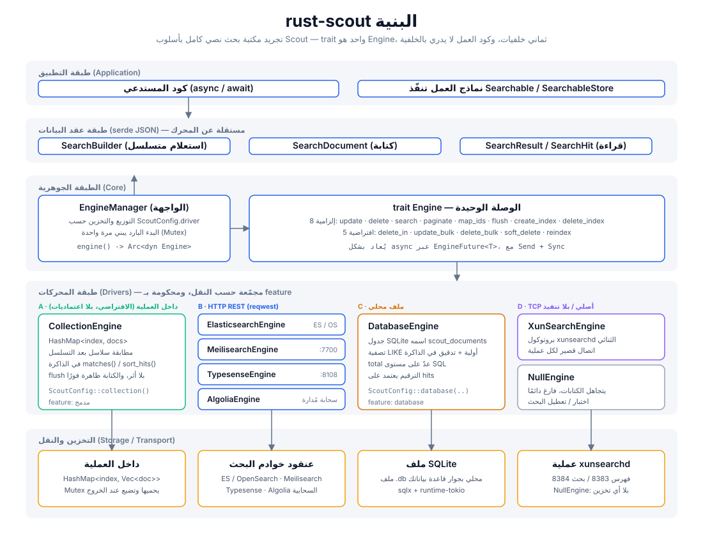
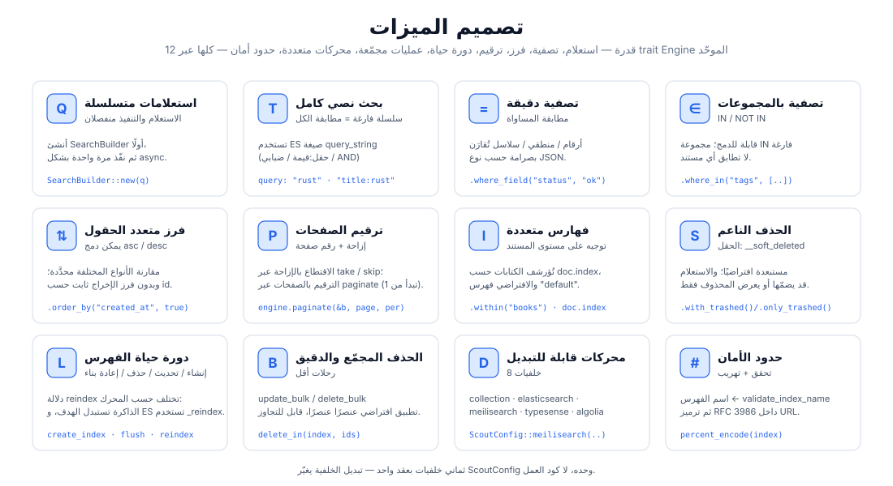
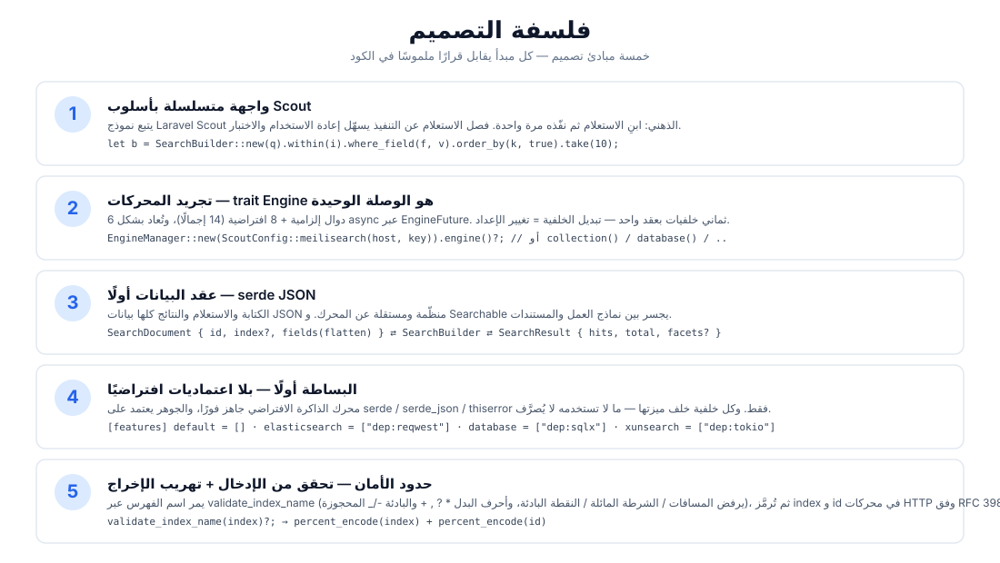
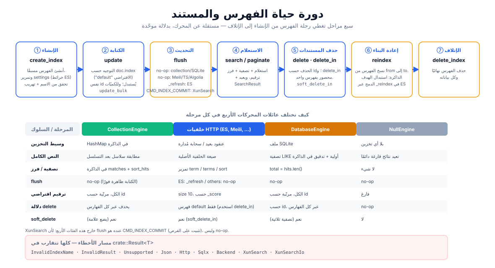

# rust-scout

[](https://crates.io/crates/rust-scout)
[](https://docs.rs/rust-scout)
[](../../../LICENSE)

[简体中文](../../../README.md) · [English](../en/README.md) · [日本語](../ja/README.md) · [한국어](../ko/README.md) · [Bahasa Indonesia](../id/README.md) · [Русский](../ru/README.md) · [Deutsch](../de/README.md) · [Français](../fr/README.md) · [Español](../es/README.md) · [Português](../pt/README.md) · [हिन्दी](../hi/README.md) · العربية · [বাংলা](../bn/README.md)

**rust-scout — تجريد مكتبة بحث نصي كامل** — طبقة واجهة خفيفة للبحث النصي الكامل في Rust. مستوحاة من أسلوب الاستعلامات المتسلسلة في [Laravel Scout](https://laravel.com/docs/scout)، وهي تجرّد **8 خلفيات** (الذاكرة، Elasticsearch/OpenSearch، Meilisearch، Typesense، Algolia، SQLite، XunSearch، Null) عبر trait موحّد واحد هو `Engine`: **محرك ذاكرة بلا أي اعتماديات للتطوير، وانتقال سلس إلى أي خلفية في الإنتاج دون تغيير سطر واحد من كود العمل.**


> حيوان المشروع الأليف **كلب البحث Scout** — يشمّ المستندات، ويتتبّع الفهارس.
> وهو ليس في التوثيق وحده: إنه حاضر أيضًا في شعار الطرفية وتلميحات الأخطاء،
> انظر [حيوان المشروع الأليف](#حيوان-المشروع-الأليف).

```rust
let result = engine.search(
    SearchBuilder::new("rust 异步")
        .within("articles")
        .where_field("status", "published")
        .order_by("created_at", true)
        .take(10),
).await?;
```

## الميزات

| القدرة | الوصف |
|------|------|
| 🔍 بحث نصي كامل | مطابقة السلاسل الفرعية في محرك الذاكرة؛ ومحركات HTTP تستخدم صيغة الخلفية الأصلية (في ES: `query_string`، أي `حقل:قيمة`) |
| ⚙️ استعلامات متسلسلة | `SearchBuilder`: query / within / where_field / where_in / where_not_in / order_by / take / skip / option |
| 🎯 تصفية دقيقة | مطابقة المساواة (في ES ← `term`)، ومطابقة المجموعات (في ES ← `terms` / `must_not`) |
| 📄 فرز متعدد الحقول | يمكن دمج asc / desc، مع ترتيب محدَّد عبر أنواع JSON المختلفة |
| 📃 ترقيم الصفحات | اقتطاع بالإزاحة عبر `take`/`skip` + ترقيم بالصفحات عبر `paginate(page, per_page)` |
| 🗂️ فهارس متعددة | توجيه عبر حقل `index` على مستوى المستند، والفهرس الافتراضي `"default"` |
| 🔄 دورة حياة الفهرس | المسار الكامل لـ `create_index` / `flush` / `reindex` / `delete_index` |
| 🗑️ الحذف الناعم | يضع `soft_delete` علامة `__soft_deleted`؛ وتصفية ثلاثية الحالات عبر `with_trashed()` / `only_trashed()` |
| 📦 عمليات مجمّعة | `update_bulk` / `delete_bulk` تقلّلان الرحلات ذهابًا وإيابًا؛ و`delete_in` يستهدف فهرسًا واحدًا بدقة |
| 🔌 محركات قابلة للتبديل | الافتراضي بلا اعتماديات؛ و8 خلفيات كل واحدة خلف ميزة خاصة بها، فما لا تستخدمه لا يُصرَّف |
| 🔒 حدود الأمان | التحقق من اسم الفهرس (`validate_index_name`) + ترميز النسبة المئوية وفق RFC 3986 لمنع حقن المسارات |
| 🐕 حيوان المشروع الأليف | كلب البحث Scout: شعار الطرفية + تلميح تشخيصي لكل خطأ (`rust_scout::pet`) |

## تصميم البنية



خمس طبقات: طبقة التطبيق ← طبقة عقد البيانات (serde JSON) ← الطبقة الجوهرية (`EngineManager` + trait `Engine`)
← طبقة المحركات (مجموعة في أربع فئات حسب النقل، 8 محركات إجمالًا) ← طبقة التخزين. والوحيد الذي يعبر الطبقات هو trait `Engine`.

## تصميم الميزات



12 قدرة: الاستعلامات المتسلسلة، البحث النصي الكامل، التصفية الدقيقة/بالمجموعات، الفرز، ترقيم الصفحات،
الفهارس المتعددة، الحذف الناعم، دورة حياة الفهرس، الحذف المجمّع والدقيق، المحركات القابلة للتبديل، حدود الأمان.

## فلسفة التصميم



## دورة الحياة



سبع مراحل: الإنشاء ← الكتابة ← التحديث ← الاستعلام ← حذف المستندات ← إعادة البناء ← الإتلاف.
ويقارن النصف السفلي من المخطط كيف تختلف عائلات المحركات الأربع في كل مرحلة.

## هيكل المشروع

```
rust-scout/
├── Cargo.toml              # التبعيات وإعلانات feature (default = []، بلا اعتماديات)
├── src/
│   ├── lib.rs              # جذر crate: تصدير الوحدات + إعادة تصدير الأنواع العامة حسب feature
│   │
│   ├── engine.rs           # trait Engine: عقد المحرك الوحيد (8 إلزامية + 5 افتراضية)
│   ├── manager.rs          # EngineManager: الواجهة، يوزّع حسب driver ويخزّن Arc<dyn Engine>
│   ├── config.rs           # ScoutConfig (8 بوانٍ) + validate_index_name + percent_encode
│   │
│   ├── builder.rs          # SearchBuilder / Where / Order / TrashedFilter: الاستعلامات المتسلسلة
│   ├── document.rs         # SearchDocument: المستند المكتوب (عقد serde JSON)
│   ├── result.rs           # SearchResult / SearchHit: نتائج الاستعلام
│   ├── searchable.rs       # Searchable / SearchableStore: جسر نماذج العمل
│   ├── error.rs            # ScoutError + Result<T> + pet_hint()
│   ├── pet.rs              # حيوان المشروع الأليف: كلب البحث Scout (الشعار + تلميحات الأخطاء)
│   │
│   ├── collection_engine.rs    # محرك الذاكرة (الافتراضي، بلا اعتماديات)
│   ├── null_engine.rs          # محرك لا يفعل شيئًا: يُسقط الكتابات، ونتائج فارغة دائمًا  [null]
│   ├── elasticsearch_engine.rs # ES / OpenSearch (REST)                        [elasticsearch]
│   │   └── query.rs            #   بناء query_string وتحليل الاستجابة
│   ├── meilisearch_engine.rs   # Meilisearch (REST)                            [meilisearch]
│   ├── typesense_engine.rs     # Typesense (REST)                              [typesense]
│   │   └── typesense_query.rs  #   معاملات البحث وبناء filter_by
│   ├── algolia_engine.rs       # Algolia (REST سحابي مُدار)                    [algolia]
│   ├── database_engine.rs      # SQLite (sqlx، تصفية LIKE الأولية + تدقيق في الذاكرة) [database]
│   ├── xunsearch_engine.rs     # XunSearch: بروتوكول xunsearchd الأصلي عبر TCP  [xunsearch]
│   │   ├── xunsearch_query.rs  #   ترميز الحزم وفكّها + مخطط حقول ini
│   │   └── xunsearch_tests.rs  #   اختبارات شاملة من الطرف إلى الطرف مع خادم وهمي
│   │
│   └── (اختبارات الوحدة مُضمَّنة أسفل كل وحدة تحت #[cfg(test)] mod tests)
├── tests/                  # اختبارات التكامل (فارغة حاليًا، الاختبارات مُضمَّنة في src)
├── examples/
│   └── pet.rs              # cargo run --example pet: شعار الحيوان + عرض تلميحات الأخطاء
└── docs/
    ├── svg/                # الحيوان + مخططات البنية / الميزات / التصميم / دورة الحياة
    ├── i18n/               # ملفات README وSVG المقابلة لها بـ 12 لغة
    ├── coin/               # رموز QR للتبرعات
    └── superpowers/specs/  # مستندات التصميم
```

> تشير `[feature]` إلى ميزة Cargo التي يحتاجها ذلك المحرك. وعندما تكون غير مفعّلة،
> يعيد `EngineManager` الخطأ `ScoutError::Unsupported` بدلًا من التدهور الصامت.

## بدء سريع

### 1. إضافة التبعية

```toml
[dependencies]
rust-scout = "0.5"
tokio = { version = "1", features = ["macros", "rt"] }   # للمثال فقط
```

### 2. مثال أدنى (محرك الذاكرة الافتراضي)

```rust
use rust_scout::{Engine, EngineManager, ScoutConfig, SearchBuilder, SearchDocument};

#[tokio::main]
async fn main() -> rust_scout::Result<()> {
    // المحرك الافتراضي: CollectionEngine في الذاكرة، بلا أي اعتماديات
    let engine = EngineManager::new(ScoutConfig::collection()).engine()?;

    // كتابة مستند
    let mut book = SearchDocument::new(
        "book-1",
        serde_json::json!({
            "title": "Programming Rust",
            "author": "Blandy & Orendorff",
            "tags": ["rust", "systems"],
            "status": "published",
        }),
    )?;
    book.index = Some("books".to_string());
    engine.update(&[book]).await?;

    // استعلام
    let result = engine
        .search(
            SearchBuilder::new("rust")
                .within("books")
                .where_field("status", "published")
                .order_by("title", false)
                .take(10),
        )
        .await?;

    println!("total = {}", result.total);
    for hit in &result.hits {
        println!("  [{}] {:?}", hit.id, hit.source);
    }
    Ok(())
}
```

## دليل الاستخدام

### بناء الاستعلامات (SearchBuilder)

تُجمَّع كل عمليات الاستعلام في سلسلة واحدة، ثم تُسلَّم أخيرًا إلى `engine.search(&builder)`:

```rust
let builder = SearchBuilder::new("كلمات البحث النصي الكامل")   // بحث نصي كامل (اختياري، سلسلة فارغة = مطابقة الكل)
    .within("articles")                          // الفهرس المستهدف (اختياري، الافتراضي "default")
    .where_field("status", "published")          // تصفية بالمساواة
    .where_in("tags", ["rust", "async"])         // مجموعة IN
    .where_not_in("category", ["draft"])         // مجموعة NOT IN
    .order_by("created_at", true)                // فرز متعدد الحقول (true = desc)
    .order_by("title", false)
    .take(20)                                    // عدد العناصر في الصفحة
    .skip(40)                                    // الإزاحة
    .option("highlight", true)                   // خيارات تمرير خاصة بالمحرك
    .with_trashed();                             // الحذف الناعم بثلاث حالات: استبعاد / تضمين / عرض المحذوف فقط
```

> يدعم `query` صيغة Lucene `query_string` (وتعمل كاملةً في محرك ES):
> `"rust"` و`"title:rust AND tags:async"` و`"rust~2"` (بحث ضبابي). أما بقية المحركات
> فتتعامل بالصيغة الأصلية الخاصة بها أو بمطابقة السلاسل الفرعية.

### ترقيم الصفحات

```rust
// الطريقة الأولى: الاقتطاع بالإزاحة
let page2 = SearchBuilder::new("rust").within("books").skip(10).take(10);
// الطريقة الثانية: الترقيم بالصفحات (تبدأ الصفحة من 1)
let page2 = engine.paginate(&SearchBuilder::new("rust").within("books"), 2, 10).await?;
```

### الفهارس المتعددة ودورة الحياة

```rust
engine.create_index("books", serde_json::json!({})).await?;    // إنشاء فهرس
engine.update(&docs).await?;                                   // كتابة مستندات
engine.update_bulk(&docs).await?;                              // كتابة مجمّعة (عبر واجهة bulk إن دعمتها الخلفية)
engine.flush("books").await?;                                  // تحديث الظهور
engine.search(&builder).await?;                                // استعلام
engine.delete_in("books", &["book-1".to_string()]).await?;     // حذف مستندات من فهرس واحد
engine.soft_delete(&["book-2".to_string()]).await?;            // حذف ناعم (وضع علامة)
engine.reindex("books", "books_v2").await?;                    // إعادة بناء الفهرس
engine.delete_index("books").await?;                           // حذف الفهرس
```

> لا يحمل `delete` أي معلومة عن الفهرس، لذا يختلف معناه من محرك لآخر (محرك الذاكرة
> يحذف عبر كل الفهارس، بينما ES يمسّ `default` فقط). لاستهداف فهرس واحد بدقة
> استخدم `delete_in`.

### التبديل إلى Elasticsearch / OpenSearch

```bash
cargo add rust-scout --features elasticsearch
```

```rust
use rust_scout::{Engine, EngineManager, ScoutConfig};

let config = ScoutConfig::elasticsearch(
    "http://127.0.0.1:9200",      // أو عنوان OpenSearch
    Some("your-api-key".into()),   // اختياري: مصادقة ApiKey
);
let engine = EngineManager::new(config).engine()?;
// —— بعد ذلك كل العمليات مطابقة تمامًا لمحرك الذاكرة ——
```

| البند | CollectionEngine (الافتراضي) | ElasticsearchEngine |
|--------|--------------------------|---------------------|
| التبعيات | serde / thiserror فقط | reqwest (عند تفعيل الميزة) |
| البحث النصي الكامل | مطابقة سلاسل فرعية بعد التسلسل | `query_string` |
| التصفية | matches() في الذاكرة | term / terms / must_not |
| الفرز | sort_hits() في الذاكرة | مصفوفة sort |
| flush | no-op | `_refresh` |
| الترقيم الافتراضي | كل النتائج | size 10 |
| الفرز الافتراضي | حسب id | حسب _score |

### التبديل إلى Meilisearch

```bash
cargo add rust-scout --features meilisearch
```

```rust
use rust_scout::{Engine, EngineManager, ScoutConfig};

let config = ScoutConfig::meilisearch(
    "http://127.0.0.1:7700",   // عنوان خدمة Meilisearch
    "your-master-key",          // اختياري: مفتاح API
);
let engine = EngineManager::new(config).engine()?;
// —— بعد ذلك كل العمليات مطابقة تمامًا لمحرك الذاكرة ——
```

### مقارنة المحركات

| المحرك | driver | feature | النقل | الحالة |
|------|--------|---------|------|------|
| الذاكرة (الافتراضي) | `collection` | مدمج | داخل العملية | كامل |
| Elasticsearch / OpenSearch | `elasticsearch` / `opensearch` | `elasticsearch` | HTTP REST | كامل |
| Meilisearch | `meilisearch` | `meilisearch` | HTTP REST | كامل |
| Typesense | `typesense` | `typesense` | HTTP REST | كامل |
| Algolia | `algolia` | `algolia` | HTTP REST | كامل |
| SQLite | `database` | `database` | ملف محلي | كامل |
| XunSearch | `xunsearch` | `xunsearch` | TCP أصلي | كامل |
| Null (للاختبار/تعطيل البحث) | `null` | `null` | — | كامل |

أما بواني إعدادات بقية المحركات فهي موثّقة على [docs.rs](https://docs.rs/rust-scout): `ScoutConfig::typesense(host, api_key)` و`ScoutConfig::algolia(app_id, api_key)` و`ScoutConfig::database(url, fields)` و`ScoutConfig::null()` و`ScoutConfig::xunsearch(host, project)`.

> في محرك SQLite (`database`) يكون `total` عدًّا على مستوى SQL (الفهرس + تصفية LIKE الأولية)؛
> وقد تجعل شروط wheres / الحذف الناعم القيمة `hits.len() < total` بعد التصفية في الذاكرة،
> والترقيم يعتمد على hits.

### الحقول المحجوزة

`__soft_deleted` هو اسم الحقل المحجوز الذي تستخدمه ميزة الحذف الناعم (`Engine::soft_delete`،
`SearchBuilder::with_trashed()` / `only_trashed()`) لتصفية المستندات المحذوفة ناعمًا. ويجب على
مستندات المستخدمين **ألا** تستخدم اسم الحقل هذا كحقل عمل.

### معالجة الأخطاء

تعيد جميع العمليات `crate::Result<T>`، وتتقارب الأخطاء في `ScoutError` الموحّد:

| المتغيّر | متى يحدث | feature |
|------|----------|---------|
| `InvalidIndexName` | اسم الفهرس يحتوي على مسافة أو `/` أو `\`، أو يبدأ بـ `.`، أو فارغ (يُتحقق منه قبل الكتابة) | مدمج |
| `InvalidResult` | حقل المستند ليس كائن JSON | مدمج |
| `Unsupported` | ميزة المحرك غير مفعّلة، أو إعداد مطلوب ناقص، أو المحرك لا يدعم العملية | مدمج |
| `Json` | خطأ في التسلسل / فك التسلسل عبر serde | مدمج |
| `Http` | فشل طلب HTTP (الاتصال، المهلة، رمز الحالة) | محركات HTTP الأربعة |
| `Sqlx` | خطأ SQLite | `database` |
| `Backend` | أعادت الخلفية استجابة خطأ، مع تمرير الرسالة الأصلية كما هي | محركات HTTP الأربعة / `xunsearch` |
| `XunSearch` / `XunSearchIo` | فشل تحليل البروتوكول / فشل إدخال-إخراج TCP | `xunsearch` |

ويحمل كل متغيّر تلميحًا تشخيصيًا، انظر [`ScoutError::pet_hint()`](#حيوان-المشروع-الأليف).

### ربط نماذج العمل (Searchable)

نفّذ `Searchable` لتحويل بنيتك البرمجية إلى مستند قابل للفهرسة، ونفّذ `SearchableStore`
لتغليف العمليات الثلاث `index_documents` / `remove_documents` / `search`:

```rust
use rust_scout::{Searchable, SearchableStore, SearchDocument, SearchResult};

struct Article { id: String, title: String, body: String }

impl Searchable for Article {
    fn searchable_id(&self) -> String { self.id.clone() }
    fn to_searchable_json(&self) -> serde_json::Value {
        serde_json::json!({ "title": self.title, "body": self.body })
    }
}
```

## حيوان المشروع الأليف


**Scout · كلب البحث** — يشمّ المستندات، ويتتبّع الفهارس. حيثما وُجد استعلام كان حاضرًا.
الصورة في [`svg/pet.svg`](svg/pet.svg)، وهكذا يبدو في الطرفية:

```console
$ cargo run --example pet
```

```

      ___              ___
     /   \            /   \
    |     |__________|     |
    |     /          \     |
    |    |   o    o   |    |
    |    |     __     |    |
    |     \   /  \   /     |
     \     \  \__/  /     /
      \     \________/    /
       \_________________/
         \   ~~~~~~   /
          \__________/
             |    |
            _|    |_
           |__|  |__|


   ,^.     ,^.     ,^.     ,^.

  Scout · 嗅探猎犬 · rust-scout
  嗅探文档，追踪索引 —— 哪里有查询，哪里就有它
```

يسكن هذا الحيوان وحدة [`rust_scout::pet`](../../../src/pet.rs) و**لا يضيف أي اعتماديات**:

| البند | الوصف |
|----|------|
| `pet::NAME` / `pet::SPECIES` / `pet::TAGLINE` | معلومات لوحة الاسم |
| `pet::ART` | الرسم بـ ASCII (مقصود أن يكون بسبع بتات فقط، فلا ينحرف في طرفيات CJK) |
| `pet::banner()` | شعار الطرفية، نص صافٍ بلا تسلسلات هروب، آمن في السجلات |
| `pet::hint(&err)` | تلميح تشخيصي لكل خطأ، ويعيد `&'static str` |
| `pet::format_error(&err)` | الخطأ الأصلي + التلميح، بصيغة مقروءة للبشر |
| `ScoutError::pet_hint()` | التلميح نفسه، معلّقًا على نوع الخطأ مباشرة |

```rust
use rust_scout::{pet, ScoutError};

println!("{}", pet::banner());

let err = ScoutError::Unsupported("missing feature".into());
eprintln!("{}", pet::format_error(&err));
// error: unsupported operation: missing feature
//
//   [o_o] Scout：这个后端我还没找到路 —— Cargo.toml 里对应的 feature 启用了吗？
```

> **لماذا لا يُدمج التلميح في `Display` مباشرة؟** يبقى `Display` في `ScoutError` سطرًا واحدًا
> آليّ القراءة — فنشر `?` وجمع السجلات والبحث عن سلاسل الأخطاء في CI كلها تعتمد عليه.
> أما الإخراج المقروء للبشر مع التلميح فيأتي عبر `pet::format_error()`.

## الدعم والتبرعات

إن كان هذا المشروع مفيدًا لك، يمكنك دعمه بتبرع ☕ — دعمك هو حافز استمرار الصيانة!

### WeChat / Alipay


امسح عبر WeChat · امسح عبر Alipay

### التبرعات بالعملات الرقمية

| الشبكة | عنوان المحفظة | رمز QR |
|------|----------|--------|
| BNB Smart Chain (BEP20) | `0x355d429f97511897ccb4e271ec888205f9ab6629` |  |
| Tron (TRC20) | `TEdDHWLajt1XvqtPDWmQctdrJaC3pzZZzz` |  |
| Ethereum (ERC20) | `0x355d429f97511897ccb4e271ec888205f9ab6629` |  |
| Aptos | `0x836e3780edfc3f7b2372b39e2a1a3a5d7adfaccd96c726f21cfde1b50dd68030` |  |
| Plasma | `0x355d429f97511897ccb4e271ec888205f9ab6629` |  |
| Polygon POS | `0x355d429f97511897ccb4e271ec888205f9ab6629` |  |
| Solana | `2hfhboHdmdrYsY25XfQSsEWxq5ip4EQsR7f4AzSRMUyr` |  |
| The Open Network (TON) | `UQB9kFQohzmXUir9QSSZq01iwl9aQZIDdBpNmDklljRtCoGK` |  |
| Arbitrum One | `0x355d429f97511897ccb4e271ec888205f9ab6629` |  |
| AVAX C-Chain | `0x355d429f97511897ccb4e271ec888205f9ab6629` |  |

### التحويلات الدولية (حوالة بنكية)

**معلومات المستفيد**

- اسم المستفيد: WANG KEXUN
- رقم الحساب: 881015918251

**البنك المستلم (ZA Bank)**

- SWIFT Code: `AABLHKHHXXX`
- اسم البنك: ZA Bank Limited
- رمز البنك: 387
- عنوان البنك: Core F, Cyberport 3, 100 Cyberport Road, Hong Kong

> معلومات البنك المراسل (الوسيط) أدناه تخصّ التحويلات العابرة للحدود، وليست معلومات البنك
> المستلم. يُرجى سؤال البنك المحوِّل عمّا إذا كانت مطلوبة.

- البنك المراسل للتحويلات بالدولار الهونغ كونغي واليوان الصيني والدولار الأمريكي هو **Citibank**:
  - اسم البنك: Citibank N.A. Hong Kong
  - SWIFT Code: `CITIHKHXXXX`
  - رمز البنك: 006 / رمز الفرع: 391
  - اسم الفرع: Hong Kong Branch
  - عنوان البنك: Citibank Tower, Citibank Plaza, 3 Garden Road, Central, Hong Kong
- البنك المراسل للتحويلات بالعملات الأخرى هو **BNY Mellon**:
  - اسم البنك: THE BANK OF NEW YORK MELLON
  - SWIFT Code: `IRVTUS3NXXX`
  - عنوان البنك: THE BANK OF NEW YORK MELLON, 240 GREENWICH STREET, NEW YORK, United States

## الرخصة

MIT License. التفاصيل في [LICENSE](../../../LICENSE).
