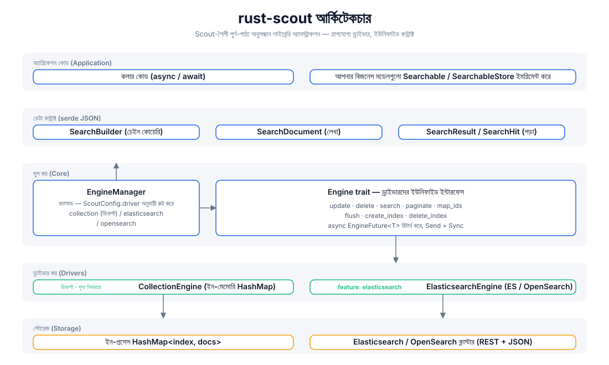
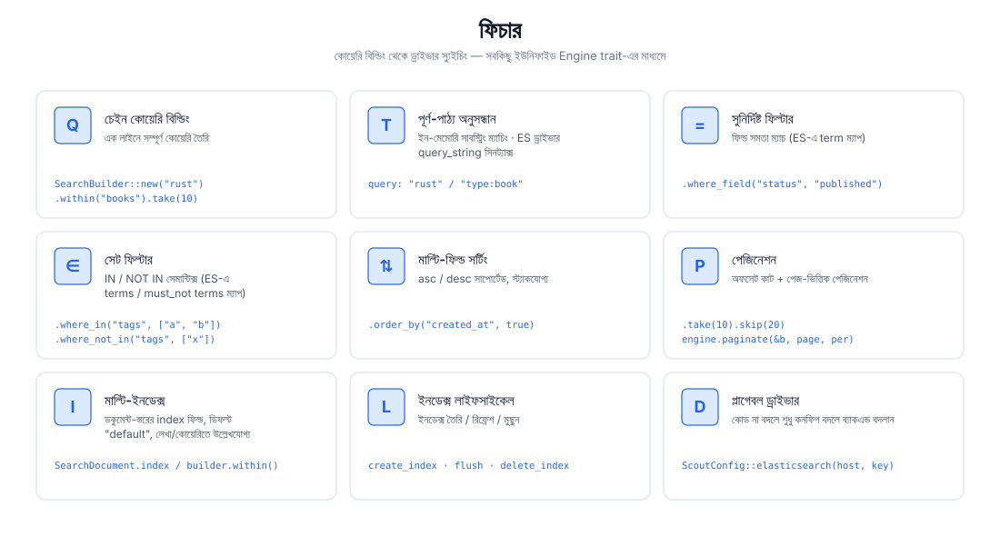
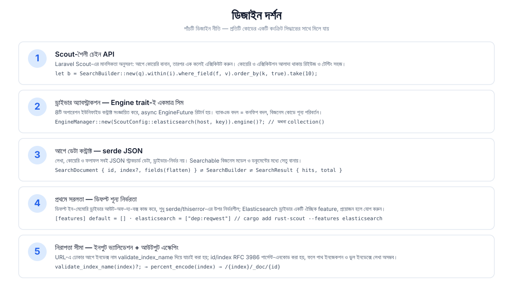
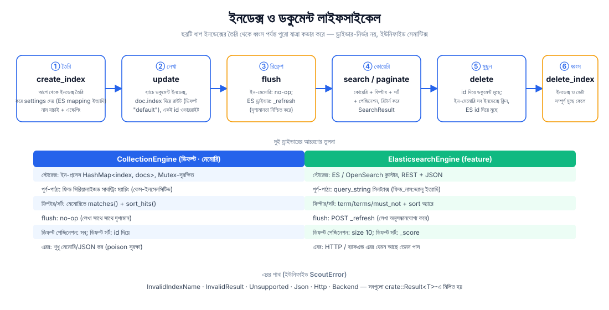

# rust-scout

[](https://crates.io/crates/rust-scout)
[](https://docs.rs/rust-scout)
[](../../../LICENSE)

[简体中文](../../../README.md) · [English](../en/README.md) · [日本語](../ja/README.md) · [한국어](../ko/README.md) · [Русский](../ru/README.md) · [Deutsch](../de/README.md) · [Français](../fr/README.md) · [Español](../es/README.md) · [Português](../pt/README.md) · [हिन्दी](../hi/README.md) · [العربية](../ar/README.md) · বাংলা · [Bahasa Indonesia](../id/README.md)

**rust-scout — পূর্ণ-পাঠ্য অনুসন্ধান লাইব্রেরির অ্যাবস্ট্রাকশন** — Rust-এর জন্য একটি হালকা পূর্ণ-পাঠ্য অনুসন্ধান ইন্টারফেস স্তর। [Laravel Scout](https://laravel.com/docs/scout)-এর চেইন-ভিত্তিক কোয়েরি ধাঁচ থেকে অনুপ্রাণিত হয়ে, একটি ইউনিফাইড `Engine` trait-এর মাধ্যমে মেমোরি, Elasticsearch/OpenSearch, Meilisearch, Typesense, Algolia, SQLite-সহ একাধিক ব্যাকএন্ডকে অ্যাবস্ট্র্যাক্ট করে: **ডেভেলপমেন্টে শূন্য-নির্ভরতা ইন-মেমোরি ড্রাইভার, প্রোডাকশনে ব্যবসায়িক কোডের এক লাইনও না বদলে যেকোনো ব্যাকএন্ডে নির্বিঘ্নে সুইচ করুন।**

```rust
let result = engine.search(
    SearchBuilder::new("rust 异步")
        .within("articles")
        .where_field("status", "published")
        .order_by("created_at", true)
        .take(10),
).await?;
```

## ফিচার

| ক্ষমতা | বিবরণ |
|------|------|
| 🔍 পূর্ণ-পাঠ্য অনুসন্ধান | ইন-মেমোরি ড্রাইভারে সাবস্ট্রিং ম্যাচিং; ES ড্রাইভারে `query_string` সিনট্যাক্স (`ফিল্ড:ভ্যালু`) |
| ⚙️ চেইন কোয়েরি | `SearchBuilder`: query / within / where_field / where_in / where_not_in / order_by / take / skip |
| 🎯 সুনির্দিষ্ট ফিল্টারিং | সমতা ম্যাচ (ES → `term`), সেট ম্যাচ (ES → `terms` / `must_not`) |
| 📄 মাল্টি-ফিল্ড সর্টিং | asc / desc স্ট্যাক করা যায় |
| 📃 পেজিনেশন | `take`/`skip` অফসেট কাট + `paginate(page, per_page)` পেজ-ভিত্তিক |
| 🗂️ মাল্টি-ইনডেক্স | ডকুমেন্ট-স্তরের `index` ফিল্ড রাউটিং, ডিফল্ট ইনডেক্স `"default"` |
| 🔄 ইনডেক্স লাইফসাইকেল | `create_index` / `flush` / `delete_index` সম্পূর্ণ প্রক্রিয়া |
| 🔌 প্লাগেবল ড্রাইভার | ডিফল্ট ইন-মেমোরি, শূন্য নির্ভরতা; `elasticsearch` / `meilisearch` / `typesense` / `algolia` / `database` / `null` feature প্রয়োজনমতো সক্রিয়; `xunsearch` একটি প্লেসহোল্ডার স্টাব |
| 🔒 নিরাপত্তা সীমা | ইনডেক্স নাম যাচাই (`validate_index_name`) + RFC 3986 পার্সেন্ট-এনকোডিং, পাথ ইনজেকশন প্রতিরোধ |

## আর্কিটেকচার



## ফিচার ওভারভিউ



## ডিজাইন দর্শন



## লাইফসাইকেল



## প্রজেক্ট স্ট্রাকচার

```
rust-scout/
├── Cargo.toml            # 依赖与 feature 声明（elasticsearch 可选）
├── src/
│   ├── lib.rs            # crate 根：模块导出 + 公开类型再导出
│   ├── engine.rs         # Engine trait：驱动统一接口（8 个操作）
│   ├── manager.rs        # EngineManager：门面，按配置分发驱动
│   ├── config.rs         # ScoutConfig + validate_index_name
│   ├── builder.rs        # SearchBuilder：链式查询构建与匹配/排序逻辑
│   ├── document.rs       # SearchDocument：写入文档（serde JSON 契约）
│   ├── result.rs         # SearchResult / SearchHit：查询结果
│   ├── searchable.rs     # Searchable / SearchableStore：业务模型桥接
│   ├── error.rs          # ScoutError + Result<T>
│   ├── collection_engine.rs  # 内存驱动（默认）
│   └── elasticsearch_engine.rs # ES/OpenSearch 驱动（feature 可选）
├── tests/                # 集成测试（当前为空）
├── examples/             # 示例（当前为空）
└── docs/
    ├── svg/              # 本 README 引用的架构/功能/设计/生命周期图
    └── superpowers/specs/ # 设计文档
```

## দ্রুত শুরু

### 1. ডিপেন্ডেন্সি যোগ করুন

```toml
[dependencies]
rust-scout = "0.1"
tokio = { version = "1", features = ["macros", "rt"] }   # শুধু উদাহরণের জন্য প্রয়োজন
```

### 2. ন্যূনতম উদাহরণ (ডিফল্ট ইন-মেমোরি ড্রাইভার)

```rust
use rust_scout::{Engine, EngineManager, ScoutConfig, SearchBuilder, SearchDocument};

#[tokio::main]
async fn main() -> rust_scout::Result<()> {
    // ডিফল্ট ড্রাইভার: ইন-মেমোরি CollectionEngine, কোনও নির্ভরতা ছাড়াই রেডি-টু-ইউজ
    let engine = EngineManager::new(ScoutConfig::collection()).engine()?;

    // ডকুমেন্ট লেখা
    let mut book = SearchDocument::new(
        "book-1",
        serde_json::json!({
            "title": "Programming Rust",
            "author": "Blandy & Orendorff",
            "tags": ["rust", "systems"],
            "status": "published",
        }),
    )?;
    book.index = Some("books".to_string());
    engine.update(&[book]).await?;

    // কোয়েরি
    let result = engine
        .search(
            SearchBuilder::new("rust")
                .within("books")
                .where_field("status", "published")
                .order_by("title", false)
                .take(10),
        )
        .await?;

    println!("total = {}", result.total);
    for hit in &result.hits {
        println!("  [{}] {:?}", hit.id, hit.source);
    }
    Ok(())
}
```

## ব্যবহার নির্দেশিকা

### কোয়েরি বিল্ডিং (SearchBuilder)

সব কোয়েরি অপারেশন চেইনে যুক্ত হয়, আর শেষে `engine.search(&builder)`-এ দেওয়া হয়:

```rust
let builder = SearchBuilder::new("全文关键词")   // পূর্ণ-পাঠ্য অনুসন্ধান (ঐচ্ছিক; খালি স্ট্রিং = সব ম্যাচ)
    .within("articles")                          // ইনডেক্স নির্ধারণ (ঐচ্ছিক; ডিফল্ট "default")
    .where_field("status", "published")          // সমতা ফিল্টার
    .where_in("tags", ["rust", "async"])         // IN সেট
    .where_not_in("category", ["draft"])         // NOT IN সেট
    .order_by("created_at", true)                // মাল্টি-ফিল্ড সর্টিং (true = desc)
    .order_by("title", false)
    .take(20)                                    // প্রতি পেজ সংখ্যা
    .skip(40);                                   // অফসেট
```

> `query` Lucene `query_string` সিনট্যাক্স সমর্থন করে (ES ড্রাইভারে সম্পূর্ণ কার্যকর):
> `"rust"`, `"title:rust AND tags:async"`, `"rust~2"` (ফাজি)। ইন-মেমোরি ড্রাইভার সাবস্ট্রিং ম্যাচিং করে।

### পেজিনেশন

```rust
// উপায় ১: অফসেট কাট
let page2 = SearchBuilder::new("rust").within("books").skip(10).take(10);
// উপায় ২: পেজ-ভিত্তিক পেজিনেশন (page 1 থেকে শুরু)
let page2 = engine.paginate(&SearchBuilder::new("rust").within("books"), 2, 10).await?;
```

### মাল্টি-ইনডেক্স ও লাইফসাইকেল

```rust
engine.create_index("books", serde_json::json!({})).await?;   // ইনডেক্স তৈরি
engine.update(&docs).await?;                                  // ডকুমেন্ট লেখা
engine.flush("books").await?;                                 // দৃশ্যমানতা রিফ্রেশ
engine.delete(&["book-1".to_string()]).await?;                // ডকুমেন্ট মুছুন
engine.delete_index("books").await?;                          // ইনডেক্স মুছুন
```

### Elasticsearch / OpenSearch-এ স্যুইচ

```bash
cargo add rust-scout --features elasticsearch
```

```rust
use rust_scout::{Engine, EngineManager, ScoutConfig};

let config = ScoutConfig::elasticsearch(
    "http://127.0.0.1:9200",      // অথবা OpenSearch ঠিকানা
    Some("your-api-key".into()),   // ঐচ্ছিক: ApiKey অথেনটিকেশন
);
let engine = EngineManager::new(config).engine()?;
// —— এরপর সব অপারেশন ইন-মেমোরি ড্রাইভারের হুবহু একই ——
```

| তুলনা | CollectionEngine (ডিফল্ট) | ElasticsearchEngine |
|--------|--------------------------|---------------------|
| ডিপেন্ডেন্সি | শুধু serde / thiserror | reqwest (feature সক্রিয়) |
| পূর্ণ-পাঠ্য | সিরিয়ালাইজড সাবস্ট্রিং ম্যাচিং | `query_string` |
| ফিল্টার | মেমোরিতে matches() | term / terms / must_not |
| সর্টিং | মেমোরিতে sort_hits() | sort অ্যারে |
| flush | no-op | `_refresh` |
| ডিফল্ট পেজিনেশন | সব ফলাফল | size 10 |
| ডিফল্ট সর্টিং | id দিয়ে | _score দিয়ে |

### Meilisearch-এ স্যুইচ

```bash
cargo add rust-scout --features meilisearch
```

```rust
use rust_scout::{Engine, EngineManager, ScoutConfig};

let config = ScoutConfig::meilisearch(
    "http://127.0.0.1:7700",   // Meilisearch সার্ভিসের ঠিকানা
    "your-master-key",          // ঐচ্ছিক: API কী
);
let engine = EngineManager::new(config).engine()?;
// —— এরপর সব অপারেশন ইন-মেমোরি ড্রাইভারের হুবহু একই ——
```

### ইঞ্জিন তুলনা

| ইঞ্জিন | driver | feature | অবস্থা |
|------|--------|---------|------|
| ইন-মেমোরি (ডিফল্ট) | `collection` | অন্তর্নির্মিত | সম্পূর্ণ |
| Elasticsearch / OpenSearch | `elasticsearch` / `opensearch` | `elasticsearch` | সম্পূর্ণ |
| Meilisearch | `meilisearch` | `meilisearch` | সম্পূর্ণ |
| Typesense | `typesense` | `typesense` | সম্পূর্ণ |
| Algolia | `algolia` | `algolia` | সম্পূর্ণ |
| SQLite | `database` | `database` | সম্পূর্ণ |
| Null (টেস্ট/অনুসন্ধান নিষ্ক্রিয়) | `null` | `null` | সম্পূর্ণ |
| XunSearch | `xunsearch` | `xunsearch` | stub (বাস্তবায়ন বাকি) |

বাকি ইঞ্জিনগুলোর কনফিগ কনস্ট্রাক্টর দেখুন [docs.rs](https://docs.rs/rust-scout)-এ: `ScoutConfig::typesense(host, api_key)`, `ScoutConfig::algolia(app_id, api_key)`, `ScoutConfig::database(url, fields)`, `ScoutConfig::null()`, `ScoutConfig::xunsearch(host, project)`।

> SQLite ইঞ্জিনে (`database`) `total` হল SQL-স্তরের গণনা (ইনডেক্স + LIKE মোটামুটি ফিল্টার);
> wheres / সফট ডিলিটের মেমোরি ফিল্টারিংয়ের পরে `hits.len() < total` হতে পারে, পেজিনেশন hits-এর ওপর ভিত্তি করে।

### সংরক্ষিত ফিল্ড

`__soft_deleted` হল সফট ডিলিট ফিচার (`Engine::soft_delete`, `SearchBuilder::with_trashed()`
/ `only_trashed()`) ব্যবহার করা সংরক্ষিত ফিল্ড নাম, যা দিয়ে ইঞ্জিন সফট-ডিলিটেড ডকুমেন্ট ফিল্টার করে। ইউজার ডকুমেন্টে **উচিত নয়**
এই ফিল্ড নামটি ব্যবসায়িক ফিল্ড হিসেবে ব্যবহার করা।

### এরর হ্যান্ডলিং

সব অপারেশন `crate::Result<T>` রিটার্ন করে, এররগুলো ইউনিফাইড `ScoutError`-এ মিলিত হয়:

- `InvalidIndexName` —— ইনডেক্স নামে স্পেস / `/` / `.` দিয়ে শুরু হওয়া ইত্যাদি (লেখার আগে যাচাই করা হয়)
- `InvalidResult` —— ডকুমেন্ট ফিল্ড JSON অবজেক্ট নয়
- `Unsupported` —— feature সক্রিয় নেই ইত্যাদি
- `Json` —— serde এরর
- `Http` / `Backend` —— ES ড্রাইভারের নেটওয়ার্ক ও ব্যাকএন্ড এরর (feature সক্রিয় থাকলে)

### বিজনেস মডেল ব্রিজিং (Searchable)

`Searchable` ইমপ্লিমেন্ট করে ব্যবসায়িক স্ট্রাকচারকে ইনডেক্সযোগ্য ডকুমেন্টে ম্যাপ করুন, আর `SearchableStore` ইমপ্লিমেন্ট করে
`index_documents` / `remove_documents` / `search` তিনটি অপারেশন এনক্যাপসুলেট করুন:

```rust
use rust_scout::{Searchable, SearchableStore, SearchDocument, SearchResult};

struct Article { id: String, title: String, body: String }

impl Searchable for Article {
    fn searchable_id(&self) -> String { self.id.clone() }
    fn to_searchable_json(&self) -> serde_json::Value {
        serde_json::json!({ "title": self.title, "body": self.body })
    }
}
```

## সাপোর্ট ও দান

প্রজেক্টটি যদি আপনার কাজে লাগে, দান করে সাপোর্ট করুন ☕ — আপনার সমর্থনই ধারাবাহিক রক্ষণাবেক্ষণের চালিকাশক্তি!

### WeChat / Alipay


WeChat স্ক্যান করুন · Alipay স্ক্যান করুন

### ক্রিপ্টোকারেন্সি দান

| মূল নেটওয়ার্ক | ওয়ালেট ঠিকানা | QR কোড |
|------|----------|--------|
| BNB Smart Chain (BEP20) | `0x355d429f97511897ccb4e271ec888205f9ab6629` |  |
| Tron (TRC20) | `TEdDHWLajt1XvqtPDWmQctdrJaC3pzZZzz` |  |
| Ethereum (ERC20) | `0x355d429f97511897ccb4e271ec888205f9ab6629` |  |
| Aptos | `0x836e3780edfc3f7b2372b39e2a1a3a5d7adfaccd96c726f21cfde1b50dd68030` |  |
| Plasma | `0x355d429f97511897ccb4e271ec888205f9ab6629` |  |
| Polygon POS | `0x355d429f97511897ccb4e271ec888205f9ab6629` |  |
| Solana | `2hfhboHdmdrYsY25XfQSsEWxq5ip4EQsR7f4AzSRMUyr` |  |
| The Open Network (TON) | `UQB9kFQohzmXUir9QSSZq01iwl9aQZIDdBpNmDklljRtCoGK` |  |
| Arbitrum One | `0x355d429f97511897ccb4e271ec888205f9ab6629` |  |
| AVAX C-Chain | `0x355d429f97511897ccb4e271ec888205f9ab6629` |  |

### আন্তর্জাতিক ট্রান্সফার (ব্যাংক রেমিট্যান্স)

**প্রাপকের তথ্য**

- প্রাপকের নাম: WANG KEXUN
- প্রাপকের অ্যাকাউন্ট নম্বর: 881015918251

**প্রাপক ব্যাংক (ZA Bank)**

- SWIFT Code: `AABLHKHHXXX`
- ব্যাংকের নাম: ZA Bank Limited
- ব্যাংক নম্বর: 387
- ব্যাংকের ঠিকানা: Core F, Cyberport 3, 100 Cyberport Road, Hong Kong

> ক্রস-বর্ডার রেমিট্যান্সের করেসপন্ডেন্ট (মধ্যস্থ) ব্যাংকের তথ্য, প্রাপক ব্যাংকের নয়। আপনার পাঠানোর ব্যাংককে জিজ্ঞেস করুন এই তথ্য দরকার কিনা।

- হংকং ডলার, রেনমিনবি ও মার্কিন ডলারে রেমিট্যান্সের করেসপন্ডেন্ট ব্যাংক হল **Citibank**:
  - ব্যাংকের নাম: Citibank N.A. Hong Kong
  - SWIFT Code: `CITIHKHXXXX`
  - ব্যাংক নম্বর: 006 / শাখা নম্বর: 391
  - শাখার নাম: Hong Kong Branch
  - ব্যাংকের ঠিকানা: Citibank Tower, Citibank Plaza, 3 Garden Road, Central, Hong Kong
- অন্যান্য মুদ্রায় রেমিট্যান্সের করেসপন্ডেন্ট ব্যাংক হল **BNY Mellon**:
  - ব্যাংকের নাম: THE BANK OF NEW YORK MELLON
  - SWIFT Code: `IRVTUS3NXXX`
  - ব্যাংকের ঠিকানা: THE BANK OF NEW YORK MELLON, 240 GREENWICH STREET, NEW YORK, United States

## লাইসেন্স

MIT License। বিস্তারিত দেখুন [LICENSE](../../../LICENSE)।
