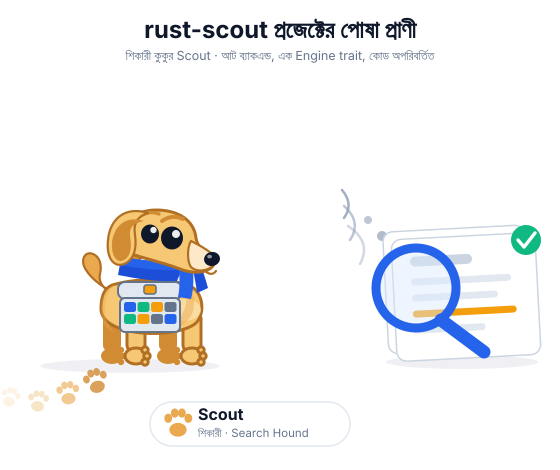
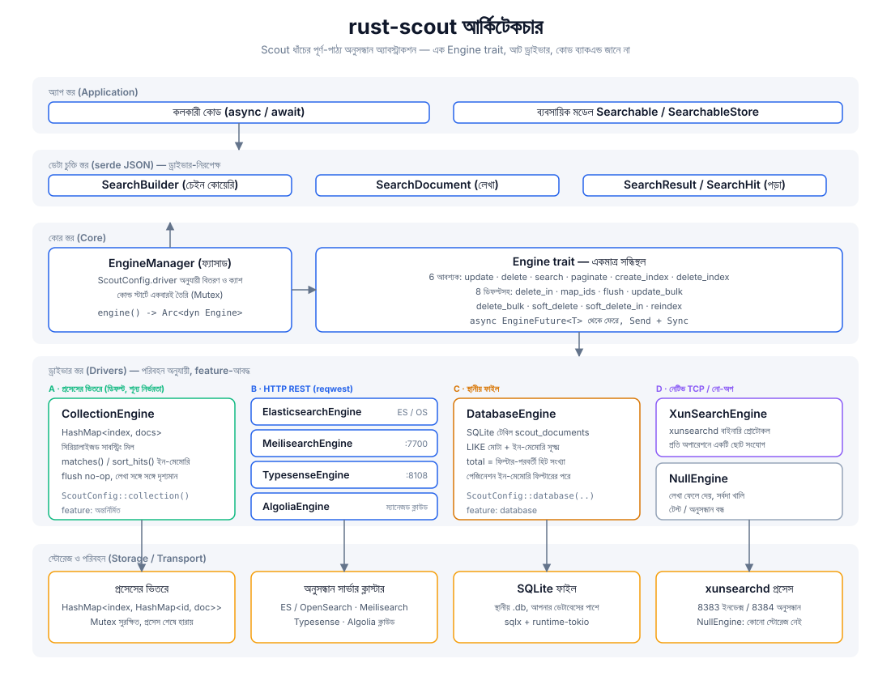
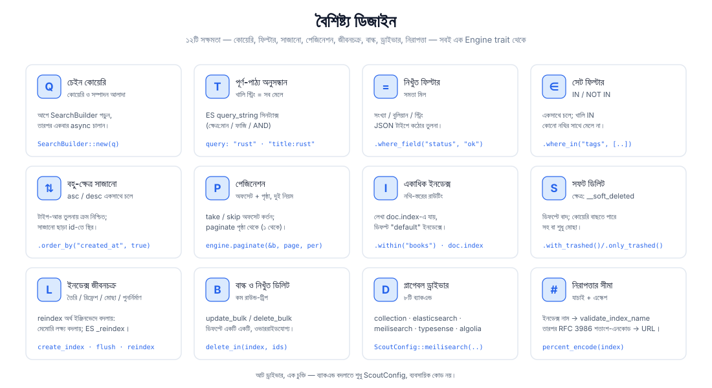
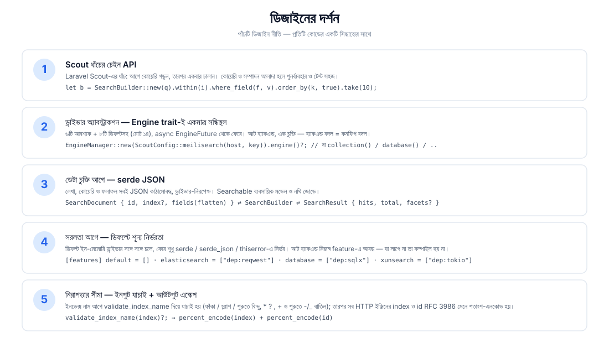
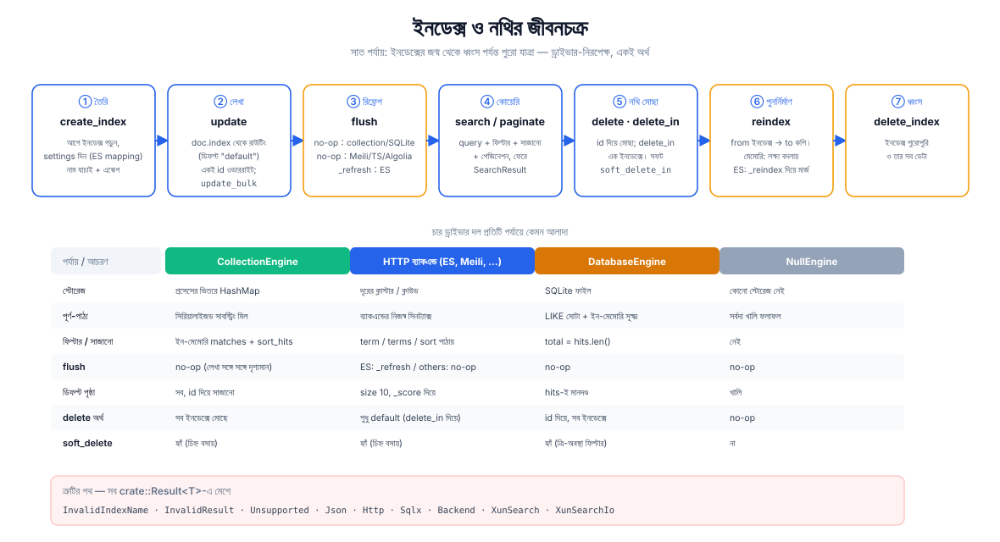

# rust-scout

[](https://crates.io/crates/rust-scout)
[](https://docs.rs/rust-scout)
[](../../../LICENSE)

[简体中文](../../../README.md) · [English](../en/README.md) · [日本語](../ja/README.md) · [한국어](../ko/README.md) · [Bahasa Indonesia](../id/README.md) · [Русский](../ru/README.md) · [Deutsch](../de/README.md) · [Français](../fr/README.md) · [Español](../es/README.md) · [Português](../pt/README.md) · [हिन्दी](../hi/README.md) · [العربية](../ar/README.md) · বাংলা

**rust-scout — পূর্ণ-পাঠ্য অনুসন্ধান লাইব্রেরির অ্যাবস্ট্রাকশন** —— Rust-এর জন্য একটি হালকা পূর্ণ-পাঠ্য অনুসন্ধান ইন্টারফেস স্তর। [Laravel Scout](https://laravel.com/docs/scout)-এর চেইন-ভিত্তিক কোয়েরি ধাঁচ থেকে অনুপ্রাণিত, যা একটি অভিন্ন `Engine` trait-এর মাধ্যমে **৮টি ব্যাকএন্ড** (ইন-মেমোরি, Elasticsearch/OpenSearch, Meilisearch, Typesense, Algolia, SQLite, XunSearch, Null) অ্যাবস্ট্র্যাক্ট করে: **ডেভেলপমেন্টের জন্য শূন্য-নির্ভরতা ইন-মেমোরি ড্রাইভার, প্রোডাকশনে ব্যবসায়িক কোডের এক লাইনও না বদলে যেকোনো ব্যাকএন্ডে নির্বিঘ্নে সুইচ।**



> প্রজেক্টের পোষা প্রাণী **শিকারী কুকুর Scout** (Search Hound) —— ডকুমেন্ট শুঁকে বের করে, ইনডেক্সের পথ অনুসরণ করে।
> শুধু ডকুমেন্টেশনে নয়: টার্মিনাল ব্যানার ও ত্রুটি-সংকেতে সে উপস্থিত,
> দেখুন [প্রজেক্টের পোষা প্রাণী](#প্রজেক্টের-পোষা-প্রাণী)।

```rust
let result = engine.search(
    SearchBuilder::new("rust 异步")
        .within("articles")
        .where_field("status", "published")
        .order_by("created_at", true)
        .take(10),
).await?;
```

## বৈশিষ্ট্যসমূহ

| সক্ষমতা | বিবরণ |
|------|------|
| 🔍 পূর্ণ-পাঠ্য অনুসন্ধান | ইন-মেমোরি ড্রাইভারে সাবস্ট্রিং মিল; HTTP ড্রাইভার ব্যাকএন্ডের নিজস্ব সিনট্যাক্স ব্যবহার করে (ES-এ `query_string`, অর্থাৎ `ক্ষেত্র:মান`) |
| ⚙️ চেইন-ভিত্তিক কোয়েরি | `SearchBuilder`: query / within / where_field / where_in / where_not_in / order_by / take / skip / option |
| 🎯 নিখুঁত ফিল্টার | সমতা মিল (ES → `term`), সেট মিল (ES → `terms` / `must_not`) |
| 📄 বহু-ক্ষেত্র সাজানো | asc / desc একসাথে প্রয়োগ করা যায়, বিভিন্ন JSON টাইপের তুলনায় নির্দিষ্ট ক্রম |
| 📃 পেজিনেশন | `take`/`skip` দিয়ে অফসেট কর্তন + `paginate(page, per_page)` দিয়ে পৃষ্ঠা-ভিত্তিক পেজিনেশন |
| 🗂️ একাধিক ইনডেক্স | ডকুমেন্ট-স্তরের `index` ক্ষেত্র দিয়ে রাউটিং, ডিফল্ট ইনডেক্স `"default"` |
| 🔄 ইনডেক্স জীবনচক্র | `create_index` / `flush` / `reindex` / `delete_index` — সম্পূর্ণ প্রবাহ |
| 🗑️ সফট ডিলিট | `soft_delete` দিয়ে `__soft_deleted` চিহ্ন বসায়; `with_trashed()` / `only_trashed()` দিয়ে ত্রি-অবস্থার ফিল্টার |
| 📦 বাল্ক অপারেশন | `update_bulk` / `delete_bulk` রাউন্ড-ট্রিপ কমায়; `delete_in` নির্দিষ্ট ইনডেক্সে নিখুঁতভাবে মোছে |
| 🔌 প্লাগেবল ড্রাইভার | ডিফল্ট ইন-মেমোরি, শূন্য নির্ভরতা; ৮টি ব্যাকএন্ডের প্রতিটি আলাদা feature-এ আবদ্ধ, যা ব্যবহার করবেন না তা কম্পাইল হয় না |
| 🔒 নিরাপত্তার সীমা | ইনডেক্স-নাম যাচাই (`validate_index_name`) + RFC 3986 শতাংশ-এনকোডিং, পাথ ইনজেকশন প্রতিরোধ |
| 🐕 প্রজেক্টের পোষা প্রাণী | শিকারী কুকুর Scout: টার্মিনাল ব্যানার + প্রতিটি ত্রুটির জন্য নিদান সংকেত (`rust_scout::pet`) |

## আর্কিটেকচার ডিজাইন



পাঁচটি স্তর: অ্যাপ্লিকেশন স্তর → ডেটা চুক্তি স্তর (serde JSON) → কোর স্তর (`EngineManager` + `Engine` trait)
→ ড্রাইভার স্তর (পরিবহন অনুযায়ী চার ভাগে, মোট ৮টি ড্রাইভার) → স্টোরেজ স্তর। স্তর অতিক্রম করে শুধু `Engine` trait-এর একটি সন্ধিস্থল।

## বৈশিষ্ট্য ডিজাইন



১২টি সক্ষমতা: চেইন-ভিত্তিক কোয়েরি, পূর্ণ-পাঠ্য, নিখুঁত/সেট ফিল্টার, সাজানো, পেজিনেশন,
একাধিক ইনডেক্স, সফট ডিলিট, ইনডেক্স জীবনচক্র, বাল্ক ও নিখুঁত ডিলিট, প্লাগেবল ড্রাইভার, নিরাপত্তার সীমা।

## ডিজাইনের দর্শন



## জীবনচক্র



সাতটি পর্যায়: তৈরি → লেখা → রিফ্রেশ → কোয়েরি → ডকুমেন্ট মোছা → পুনর্নির্মাণ → ধ্বংস।
চিত্রের নিচের অংশে চার ধরনের ড্রাইভার প্রতিটি পর্যায়ে কীভাবে আলাদা আচরণ করে তার তুলনা দেওয়া হয়েছে।

## প্রজেক্টের কাঠামো

```
rust-scout/
├── Cargo.toml              # নির্ভরতা ও feature ঘোষণা (ডিফল্ট default = [], শূন্য নির্ভরতা)
├── src/
│   ├── lib.rs              # crate রুট: মডিউল এক্সপোর্ট + feature-আবদ্ধ পাবলিক টাইপ রি-এক্সপোর্ট
│   │
│   ├── engine.rs           # Engine trait: একমাত্র ড্রাইভার চুক্তি (৮টি আবশ্যক + ৫টি ডিফল্ট)
│   ├── manager.rs          # EngineManager: ফ্যাসাড, driver অনুযায়ী বিতরণ ও Arc<dyn Engine> ক্যাশ
│   ├── config.rs           # ScoutConfig (৮টি কনস্ট্রাক্টর) + validate_index_name + percent_encode
│   │
│   ├── builder.rs          # SearchBuilder / Where / Order / TrashedFilter: চেইন-ভিত্তিক কোয়েরি
│   ├── document.rs         # SearchDocument: লেখার ডকুমেন্ট (serde JSON চুক্তি)
│   ├── result.rs           # SearchResult / SearchHit: কোয়েরির ফলাফল
│   ├── searchable.rs       # Searchable / SearchableStore: ব্যবসায়িক মডেল সেতু
│   ├── error.rs            # ScoutError + Result<T> + pet_hint()
│   ├── pet.rs              # প্রজেক্টের পোষা প্রাণী: শিকারী কুকুর Scout (ব্যানার + ত্রুটি সংকেত)
│   │
│   ├── collection_engine.rs    # ইন-মেমোরি ড্রাইভার (ডিফল্ট, শূন্য নির্ভরতা)
│   ├── null_engine.rs          # নাল ড্রাইভার: লেখা ফেলে দেয়, ফলাফল সর্বদা খালি      [null]
│   ├── elasticsearch_engine.rs # ES / OpenSearch (REST)                          [elasticsearch]
│   │   └── query.rs            #   query_string নির্মাণ ও প্রতিক্রিয়া পার্সিং
│   ├── meilisearch_engine.rs   # Meilisearch (REST)                              [meilisearch]
│   ├── typesense_engine.rs     # Typesense (REST)                                [typesense]
│   │   └── typesense_query.rs  #   অনুসন্ধান প্যারামিটার ও filter_by নির্মাণ
│   ├── algolia_engine.rs       # Algolia (ম্যানেজড ক্লাউড REST)                   [algolia]
│   ├── database_engine.rs      # SQLite (sqlx, LIKE মোটা ফিল্টার + ইন-মেমোরি সূক্ষ্ম ফিল্টার) [database]
│   ├── xunsearch_engine.rs     # XunSearch: xunsearchd নেটিভ TCP প্রোটোকল          [xunsearch]
│   │   ├── xunsearch_query.rs  #   প্যাকেট এনকোড/ডিকোড + ini ক্ষেত্র স্কিমা
│   │   └── xunsearch_tests.rs  #   mock server সহ এন্ড-টু-এন্ড টেস্ট
│   │
│   └── (ইউনিট টেস্ট প্রতিটি মডিউলের নিচে ইনলাইন, #[cfg(test)] mod tests)
├── tests/                  # ইন্টিগ্রেশন টেস্ট (বর্তমানে খালি, টেস্ট src-এ ইনলাইন)
├── examples/
│   └── pet.rs              # cargo run --example pet: পোষা প্রাণীর ব্যানার + ত্রুটি সংকেতের ডেমো
└── docs/
    ├── svg/                # পোষা প্রাণী + আর্কিটেকচার / বৈশিষ্ট্য / ডিজাইন / জীবনচক্র চিত্র
    ├── i18n/               # ১২টি ভাষার README ও সংশ্লিষ্ট SVG
    ├── coin/               # ডোনেশনের QR কোড
    └── superpowers/specs/  # ডিজাইন ডকুমেন্ট
```

> `[feature]` বলতে সেই ড্রাইভারের প্রয়োজনীয় Cargo feature বোঝায়। সক্রিয় না থাকলে
> `EngineManager` নীরবে নিম্নমানের আচরণে না গিয়ে `ScoutError::Unsupported` ফেরত দেয়।

## দ্রুত শুরু

### ১. নির্ভরতা যোগ করুন

```toml
[dependencies]
rust-scout = "0.3"
tokio = { version = "1", features = ["macros", "rt"] }   # শুধু উদাহরণের জন্য প্রয়োজন
```

### ২. ন্যূনতম উদাহরণ (ডিফল্ট ইন-মেমোরি ড্রাইভার)

```rust
use rust_scout::{Engine, EngineManager, ScoutConfig, SearchBuilder, SearchDocument};

#[tokio::main]
async fn main() -> rust_scout::Result<()> {
    // ডিফল্ট ড্রাইভার: ইন-মেমোরি CollectionEngine, শূন্য নির্ভরতা, সাথে সাথে ব্যবহারযোগ্য
    let engine = EngineManager::new(ScoutConfig::collection()).engine()?;

    // ডকুমেন্ট লেখা
    let mut book = SearchDocument::new(
        "book-1",
        serde_json::json!({
            "title": "Programming Rust",
            "author": "Blandy & Orendorff",
            "tags": ["rust", "systems"],
            "status": "published",
        }),
    )?;
    book.index = Some("books".to_string());
    engine.update(&[book]).await?;

    // কোয়েরি
    let result = engine
        .search(
            SearchBuilder::new("rust")
                .within("books")
                .where_field("status", "published")
                .order_by("title", false)
                .take(10),
        )
        .await?;

    println!("total = {}", result.total);
    for hit in &result.hits {
        println!("  [{}] {:?}", hit.id, hit.source);
    }
    Ok(())
}
```

## ব্যবহারবিধি

### কোয়েরি নির্মাণ (SearchBuilder)

সব কোয়েরি অপারেশন চেইন আকারে জোড়া লাগে, শেষে `engine.search(&builder)`-কে দেওয়া হয়:

```rust
let builder = SearchBuilder::new("পূর্ণ-পাঠ্য কীওয়ার্ড")   // পূর্ণ-পাঠ্য অনুসন্ধান (ঐচ্ছিক, খালি স্ট্রিং = সব মেলে)
    .within("articles")                          // ইনডেক্স নির্দিষ্ট করা (ঐচ্ছিক, ডিফল্ট "default")
    .where_field("status", "published")          // সমতা ফিল্টার
    .where_in("tags", ["rust", "async"])         // IN সেট
    .where_not_in("category", ["draft"])         // NOT IN সেট
    .order_by("created_at", true)                // বহু-ক্ষেত্র সাজানো (true = desc)
    .order_by("title", false)
    .take(20)                                    // প্রতি পৃষ্ঠায় কতটি
    .skip(40)                                    // অফসেট
    .option("highlight", true)                   // ড্রাইভার-নির্ভর পাস-থ্রু অপশন
    .with_trashed();                             // সফট ডিলিটের ত্রি-অবস্থা: ডিফল্টে বাদ / সাথে নেওয়া / শুধু দেখা
```

> `query` Lucene `query_string` সিনট্যাক্স সমর্থন করে (ES ড্রাইভারে সম্পূর্ণ কার্যকর):
> `"rust"`, `"title:rust AND tags:async"`, `"rust~2"` (ফাজি)। বাকি ড্রাইভার নিজস্ব
> নেটিভ সিনট্যাক্স বা সাবস্ট্রিং মিল ব্যবহার করে।

### পেজিনেশন

```rust
// পদ্ধতি এক: অফসেট কর্তন
let page2 = SearchBuilder::new("rust").within("books").skip(10).take(10);
// পদ্ধতি দুই: পৃষ্ঠা-ভিত্তিক পেজিনেশন (page ১ থেকে শুরু)
let page2 = engine.paginate(&SearchBuilder::new("rust").within("books"), 2, 10).await?;
```

### একাধিক ইনডেক্স ও জীবনচক্র

```rust
engine.create_index("books", serde_json::json!({})).await?;    // ইনডেক্স তৈরি
engine.update(&docs).await?;                                   // ডকুমেন্ট লেখা
engine.update_bulk(&docs).await?;                              // বাল্ক লেখা (ব্যাকএন্ড সমর্থন করলে bulk ইন্টারফেস ব্যবহার করে)
engine.flush("books").await?;                                  // দৃশ্যমানতা রিফ্রেশ
engine.search(&builder).await?;                                // কোয়েরি
engine.delete_in("books", &["book-1".to_string()]).await?;     // নির্দিষ্ট ইনডেক্স থেকে ডকুমেন্ট মোছা
engine.soft_delete(&["book-2".to_string()]).await?;            // সফট ডিলিট (চিহ্ন বসানো)
engine.reindex("books", "books_v2").await?;                    // ইনডেক্স পুনর্নির্মাণ
engine.delete_index("books").await?;                           // ইনডেক্স মোছা
```

> `delete`-এর সাথে ইনডেক্স তথ্য থাকে না, তাই এর অর্থ ইঞ্জিনভেদে বদলায় (ইন-মেমোরি ড্রাইভার
> সব ইনডেক্স জুড়ে মোছে, ES শুধু `default` ইনডেক্স দেখে)। নির্দিষ্ট ইনডেক্সে নিখুঁতভাবে
> মোছার জন্য `delete_in` ব্যবহার করুন।

### Elasticsearch / OpenSearch-এ সুইচ করা

```bash
cargo add rust-scout --features elasticsearch
```

```rust
use rust_scout::{Engine, EngineManager, ScoutConfig};

let config = ScoutConfig::elasticsearch(
    "http://127.0.0.1:9200",      // অথবা OpenSearch ঠিকানা
    Some("your-api-key".into()),   // ঐচ্ছিক: ApiKey প্রমাণীকরণ
);
let engine = EngineManager::new(config).engine()?;
// —— এরপরের সব অপারেশন ইন-মেমোরি ড্রাইভারের সাথে হুবহু একই ——
```

| তুলনার বিষয় | CollectionEngine (ডিফল্ট) | ElasticsearchEngine |
|--------|--------------------------|---------------------|
| নির্ভরতা | শুধু serde / thiserror | reqwest (feature সক্রিয়) |
| পূর্ণ-পাঠ্য | সিরিয়ালাইজড সাবস্ট্রিং মিল | `query_string` |
| ফিল্টার | ইন-মেমোরি matches() | term / terms / must_not |
| সাজানো | ইন-মেমোরি sort_hits() | sort অ্যারে |
| flush | no-op | `_refresh` |
| পেজিনেশন ডিফল্ট | সব ফলাফল | size 10 |
| সাজানোর ডিফল্ট | id অনুযায়ী | _score অনুযায়ী |

### Meilisearch-এ সুইচ করা

```bash
cargo add rust-scout --features meilisearch
```

```rust
use rust_scout::{Engine, EngineManager, ScoutConfig};

let config = ScoutConfig::meilisearch(
    "http://127.0.0.1:7700",   // Meilisearch সার্ভারের ঠিকানা
    "your-master-key",          // ঐচ্ছিক: API কী
);
let engine = EngineManager::new(config).engine()?;
// —— এরপরের সব অপারেশন ইন-মেমোরি ড্রাইভারের সাথে হুবহু একই ——
```

### ইঞ্জিন তুলনা

| ইঞ্জিন | driver | feature | পরিবহন | অবস্থা |
|------|--------|---------|------|------|
| ইন-মেমোরি (ডিফল্ট) | `collection` | অন্তর্নির্মিত | প্রসেসের ভিতরে | সম্পূর্ণ |
| Elasticsearch / OpenSearch | `elasticsearch` / `opensearch` | `elasticsearch` | HTTP REST | সম্পূর্ণ |
| Meilisearch | `meilisearch` | `meilisearch` | HTTP REST | সম্পূর্ণ |
| Typesense | `typesense` | `typesense` | HTTP REST | সম্পূর্ণ |
| Algolia | `algolia` | `algolia` | HTTP REST | সম্পূর্ণ |
| SQLite | `database` | `database` | স্থানীয় ফাইল | সম্পূর্ণ |
| XunSearch | `xunsearch` | `xunsearch` | নেটিভ TCP | সম্পূর্ণ |
| Null (টেস্ট/অনুসন্ধান নিষ্ক্রিয়) | `null` | `null` | — | সম্পূর্ণ |

বাকি ইঞ্জিনের কনফিগারেশন কনস্ট্রাক্টর দেখুন [docs.rs](https://docs.rs/rust-scout)-এ: `ScoutConfig::typesense(host, api_key)`, `ScoutConfig::algolia(app_id, api_key)`, `ScoutConfig::database(url, fields)`, `ScoutConfig::null()`, `ScoutConfig::xunsearch(host, project)`।

> SQLite ইঞ্জিনের (`database`) `total` হলো SQL স্তরের গণনা (ইনডেক্স + LIKE মোটা ফিল্টার);
> wheres / সফট ডিলিট ইন-মেমোরিতে ফিল্টার হওয়ার পরে `hits.len() < total` হতে পারে,
> পেজিনেশন hits-কেই মানদণ্ড ধরে।

### সংরক্ষিত ক্ষেত্র

`__soft_deleted` হলো সফট ডিলিট বৈশিষ্ট্য (`Engine::soft_delete`, `SearchBuilder::with_trashed()`
/ `only_trashed()`) এর ব্যবহৃত সংরক্ষিত ক্ষেত্র-নাম, যা দেখে ইঞ্জিন সফট-ডিলিট করা ডকুমেন্ট
ফিল্টার করে। ব্যবহারকারীর ডকুমেন্টে **এই ক্ষেত্র-নামটি** ব্যবসায়িক ক্ষেত্র হিসেবে ব্যবহার করা **উচিত নয়**।

### ত্রুটি ব্যবস্থাপনা

সব অপারেশন `crate::Result<T>` ফেরত দেয়, ত্রুটি অভিন্ন `ScoutError`-এ মিলিত হয়:

| ভ্যারিয়েন্ট | কখন ঘটে | feature |
|------|----------|---------|
| `InvalidIndexName` | ইনডেক্স-নামে ফাঁকা জায়গা / `/` / `\` আছে, অথবা `.` দিয়ে শুরু, অথবা খালি (লেখার আগে যাচাই) | অন্তর্নির্মিত |
| `InvalidResult` | ডকুমেন্টের ক্ষেত্র JSON অবজেক্ট নয় | অন্তর্নির্মিত |
| `Unsupported` | ড্রাইভারের প্রয়োজনীয় feature সক্রিয় নয়, আবশ্যক কনফিগারেশন অনুপস্থিত, বা ইঞ্জিন এই অপারেশন সমর্থন করে না | অন্তর্নির্মিত |
| `Json` | serde সিরিয়ালাইজ / ডিসিরিয়ালাইজ ত্রুটি | অন্তর্নির্মিত |
| `Http` | HTTP অনুরোধ ব্যর্থ (সংযোগ, টাইমআউট, স্ট্যাটাস কোড) | HTTP চার ইঞ্জিন |
| `Sqlx` | SQLite ত্রুটি | `database` |
| `Backend` | ব্যাকএন্ড ত্রুটি-প্রতিক্রিয়া দিয়েছে, মূল তথ্য অবিকৃতভাবে পাঠানো হয় | HTTP চার ইঞ্জিন / `xunsearch` |
| `XunSearch` / `XunSearchIo` | প্রোটোকল পার্সিং ব্যর্থ / TCP I/O ব্যর্থ | `xunsearch` |

প্রতিটি ভ্যারিয়েন্টের সাথে একটি নিদান সংকেত থাকে, দেখুন [`ScoutError::pet_hint()`](#প্রজেক্টের-পোষা-প্রাণী)।

### ব্যবসায়িক মডেল সেতু (Searchable)

`Searchable` ইমপ্লিমেন্ট করে ব্যবসায়িক স্ট্রাকচারকে ইনডেক্সযোগ্য ডকুমেন্টে ম্যাপ করুন,
আর `SearchableStore` ইমপ্লিমেন্ট করে `index_documents` / `remove_documents` / `search`
এই তিনটি অপারেশন মোড়কবন্দী করুন:

```rust
use rust_scout::{Searchable, SearchableStore, SearchDocument, SearchResult};

struct Article { id: String, title: String, body: String }

impl Searchable for Article {
    fn searchable_id(&self) -> String { self.id.clone() }
    fn to_searchable_json(&self) -> serde_json::Value {
        serde_json::json!({ "title": self.title, "body": self.body })
    }
}
```

## প্রজেক্টের পোষা প্রাণী


**Scout · শিকারী কুকুর** (Search Hound) —— ডকুমেন্ট শুঁকে বের করে, ইনডেক্সের পথ অনুসরণ করে; কোয়েরি যেখানে, সে-ও সেখানে।
ছবির সংস্করণ দেখুন [`docs/svg/pet.svg`](../../svg/pet.svg)-এ; টার্মিনালে দেখতে এমন:

```console
$ cargo run --example pet
```

```

      ___              ___
     /   \            /   \
    |     |__________|     |
    |     /          \     |
    |    |   o    o   |    |
    |    |     __     |    |
    |     \   /  \   /     |
     \     \  \__/  /     /
      \     \________/    /
       \_________________/
         \   ~~~~~~   /
          \__________/
             |    |
            _|    |_
           |__|  |__|


   ,^.     ,^.     ,^.     ,^.

  Scout · 嗅探猎犬 · rust-scout
  嗅探文档，追踪索引 —— 哪里有查询，哪里就有它
```

পোষা প্রাণীটি [`rust_scout::pet`](../../../src/pet.rs) মডিউলে থাকে, **কোনো নির্ভরতা আনে না**:

| বিষয় | বিবরণ |
|----|------|
| `pet::NAME` / `pet::SPECIES` / `pet::TAGLINE` | নামফলকের তথ্য |
| `pet::ART` | ASCII অবয়ব (সচেতনভাবে শুধু ৭-বিট ASCII, CJK টার্মিনালে বিকৃত হয় না) |
| `pet::banner()` | টার্মিনাল ব্যানার, খাঁটি টেক্সট, কোনো এস্কেপ সিকোয়েন্স নেই, লগে নিরাপদে লেখা যায় |
| `pet::hint(&err)` | প্রতিটি ত্রুটির নিদান সংকেত, `&'static str` ফেরত দেয় |
| `pet::format_error(&err)` | মূল ত্রুটি + সংকেত, মানুষের পড়ার উপযোগী রূপে |
| `ScoutError::pet_hint()` | একই সংকেত, সরাসরি ত্রুটি টাইপে যুক্ত |

```rust
use rust_scout::{pet, ScoutError};

println!("{}", pet::banner());

let err = ScoutError::Unsupported("missing feature".into());
eprintln!("{}", pet::format_error(&err));
// error: unsupported operation: missing feature
//
//   [o_o] Scout：这个后端我还没找到路 —— Cargo.toml 里对应的 feature 启用了吗？
```

> **ত্রুটি-সংকেত সরাসরি `Display`-এ কেন ঢোকানো হয়নি?** `ScoutError`-এর `Display` এক-লাইনের
> ও মেশিন-পাঠযোগ্য থাকে —— `?` propagation, লগ সংগ্রহ, CI-তে ত্রুটি-স্ট্রিং grep করা
> সবই তার উপর নির্ভর করে। পোষা প্রাণীর সংকেতসহ মানুষের-পাঠযোগ্য আউটপুটের জন্য
> `pet::format_error()` ব্যবহার করুন।

## সহায়তা ও ডোনেশন

এই প্রজেক্টটি যদি আপনার উপকারে আসে, ডোনেশন দিয়ে সহায়তা করতে পারেন ☕ —— আপনার সহায়তাই ধারাবাহিক রক্ষণাবেক্ষণের প্রেরণা!

### WeChat / Alipay


WeChat স্ক্যান · Alipay স্ক্যান

### ক্রিপ্টোকারেন্সি ডোনেশন

| মেইননেট | ওয়ালেট ঠিকানা | QR কোড |
|------|----------|--------|
| BNB Smart Chain (BEP20) | `0x355d429f97511897ccb4e271ec888205f9ab6629` |  |
| Tron (TRC20) | `TEdDHWLajt1XvqtPDWmQctdrJaC3pzZZzz` |  |
| Ethereum (ERC20) | `0x355d429f97511897ccb4e271ec888205f9ab6629` |  |
| Aptos | `0x836e3780edfc3f7b2372b39e2a1a3a5d7adfaccd96c726f21cfde1b50dd68030` |  |
| Plasma | `0x355d429f97511897ccb4e271ec888205f9ab6629` |  |
| Polygon POS | `0x355d429f97511897ccb4e271ec888205f9ab6629` |  |
| Solana | `2hfhboHdmdrYsY25XfQSsEWxq5ip4EQsR7f4AzSRMUyr` |  |
| The Open Network (TON) | `UQB9kFQohzmXUir9QSSZq01iwl9aQZIDdBpNmDklljRtCoGK` |  |
| Arbitrum One | `0x355d429f97511897ccb4e271ec888205f9ab6629` |  |
| AVAX C-Chain | `0x355d429f97511897ccb4e271ec888205f9ab6629` |  |

### আন্তর্জাতিক স্থানান্তর (ব্যাংক রেমিট্যান্স)

**প্রাপকের তথ্য**

- প্রাপকের নাম: WANG KEXUN
- প্রাপকের অ্যাকাউন্ট নম্বর: 881015918251

**প্রাপক ব্যাংক (ZA Bank)**

- SWIFT Code: `AABLHKHHXXX`
- ব্যাংকের নাম: ZA Bank Limited
- ব্যাংক কোড: 387
- ব্যাংকের ঠিকানা: Core F, Cyberport 3, 100 Cyberport Road, Hong Kong

> আন্তঃসীমান্ত রেমিট্যান্সের এজেন্ট ব্যাংকের (মধ্যস্থ ব্যাংক) তথ্য, প্রাপক ব্যাংকের তথ্য নয়। রেমিট্যান্স পাঠানোর ব্যাংকের কাছে জিজ্ঞাসা করুন এটি দেওয়া প্রয়োজন কি না।

- হংকং ডলার, চীনা ইউয়ান ও মার্কিন ডলার পাঠানোর এজেন্ট ব্যাংক **Citibank**:
  - ব্যাংকের নাম: Citibank N.A. Hong Kong
  - SWIFT Code: `CITIHKHXXXX`
  - ব্যাংক কোড: 006 / শাখা কোড: 391
  - শাখার নাম: Hong Kong Branch
  - ব্যাংকের ঠিকানা: Citibank Tower, Citibank Plaza, 3 Garden Road, Central, Hong Kong
- অন্য মুদ্রা পাঠানোর সময় এজেন্ট ব্যাংক **BNY Mellon**:
  - ব্যাংকের নাম: THE BANK OF NEW YORK MELLON
  - SWIFT Code: `IRVTUS3NXXX`
  - ব্যাংকের ঠিকানা: THE BANK OF NEW YORK MELLON, 240 GREENWICH STREET, NEW YORK, United States

## লাইসেন্স

MIT License। বিস্তারিত দেখুন [LICENSE](../../../LICENSE)-এ।
