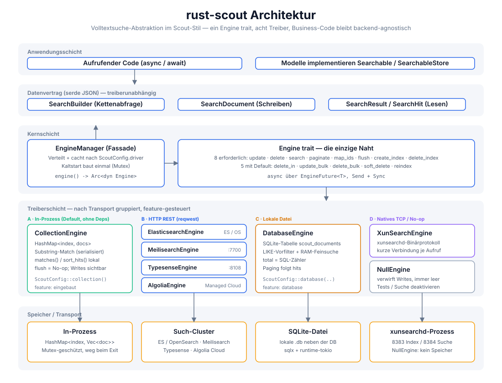
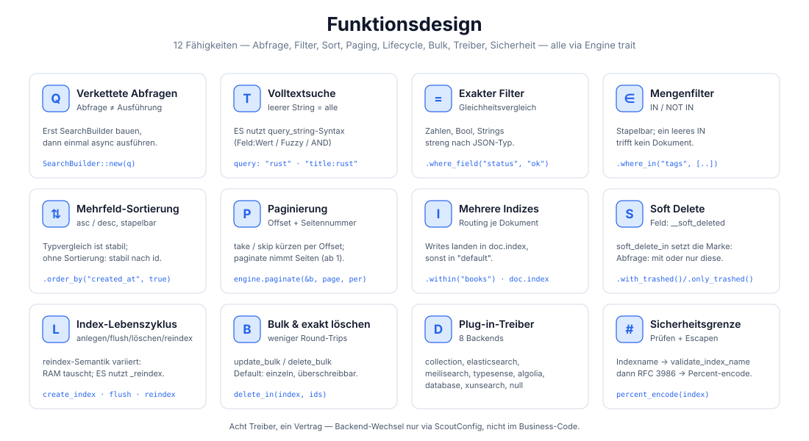
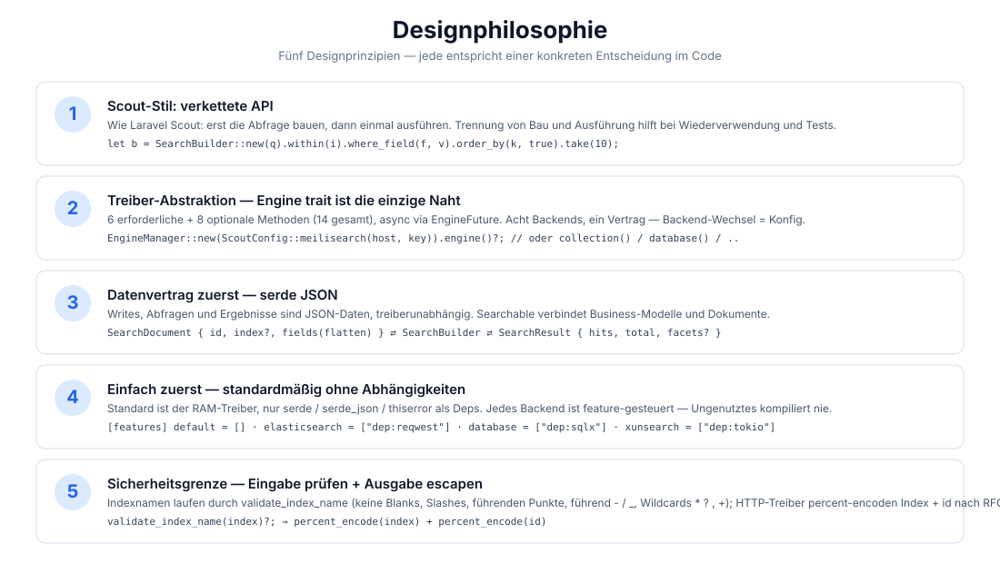
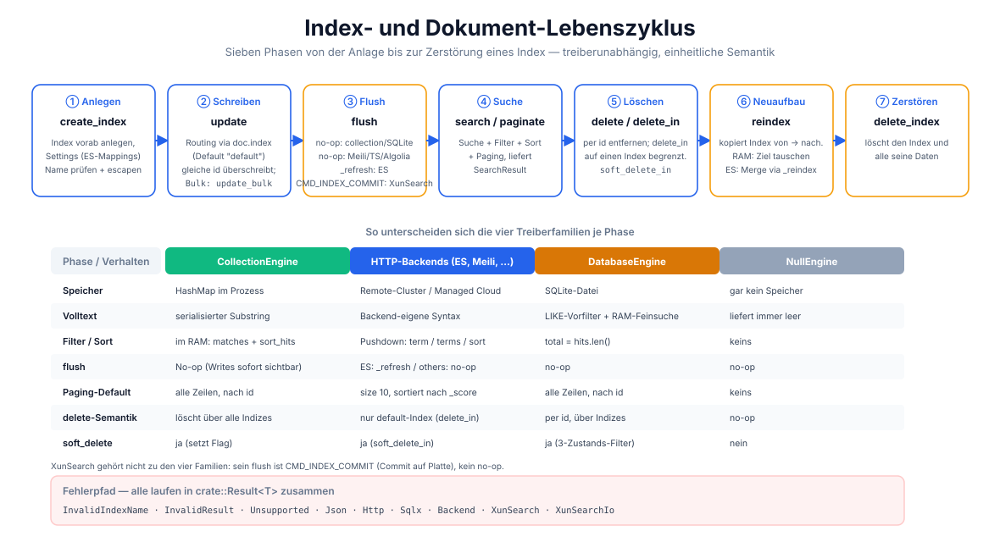

# rust-scout

[](https://crates.io/crates/rust-scout)
[](https://docs.rs/rust-scout)
[](../../../LICENSE)

[简体中文](../../../README.md) · [English](../en/README.md) · [日本語](../ja/README.md) · [한국어](../ko/README.md) · [Bahasa Indonesia](../id/README.md) · [Русский](../ru/README.md) · Deutsch · [Français](../fr/README.md) · [Español](../es/README.md) · [Português](../pt/README.md) · [हिन्दी](../hi/README.md) · [العربية](../ar/README.md) · [বাংলা](../bn/README.md)

**rust-scout — Abstraktion für Volltextsuchbibliotheken** — eine schlanke Schnittstellenschicht für die Volltextsuche in Rust. Vom verketteten Abfrage-Modell von [Laravel Scout](https://laravel.com/docs/scout) übernommen, abstrahiert sie über den einheitlichen `Engine` trait **8 Backends** (In-Memory, Elasticsearch/OpenSearch, Meilisearch, Typesense, Algolia, SQLite, XunSearch, Null): **In-Memory-Treiber ohne Abhängigkeiten für die Entwicklung, in der Produktion nahtlos auf jedes Backend wechseln — ohne eine Zeile Business-Code zu ändern.**


> Projektmaskottchen **Spürhund Scout** (Search Hound) — erschnüffelt Dokumente, verfolgt Indizes.
> Er steckt nicht nur in der Doku: Terminal-Banner und Fehlermeldungen tragen ihn ebenfalls,
> siehe [Projektmaskottchen](#projektmaskottchen).

```rust
let result = engine.search(
    SearchBuilder::new("rust async")
        .within("articles")
        .where_field("status", "published")
        .order_by("created_at", true)
        .take(10),
).await?;
```

## Funktionen

| Fähigkeit | Beschreibung |
|------|------|
| 🔍 Volltextsuche | In-Memory-Treiber: Substring-Match; HTTP-Treiber nutzen die native Syntax des Backends (ES: `query_string`, `feld:wert`) |
| ⚙️ Verkettete Abfragen | `SearchBuilder`: query / within / where_field / where_in / where_not_in / order_by / take / skip / option |
| 🎯 Exakte Filter | Gleichheitsvergleich (ES → `term`), Mengenvergleich (ES → `terms` / `must_not`) |
| 📄 Mehrfeld-Sortierung | asc / desc stapelbar, deterministische Reihenfolge über JSON-Typen hinweg |
| 📃 Paginierung | `take`/`skip` als Offset-Abschnitt + `paginate(page, per_page)` als Seitenpaginierung |
| 🗂️ Mehrere Indizes | Routing über das `index`-Feld je Dokument, Standardindex `"default"` |
| 🔄 Index-Lebenszyklus | Kompletter Ablauf `create_index` / `flush` / `reindex` / `delete_index` |
| 🗑️ Soft Delete | `soft_delete_in(index, ids)` setzt `__soft_deleted`; `with_trashed()` / `only_trashed()` als Drei-Zustands-Filter |
| 📦 Bulk-Operationen | `update_bulk` / `delete_bulk` sparen Round-Trips; `delete_in` löscht gezielt in einem Index |
| 🔌 Plug-in-Treiber | Standard ist In-Memory ohne Abhängigkeiten; 8 Backends je hinter eigenem feature — Ungenutztes wird nicht kompiliert |
| 🔒 Sicherheitsgrenze | Indexnamen-Prüfung (`validate_index_name`) + RFC-3986-Percent-Encoding gegen Pfad-Injection |
| 🐕 Projektmaskottchen | Spürhund Scout: Terminal-Banner + Troubleshooting-Hinweis je Fehler (`rust_scout::pet`) |

## Architektur



Fünf Schichten: Anwendungsschicht → Datenvertragsschicht (serde JSON) → Kernschicht (`EngineManager` + `Engine` trait)
→ Treiberschicht (nach Transport in vier Gruppen, insgesamt 8 Treiber) → Speicherschicht. Über die Schichten
hinweg gibt es nur eine Naht: den `Engine` trait.

## Funktionsdesign



12 Fähigkeiten: verkettete Abfragen, Volltext, exakte/Mengen-Filter, Sortierung, Paginierung, mehrere
Indizes, Soft Delete, Index-Lebenszyklus, Bulk- und gezieltes Löschen, Plug-in-Treiber, Sicherheitsgrenze.

## Designphilosophie



## Lebenszyklus



Sieben Phasen: Anlegen → Schreiben → Flush → Suche → Dokumente löschen → Neuaufbau → Zerstören.
Die untere Hälfte vergleicht, wie sich die vier Treiberfamilien in den einzelnen Phasen verhalten.

## Projektstruktur

```
rust-scout/
├── Cargo.toml              # Abhängigkeiten + feature-Deklaration (default = [], ohne Abhängigkeiten)
├── src/
│   ├── lib.rs              # crate-Wurzel: Modul-Exporte + feature-gesteuerte Re-Exports
│   │
│   ├── engine.rs           # Engine trait: der eine Treibervertrag (8 nötig + 5 mit Default)
│   ├── manager.rs          # EngineManager: Fassade, verteilt nach driver und cacht Arc<dyn Engine>
│   ├── config.rs           # ScoutConfig (8 Konstruktoren) + validate_index_name + percent_encode
│   │
│   ├── builder.rs          # SearchBuilder / Where / Order / TrashedFilter: verkettete Abfragen
│   ├── document.rs         # SearchDocument: das geschriebene Dokument (serde-JSON-Vertrag)
│   ├── result.rs           # SearchResult / SearchHit: Abfrageergebnisse
│   ├── searchable.rs       # Searchable / SearchableStore: Brücke zu Business-Modellen
│   ├── error.rs            # ScoutError + Result<T> + pet_hint()
│   ├── pet.rs              # Projektmaskottchen: Spürhund Scout (Banner + Fehlerhinweise)
│   │
│   ├── collection_engine.rs    # In-Memory-Treiber (Standard, ohne Abhängigkeiten)
│   ├── null_engine.rs          # No-op-Treiber: verwirft Writes, immer leer     [null]
│   ├── elasticsearch_engine.rs # ES / OpenSearch (REST)                        [elasticsearch]
│   │   └── query.rs            #   query_string-Aufbau + Antwort-Parsing
│   ├── meilisearch_engine.rs   # Meilisearch (REST)                            [meilisearch]
│   ├── typesense_engine.rs     # Typesense (REST)                              [typesense]
│   │   └── typesense_query.rs  #   Suchparameter + filter_by-Aufbau
│   ├── algolia_engine.rs       # Algolia (gehostete Cloud-REST)                [algolia]
│   ├── database_engine.rs      # SQLite (sqlx, LIKE-Vorfilter + Feinsuche im RAM) [database]
│   ├── xunsearch_engine.rs     # XunSearch: natives xunsearchd-TCP-Protokoll    [xunsearch]
│   │   ├── xunsearch_query.rs  #   Paket-Codec + ini-Feldschema
│   │   └── xunsearch_tests.rs  #   End-to-End-Tests gegen einen Mock-Server
│   │
│   └── (Unit-Tests stehen inline am Ende jedes Moduls unter #[cfg(test)] mod tests)
├── tests/                  # Integrationstests (derzeit leer, Tests liegen in src)
├── examples/
│   └── pet.rs              # cargo run --example pet: Banner + Fehlerhinweis-Demo
└── docs/
    ├── svg/                # Maskottchen + Architektur / Funktionen / Design / Lebenszyklus
    ├── i18n/               # READMEs und passende SVGs für 12 Sprachen
    ├── coin/               # Spenden-QR-Codes
    └── superpowers/specs/  # Designdokumente
```

> `[feature]` markiert das Cargo-feature, das ein Treiber benötigt. Ist es aus,
> liefert `EngineManager` `ScoutError::Unsupported` statt still zu degradieren.

### Treiberfähigkeiten im Vergleich

Der In-Memory-Treiber ist die semantische Referenz. Kann ein Backend etwas nicht,
**sagt es das ausdrücklich** — statt still falsche Ergebnisse zu liefern:

| Treiber | Einschränkung | Verhalten |
|---------|--------------|-----------|
| Algolia | Sortierung braucht vorab gebaute Replica-Indizes; pro Abfrage nicht wählbar | `order_by` wird **ignoriert** (Ergebnisse kommen trotzdem, nur die Reihenfolge bleibt undefiniert) |
| XunSearch | Kein Protokollbefehl für `where_in` / `where_not_in` | liefert `Unsupported`; nutze `where_field` |
| XunSearch | Server unterstützt nur ein Sortierfeld | mehrere `order_by` liefern `Unsupported` |
| XunSearch | Soft Delete nicht implementiert | `soft_delete` / `only_trashed` liefern `Unsupported` |
| XunSearch | Index-Anlage braucht eine Feld-Schema-ini | `create_index` liefert `Unsupported` (ini an `XunSearchEngine::new` übergeben) |

Zwei bewusste semantische Angleichungen:

- **Bei fehlerhafter Abfragesyntax** (`"("`, `"foo AND"`) liefert ES ein leeres Ergebnis
  statt eines Fehlers — der In-Memory-Treiber macht bei derselben Eingabe einen
  Substring-Match, und ein 400 würde "Backend tauschen, Code behalten" brechen.
- **`delete` und `soft_delete` tragen keine Index-Information**, ob sie also über Indizes
  hinweg wirken, hängt vom Backend ab. Um genau einen Index zu treffen, immer
  `delete_in` / `soft_delete_in` verwenden.

## Schnellstart

### 1. Abhängigkeit hinzufügen

```toml
[dependencies]
rust-scout = "0.6"
tokio = { version = "1", features = ["macros", "rt"] }   # nur für dieses Beispiel nötig
```

### 2. Minimalbeispiel (Standard-In-Memory-Treiber)

```rust
use rust_scout::{Engine, EngineManager, ScoutConfig, SearchBuilder, SearchDocument};

#[tokio::main]
async fn main() -> rust_scout::Result<()> {
    // Standard-Treiber: In-Memory CollectionEngine, sofort nutzbar ohne Abhängigkeiten
    let engine = EngineManager::new(ScoutConfig::collection()).engine()?;

    // Dokument schreiben
    let mut book = SearchDocument::new(
        "book-1",
        serde_json::json!({
            "title": "Programming Rust",
            "author": "Blandy & Orendorff",
            "tags": ["rust", "systems"],
            "status": "published",
        }),
    )?;
    book.index = Some("books".to_string());
    engine.update(&[book]).await?;

    // Abfrage
    let result = engine
        .search(
            SearchBuilder::new("rust")
                .within("books")
                .where_field("status", "published")
                .order_by("title", false)
                .take(10),
        )
        .await?;

    println!("total = {}", result.total);
    for hit in &result.hits {
        println!("  [{}] {:?}", hit.id, hit.source);
    }
    Ok(())
}
```

## Verwendung

### Abfragen bauen (SearchBuilder)

Alle Abfrageoperationen werden verkettet und am Ende an `engine.search(&builder)` übergeben:

```rust
let builder = SearchBuilder::new("Volltext-Schlüsselwörter")  // Volltext (optional, leer = alles)
    .within("articles")                          // Zielindex (optional, Standard "default")
    .where_field("status", "published")          // Gleichheitsfilter
    .where_in("tags", ["rust", "async"])         // IN-Menge
    .where_not_in("category", ["draft"])         // NOT-IN-Menge
    .order_by("created_at", true)                // Mehrfeld-Sortierung (true = desc)
    .order_by("title", false)
    .take(20)                                    // Seitengröße
    .skip(40)                                    // Offset
    .option("highlight", true)                   // treiberspezifische Durchreich-Optionen
    .with_trashed();                             // Soft-Delete-Dreizustand: ausgenommen / mit / nur
```

> `query` unterstützt die Lucene-`query_string`-Syntax (unter dem ES-Treiber voll wirksam):
> `"rust"`, `"title:rust AND tags:async"`, `"rust~2"` (fuzzy). Die übrigen Treiber nutzen ihre
> eigene native Syntax oder Substring-Matching.

### Paginierung

```rust
// Variante 1: Offset-Abschnitt
let page2 = SearchBuilder::new("rust").within("books").skip(10).take(10);
// Variante 2: Seitenpaginierung (page beginnt bei 1)
let page2 = engine.paginate(&SearchBuilder::new("rust").within("books"), 2, 10).await?;
```

### Mehrere Indizes und Lebenszyklus

```rust
engine.create_index("books", serde_json::json!({})).await?;    // Index anlegen
engine.update(&docs).await?;                                   // Dokumente schreiben
engine.update_bulk(&docs).await?;                              // Bulk-Schreiben (nutzt den Bulk-Endpunkt, falls vorhanden)
engine.flush("books").await?;                                  // Sichtbarkeit aktualisieren
engine.search(&builder).await?;                                // Abfrage
engine.delete_in("books", &["book-1".to_string()]).await?;     // Dokumente gezielt in einem Index löschen
engine.soft_delete_in("books", &["book-2".to_string()]).await?;            // Soft Delete (setzt die Markierung)
engine.reindex("books", "books_v2").await?;                    // Index neu aufbauen
engine.delete_index("books").await?;                           // Index löschen
```

> `delete` trägt keine Indexinformation, die Semantik unterscheidet sich je Engine (der In-Memory-Treiber
> löscht über alle Indizes hinweg, ES betrachtet nur `default`). Für einen bestimmten Index bitte
> `delete_in` verwenden.
>
> Für Soft Delete gilt dasselbe: **`soft_delete_in(index, ids)` ist über alle Engines hinweg
> der zuverlässige**. Das indexlose `soft_delete` kann nur bei synchronen Backends
> (`collection` / `database`) über Indizes hinweg markieren; die HTTP-Backends können das
> nicht und geben `ScoutError::Unsupported` zurück (statt stillschweigend gar nichts zu tun).
>
> Der Vertrag von `flush` lautet, Schreibvorgänge sichtbar zu machen: **kein Treiber leert
> einen Index** – ES geht über `_refresh`, bei allen anderen Treibern sind Schreibvorgänge
> sofort sichtbar, also ein No-op. Um einen Index zu leeren, `delete_index` verwenden.

### Umstieg auf Elasticsearch / OpenSearch

```bash
cargo add rust-scout --features elasticsearch
```

```rust
use rust_scout::{Engine, EngineManager, ScoutConfig};

let config = ScoutConfig::elasticsearch(
    "http://127.0.0.1:9200",      // oder eine OpenSearch-Adresse
    Some("your-api-key".into()),   // optional: ApiKey-Authentifizierung
);
let engine = EngineManager::new(config).engine()?;
// —— alle folgenden Operationen sind identisch zum In-Memory-Treiber ——
```

| Punkt | CollectionEngine (Standard) | ElasticsearchEngine |
|--------|--------------------------|---------------------|
| Abhängigkeiten | nur serde / thiserror | reqwest (feature-gesteuert) |
| Volltext | serialisierter Substring-Match | `query_string` |
| Filter | matches() im Speicher | term / terms / must_not |
| Sortierung | sort_hits() im Speicher | sort-Array |
| flush | no-op | `_refresh` |
| Standard-Paginierung | alle Ergebnisse | size 10 |
| Standard-Sortierung | nach id | nach _score |

### Umstieg auf Meilisearch

```bash
cargo add rust-scout --features meilisearch
```

```rust
use rust_scout::{Engine, EngineManager, ScoutConfig};

let config = ScoutConfig::meilisearch(
    "http://127.0.0.1:7700",   // Meilisearch-Adresse
    "your-master-key",          // optional: API-Schlüssel
);
let engine = EngineManager::new(config).engine()?;
// —— alle folgenden Operationen sind identisch zum In-Memory-Treiber ——
```

### Engine-Vergleich

| Engine | driver | feature | Transport | Status |
|------|--------|---------|-----------|--------|
| In-Memory (Standard) | `collection` | eingebaut | im Prozess | vollständig |
| Elasticsearch / OpenSearch | `elasticsearch` / `opensearch` | `elasticsearch` | HTTP REST | vollständig |
| Meilisearch | `meilisearch` | `meilisearch` | HTTP REST | vollständig |
| Typesense | `typesense` | `typesense` | HTTP REST | vollständig |
| Algolia | `algolia` | `algolia` | HTTP REST | vollständig |
| SQLite | `database` | `database` | lokale Datei | vollständig |
| XunSearch | `xunsearch` | `xunsearch` | natives TCP | vollständig |
| Null (Test / Suche abgeschaltet) | `null` | `null` | — | vollständig |

Die Konfigurationskonstruktoren der übrigen Engines stehen auf [docs.rs](https://docs.rs/rust-scout): `ScoutConfig::typesense(host, api_key)`, `ScoutConfig::algolia(app_id, api_key)`, `ScoutConfig::database(url, fields)`, `ScoutConfig::null()`, `ScoutConfig::xunsearch(host, project)`.

> Beim SQLite-Treiber (`database`) ist `total` ein Zähler auf SQL-Ebene (Index + LIKE-Vorfilter);
> wheres / Soft Deletes können nach dem Filtern im Speicher zu `hits.len() < total` führen, die
> Paginierung richtet sich nach den hits.

### Reservierte Felder

`__soft_deleted` ist der reservierte Feldname der Soft-Delete-Funktion (`Engine::soft_delete_in`,
`SearchBuilder::with_trashed()` / `only_trashed()`); die Engines filtern damit soft-deleted Dokumente
heraus. Anwenderdokumente **sollten** diesen Feldnamen nicht als Business-Feld verwenden.

### Fehlerbehandlung

Alle Operationen liefern `crate::Result<T>`, die Fehler laufen in einem einheitlichen `ScoutError` zusammen:

| Variante | Auslöser | feature |
|------|----------|---------|
| `InvalidIndexName` | Indexname enthält Whitespace / `/` / `\`, beginnt mit `.` oder ist leer (Prüfung vor dem Schreiben) | eingebaut |
| `InvalidResult` | Dokumentfeld ist kein JSON-Objekt | eingebaut |
| `Unsupported` | benötigtes feature ist aus, Pflichtkonfiguration fehlt oder die Engine unterstützt die Operation nicht | eingebaut |
| `Json` | serde-Serialisierungs- / -Deserialisierungsfehler | eingebaut |
| `Http` | HTTP-Anfrage fehlgeschlagen (Verbindung, Timeout, Statuscode) | HTTP-Vier-Treiber |
| `Sqlx` | SQLite-Fehler | `database` |
| `Backend` | das Backend hat mit einem Fehler geantwortet, die Originalmeldung wird durchgereicht | HTTP-Vier-Treiber / `xunsearch` |
| `XunSearch` / `XunSearchIo` | Protokoll-Parsing fehlgeschlagen / TCP-I/O-Fehler | `xunsearch` |

Jede Variante trägt einen Troubleshooting-Hinweis — siehe [`ScoutError::pet_hint()`](#projektmaskottchen).

### Business-Modelle anbinden (Searchable)

`Searchable` implementieren, um eine Geschäftsstruktur auf ein indexierbares Dokument abzubilden, und
`SearchableStore` implementieren, um die drei Operationen `index_documents` / `remove_documents` / `search`
zu kapseln:

```rust
use rust_scout::{Searchable, SearchableStore, SearchDocument, SearchResult};

struct Article { id: String, title: String, body: String }

impl Searchable for Article {
    fn searchable_id(&self) -> String { self.id.clone() }
    fn to_searchable_json(&self) -> serde_json::Value {
        serde_json::json!({ "title": self.title, "body": self.body })
    }
}
```

## Projektmaskottchen


**Scout · der Spürhund** (Search Hound) — erschnüffelt Dokumente, verfolgt Indizes, wo eine Abfrage ist,
ist er schon. Als Grafik in [`svg/pet.svg`](svg/pet.svg); im Terminal sieht er so aus:

```console
$ cargo run --example pet
```

```

      ___              ___
     /   \            /   \
    |     |__________|     |
    |     /          \     |
    |    |   o    o   |    |
    |    |     __     |    |
    |     \   /  \   /     |
     \     \  \__/  /     /
      \     \________/    /
       \_________________/
         \   ~~~~~~   /
          \__________/
             |    |
            _|    |_
           |__|  |__|


   ,^.     ,^.     ,^.     ,^.

  Scout · 嗅探猎犬 · rust-scout
  嗅探文档，追踪索引 —— 哪里有查询，哪里就有它
```

Das Maskottchen wohnt im Modul [`rust_scout::pet`](../../../src/pet.rs) und **bringt keine einzige Abhängigkeit mit**:

| Element | Beschreibung |
|----|------|
| `pet::NAME` / `pet::SPECIES` / `pet::TAGLINE` | Namensschild |
| `pet::ART` | das ASCII-Porträt (absichtlich nur 7-Bit, damit es in CJK-Terminals nicht verrutscht) |
| `pet::banner()` | Terminal-Banner, reiner Text ohne Escape-Sequenzen, sicher fürs Log |
| `pet::hint(&err)` | Troubleshooting-Hinweis je Fehler, liefert `&'static str` |
| `pet::format_error(&err)` | Originalfehler + Hinweis, für Menschen lesbar aufbereitet |
| `ScoutError::pet_hint()` | derselbe Hinweis, direkt am Fehlertyp |

```rust
use rust_scout::{pet, ScoutError};

println!("{}", pet::banner());

let err = ScoutError::Unsupported("fehlendes feature".into());
eprintln!("{}", pet::format_error(&err));
// error: unsupported operation: fehlendes feature
//
//   [o_o] Scout：这个后端我还没找到路 —— Cargo.toml 里对应的 feature 启用了吗？
```

> **Warum steckt der Hinweis nicht direkt in `Display`?** `Display` von `ScoutError` bleibt einzeilig
> und maschinenlesbar — `?`-Propagierung, Log-Sammlung und grep in der CI hängen davon ab. Für eine
> menschenlesbare Ausgabe mit Maskottchen-Hinweis `pet::format_error()` aufrufen.

## Unterstützung & Spenden

Wenn dieses Projekt dir hilft, freue ich mich über eine Spende ☕ — deine Unterstützung ist der Antrieb für die weitere Pflege!

### WeChat / Alipay


Mit WeChat scannen · mit Alipay scannen

### Krypto-Spenden

| Netzwerk | Wallet-Adresse | QR-Code |
|------|----------|--------|
| BNB Smart Chain (BEP20) | `0x355d429f97511897ccb4e271ec888205f9ab6629` |  |
| Tron (TRC20) | `TEdDHWLajt1XvqtPDWmQctdrJaC3pzZZzz` |  |
| Ethereum (ERC20) | `0x355d429f97511897ccb4e271ec888205f9ab6629` |  |
| Aptos | `0x836e3780edfc3f7b2372b39e2a1a3a5d7adfaccd96c726f21cfde1b50dd68030` |  |
| Plasma | `0x355d429f97511897ccb4e271ec888205f9ab6629` |  |
| Polygon POS | `0x355d429f97511897ccb4e271ec888205f9ab6629` |  |
| Solana | `2hfhboHdmdrYsY25XfQSsEWxq5ip4EQsR7f4AzSRMUyr` |  |
| The Open Network (TON) | `UQB9kFQohzmXUir9QSSZq01iwl9aQZIDdBpNmDklljRtCoGK` |  |
| Arbitrum One | `0x355d429f97511897ccb4e271ec888205f9ab6629` |  |
| AVAX C-Chain | `0x355d429f97511897ccb4e271ec888205f9ab6629` |  |

### Weltweite Überweisungen (Bank)

**Empfängerangaben**

- Name des Empfängers: WANG KEXUN
- Kontonummer des Empfängers: 881015918251

**Empfängerbank (ZA Bank)**

- SWIFT Code: `AABLHKHHXXX`
- Bankname: ZA Bank Limited
- Bankleitzahl: 387
- Bankadresse: Core F, Cyberport 3, 100 Cyberport Road, Hong Kong

> Die folgenden Angaben betreffen die Korrespondenzbank (Zwischenbank) bei grenzüberschreitenden
> Überweisungen, nicht die Empfängerbank. Bitte bei der überweisenden Bank erfragen, ob sie
> angegeben werden muss.

- Korrespondenzbank für Überweisungen in HKD, CNY und USD ist **Citibank**:
  - Bankname: Citibank N.A. Hong Kong
  - SWIFT Code: `CITIHKHXXXX`
  - Bankleitzahl: 006 / Filialnummer: 391
  - Filialname: Hong Kong Branch
  - Bankadresse: Citibank Tower, Citibank Plaza, 3 Garden Road, Central, Hong Kong
- Korrespondenzbank für Überweisungen in anderen Währungen ist **BNY Mellon**:
  - Bankname: THE BANK OF NEW YORK MELLON
  - SWIFT Code: `IRVTUS3NXXX`
  - Bankadresse: THE BANK OF NEW YORK MELLON, 240 GREENWICH STREET, NEW YORK, United States

## Lizenz

MIT-Lizenz. Details siehe [LICENSE](../../../LICENSE).
