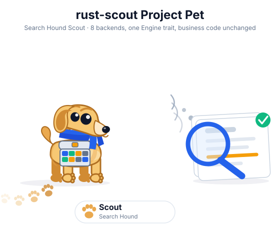
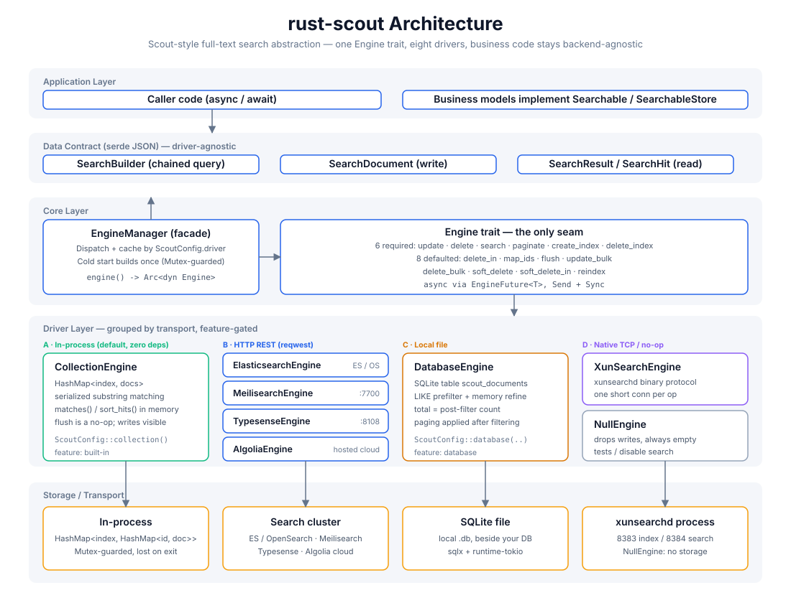
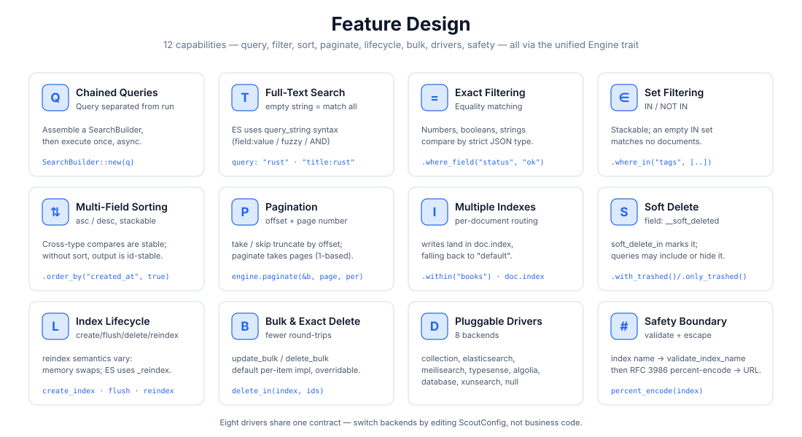
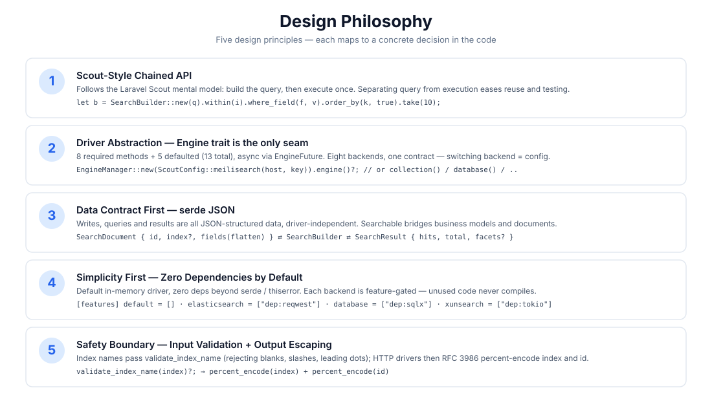
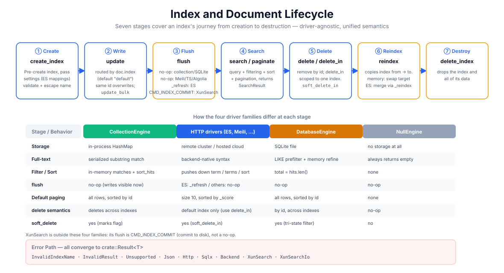

# rust-scout

[](https://crates.io/crates/rust-scout)
[](https://docs.rs/rust-scout)
[](../../../LICENSE)

[简体中文](../../../README.md) · English · [日本語](../ja/README.md) · [한국어](../ko/README.md) · [Bahasa Indonesia](../id/README.md) · [Русский](../ru/README.md) · [Deutsch](../de/README.md) · [Français](../fr/README.md) · [Español](../es/README.md) · [Português](../pt/README.md) · [हिन्दी](../hi/README.md) · [العربية](../ar/README.md) · [বাংলা](../bn/README.md)

**rust-scout full-text search library abstraction** — a lightweight full-text search interface layer for Rust. Borrowing the chained-query mental model of [Laravel Scout](https://laravel.com/docs/scout), it abstracts **8 backends** (in-memory, Elasticsearch/OpenSearch, Meilisearch, Typesense, Algolia, SQLite, XunSearch, Null) through a unified `Engine` trait: **zero-dependency in-memory driver for development, seamless switch to any backend in production, without changing a single line of business code.**



> Project pet **Scout the Search Hound** — sniffs out documents, tracks down indexes.
> It lives in the docs *and* in the code: terminal banner and error hints.
> See [Project Pet](#project-pet).

```rust
let result = engine.search(
    SearchBuilder::new("rust 异步")
        .within("articles")
        .where_field("status", "published")
        .order_by("created_at", true)
        .take(10),
).await?;
```

## Features

| Capability | Description |
|------|------|
| 🔍 Full-text search | In-memory driver substring matching; HTTP drivers use native syntax (ES: `query_string`, `field:value`) |
| ⚙️ Chained queries | `SearchBuilder`: query / within / where_field / where_in / where_not_in / order_by / take / skip / option |
| 🎯 Exact filtering | Equality matching (ES → `term`), set matching (ES → `terms` / `must_not`) |
| 📄 Multi-field sorting | Stackable asc / desc, deterministic ordering across JSON types |
| 📃 Pagination | `take`/`skip` offset truncation + `paginate(page, per_page)` page-based pagination |
| 🗂️ Multiple indexes | Document-level `index` field routing, default index `"default"` |
| 🔄 Index lifecycle | `create_index` / `flush` / `reindex` / `delete_index` full workflow |
| 🗑️ Soft delete | `soft_delete_in(index, ids)` marks `__soft_deleted`; `with_trashed()` / `only_trashed()` three-state filtering |
| 📦 Bulk operations | `update_bulk` / `delete_bulk` cut round-trips; `delete_in` targets one index exactly |
| 🔌 Pluggable drivers | Zero-dependency default; 8 backends each behind its own feature — what you don't use doesn't compile |
| 🔒 Safety boundary | Index name validation (`validate_index_name`) + RFC 3986 percent-encoding to prevent path injection |
| 🐕 Project pet | Scout the Search Hound: terminal banner + per-error troubleshooting hints (`rust_scout::pet`) |

## Architecture Design



Five layers: application → data contract (serde JSON) → core (`EngineManager` + `Engine` trait)
→ drivers (grouped by transport, 8 total) → storage. `Engine` is the only seam crossing layers.

## Feature Design



12 capabilities: chained queries, full-text, exact/set filtering, sorting, pagination,
multiple indexes, soft delete, index lifecycle, bulk and targeted deletion,
pluggable drivers, safety boundary.

## Design Philosophy



## Lifecycle



Seven stages: create → write → flush → search → delete documents → reindex → destroy.
The lower half compares how the four driver families behave at each stage.

## Project Structure

```
rust-scout/
├── Cargo.toml              # deps + feature flags (default = [], zero-dependency)
├── src/
│   ├── lib.rs              # crate root: module exports + feature-gated re-exports
│   │
│   ├── engine.rs           # Engine trait: the one driver contract (8 required + 5 defaulted)
│   ├── manager.rs          # EngineManager: facade, dispatches by driver, caches Arc<dyn Engine>
│   ├── config.rs           # ScoutConfig (8 constructors) + validate_index_name + percent_encode
│   │
│   ├── builder.rs          # SearchBuilder / Where / Order / TrashedFilter: chained queries
│   ├── document.rs         # SearchDocument: the document being written (serde JSON contract)
│   ├── result.rs           # SearchResult / SearchHit: query results
│   ├── searchable.rs       # Searchable / SearchableStore: business-model bridge
│   ├── error.rs            # ScoutError + Result<T> + pet_hint()
│   ├── pet.rs              # Project pet: Scout the Search Hound (banner + error hints)
│   │
│   ├── collection_engine.rs    # in-memory driver (default, zero-dependency)
│   ├── null_engine.rs          # no-op driver: drops writes, always empty      [null]
│   ├── elasticsearch_engine.rs # ES / OpenSearch (REST)                        [elasticsearch]
│   │   └── query.rs            #   query_string building + response parsing
│   ├── meilisearch_engine.rs   # Meilisearch (REST)                            [meilisearch]
│   ├── typesense_engine.rs     # Typesense (REST)                              [typesense]
│   │   └── typesense_query.rs  #   search params + filter_by building
│   ├── algolia_engine.rs       # Algolia (hosted cloud REST)                   [algolia]
│   ├── database_engine.rs      # SQLite (sqlx, LIKE prefilter + in-memory refine) [database]
│   ├── xunsearch_engine.rs     # XunSearch: native xunsearchd TCP protocol     [xunsearch]
│   │   ├── xunsearch_query.rs  #   packet codec + ini field scheme
│   │   └── xunsearch_tests.rs  #   end-to-end tests against a mock server
│   │
│   └── (unit tests are inlined per module under #[cfg(test)] mod tests)
├── tests/                  # integration tests (currently empty; tests live in src)
├── examples/
│   └── pet.rs              # cargo run --example pet: pet banner + error-hint demo
└── docs/
    ├── svg/                # pet + architecture / features / design / lifecycle diagrams
    ├── i18n/               # READMEs and matching SVGs for 12 languages
    ├── coin/               # donation QR codes
    └── superpowers/specs/  # design documents
```

> The `[feature]` tag marks the Cargo feature a driver needs. When it is off,
> `EngineManager` returns `ScoutError::Unsupported` instead of silently degrading.

### Driver Capability Differences

The default in-memory driver is the semantic baseline. Where a backend cannot do
something, it **says so explicitly** rather than silently returning wrong results:

| Driver | Limitation | Behaviour |
|--------|-----------|-----------|
| Algolia | Sorting requires pre-built replica indices; it cannot be chosen per query | `order_by` is **ignored** (results still return, order is just unspecified) |
| XunSearch | No protocol command for `where_in` / `where_not_in` | returns `Unsupported`; use `where_field` |
| XunSearch | Server supports a single sort field only | multiple `order_by` returns `Unsupported` |
| XunSearch | Soft delete not implemented | `soft_delete` / `only_trashed` return `Unsupported` |
| XunSearch | Creating an index needs a field-scheme ini | `create_index` returns `Unsupported` (pass an ini to `XunSearchEngine::new`) |

Two deliberate semantic alignments:

- **When ES receives malformed query syntax** (`"("`, `"foo AND"`) it returns an
  empty result rather than an error — the in-memory driver does a substring match
  for the same input, and a 400 would break "swap backends, keep your code".
- **`delete` and `soft_delete` carry no index information**, so whether they span
  indexes depends on the backend. To target one index, always use
  `delete_in` / `soft_delete_in`.

## Quick Start

### 1. Add the dependency

```toml
[dependencies]
rust-scout = "0.6"
tokio = { version = "1", features = ["macros", "rt"] }   # example only
```

### 2. Minimal example (default in-memory driver)

```rust
use rust_scout::{Engine, EngineManager, ScoutConfig, SearchBuilder, SearchDocument};

#[tokio::main]
async fn main() -> rust_scout::Result<()> {
    // default driver: in-memory CollectionEngine, zero dependencies
    let engine = EngineManager::new(ScoutConfig::collection()).engine()?;

    // write a document
    let mut book = SearchDocument::new(
        "book-1",
        serde_json::json!({
            "title": "Programming Rust",
            "author": "Blandy & Orendorff",
            "tags": ["rust", "systems"],
            "status": "published",
        }),
    )?;
    book.index = Some("books".to_string());
    engine.update(&[book]).await?;

    // query
    let result = engine
        .search(
            SearchBuilder::new("rust")
                .within("books")
                .where_field("status", "published")
                .order_by("title", false)
                .take(10),
        )
        .await?;

    println!("total = {}", result.total);
    for hit in &result.hits {
        println!("  [{}] {:?}", hit.id, hit.source);
    }
    Ok(())
}
```

## Usage

### Query Building (SearchBuilder)

All query operations are chained together and finally handed to `engine.search(&builder)`:

```rust
let builder = SearchBuilder::new("full-text keywords")  // full-text (optional, empty = match all)
    .within("articles")                          // target index (optional, default "default")
    .where_field("status", "published")          // equality filter
    .where_in("tags", ["rust", "async"])         // IN set
    .where_not_in("category", ["draft"])         // NOT IN set
    .order_by("created_at", true)                // multi-field sort (true = desc)
    .order_by("title", false)
    .take(20)                                    // page size
    .skip(40)                                    // offset
    .option("highlight", true)                   // driver-specific passthrough options
    .with_trashed();                             // soft-delete tri-state: exclude / with / only
```

> `query` supports Lucene `query_string` syntax (fully effective under the ES driver): `"rust"`, `"title:rust AND tags:async"`, `"rust~2"` (fuzzy). Other drivers use their native syntax or substring matching.

### Pagination

```rust
// Option 1: offset truncation
let page2 = SearchBuilder::new("rust").within("books").skip(10).take(10);
// Option 2: page-based (page starts at 1)
let page2 = engine.paginate(&SearchBuilder::new("rust").within("books"), 2, 10).await?;
```

### Multiple Indexes and Lifecycle

```rust
engine.create_index("books", serde_json::json!({})).await?;    // create index
engine.update(&docs).await?;                                   // write documents
engine.update_bulk(&docs).await?;                              // bulk write (native bulk endpoint when available)
engine.flush("books").await?;                                  // refresh visibility
engine.search(&builder).await?;                                // query
engine.delete_in("books", &["book-1".to_string()]).await?;     // delete docs from one index
engine.soft_delete_in("books", &["book-2".to_string()]).await?;  // soft delete (marks the doc)
engine.reindex("books", "books_v2").await?;                    // rebuild an index
engine.delete_index("books").await?;                           // drop the index
```

> `delete` carries no index information, so its semantics vary by engine (the in-memory
> driver deletes across indexes; ES only touches `default`). Use `delete_in` to target
> one index exactly.
>
> Same for soft delete: **`soft_delete_in(index, ids)` is the one that works everywhere**.
> The index-less `soft_delete` can only mark across indexes on a synchronous backend
> (`collection` / `database`); the HTTP backends cannot, and return
> `ScoutError::Unsupported` instead of silently doing nothing.
>
> `flush` means "make pending writes visible" and **never clears an index on any driver**:
> ES issues `_refresh`, every other driver is immediately visible so it is a no-op.
> To clear an index, use `delete_index`.

### Switching to Elasticsearch / OpenSearch

```bash
cargo add rust-scout --features elasticsearch
```

```rust
use rust_scout::{Engine, EngineManager, ScoutConfig};

let config = ScoutConfig::elasticsearch(
    "http://127.0.0.1:9200",      // or an OpenSearch endpoint
    Some("your-api-key".into()),  // optional: ApiKey auth
);
let engine = EngineManager::new(config).engine()?;
// — every operation below is identical to the in-memory driver —
```

| Item | CollectionEngine (default) | ElasticsearchEngine |
|--------|--------------------------|---------------------|
| Dependencies | serde / thiserror only | reqwest (feature-enabled) |
| Full-text | Serialized substring matching | `query_string` |
| Filtering | In-memory matches() | term / terms / must_not |
| Sorting | In-memory sort_hits() | sort array |
| flush | no-op | `_refresh` |
| Default pagination | All results | size 10 |
| Default sorting | By id | By _score |

### Switching to Meilisearch

```bash
cargo add rust-scout --features meilisearch
```

```rust
use rust_scout::{Engine, EngineManager, ScoutConfig};

let config = ScoutConfig::meilisearch(
    "http://127.0.0.1:7700",   // Meilisearch endpoint
    "your-master-key",          // optional: API key
);
let engine = EngineManager::new(config).engine()?;
// — every operation below is identical to the in-memory driver —
```

### Engine Comparison

| Engine | driver | feature | Transport | Status |
|------|--------|---------|-----------|--------|
| In-memory (default) | `collection` | built-in | In-process | Complete |
| Elasticsearch / OpenSearch | `elasticsearch` / `opensearch` | `elasticsearch` | HTTP REST | Complete |
| Meilisearch | `meilisearch` | `meilisearch` | HTTP REST | Complete |
| Typesense | `typesense` | `typesense` | HTTP REST | Complete |
| Algolia | `algolia` | `algolia` | HTTP REST | Complete |
| SQLite | `database` | `database` | Local file | Complete |
| XunSearch | `xunsearch` | `xunsearch` | Native TCP | Complete |
| Null (testing/disabled search) | `null` | `null` | — | Complete |

Config constructors for the remaining engines are documented on [docs.rs](https://docs.rs/rust-scout): `ScoutConfig::typesense(host, api_key)`, `ScoutConfig::algolia(app_id, api_key)`, `ScoutConfig::database(url, fields)`, `ScoutConfig::null()`, `ScoutConfig::xunsearch(host, project)`.

> For the SQLite engine (`database`), `total` is the **post-filter** hit count, matching `CollectionEngine`: SQL only does the index + LIKE coarse pass to fetch candidates, then wheres / soft deletes / sorting / pagination all happen in memory. Pagination cannot be pushed down into SQL `LIMIT/OFFSET` — that would make matching rows outside the window permanently unreachable.

### Reserved Fields

`__soft_deleted` is the reserved field name used by the soft-delete feature (`Engine::soft_delete_in`, `SearchBuilder::with_trashed()` / `only_trashed()`), which engines use to filter out soft-deleted documents. User documents **should not** use this field name as a business field.

### Error Handling

All operations return `crate::Result<T>`, with errors converging into the unified `ScoutError`:

| Variant | Triggered by | feature |
|---------|--------------|---------|
| `InvalidIndexName` | index name has whitespace / `/` / `\`, starts with `.` or `-` or `_`, is empty, or contains a wildcard/multi-index character (`*` `?` `,` `+`) — validated before writing | built-in |
| `InvalidResult` | document field is not a JSON object | built-in |
| `Unsupported` | driver's feature is off, required config missing, or the engine does not support the operation | built-in |
| `Json` | serde serialization / deserialization error | built-in |
| `Http` | HTTP request failed (connect, timeout, status) | HTTP drivers |
| `Sqlx` | SQLite error | `database` |
| `Backend` | backend returned an error response; original message passed through | HTTP drivers / `xunsearch` |
| `XunSearch` / `XunSearchIo` | protocol parse failure / TCP I/O failure | `xunsearch` |

Every variant carries a troubleshooting hint — see [`ScoutError::pet_hint()`](#project-pet).

### Bridging Business Models (Searchable)

Implement `Searchable` to map a business structure into an indexable document, and implement `SearchableStore` to encapsulate the three operations `index_documents` / `remove_documents` / `search`:

```rust
use rust_scout::{Searchable, SearchableStore, SearchDocument, SearchResult};

struct Article { id: String, title: String, body: String }

impl Searchable for Article {
    fn searchable_id(&self) -> String { self.id.clone() }
    fn to_searchable_json(&self) -> serde_json::Value {
        serde_json::json!({ "title": self.title, "body": self.body })
    }
}
```

## Project Pet


**Scout · the Search Hound** — sniffs out documents, tracks down indexes. Wherever there
is a query, he is already there. Illustration in [`svg/pet.svg`](svg/pet.svg);
in the terminal he looks like this:

```console
$ cargo run --example pet
```

```

      ___              ___
     /   \            /   \
    |     |__________|     |
    |     /          \     |
    |    |   o    o   |    |
    |    |     __     |    |
    |     \   /  \   /     |
     \     \  \__/  /     /
      \     \________/    /
       \_________________/
         \   ~~~~~~   /
          \__________/
        +----------------+
        |  [] [] [] []   |
        |  [] [] [] []   |
        +----------------+
           ||      ||
           ||      ||
          (__)    (__)


   ,^.     ,^.     ,^.     ,^.

  Scout · 嗅探猎犬 · rust-scout
  嗅探文档，追踪索引 —— 哪里有查询，哪里就有它
```

The pet lives in the [`rust_scout::pet`](../../../src/pet.rs) module and **adds no dependencies**:

| Item | Description |
|------|-------------|
| `pet::NAME` / `pet::SPECIES` / `pet::TAGLINE` | name tag |
| `pet::ART` | the ASCII portrait (deliberately 7-bit only, so it never skews in CJK terminals) |
| `pet::banner()` | terminal banner; plain text, no escape sequences, safe to log |
| `pet::hint(&err)` | per-error troubleshooting hint, returns `&'static str` |
| `pet::format_error(&err)` | original error + hint, rendered for humans |
| `ScoutError::pet_hint()` | the same hint, hanging off the error type itself |

```rust
use rust_scout::{pet, ScoutError};

println!("{}", pet::banner());

let err = ScoutError::Unsupported("missing feature".into());
eprintln!("{}", pet::format_error(&err));
// error: unsupported operation: missing feature
//
//   [o_o] Scout：这个后端我还没找到路 —— Cargo.toml 里对应的 feature 启用了吗？
```

> **Why isn't the hint baked into `Display`?** `ScoutError`'s `Display` stays single-line
> and machine-readable — `?` propagation, log collection and CI grepping all depend on it.
> For human-readable output that includes the hint, call `pet::format_error()`.

## Support & Donations

If this project helps you, feel free to support it with a donation ☕ — your support is the motivation for continued maintenance!

### WeChat / Alipay


Scan with WeChat · Scan with Alipay

### Crypto Donations

| Network | Wallet Address | QR Code |
|------|----------|--------|
| BNB Smart Chain (BEP20) | `0x355d429f97511897ccb4e271ec888205f9ab6629` |  |
| Tron (TRC20) | `TEdDHWLajt1XvqtPDWmQctdrJaC3pzZZzz` |  |
| Ethereum (ERC20) | `0x355d429f97511897ccb4e271ec888205f9ab6629` |  |
| Aptos | `0x836e3780edfc3f7b2372b39e2a1a3a5d7adfaccd96c726f21cfde1b50dd68030` |  |
| Plasma | `0x355d429f97511897ccb4e271ec888205f9ab6629` |  |
| Polygon POS | `0x355d429f97511897ccb4e271ec888205f9ab6629` |  |
| Solana | `2hfhboHdmdrYsY25XfQSsEWxq5ip4EQsR7f4AzSRMUyr` |  |
| The Open Network (TON) | `UQB9kFQohzmXUir9QSSZq01iwl9aQZIDdBpNmDklljRtCoGK` |  |
| Arbitrum One | `0x355d429f97511897ccb4e271ec888205f9ab6629` |  |
| AVAX C-Chain | `0x355d429f97511897ccb4e271ec888205f9ab6629` |  |

### Global Transfers (Bank Transfer)

**Payee Information**

- Payee Name: WANG KEXUN
- Account Number: 881015918251

**Receiving Bank (ZA Bank)**

- SWIFT Code: `AABLHKHHXXX`
- Bank Name: ZA Bank Limited
- Bank Code: 387
- Bank Address: Core F, Cyberport 3, 100 Cyberport Road, Hong Kong

> The correspondent bank (intermediary bank) information below is for cross-border remittances, not the receiving bank's information. Please ask the remitting bank whether it is required.

- The correspondent bank for remittances in HKD, CNY and USD is **Citibank**:
  - Bank Name: Citibank N.A. Hong Kong
  - SWIFT Code: `CITIHKHXXXX`
  - Bank Code: 006 / Branch Code: 391
  - Branch Name: Hong Kong Branch
  - Bank Address: Citibank Tower, Citibank Plaza, 3 Garden Road, Central, Hong Kong
- The correspondent bank for remittances in other currencies is **BNY Mellon**:
  - Bank Name: THE BANK OF NEW YORK MELLON
  - SWIFT Code: `IRVTUS3NXXX`
  - Bank Address: THE BANK OF NEW YORK MELLON, 240 GREENWICH STREET, NEW YORK, United States

## License

MIT License. See [LICENSE](../../../LICENSE) for details.
