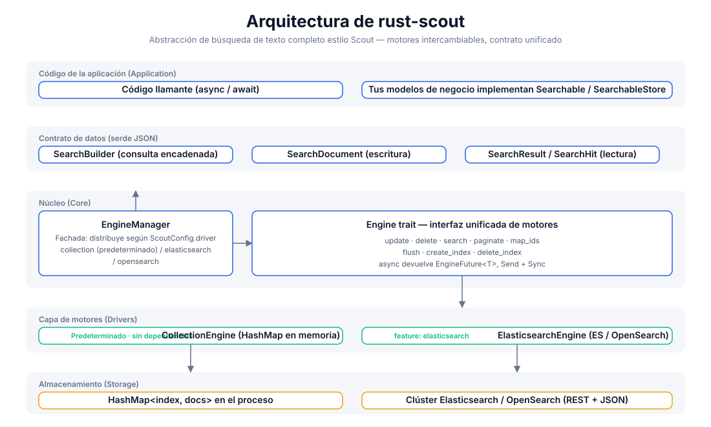
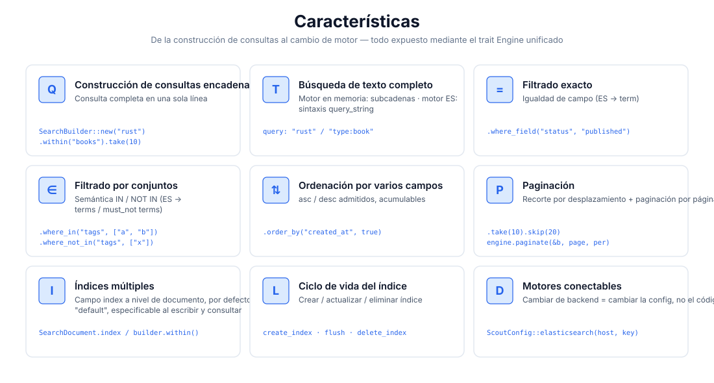
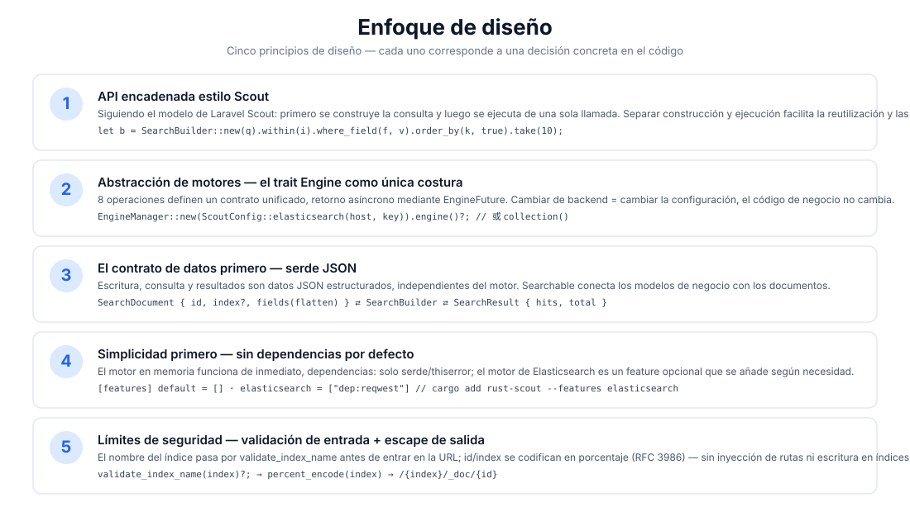
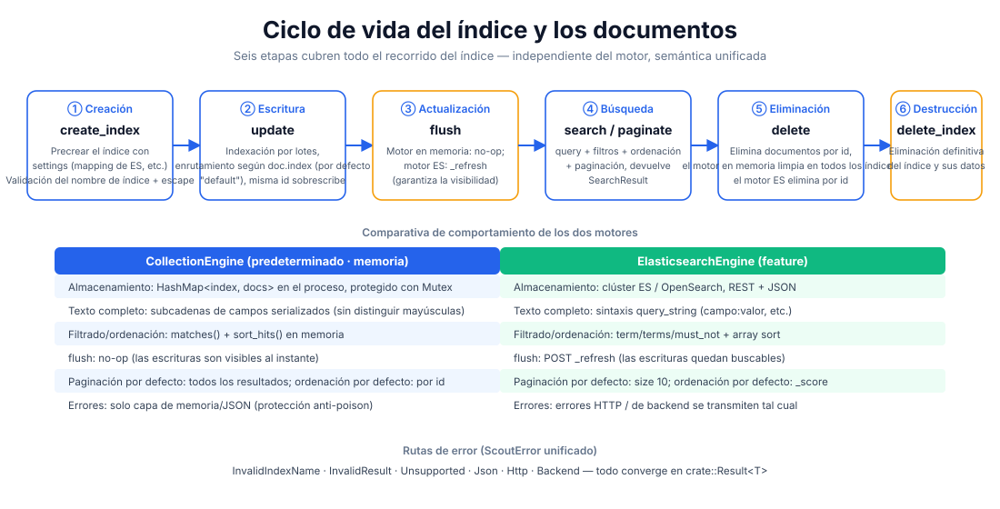

# rust-scout

[](https://crates.io/crates/rust-scout)
[](https://docs.rs/rust-scout)
[](../../../LICENSE)

[简体中文](../../../README.md) · [English](../en/README.md) · [日本語](../ja/README.md) · [한국어](../ko/README.md) · [Русский](../ru/README.md) · [Deutsch](../de/README.md) · [Français](../fr/README.md) · Español · [Português](../pt/README.md) · [हिन्दी](../hi/README.md) · [العربية](../ar/README.md) · [বাংলা](../bn/README.md) · [Bahasa Indonesia](../id/README.md)

**rust-scout — abstracción de búsqueda de texto completo** — una capa de interfaz ligera para la búsqueda de texto completo en Rust. Siguiendo la filosofía de consultas encadenadas de [Laravel Scout](https://laravel.com/docs/scout), abstrae mediante un trait `Engine` unificado varios backends: memoria, Elasticsearch/OpenSearch, Meilisearch, Typesense, Algolia, SQLite y otros: **para desarrollo, un motor en memoria sin dependencias; para producción, cambio transparente a cualquier backend sin modificar el código de negocio.**

```rust
let result = engine.search(
    SearchBuilder::new("rust 异步")
        .within("articles")
        .where_field("status", "published")
        .order_by("created_at", true)
        .take(10),
).await?;
```

## Características

| Característica | Descripción |
|------|------|
| 🔍 Búsqueda de texto completo | Motor en memoria: coincidencia de subcadenas; motor ES: sintaxis `query_string` (`campo:valor`) |
| ⚙️ Consultas encadenadas | `SearchBuilder`: query / within / where_field / where_in / where_not_in / order_by / take / skip |
| 🎯 Filtrado exacto | Coincidencia por igualdad (ES → `term`), coincidencia por conjuntos (ES → `terms` / `must_not`) |
| 📄 Ordenación por varios campos | asc / desc acumulables |
| 📃 Paginación | Recorte por desplazamiento `take`/`skip` + paginación por páginas `paginate(page, per_page)` |
| 🗂️ Índices múltiples | Enrutamiento por el campo `index` del documento, índice por defecto `"default"` |
| 🔄 Ciclo de vida del índice | Flujo completo `create_index` / `flush` / `delete_index` |
| 🔌 Motores conectables | Por defecto memoria sin dependencias; features `elasticsearch` / `meilisearch` / `typesense` / `algolia` / `database` / `null` a demanda; `xunsearch` es un stub |
| 🔒 Límites de seguridad | Validación del nombre de índice (`validate_index_name`) + codificación de porcentaje RFC 3986, evita inyección de rutas |

## Arquitectura



## Resumen de funciones



## Enfoque de diseño



## Ciclo de vida



## Estructura del proyecto

```
rust-scout/
├── Cargo.toml            # 依赖与 feature 声明（elasticsearch 可选）
├── src/
│   ├── lib.rs            # crate 根：模块导出 + 公开类型再导出
│   ├── engine.rs         # Engine trait：驱动统一接口（8 个操作）
│   ├── manager.rs        # EngineManager：门面，按配置分发驱动
│   ├── config.rs         # ScoutConfig + validate_index_name
│   ├── builder.rs        # SearchBuilder：链式查询构建与匹配/排序逻辑
│   ├── document.rs       # SearchDocument：写入文档（serde JSON 契约）
│   ├── result.rs         # SearchResult / SearchHit：查询结果
│   ├── searchable.rs     # Searchable / SearchableStore：业务模型桥接
│   ├── error.rs          # ScoutError + Result<T>
│   ├── collection_engine.rs  # 内存驱动（默认）
│   └── elasticsearch_engine.rs # ES/OpenSearch 驱动（feature 可选）
├── tests/                # 集成测试（当前为空）
├── examples/             # 示例（当前为空）
└── docs/
    ├── svg/              # 本 README 引用的架构/功能/设计/生命周期图
    └── superpowers/specs/ # 设计文档
```

## Inicio rápido

### 1. Añadir la dependencia

```toml
[dependencies]
rust-scout = "0.1"
tokio = { version = "1", features = ["macros", "rt"] }   # 仅示例需要
```

### 2. Ejemplo mínimo (motor en memoria por defecto)

```rust
use rust_scout::{Engine, EngineManager, ScoutConfig, SearchBuilder, SearchDocument};

#[tokio::main]
async fn main() -> rust_scout::Result<()> {
    // 默认驱动：内存 CollectionEngine，零依赖开箱即用
    let engine = EngineManager::new(ScoutConfig::collection()).engine()?;

    // 写入文档
    let mut book = SearchDocument::new(
        "book-1",
        serde_json::json!({
            "title": "Programming Rust",
            "author": "Blandy & Orendorff",
            "tags": ["rust", "systems"],
            "status": "published",
        }),
    )?;
    book.index = Some("books".to_string());
    engine.update(&[book]).await?;

    // 查询
    let result = engine
        .search(
            SearchBuilder::new("rust")
                .within("books")
                .where_field("status", "published")
                .order_by("title", false)
                .take(10),
        )
        .await?;

    println!("total = {}", result.total);
    for hit in &result.hits {
        println!("  [{}] {:?}", hit.id, hit.source);
    }
    Ok(())
}
```

## Uso

### Construcción de consultas (SearchBuilder)

Todas las operaciones de consulta se encadenan y finalmente se pasan a `engine.search(&builder)`:

```rust
let builder = SearchBuilder::new("全文关键词")   // 全文搜索（可选，空串 = 匹配全部）
    .within("articles")                          // 指定索引（可选，默认 "default"）
    .where_field("status", "published")          // 等值过滤
    .where_in("tags", ["rust", "async"])         // IN 集合
    .where_not_in("category", ["draft"])         // NOT IN 集合
    .order_by("created_at", true)                // 多字段排序（true = desc）
    .order_by("title", false)
    .take(20)                                    // 每页条数
    .skip(40);                                   // 偏移
```

> `query` admite la sintaxis `query_string` de Lucene (completamente efectiva con el motor ES):
> `"rust"`, `"title:rust AND tags:async"`, `"rust~2"` (difuso). El motor en memoria la trata como coincidencia de subcadenas.

### Paginación

```rust
// 方式一：偏移截取
let page2 = SearchBuilder::new("rust").within("books").skip(10).take(10);
// 方式二：页码分页（page 从 1 起）
let page2 = engine.paginate(&SearchBuilder::new("rust").within("books"), 2, 10).await?;
```

### Índices múltiples y ciclo de vida

```rust
engine.create_index("books", serde_json::json!({})).await?;   // 建索引
engine.update(&docs).await?;                                  // 写文档
engine.flush("books").await?;                                 // 刷新可见性
engine.delete(&["book-1".to_string()]).await?;                // 删文档
engine.delete_index("books").await?;                          // 删索引
```

### Cambiar a Elasticsearch / OpenSearch

```bash
cargo add rust-scout --features elasticsearch
```

```rust
use rust_scout::{Engine, EngineManager, ScoutConfig};

let config = ScoutConfig::elasticsearch(
    "http://127.0.0.1:9200",      // 或 OpenSearch 地址
    Some("your-api-key".into()),   // 可选：ApiKey 认证
);
let engine = EngineManager::new(config).engine()?;
// —— 之后所有操作与内存驱动完全一致 ——
```

| Criterio | CollectionEngine (por defecto) | ElasticsearchEngine |
|--------|--------------------------|---------------------|
| Dependencias | solo serde / thiserror | reqwest (feature activado) |
| Texto completo | Coincidencia de subcadenas serializadas | `query_string` |
| Filtrado | matches() en memoria | term / terms / must_not |
| Ordenación | sort_hits() en memoria | array sort |
| flush | no-op | `_refresh` |
| Paginación por defecto | todos los resultados | size 10 |
| Ordenación por defecto | por id | por _score |

### Cambiar a Meilisearch

```bash
cargo add rust-scout --features meilisearch
```

```rust
use rust_scout::{Engine, EngineManager, ScoutConfig};

let config = ScoutConfig::meilisearch(
    "http://127.0.0.1:7700",   // Meilisearch 服务地址
    "your-master-key",          // 可选：API 密钥
);
let engine = EngineManager::new(config).engine()?;
// —— 之后所有操作与内存驱动完全一致 ——
```

### Comparativa de motores

| Motor | driver | feature | Estado |
|------|--------|---------|------|
| Memoria (por defecto) | `collection` | integrado | Completo |
| Elasticsearch / OpenSearch | `elasticsearch` / `opensearch` | `elasticsearch` | Completo |
| Meilisearch | `meilisearch` | `meilisearch` | Completo |
| Typesense | `typesense` | `typesense` | Completo |
| Algolia | `algolia` | `algolia` | Completo |
| SQLite | `database` | `database` | Completo |
| Null (pruebas / búsqueda desactivada) | `null` | `null` | Completo |
| XunSearch | `xunsearch` | `xunsearch` | stub (pendiente) |

Los constructores de configuración de los demás motores están en [docs.rs](https://docs.rs/rust-scout): `ScoutConfig::typesense(host, api_key)`, `ScoutConfig::algolia(app_id, api_key)`, `ScoutConfig::database(url, fields)`, `ScoutConfig::null()`, `ScoutConfig::xunsearch(host, project)`.

> Con el motor SQLite (`database`), `total` se cuenta a nivel de SQL (índice + prefiltrado LIKE aproximado);
> tras el filtrado de wheres / soft delete en memoria, `hits.len()` puede ser menor que `total` — la paginación se basa en hits.

### Campos reservados

`__soft_deleted` es el nombre de campo reservado para el borrado suave (`Engine::soft_delete`, `SearchBuilder::with_trashed()` / `only_trashed()`), por el que el motor filtra los documentos eliminados suavemente. Los documentos de usuario **no deben** usar este nombre de campo como campo de negocio.

### Manejo de errores

Todas las operaciones devuelven `crate::Result<T>`, los errores convergen en un único `ScoutError`:

- `InvalidIndexName` — nombre de índice con espacios / `/` / que empieza por `.`, etc. (validado antes de escribir)
- `InvalidResult` — campo de documento que no es un objeto JSON
- `Unsupported` — feature no activado, etc.
- `Json` — error de serde
- `Http` / `Backend` — errores de red y de backend del motor ES (feature activado)

### Puente con los modelos de negocio (Searchable)

Implementa `Searchable` para mapear tus estructuras de negocio a documentos indexables, y `SearchableStore` para encapsular las tres operaciones `index_documents` / `remove_documents` / `search`:

```rust
use rust_scout::{Searchable, SearchableStore, SearchDocument, SearchResult};

struct Article { id: String, title: String, body: String }

impl Searchable for Article {
    fn searchable_id(&self) -> String { self.id.clone() }
    fn to_searchable_json(&self) -> serde_json::Value {
        serde_json::json!({ "title": self.title, "body": self.body })
    }
}
```

## Apoyo y donaciones

Si este proyecto te resulta útil, te agradecemos una donación ☕ — ¡tu apoyo impulsa el mantenimiento continuo!

### WeChat / Alipay


Escanea el código de WeChat · Escanea el código de Alipay

### Donaciones en criptomonedas

| Red | Dirección de la cartera | Código QR |
|------|----------|--------|
| BNB Smart Chain (BEP20) | `0x355d429f97511897ccb4e271ec888205f9ab6629` |  |
| Tron (TRC20) | `TEdDHWLajt1XvqtPDWmQctdrJaC3pzZZzz` |  |
| Ethereum (ERC20) | `0x355d429f97511897ccb4e271ec888205f9ab6629` |  |
| Aptos | `0x836e3780edfc3f7b2372b39e2a1a3a5d7adfaccd96c726f21cfde1b50dd68030` |  |
| Plasma | `0x355d429f97511897ccb4e271ec888205f9ab6629` |  |
| Polygon POS | `0x355d429f97511897ccb4e271ec888205f9ab6629` |  |
| Solana | `2hfhboHdmdrYsY25XfQSsEWxq5ip4EQsR7f4AzSRMUyr` |  |
| The Open Network (TON) | `UQB9kFQohzmXUir9QSSZq01iwl9aQZIDdBpNmDklljRtCoGK` |  |
| Arbitrum One | `0x355d429f97511897ccb4e271ec888205f9ab6629` |  |
| AVAX C-Chain | `0x355d429f97511897ccb4e271ec888205f9ab6629` |  |

### Transferencias internacionales (transferencia bancaria)

**Información del beneficiario**

- Nombre del beneficiario: WANG KEXUN
- Número de cuenta del beneficiario: 881015918251

**Banco del beneficiario (ZA Bank)**

- SWIFT Code: `AABLHKHHXXX`
- Nombre del banco: ZA Bank Limited
- Código del banco: 387
- Dirección del banco: Core F, Cyberport 3, 100 Cyberport Road, Hong Kong

> Información del banco corresponsal (banco intermediario) para transferencias transfronterizas, no del banco del beneficiario. Consulta a tu banco si es necesario aportarla.

- Para transferencias en dólares de Hong Kong, yuanes chinos y dólares estadounidenses, el banco corresponsal es **Citibank**:
  - Nombre del banco: Citibank N.A. Hong Kong
  - SWIFT Code: `CITIHKHXXXX`
  - Código del banco: 006 / código de sucursal: 391
  - Nombre de la sucursal: Hong Kong Branch
  - Dirección del banco: Citibank Tower, Citibank Plaza, 3 Garden Road, Central, Hong Kong
- Para transferencias en otras divisas, el banco corresponsal es **BNY Mellon**:
  - Nombre del banco: THE BANK OF NEW YORK MELLON
  - SWIFT Code: `IRVTUS3NXXX`
  - Dirección del banco: THE BANK OF NEW YORK MELLON, 240 GREENWICH STREET, NEW YORK, United States

## Licencia

Licencia MIT. Ver [LICENSE](../../../LICENSE).
