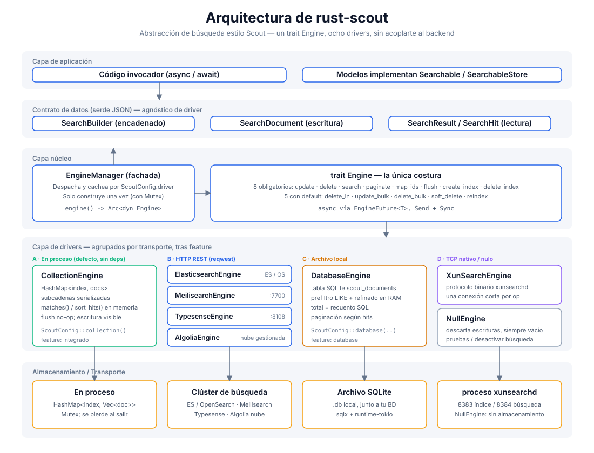
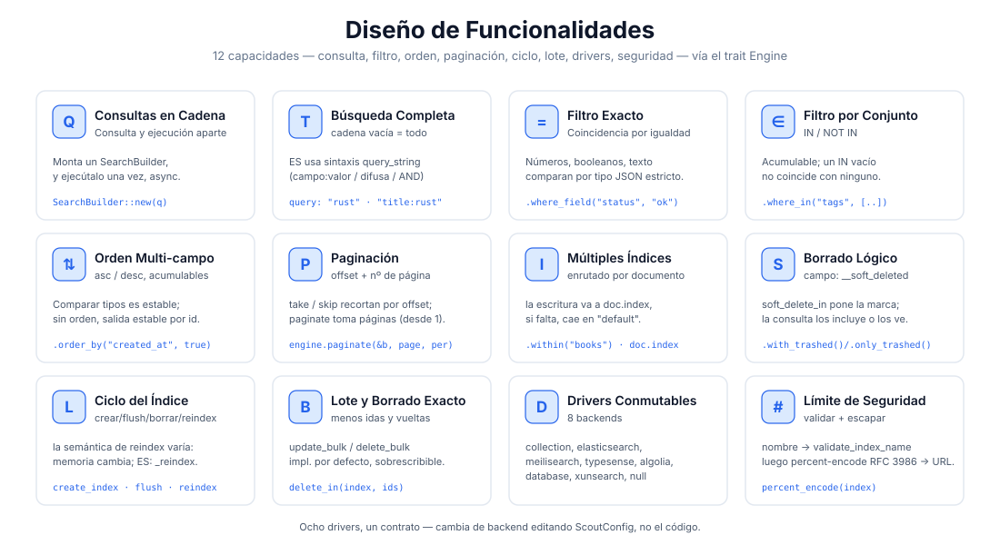
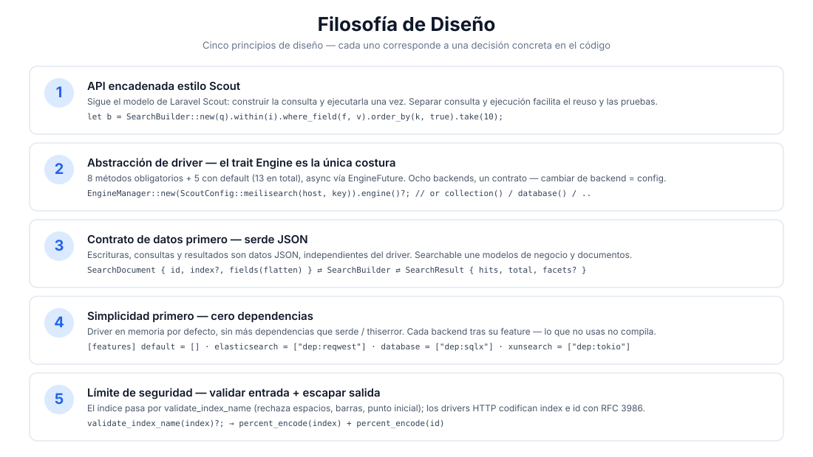
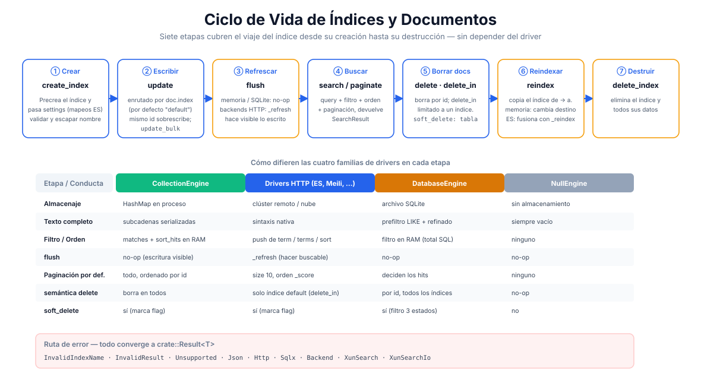

# rust-scout

[](https://crates.io/crates/rust-scout)
[](https://docs.rs/rust-scout)
[](../../../LICENSE)

[简体中文](../../../README.md) · [English](../en/README.md) · [日本語](../ja/README.md) · [한국어](../ko/README.md) · [Bahasa Indonesia](../id/README.md) · [Русский](../ru/README.md) · [Deutsch](../de/README.md) · [Français](../fr/README.md) · Español · [Português](../pt/README.md) · [हिन्दी](../hi/README.md) · [العربية](../ar/README.md) · [বাংলা](../bn/README.md)

**rust-scout, abstracción de biblioteca de búsqueda de texto completo** — una capa ligera de interfaz de búsqueda de texto completo para Rust. Tomando el modelo mental de consultas encadenadas de [Laravel Scout](https://laravel.com/docs/scout), abstrae **8 backends** (memoria, Elasticsearch/OpenSearch, Meilisearch, Typesense, Algolia, SQLite, XunSearch, Null) mediante un trait `Engine` unificado: **driver en memoria sin dependencias para desarrollo, cambio transparente a cualquier backend en producción, sin tocar una sola línea del código de negocio.**


> Mascota del proyecto **Scout el Sabueso de Búsqueda** — olfatea documentos, rastrea índices.
> Vive en la documentación *y* en el código: banner de terminal y avisos de error.
> Ver [Mascota del Proyecto](#mascota-del-proyecto).

```rust
let result = engine.search(
    SearchBuilder::new("rust async")
        .within("articles")
        .where_field("status", "published")
        .order_by("created_at", true)
        .take(10),
).await?;
```

## Funcionalidades

| Capacidad | Descripción |
|------|------|
| 🔍 Búsqueda de texto completo | Driver en memoria por subcadenas; los drivers HTTP usan sintaxis nativa (ES: `query_string`, `campo:valor`) |
| ⚙️ Consultas encadenadas | `SearchBuilder`: query / within / where_field / where_in / where_not_in / order_by / take / skip / option |
| 🎯 Filtrado exacto | Coincidencia por igualdad (ES → `term`), por conjunto (ES → `terms` / `must_not`) |
| 📄 Orden multi-campo | asc / desc acumulables, orden determinista entre tipos JSON |
| 📃 Paginación | Recorte por offset con `take`/`skip` + paginación por página `paginate(page, per_page)` |
| 🗂️ Múltiples índices | Enrutado por el campo `index` a nivel de documento, índice por defecto `"default"` |
| 🔄 Ciclo de vida del índice | Flujo completo `create_index` / `flush` / `reindex` / `delete_index` |
| 🗑️ Borrado lógico | `soft_delete` marca `__soft_deleted`; filtrado de tres estados `with_trashed()` / `only_trashed()` |
| 📦 Operaciones en lote | `update_bulk` / `delete_bulk` reducen idas y vueltas; `delete_in` apunta a un índice exacto |
| 🔌 Drivers intercambiables | Por defecto sin dependencias; 8 backends tras su propio feature — lo que no usas no se compila |
| 🔒 Límite de seguridad | Validación del nombre de índice (`validate_index_name`) + codificación porcentual RFC 3986 contra inyección de rutas |
| 🐕 Mascota del proyecto | Scout el Sabueso de Búsqueda: banner de terminal + pistas de diagnóstico por error (`rust_scout::pet`) |

## Arquitectura



Cinco capas: aplicación → contrato de datos (serde JSON) → núcleo (`EngineManager` + trait
`Engine`) → drivers (agrupados por transporte, 8 en total) → almacenamiento. `Engine` es la
única costura que cruza capas.

## Diseño de Funcionalidades



12 capacidades: consultas encadenadas, texto completo, filtrado exacto/por conjunto, orden,
paginación, múltiples índices, borrado lógico, ciclo de vida del índice, borrado en lote y
dirigido, drivers intercambiables, límite de seguridad.

## Filosofía de Diseño



## Ciclo de Vida



Siete etapas: crear → escribir → refrescar → buscar → borrar documentos → reconstruir → destruir.
La mitad inferior compara cómo se comportan las cuatro familias de drivers en cada etapa.

## Estructura del Proyecto

```
rust-scout/
├── Cargo.toml              # dependencias + features (default = [], sin dependencias)
├── src/
│   ├── lib.rs              # raíz del crate: export de módulos + re-export tras feature
│   │
│   ├── engine.rs           # trait Engine: el único contrato de driver (8 obligatorios + 5 con default)
│   ├── manager.rs          # EngineManager: fachada, despacha por driver y cachea Arc<dyn Engine>
│   ├── config.rs           # ScoutConfig (8 constructores) + validate_index_name + percent_encode
│   │
│   ├── builder.rs          # SearchBuilder / Where / Order / TrashedFilter: consultas encadenadas
│   ├── document.rs         # SearchDocument: el documento escrito (contrato serde JSON)
│   ├── result.rs           # SearchResult / SearchHit: resultados de consulta
│   ├── searchable.rs       # Searchable / SearchableStore: puente con modelos de negocio
│   ├── error.rs            # ScoutError + Result<T> + pet_hint()
│   ├── pet.rs              # Mascota del proyecto: Scout el Sabueso de Búsqueda (banner + pistas)
│   │
│   ├── collection_engine.rs    # driver en memoria (por defecto, sin dependencias)
│   ├── null_engine.rs          # driver nulo: descarta escrituras, siempre vacío   [null]
│   ├── elasticsearch_engine.rs # ES / OpenSearch (REST)                            [elasticsearch]
│   │   └── query.rs            #   construcción de query_string y parseo de respuestas
│   ├── meilisearch_engine.rs   # Meilisearch (REST)                                [meilisearch]
│   ├── typesense_engine.rs     # Typesense (REST)                                  [typesense]
│   │   └── typesense_query.rs  #   parámetros de búsqueda y construcción de filter_by
│   ├── algolia_engine.rs       # Algolia (REST en nube gestionada)                 [algolia]
│   ├── database_engine.rs      # SQLite (sqlx, prefiltro LIKE + refinado en memoria) [database]
│   ├── xunsearch_engine.rs     # XunSearch: protocolo TCP nativo de xunsearchd     [xunsearch]
│   │   ├── xunsearch_query.rs  #   códec de paquetes + esquema de campos ini
│   │   └── xunsearch_tests.rs  #   pruebas end-to-end con servidor mock
│   │
│   └── (las pruebas unitarias van por módulo al final, en #[cfg(test)] mod tests)
├── tests/                  # pruebas de integración (hoy vacío; las pruebas viven en src)
├── examples/
│   └── pet.rs              # cargo run --example pet: banner de la mascota + demo de pistas
└── docs/
    ├── svg/                # mascota + diagramas de arquitectura / funcionalidades / diseño / ciclo de vida
    ├── i18n/               # README y SVG correspondientes en 12 idiomas
    ├── coin/               # códigos QR de donación
    └── superpowers/specs/  # documentos de diseño
```

> La marca `[feature]` indica el feature de Cargo que necesita cada driver. Si está
> desactivado, `EngineManager` devuelve `ScoutError::Unsupported` en vez de degradar en silencio.

## Inicio Rápido

### 1. Añadir la dependencia

```toml
[dependencies]
rust-scout = "0.3"
tokio = { version = "1", features = ["macros", "rt"] }   # solo para el ejemplo
```

### 2. Ejemplo mínimo (driver en memoria por defecto)

```rust
use rust_scout::{Engine, EngineManager, ScoutConfig, SearchBuilder, SearchDocument};

#[tokio::main]
async fn main() -> rust_scout::Result<()> {
    // driver por defecto: CollectionEngine en memoria, sin dependencias
    let engine = EngineManager::new(ScoutConfig::collection()).engine()?;

    // escribir un documento
    let mut book = SearchDocument::new(
        "book-1",
        serde_json::json!({
            "title": "Programming Rust",
            "author": "Blandy & Orendorff",
            "tags": ["rust", "systems"],
            "status": "published",
        }),
    )?;
    book.index = Some("books".to_string());
    engine.update(&[book]).await?;

    // consultar
    let result = engine
        .search(
            SearchBuilder::new("rust")
                .within("books")
                .where_field("status", "published")
                .order_by("title", false)
                .take(10),
        )
        .await?;

    println!("total = {}", result.total);
    for hit in &result.hits {
        println!("  [{}] {:?}", hit.id, hit.source);
    }
    Ok(())
}
```

## Uso

### Construcción de Consultas (SearchBuilder)

Todas las operaciones de consulta se encadenan y al final se entregan a `engine.search(&builder)`:

```rust
let builder = SearchBuilder::new("palabras clave")  // texto completo (opcional, vacío = todo)
    .within("articles")                          // índice destino (opcional, por defecto "default")
    .where_field("status", "published")          // filtro por igualdad
    .where_in("tags", ["rust", "async"])         // conjunto IN
    .where_not_in("category", ["draft"])         // conjunto NOT IN
    .order_by("created_at", true)                // orden multi-campo (true = desc)
    .order_by("title", false)
    .take(20)                                    // tamaño de página
    .skip(40)                                    // offset
    .option("highlight", true)                   // opciones passthrough del driver
    .with_trashed();                             // borrado lógico: excluir / incluir / solo
```

> `query` admite la sintaxis Lucene `query_string` (plenamente efectiva en el driver ES):
> `"rust"`, `"title:rust AND tags:async"`, `"rust~2"` (difusa). Los demás drivers usan su
> sintaxis nativa o coincidencia por subcadenas.

### Paginación

```rust
// Opción 1: recorte por offset
let page2 = SearchBuilder::new("rust").within("books").skip(10).take(10);
// Opción 2: por número de página (page empieza en 1)
let page2 = engine.paginate(&SearchBuilder::new("rust").within("books"), 2, 10).await?;
```

### Múltiples Índices y Ciclo de Vida

```rust
engine.create_index("books", serde_json::json!({})).await?;    // crear índice
engine.update(&docs).await?;                                   // escribir documentos
engine.update_bulk(&docs).await?;                              // escritura en lote (endpoint bulk si existe)
engine.flush("books").await?;                                  // refrescar visibilidad
engine.search(&builder).await?;                                // consultar
engine.delete_in("books", &["book-1".to_string()]).await?;     // borrar docs de un índice exacto
engine.soft_delete(&["book-2".to_string()]).await?;            // borrado lógico (marca el doc)
engine.reindex("books", "books_v2").await?;                    // reconstruir un índice
engine.delete_index("books").await?;                           // eliminar el índice
```

> `delete` no lleva información de índice, así que su semántica varía según el motor (el driver
> en memoria borra en todos los índices; ES solo toca `default`). Para apuntar a un índice
> exacto usa `delete_in`.

### Cambiar a Elasticsearch / OpenSearch

```bash
cargo add rust-scout --features elasticsearch
```

```rust
use rust_scout::{Engine, EngineManager, ScoutConfig};

let config = ScoutConfig::elasticsearch(
    "http://127.0.0.1:9200",      // o un endpoint de OpenSearch
    Some("your-api-key".into()),  // opcional: autenticación ApiKey
);
let engine = EngineManager::new(config).engine()?;
// — todas las operaciones siguientes son idénticas al driver en memoria —
```

| Ítem | CollectionEngine (por defecto) | ElasticsearchEngine |
|--------|--------------------------|---------------------|
| Dependencias | solo serde / thiserror | reqwest (con feature) |
| Texto completo | Coincidencia por subcadenas serializadas | `query_string` |
| Filtrado | matches() en memoria | term / terms / must_not |
| Orden | sort_hits() en memoria | array sort |
| flush | no-op | `_refresh` |
| Paginación por defecto | Todos los resultados | size 10 |
| Orden por defecto | Por id | Por _score |

### Cambiar a Meilisearch

```bash
cargo add rust-scout --features meilisearch
```

```rust
use rust_scout::{Engine, EngineManager, ScoutConfig};

let config = ScoutConfig::meilisearch(
    "http://127.0.0.1:7700",   // endpoint de Meilisearch
    "your-master-key",          // opcional: clave API
);
let engine = EngineManager::new(config).engine()?;
// — todas las operaciones siguientes son idénticas al driver en memoria —
```

### Comparación de Motores

| Motor | driver | feature | Transporte | Estado |
|------|--------|---------|-----------|--------|
| Memoria (por defecto) | `collection` | integrado | En proceso | Completo |
| Elasticsearch / OpenSearch | `elasticsearch` / `opensearch` | `elasticsearch` | HTTP REST | Completo |
| Meilisearch | `meilisearch` | `meilisearch` | HTTP REST | Completo |
| Typesense | `typesense` | `typesense` | HTTP REST | Completo |
| Algolia | `algolia` | `algolia` | HTTP REST | Completo |
| SQLite | `database` | `database` | Archivo local | Completo |
| XunSearch | `xunsearch` | `xunsearch` | TCP nativo | Completo |
| Null (pruebas/sin búsqueda) | `null` | `null` | — | Completo |

Los constructores de configuración de los demás motores están en [docs.rs](https://docs.rs/rust-scout): `ScoutConfig::typesense(host, api_key)`, `ScoutConfig::algolia(app_id, api_key)`, `ScoutConfig::database(url, fields)`, `ScoutConfig::null()`, `ScoutConfig::xunsearch(host, project)`.

> En el motor SQLite (`database`), `total` se cuenta en la capa SQL (índice + filtro LIKE);
> tras el filtrado en memoria, los wheres / borrados lógicos pueden dejar `hits.len() < total`,
> y la paginación se basa en los hits.

### Campos Reservados

`__soft_deleted` es el nombre de campo reservado que usa el borrado lógico (`Engine::soft_delete`,
`SearchBuilder::with_trashed()` / `only_trashed()`), y los motores lo usan para filtrar los
documentos borrados. Los documentos de usuario **no deben** usar ese nombre como campo de negocio.

### Manejo de Errores

Todas las operaciones devuelven `crate::Result<T>`, con los errores convergiendo en un único `ScoutError`:

| Variante | Cuándo se produce | feature |
|---------|--------------|---------|
| `InvalidIndexName` | el nombre de índice tiene espacios / `/` / `\`, empieza por `.` o está vacío (se valida antes de escribir) | integrado |
| `InvalidResult` | el campo del documento no es un objeto JSON | integrado |
| `Unsupported` | el feature del driver está desactivado, falta configuración obligatoria, o el motor no soporta la operación | integrado |
| `Json` | error de serialización / deserialización de serde | integrado |
| `Http` | falló la petición HTTP (conexión, timeout, código de estado) | drivers HTTP |
| `Sqlx` | error de SQLite | `database` |
| `Backend` | el backend devolvió una respuesta de error; el mensaje original se propaga | drivers HTTP / `xunsearch` |
| `XunSearch` / `XunSearchIo` | fallo al parsear el protocolo / fallo de E/S TCP | `xunsearch` |

Cada variante lleva una pista de diagnóstico; ver [`ScoutError::pet_hint()`](#mascota-del-proyecto).

### Puente con Modelos de Negocio (Searchable)

Implementa `Searchable` para mapear una estructura de negocio a un documento indexable, e implementa `SearchableStore` para encapsular las tres operaciones `index_documents` / `remove_documents` / `search`:

```rust
use rust_scout::{Searchable, SearchableStore, SearchDocument, SearchResult};

struct Article { id: String, title: String, body: String }

impl Searchable for Article {
    fn searchable_id(&self) -> String { self.id.clone() }
    fn to_searchable_json(&self) -> serde_json::Value {
        serde_json::json!({ "title": self.title, "body": self.body })
    }
}
```

## Mascota del Proyecto


**Scout · el Sabueso de Búsqueda** — olfatea documentos, rastrea índices. Donde hay una
consulta, ya está él. Ilustración en [`svg/pet.svg`](svg/pet.svg); en la terminal se ve así:

```console
$ cargo run --example pet
```

```

      ___              ___
     /   \            /   \
    |     |__________|     |
    |     /          \     |
    |    |   o    o   |    |
    |    |     __     |    |
    |     \   /  \   /     |
     \     \  \__/  /     /
      \     \________/    /
       \_________________/
         \   ~~~~~~   /
          \__________/
             |    |
            _|    |_
           |__|  |__|


   ,^.     ,^.     ,^.     ,^.

  Scout · 嗅探猎犬 · rust-scout
  嗅探文档，追踪索引 —— 哪里有查询，哪里就有它
```

La mascota vive en el módulo [`rust_scout::pet`](../../../src/pet.rs) y **no añade ninguna dependencia**:

| Ítem | Descripción |
|----|------|
| `pet::NAME` / `pet::SPECIES` / `pet::TAGLINE` | datos de la placa |
| `pet::ART` | el retrato ASCII (a propósito solo 7 bits, nunca se descuadra en terminales CJK) |
| `pet::banner()` | banner de terminal; texto plano, sin secuencias de escape, seguro para logs |
| `pet::hint(&err)` | pista de diagnóstico por error, devuelve `&'static str` |
| `pet::format_error(&err)` | error original + pista, renderizado para humanos |
| `ScoutError::pet_hint()` | la misma pista, colgada del propio tipo de error |

```rust
use rust_scout::{pet, ScoutError};

println!("{}", pet::banner());

let err = ScoutError::Unsupported("falta feature".into());
eprintln!("{}", pet::format_error(&err));
// error: unsupported operation: falta feature
//
//   [o_o] Scout：这个后端我还没找到路 —— Cargo.toml 里对应的 feature 启用了吗？
```

> **¿Por qué la pista no va dentro de `Display`?** El `Display` de `ScoutError` se mantiene en una
> sola línea y legible por máquina — la propagación con `?`, la recolección de logs y el grep de
> errores en CI dependen de ello. Para una salida legible por humanos con la pista, usa
> `pet::format_error()`.

## Soporte y Donaciones

Si este proyecto te resulta útil, puedes apoyarlo con una donación ☕ — ¡tu apoyo es el motor del mantenimiento continuo!

### WeChat / Alipay


Escanea con WeChat · Escanea con Alipay

### Donaciones en Criptomonedas

| Red | Dirección de cartera | Código QR |
|------|----------|--------|
| BNB Smart Chain (BEP20) | `0x355d429f97511897ccb4e271ec888205f9ab6629` |  |
| Tron (TRC20) | `TEdDHWLajt1XvqtPDWmQctdrJaC3pzZZzz` |  |
| Ethereum (ERC20) | `0x355d429f97511897ccb4e271ec888205f9ab6629` |  |
| Aptos | `0x836e3780edfc3f7b2372b39e2a1a3a5d7adfaccd96c726f21cfde1b50dd68030` |  |
| Plasma | `0x355d429f97511897ccb4e271ec888205f9ab6629` |  |
| Polygon POS | `0x355d429f97511897ccb4e271ec888205f9ab6629` |  |
| Solana | `2hfhboHdmdrYsY25XfQSsEWxq5ip4EQsR7f4AzSRMUyr` |  |
| The Open Network (TON) | `UQB9kFQohzmXUir9QSSZq01iwl9aQZIDdBpNmDklljRtCoGK` |  |
| Arbitrum One | `0x355d429f97511897ccb4e271ec888205f9ab6629` |  |
| AVAX C-Chain | `0x355d429f97511897ccb4e271ec888205f9ab6629` |  |

### Transferencias Globales (Transferencia Bancaria)

**Datos del beneficiario**

- Nombre del beneficiario: WANG KEXUN
- Número de cuenta: 881015918251

**Banco receptor (ZA Bank)**

- SWIFT Code: `AABLHKHHXXX`
- Nombre del banco: ZA Bank Limited
- Código de banco: 387
- Dirección del banco: Core F, Cyberport 3, 100 Cyberport Road, Hong Kong

> La información del banco corresponsal (banco intermediario) que sigue es para remesas transfronterizas, no es la del banco receptor. Consulta con el banco emisor si es necesario aportarla.

- El banco corresponsal para remesas en HKD, CNY y USD es **Citibank**:
  - Nombre del banco: Citibank N.A. Hong Kong
  - SWIFT Code: `CITIHKHXXXX`
  - Código de banco: 006 / Código de sucursal: 391
  - Nombre de la sucursal: Hong Kong Branch
  - Dirección del banco: Citibank Tower, Citibank Plaza, 3 Garden Road, Central, Hong Kong
- El banco corresponsal para remesas en otras divisas es **BNY Mellon**:
  - Nombre del banco: THE BANK OF NEW YORK MELLON
  - SWIFT Code: `IRVTUS3NXXX`
  - Dirección del banco: THE BANK OF NEW YORK MELLON, 240 GREENWICH STREET, NEW YORK, United States

## Licencia

MIT License. Ver [LICENSE](../../../LICENSE) para más detalles.
