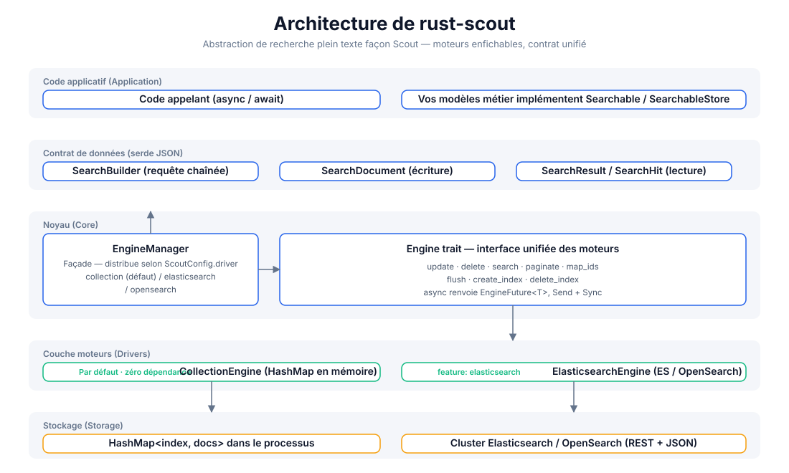
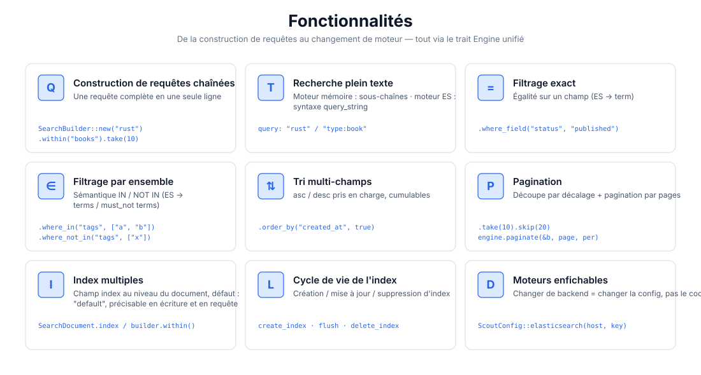
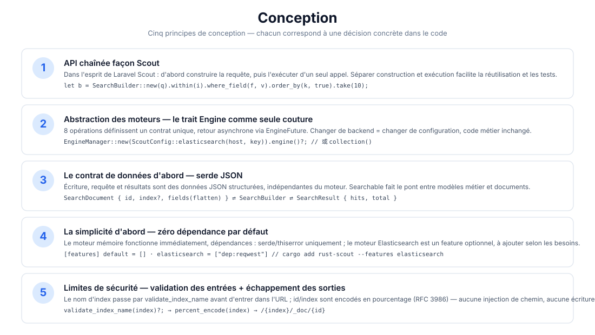
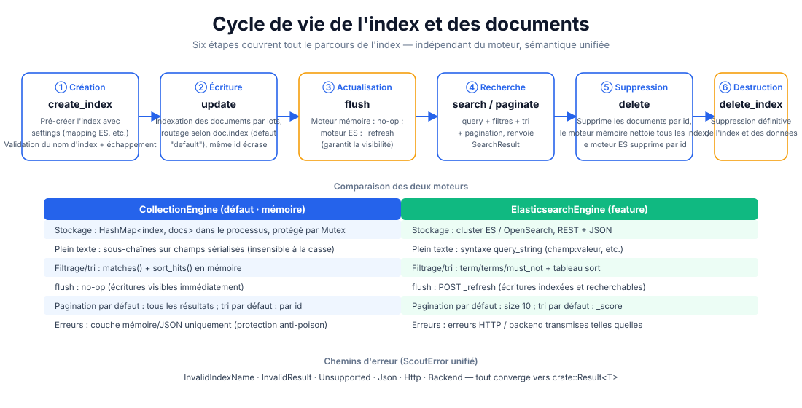

# rust-scout

[](https://crates.io/crates/rust-scout)
[](https://docs.rs/rust-scout)
[](../../../LICENSE)

[简体中文](../../../README.md) · [English](../en/README.md) · [日本語](../ja/README.md) · [한국어](../ko/README.md) · [Русский](../ru/README.md) · [Deutsch](../de/README.md) · Français · [Español](../es/README.md) · [Português](../pt/README.md) · [हिन्दी](../hi/README.md) · [العربية](../ar/README.md) · [বাংলা](../bn/README.md) · [Bahasa Indonesia](../id/README.md)

**rust-scout — abstraction de recherche plein texte** — une couche d'interface légère pour la recherche plein texte en Rust. S'inspirant de la philosophie de requêtes chaînées de [Laravel Scout](https://laravel.com/docs/scout), elle abstrait via un trait `Engine` unifié plusieurs backends : mémoire, Elasticsearch/OpenSearch, Meilisearch, Typesense, Algolia, SQLite et autres : **pour le développement, un moteur mémoire sans dépendance ; pour la production, une bascule transparente vers n'importe quel backend, sans toucher au code métier.**

```rust
let result = engine.search(
    SearchBuilder::new("rust 异步")
        .within("articles")
        .where_field("status", "published")
        .order_by("created_at", true)
        .take(10),
).await?;
```

## Fonctionnalités

| Fonctionnalité | Description |
|------|------|
| 🔍 Recherche plein texte | Moteur mémoire : correspondance de sous-chaînes ; moteur ES : syntaxe `query_string` (`champ:valeur`) |
| ⚙️ Requêtes chaînées | `SearchBuilder` : query / within / where_field / where_in / where_not_in / order_by / take / skip |
| 🎯 Filtrage exact | Correspondance d'égalité (ES → `term`), correspondance d'ensemble (ES → `terms` / `must_not`) |
| 📄 Tri multi-champs | asc / desc cumulables |
| 📃 Pagination | Découpe par décalage `take`/`skip` + pagination par pages `paginate(page, per_page)` |
| 🗂️ Index multiples | Routage via le champ `index` du document, index par défaut `"default"` |
| 🔄 Cycle de vie de l'index | Cycle complet `create_index` / `flush` / `delete_index` |
| 🔌 Moteurs enfichables | Par défaut mémoire sans dépendance ; features `elasticsearch` / `meilisearch` / `typesense` / `algolia` / `database` / `null` à la demande ; `xunsearch` est un stub |
| 🔒 Limites de sécurité | Validation du nom d'index (`validate_index_name`) + encodage en pourcentage RFC 3986, empêche l'injection de chemin |

## Architecture



## Aperçu des fonctionnalités



## Conception



## Cycle de vie



## Structure du projet

```
rust-scout/
├── Cargo.toml            # 依赖与 feature 声明（elasticsearch 可选）
├── src/
│   ├── lib.rs            # crate 根：模块导出 + 公开类型再导出
│   ├── engine.rs         # Engine trait：驱动统一接口（8 个操作）
│   ├── manager.rs        # EngineManager：门面，按配置分发驱动
│   ├── config.rs         # ScoutConfig + validate_index_name
│   ├── builder.rs        # SearchBuilder：链式查询构建与匹配/排序逻辑
│   ├── document.rs       # SearchDocument：写入文档（serde JSON 契约）
│   ├── result.rs         # SearchResult / SearchHit：查询结果
│   ├── searchable.rs     # Searchable / SearchableStore：业务模型桥接
│   ├── error.rs          # ScoutError + Result<T>
│   ├── collection_engine.rs  # 内存驱动（默认）
│   └── elasticsearch_engine.rs # ES/OpenSearch 驱动（feature 可选）
├── tests/                # 集成测试（当前为空）
├── examples/             # 示例（当前为空）
└── docs/
    ├── svg/              # 本 README 引用的架构/功能/设计/生命周期图
    └── superpowers/specs/ # 设计文档
```

## Démarrage rapide

### 1. Ajouter la dépendance

```toml
[dependencies]
rust-scout = "0.1"
tokio = { version = "1", features = ["macros", "rt"] }   # 仅示例需要
```

### 2. Exemple minimal (moteur mémoire par défaut)

```rust
use rust_scout::{Engine, EngineManager, ScoutConfig, SearchBuilder, SearchDocument};

#[tokio::main]
async fn main() -> rust_scout::Result<()> {
    // 默认驱动：内存 CollectionEngine，零依赖开箱即用
    let engine = EngineManager::new(ScoutConfig::collection()).engine()?;

    // 写入文档
    let mut book = SearchDocument::new(
        "book-1",
        serde_json::json!({
            "title": "Programming Rust",
            "author": "Blandy & Orendorff",
            "tags": ["rust", "systems"],
            "status": "published",
        }),
    )?;
    book.index = Some("books".to_string());
    engine.update(&[book]).await?;

    // 查询
    let result = engine
        .search(
            SearchBuilder::new("rust")
                .within("books")
                .where_field("status", "published")
                .order_by("title", false)
                .take(10),
        )
        .await?;

    println!("total = {}", result.total);
    for hit in &result.hits {
        println!("  [{}] {:?}", hit.id, hit.source);
    }
    Ok(())
}
```

## Utilisation

### Construction de requêtes (SearchBuilder)

Toutes les opérations de requête s'enchaînent et sont finalement passées à `engine.search(&builder)` :

```rust
let builder = SearchBuilder::new("全文关键词")   // 全文搜索（可选，空串 = 匹配全部）
    .within("articles")                          // 指定索引（可选，默认 "default"）
    .where_field("status", "published")          // 等值过滤
    .where_in("tags", ["rust", "async"])         // IN 集合
    .where_not_in("category", ["draft"])         // NOT IN 集合
    .order_by("created_at", true)                // 多字段排序（true = desc）
    .order_by("title", false)
    .take(20)                                    // 每页条数
    .skip(40);                                   // 偏移
```

> `query` prend en charge la syntaxe Lucene `query_string` (pleinement effective avec le moteur ES) :
> `"rust"`, `"title:rust AND tags:async"`, `"rust~2"` (flou). Le moteur mémoire la traite comme une correspondance de sous-chaînes.

### Pagination

```rust
// 方式一：偏移截取
let page2 = SearchBuilder::new("rust").within("books").skip(10).take(10);
// 方式二：页码分页（page 从 1 起）
let page2 = engine.paginate(&SearchBuilder::new("rust").within("books"), 2, 10).await?;
```

### Index multiples et cycle de vie

```rust
engine.create_index("books", serde_json::json!({})).await?;   // 建索引
engine.update(&docs).await?;                                  // 写文档
engine.flush("books").await?;                                 // 刷新可见性
engine.delete(&["book-1".to_string()]).await?;                // 删文档
engine.delete_index("books").await?;                          // 删索引
```

### Passer à Elasticsearch / OpenSearch

```bash
cargo add rust-scout --features elasticsearch
```

```rust
use rust_scout::{Engine, EngineManager, ScoutConfig};

let config = ScoutConfig::elasticsearch(
    "http://127.0.0.1:9200",      // 或 OpenSearch 地址
    Some("your-api-key".into()),   // 可选：ApiKey 认证
);
let engine = EngineManager::new(config).engine()?;
// —— 之后所有操作与内存驱动完全一致 ——
```

| Critère | CollectionEngine (défaut) | ElasticsearchEngine |
|--------|--------------------------|---------------------|
| Dépendances | serde / thiserror uniquement | reqwest (feature activé) |
| Plein texte | Correspondance de sous-chaînes sérialisées | `query_string` |
| Filtrage | matches() en mémoire | term / terms / must_not |
| Tri | sort_hits() en mémoire | tableau sort |
| flush | no-op | `_refresh` |
| Pagination par défaut | tous les résultats | size 10 |
| Tri par défaut | par id | par _score |

### Passer à Meilisearch

```bash
cargo add rust-scout --features meilisearch
```

```rust
use rust_scout::{Engine, EngineManager, ScoutConfig};

let config = ScoutConfig::meilisearch(
    "http://127.0.0.1:7700",   // Meilisearch 服务地址
    "your-master-key",          // 可选：API 密钥
);
let engine = EngineManager::new(config).engine()?;
// —— 之后所有操作与内存驱动完全一致 ——
```

### Comparatif des moteurs

| Moteur | driver | feature | Statut |
|------|--------|---------|------|
| Mémoire (défaut) | `collection` | intégré | Complet |
| Elasticsearch / OpenSearch | `elasticsearch` / `opensearch` | `elasticsearch` | Complet |
| Meilisearch | `meilisearch` | `meilisearch` | Complet |
| Typesense | `typesense` | `typesense` | Complet |
| Algolia | `algolia` | `algolia` | Complet |
| SQLite | `database` | `database` | Complet |
| Null (tests / recherche désactivée) | `null` | `null` | Complet |
| XunSearch | `xunsearch` | `xunsearch` | stub (à implémenter) |

Les constructeurs de configuration des autres moteurs sont documentés sur [docs.rs](https://docs.rs/rust-scout) : `ScoutConfig::typesense(host, api_key)`, `ScoutConfig::algolia(app_id, api_key)`, `ScoutConfig::database(url, fields)`, `ScoutConfig::null()`, `ScoutConfig::xunsearch(host, project)`.

> Avec le moteur SQLite (`database`), `total` est compté au niveau SQL (index + préfiltre LIKE grossier) ;
> après filtrage des wheres / soft delete en mémoire, `hits.len()` peut être inférieur à `total` — la pagination se base sur hits.

### Champs réservés

`__soft_deleted` est le nom de champ réservé au soft delete (`Engine::soft_delete`, `SearchBuilder::with_trashed()` / `only_trashed()`), grâce auquel le moteur filtre les documents supprimés en douceur. Les documents utilisateur **ne doivent pas** utiliser ce nom de champ comme champ métier.

### Gestion des erreurs

Toutes les opérations renvoient `crate::Result<T>`, les erreurs convergent vers un `ScoutError` unique :

- `InvalidIndexName` — nom d'index contenant des espaces / `/` / commençant par `.`, etc. (vérifié avant l'écriture)
- `InvalidResult` — champ de document n'étant pas un objet JSON
- `Unsupported` — feature non activé, etc.
- `Json` — erreur serde
- `Http` / `Backend` — erreurs réseau et backend du moteur ES (feature activé)

### Pont vers les modèles métier (Searchable)

Implémentez `Searchable` pour mapper vos structures métier vers des documents indexables, et `SearchableStore` pour encapsuler les trois opérations `index_documents` / `remove_documents` / `search` :

```rust
use rust_scout::{Searchable, SearchableStore, SearchDocument, SearchResult};

struct Article { id: String, title: String, body: String }

impl Searchable for Article {
    fn searchable_id(&self) -> String { self.id.clone() }
    fn to_searchable_json(&self) -> serde_json::Value {
        serde_json::json!({ "title": self.title, "body": self.body })
    }
}
```

## Soutien et dons

Si ce projet vous est utile, un don est le bienvenu ☕ — votre soutien fait vivre la maintenance !

### WeChat / Alipay


Scannez le code WeChat · Scannez le code Alipay

### Dons en cryptomonnaies

| Réseau | Adresse du portefeuille | QR code |
|------|----------|--------|
| BNB Smart Chain (BEP20) | `0x355d429f97511897ccb4e271ec888205f9ab6629` |  |
| Tron (TRC20) | `TEdDHWLajt1XvqtPDWmQctdrJaC3pzZZzz` |  |
| Ethereum (ERC20) | `0x355d429f97511897ccb4e271ec888205f9ab6629` |  |
| Aptos | `0x836e3780edfc3f7b2372b39e2a1a3a5d7adfaccd96c726f21cfde1b50dd68030` |  |
| Plasma | `0x355d429f97511897ccb4e271ec888205f9ab6629` |  |
| Polygon POS | `0x355d429f97511897ccb4e271ec888205f9ab6629` |  |
| Solana | `2hfhboHdmdrYsY25XfQSsEWxq5ip4EQsR7f4AzSRMUyr` |  |
| The Open Network (TON) | `UQB9kFQohzmXUir9QSSZq01iwl9aQZIDdBpNmDklljRtCoGK` |  |
| Arbitrum One | `0x355d429f97511897ccb4e271ec888205f9ab6629` |  |
| AVAX C-Chain | `0x355d429f97511897ccb4e271ec888205f9ab6629` |  |

### Virements internationaux (virement bancaire)

**Informations sur le bénéficiaire**

- Nom du bénéficiaire : WANG KEXUN
- Numéro de compte du bénéficiaire : 881015918251

**Banque du bénéficiaire (ZA Bank)**

- SWIFT Code : `AABLHKHHXXX`
- Nom de la banque : ZA Bank Limited
- Code banque : 387
- Adresse de la banque : Core F, Cyberport 3, 100 Cyberport Road, Hong Kong

> Informations sur la banque correspondante (banque intermédiaire) pour les virements transfrontaliers, et non sur la banque du bénéficiaire. Renseignez-vous auprès de votre banque pour savoir si elles sont requises.

- Pour les virements en dollars de Hong Kong, en yuans chinois et en dollars américains, la banque correspondante est **Citibank** :
  - Nom de la banque : Citibank N.A. Hong Kong
  - SWIFT Code : `CITIHKHXXXX`
  - Code banque : 006 / code agence : 391
  - Nom de l'agence : Hong Kong Branch
  - Adresse de la banque : Citibank Tower, Citibank Plaza, 3 Garden Road, Central, Hong Kong
- Pour les virements dans d'autres devises, la banque correspondante est **BNY Mellon** :
  - Nom de la banque : THE BANK OF NEW YORK MELLON
  - SWIFT Code : `IRVTUS3NXXX`
  - Adresse de la banque : THE BANK OF NEW YORK MELLON, 240 GREENWICH STREET, NEW YORK, United States

## Licence

Licence MIT. Voir [LICENSE](../../../LICENSE).
