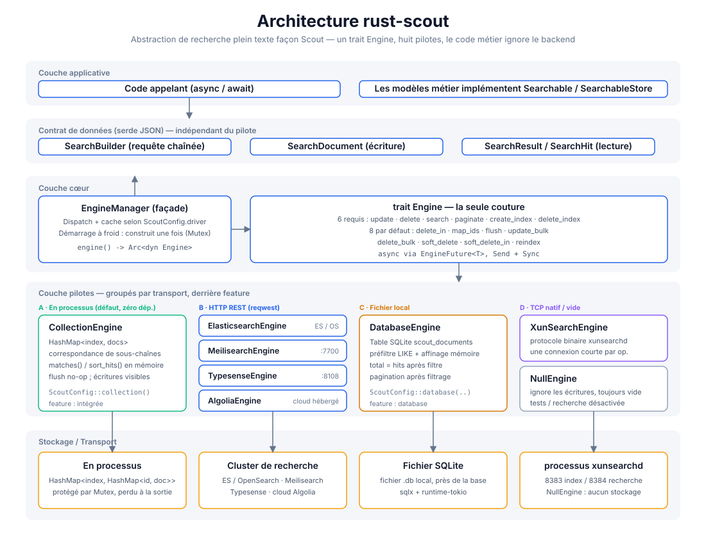
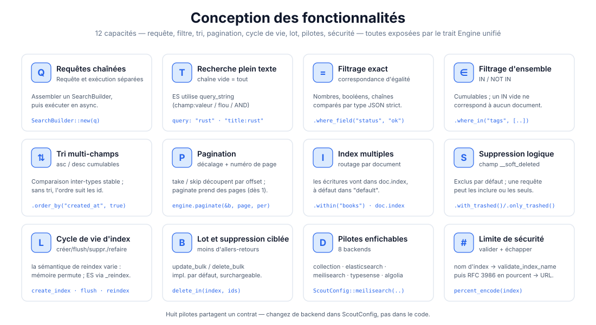
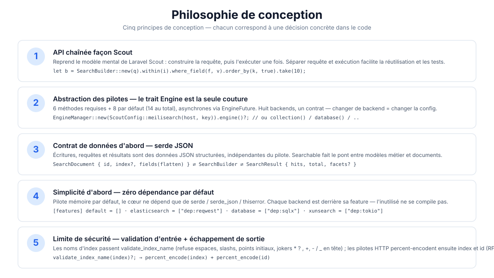
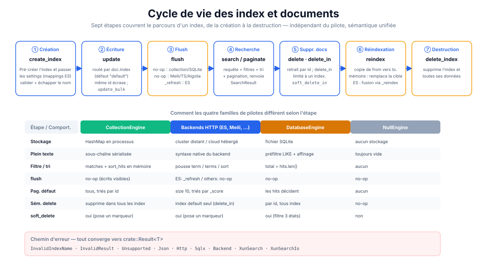

# rust-scout

[](https://crates.io/crates/rust-scout)
[](https://docs.rs/rust-scout)
[](../../../LICENSE)

[简体中文](../../../README.md) · [English](../en/README.md) · [日本語](../ja/README.md) · [한국어](../ko/README.md) · [Bahasa Indonesia](../id/README.md) · [Русский](../ru/README.md) · [Deutsch](../de/README.md) · Français · [Español](../es/README.md) · [Português](../pt/README.md) · [हिन्दी](../hi/README.md) · [العربية](../ar/README.md) · [বাংলা](../bn/README.md)

**rust-scout, abstraction de bibliothèque de recherche plein texte** — une couche d'interface de recherche plein texte légère pour Rust. Reprenant le modèle mental des requêtes chaînées de [Laravel Scout](https://laravel.com/docs/scout), elle abstrait **8 backends** (mémoire, Elasticsearch/OpenSearch, Meilisearch, Typesense, Algolia, SQLite, XunSearch, Null) via un trait `Engine` unifié : **pilote mémoire sans dépendance pour le développement, bascule transparente vers n'importe quel backend en production, sans modifier une seule ligne de code métier.**


> Animal de compagnie du projet, **Scout le chien renifleur** (Search Hound) — il renifle les documents, traque les index.
> Il n'est pas que dans la doc : bannière de terminal et messages d'erreur aussi.
> Voir [Animal de compagnie](#animal-de-compagnie).

```rust
let result = engine.search(
    SearchBuilder::new("rust async")
        .within("articles")
        .where_field("status", "published")
        .order_by("created_at", true)
        .take(10),
).await?;
```

## Fonctionnalités

| Capacité | Description |
|------|------|
| 🔍 Recherche plein texte | Pilote mémoire : correspondance de sous-chaînes ; pilotes HTTP : syntaxe native du backend (ES : `query_string`, `champ:valeur`) |
| ⚙️ Requêtes chaînées | `SearchBuilder` : query / within / where_field / where_in / where_not_in / order_by / take / skip / option |
| 🎯 Filtrage exact | Correspondance d'égalité (ES → `term`), correspondance d'ensemble (ES → `terms` / `must_not`) |
| 📄 Tri multi-champs | asc / desc cumulables, ordre déterministe entre types JSON |
| 📃 Pagination | Découpe par décalage `take`/`skip` + pagination par pages `paginate(page, per_page)` |
| 🗂️ Index multiples | Routage par champ `index` au niveau du document, index par défaut `"default"` |
| 🔄 Cycle de vie de l'index | Cycle complet `create_index` / `flush` / `reindex` / `delete_index` |
| 🗑️ Suppression logique | `soft_delete` pose `__soft_deleted` ; filtrage à trois états `with_trashed()` / `only_trashed()` |
| 📦 Opérations en lot | `update_bulk` / `delete_bulk` réduisent les allers-retours ; `delete_in` cible un index précis |
| 🔌 Pilotes enfichables | Mémoire sans dépendance par défaut ; 8 backends chacun derrière sa feature — l'inutilisé ne se compile pas |
| 🔒 Limite de sécurité | Validation du nom d'index (`validate_index_name`) + encodage pourcent RFC 3986, contre l'injection de chemin |
| 🐕 Animal de compagnie | Scout le chien renifleur : bannière de terminal + aide au diagnostic par erreur (`rust_scout::pet`) |

## Architecture



Cinq couches : application → contrat de données (serde JSON) → cœur (`EngineManager` + trait `Engine`)
→ pilotes (groupés par transport, 8 au total) → stockage. Seul le trait `Engine` traverse les couches.

## Conception des fonctionnalités



12 capacités : requêtes chaînées, plein texte, filtrage exact/ensemble, tri, pagination, index
multiples, suppression logique, cycle de vie de l'index, suppression en lot et ciblée, pilotes
enfichables, limite de sécurité.

## Philosophie de conception



## Cycle de vie



Sept étapes : création → écriture → flush → recherche → suppression de documents → reconstruction → destruction.
La moitié basse du schéma compare le comportement des quatre familles de pilotes à chaque étape.

## Structure du projet

```
rust-scout/
├── Cargo.toml              # dépendances + features (default = [], zéro dépendance)
├── src/
│   ├── lib.rs              # racine du crate : exports de modules + ré-exports derrière feature
│   │
│   ├── engine.rs           # trait Engine : le contrat unique des pilotes (8 requis + 5 par défaut)
│   ├── manager.rs          # EngineManager : façade, dispatch par driver et cache Arc<dyn Engine>
│   ├── config.rs           # ScoutConfig (8 constructeurs) + validate_index_name + percent_encode
│   │
│   ├── builder.rs          # SearchBuilder / Where / Order / TrashedFilter : requêtes chaînées
│   ├── document.rs         # SearchDocument : le document écrit (contrat serde JSON)
│   ├── result.rs           # SearchResult / SearchHit : résultats de requête
│   ├── searchable.rs       # Searchable / SearchableStore : pont vers les modèles métier
│   ├── error.rs            # ScoutError + Result<T> + pet_hint()
│   ├── pet.rs              # animal de compagnie : Scout le chien renifleur (bannière + aides)
│   │
│   ├── collection_engine.rs    # pilote mémoire (défaut, zéro dépendance)
│   ├── null_engine.rs          # pilote vide : ignore les écritures, toujours vide   [null]
│   ├── elasticsearch_engine.rs # ES / OpenSearch (REST)                             [elasticsearch]
│   │   └── query.rs            #   construction query_string + parsing des réponses
│   ├── meilisearch_engine.rs   # Meilisearch (REST)                                 [meilisearch]
│   ├── typesense_engine.rs     # Typesense (REST)                                   [typesense]
│   │   └── typesense_query.rs  #   paramètres de recherche + construction filter_by
│   ├── algolia_engine.rs       # Algolia (cloud hébergé REST)                       [algolia]
│   ├── database_engine.rs      # SQLite (sqlx, préfiltre LIKE + affinage mémoire)   [database]
│   ├── xunsearch_engine.rs     # XunSearch : protocole TCP natif xunsearchd         [xunsearch]
│   │   ├── xunsearch_query.rs  #   codec de paquets + schéma de champs ini
│   │   └── xunsearch_tests.rs  #   tests de bout en bout contre un serveur mock
│   │
│   └── (les tests unitaires sont en ligne dans chaque module sous #[cfg(test)] mod tests)
├── tests/                  # tests d'intégration (vides pour l'instant ; les tests sont dans src)
├── examples/
│   └── pet.rs              # cargo run --example pet : bannière + démo des aides d'erreur
└── docs/
    ├── svg/                # animal + schémas architecture / fonctionnalités / conception / cycle de vie
    ├── i18n/               # README et SVG correspondants pour 12 langues
    ├── coin/               # QR codes de don
    └── superpowers/specs/  # documents de conception
```

> Le tag `[feature]` indique la feature Cargo requise par un pilote. Si elle est désactivée,
> `EngineManager` renvoie `ScoutError::Unsupported` au lieu de dégrader silencieusement.

## Démarrage rapide

### 1. Ajouter la dépendance

```toml
[dependencies]
rust-scout = "0.3"
tokio = { version = "1", features = ["macros", "rt"] }   # exemple uniquement
```

### 2. Exemple minimal (pilote mémoire par défaut)

```rust
use rust_scout::{Engine, EngineManager, ScoutConfig, SearchBuilder, SearchDocument};

#[tokio::main]
async fn main() -> rust_scout::Result<()> {
    // pilote par défaut : CollectionEngine en mémoire, zéro dépendance
    let engine = EngineManager::new(ScoutConfig::collection()).engine()?;

    // écrire un document
    let mut book = SearchDocument::new(
        "book-1",
        serde_json::json!({
            "title": "Programming Rust",
            "author": "Blandy & Orendorff",
            "tags": ["rust", "systems"],
            "status": "published",
        }),
    )?;
    book.index = Some("books".to_string());
    engine.update(&[book]).await?;

    // requête
    let result = engine
        .search(
            SearchBuilder::new("rust")
                .within("books")
                .where_field("status", "published")
                .order_by("title", false)
                .take(10),
        )
        .await?;

    println!("total = {}", result.total);
    for hit in &result.hits {
        println!("  [{}] {:?}", hit.id, hit.source);
    }
    Ok(())
}
```

## Utilisation

### Construction de requêtes (SearchBuilder)

Toutes les opérations de requête s'enchaînent et sont finalement passées à `engine.search(&builder)` :

```rust
let builder = SearchBuilder::new("mots-clés plein texte")  // plein texte (optionnel, vide = tout)
    .within("articles")                          // index cible (optionnel, défaut "default")
    .where_field("status", "published")          // filtre d'égalité
    .where_in("tags", ["rust", "async"])         // ensemble IN
    .where_not_in("category", ["draft"])         // ensemble NOT IN
    .order_by("created_at", true)                // tri multi-champs (true = desc)
    .order_by("title", false)
    .take(20)                                    // taille de page
    .skip(40)                                    // décalage
    .option("highlight", true)                   // options transmises au pilote
    .with_trashed();                             // trois états : exclure / inclure / seulement
```

> `query` prend en charge la syntaxe Lucene `query_string` (pleinement effective avec le pilote ES) : `"rust"`, `"title:rust AND tags:async"`, `"rust~2"` (flou). Les autres pilotes utilisent leur syntaxe native ou la correspondance de sous-chaînes.

### Pagination

```rust
// Option 1 : découpe par décalage
let page2 = SearchBuilder::new("rust").within("books").skip(10).take(10);
// Option 2 : pagination par pages (page commence à 1)
let page2 = engine.paginate(&SearchBuilder::new("rust").within("books"), 2, 10).await?;
```

### Index multiples et cycle de vie

```rust
engine.create_index("books", serde_json::json!({})).await?;    // créer l'index
engine.update(&docs).await?;                                   // écrire des documents
engine.update_bulk(&docs).await?;                              // écriture en lot (endpoint bulk si dispo)
engine.flush("books").await?;                                  // rafraîchir la visibilité
engine.search(&builder).await?;                                // requête
engine.delete_in("books", &["book-1".to_string()]).await?;     // supprimer les docs d'un index
engine.soft_delete(&["book-2".to_string()]).await?;            // suppression logique (marquage)
engine.reindex("books", "books_v2").await?;                    // reconstruire un index
engine.delete_index("books").await?;                           // supprimer l'index
```

> `delete` ne porte aucune information d'index : sa sémantique varie selon le moteur (le pilote
> mémoire supprime dans tous les index ; ES ne touche que `default`). Utilisez `delete_in` pour
> cibler un index précis.

### Passer à Elasticsearch / OpenSearch

```bash
cargo add rust-scout --features elasticsearch
```

```rust
use rust_scout::{Engine, EngineManager, ScoutConfig};

let config = ScoutConfig::elasticsearch(
    "http://127.0.0.1:9200",      // ou une adresse OpenSearch
    Some("your-api-key".into()),  // optionnel : authentification ApiKey
);
let engine = EngineManager::new(config).engine()?;
// — toutes les opérations ci-dessous sont identiques au pilote mémoire —
```

| Critère | CollectionEngine (défaut) | ElasticsearchEngine |
|--------|--------------------------|---------------------|
| Dépendances | serde / thiserror uniquement | reqwest (feature activée) |
| Plein texte | Correspondance de sous-chaînes sérialisées | `query_string` |
| Filtrage | matches() en mémoire | term / terms / must_not |
| Tri | sort_hits() en mémoire | tableau sort |
| flush | no-op | `_refresh` |
| Pagination par défaut | tous les résultats | size 10 |
| Tri par défaut | par id | par _score |

### Passer à Meilisearch

```bash
cargo add rust-scout --features meilisearch
```

```rust
use rust_scout::{Engine, EngineManager, ScoutConfig};

let config = ScoutConfig::meilisearch(
    "http://127.0.0.1:7700",   // adresse du service Meilisearch
    "your-master-key",         // optionnel : clé d'API
);
let engine = EngineManager::new(config).engine()?;
// — toutes les opérations ci-dessous sont identiques au pilote mémoire —
```

### Comparatif des moteurs

| Moteur | driver | feature | Transport | État |
|------|--------|---------|-----------|------|
| Mémoire (défaut) | `collection` | intégré | In-process | Complet |
| Elasticsearch / OpenSearch | `elasticsearch` / `opensearch` | `elasticsearch` | HTTP REST | Complet |
| Meilisearch | `meilisearch` | `meilisearch` | HTTP REST | Complet |
| Typesense | `typesense` | `typesense` | HTTP REST | Complet |
| Algolia | `algolia` | `algolia` | HTTP REST | Complet |
| SQLite | `database` | `database` | Fichier local | Complet |
| XunSearch | `xunsearch` | `xunsearch` | TCP natif | Complet |
| Null (tests / recherche désactivée) | `null` | `null` | — | Complet |

Les constructeurs de configuration des autres moteurs sont documentés sur [docs.rs](https://docs.rs/rust-scout) : `ScoutConfig::typesense(host, api_key)`, `ScoutConfig::algolia(app_id, api_key)`, `ScoutConfig::database(url, fields)`, `ScoutConfig::null()`, `ScoutConfig::xunsearch(host, project)`.

> Pour le moteur SQLite (`database`), `total` est compté au niveau SQL (index + préfiltre LIKE) ;
> après filtrage des wheres / suppressions logiques en mémoire, `hits.len() < total` est possible,
> et la pagination se base sur les hits.

### Champs réservés

`__soft_deleted` est le nom de champ réservé utilisé par la suppression logique (`Engine::soft_delete`, `SearchBuilder::with_trashed()` / `only_trashed()`), d'après lequel les moteurs filtrent les documents supprimés logiquement. Les documents utilisateur **ne doivent pas** utiliser ce nom de champ comme champ métier.

### Gestion des erreurs

Toutes les opérations renvoient `crate::Result<T>`, les erreurs convergeant vers un `ScoutError` unifié :

| Variante | Déclencheur | feature |
|------|----------|---------|
| `InvalidIndexName` | nom d'index avec espace / `/` / `\`, commençant par `.`, ou vide (validé avant écriture) | intégré |
| `InvalidResult` | le champ d'un document n'est pas un objet JSON | intégré |
| `Unsupported` | feature du pilote désactivée, config requise manquante, ou opération non gérée par le moteur | intégré |
| `Json` | erreur de sérialisation / désérialisation serde | intégré |
| `Http` | échec d'une requête HTTP (connexion, timeout, code de statut) | pilotes HTTP |
| `Sqlx` | erreur SQLite | `database` |
| `Backend` | le backend a renvoyé une réponse d'erreur, message d'origine transmis | pilotes HTTP / `xunsearch` |
| `XunSearch` / `XunSearchIo` | échec de parsing du protocole / échec d'E/S TCP | `xunsearch` |

Chaque variante porte une aide au diagnostic — voir [`ScoutError::pet_hint()`](#animal-de-compagnie).

### Pont vers les modèles métier (Searchable)

Implémentez `Searchable` pour mapper une structure métier en document indexable, et `SearchableStore` pour encapsuler les trois opérations `index_documents` / `remove_documents` / `search` :

```rust
use rust_scout::{Searchable, SearchableStore, SearchDocument, SearchResult};

struct Article { id: String, title: String, body: String }

impl Searchable for Article {
    fn searchable_id(&self) -> String { self.id.clone() }
    fn to_searchable_json(&self) -> serde_json::Value {
        serde_json::json!({ "title": self.title, "body": self.body })
    }
}
```

## Animal de compagnie


**Scout · le chien renifleur** (Search Hound) — il renifle les documents, traque les index ;
partout où il y a une requête, il est déjà là. Version illustrée dans [`svg/pet.svg`](svg/pet.svg) ;
dans le terminal, il ressemble à ceci :

```console
$ cargo run --example pet
```

```

      ___              ___
     /   \            /   \
    |     |__________|     |
    |     /          \     |
    |    |   o    o   |    |
    |    |     __     |    |
    |     \   /  \   /     |
     \     \  \__/  /     /
      \     \________/    /
       \_________________/
         \   ~~~~~~   /
          \__________/
             |    |
            _|    |_
           |__|  |__|


   ,^.     ,^.     ,^.     ,^.

  Scout · 嗅探猎犬 · rust-scout
  嗅探文档，追踪索引 —— 哪里有查询，哪里就有它
```

L'animal vit dans le module [`rust_scout::pet`](../../../src/pet.rs) et **n'ajoute aucune dépendance** :

| Élément | Description |
|------|-------------|
| `pet::NAME` / `pet::SPECIES` / `pet::TAGLINE` | informations de la plaque |
| `pet::ART` | le portrait ASCII (volontairement en 7 bits, il ne se déforme pas dans un terminal CJK) |
| `pet::banner()` | bannière de terminal ; texte brut sans séquence d'échappement, sûre à journaliser |
| `pet::hint(&err)` | aide au diagnostic par erreur, renvoie `&'static str` |
| `pet::format_error(&err)` | erreur d'origine + aide, rendues lisibles par un humain |
| `ScoutError::pet_hint()` | la même aide, accrochée directement au type d'erreur |

```rust
use rust_scout::{pet, ScoutError};

println!("{}", pet::banner());

let err = ScoutError::Unsupported("feature manquante".into());
eprintln!("{}", pet::format_error(&err));
// error: unsupported operation: feature manquante
//
//   [o_o] Scout：这个后端我还没找到路 —— Cargo.toml 里对应的 feature 启用了吗？
```

> **Pourquoi l'aide n'est-elle pas intégrée à `Display` ?** Le `Display` de `ScoutError` reste
> sur une seule ligne et lisible par machine — la propagation `?`, la collecte de logs et le grep
> en CI en dépendent. Pour une sortie lisible contenant l'aide, appelez `pet::format_error()`.

## Soutien et dons

Si ce projet vous aide, un don est le bienvenu ☕ — votre soutien est le moteur d'une maintenance continue !

### WeChat / Alipay


Scannez avec WeChat · Scannez avec Alipay

### Dons en cryptomonnaies

| Réseau | Adresse du portefeuille | QR code |
|------|----------|--------|
| BNB Smart Chain (BEP20) | `0x355d429f97511897ccb4e271ec888205f9ab6629` |  |
| Tron (TRC20) | `TEdDHWLajt1XvqtPDWmQctdrJaC3pzZZzz` |  |
| Ethereum (ERC20) | `0x355d429f97511897ccb4e271ec888205f9ab6629` |  |
| Aptos | `0x836e3780edfc3f7b2372b39e2a1a3a5d7adfaccd96c726f21cfde1b50dd68030` |  |
| Plasma | `0x355d429f97511897ccb4e271ec888205f9ab6629` |  |
| Polygon POS | `0x355d429f97511897ccb4e271ec888205f9ab6629` |  |
| Solana | `2hfhboHdmdrYsY25XfQSsEWxq5ip4EQsR7f4AzSRMUyr` |  |
| The Open Network (TON) | `UQB9kFQohzmXUir9QSSZq01iwl9aQZIDdBpNmDklljRtCoGK` |  |
| Arbitrum One | `0x355d429f97511897ccb4e271ec888205f9ab6629` |  |
| AVAX C-Chain | `0x355d429f97511897ccb4e271ec888205f9ab6629` |  |

### Virements internationaux (virement bancaire)

**Informations du bénéficiaire**

- Nom du bénéficiaire : WANG KEXUN
- Numéro de compte du bénéficiaire : 881015918251

**Banque de réception (ZA Bank)**

- SWIFT Code : `AABLHKHHXXX`
- Nom de la banque : ZA Bank Limited
- Code banque : 387
- Adresse de la banque : Core F, Cyberport 3, 100 Cyberport Road, Hong Kong

> Les informations de banque correspondante (banque intermédiaire) ci-dessous concernent les virements transfrontaliers, et non la banque de réception. Demandez à votre banque émettrice si elles sont nécessaires.

- La banque correspondante pour les virements en dollars de Hong Kong, en yuans et en dollars américains est **Citibank** :
  - Nom de la banque : Citibank N.A. Hong Kong
  - SWIFT Code : `CITIHKHXXXX`
  - Code banque : 006 / code agence : 391
  - Nom de l'agence : Hong Kong Branch
  - Adresse de la banque : Citibank Tower, Citibank Plaza, 3 Garden Road, Central, Hong Kong
- La banque correspondante pour les virements dans d'autres devises est **BNY Mellon** :
  - Nom de la banque : THE BANK OF NEW YORK MELLON
  - SWIFT Code : `IRVTUS3NXXX`
  - Adresse de la banque : THE BANK OF NEW YORK MELLON, 240 GREENWICH STREET, NEW YORK, United States

## Licence

Licence MIT. Voir [LICENSE](../../../LICENSE) pour les détails.
