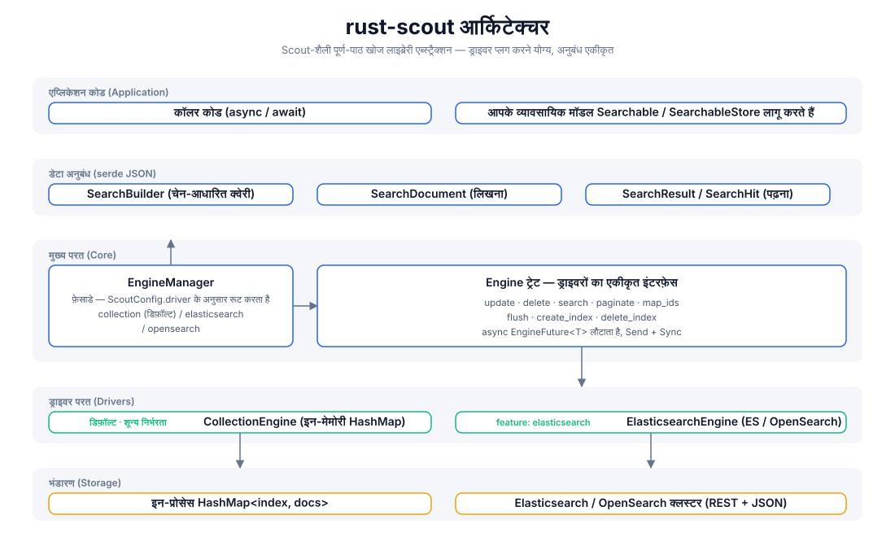
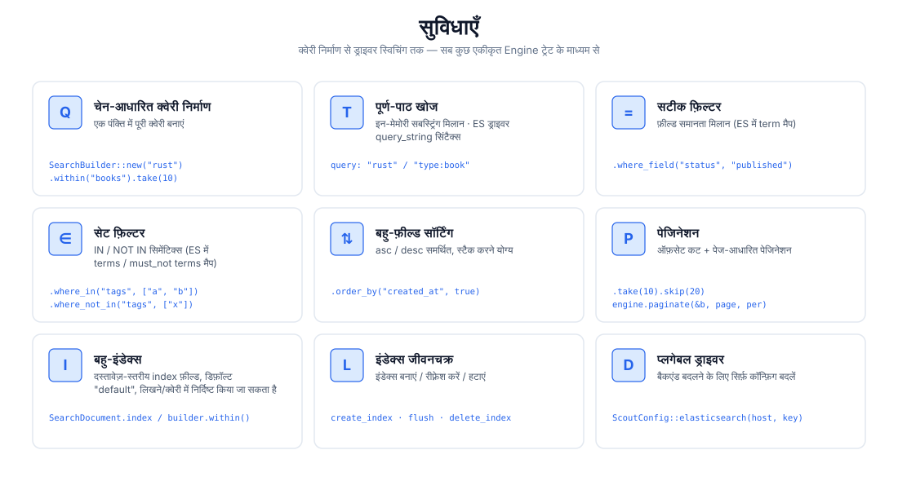
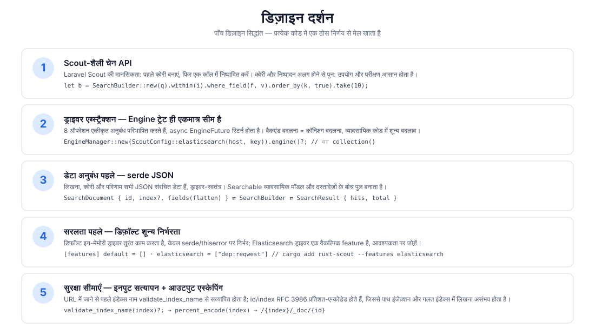
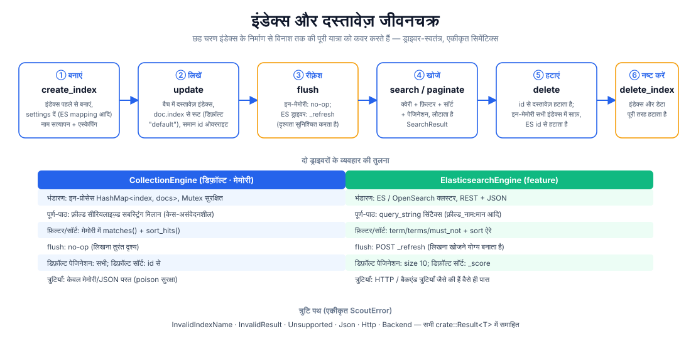

# rust-scout

[](https://crates.io/crates/rust-scout)
[](https://docs.rs/rust-scout)
[](../../../LICENSE)

[简体中文](../../../README.md) · [English](../en/README.md) · [日本語](../ja/README.md) · [한국어](../ko/README.md) · [Русский](../ru/README.md) · [Deutsch](../de/README.md) · [Français](../fr/README.md) · [Español](../es/README.md) · [Português](../pt/README.md) · हिन्दी · [العربية](../ar/README.md) · [বাংলা](../bn/README.md) · [Bahasa Indonesia](../id/README.md)

**rust-scout — पूर्ण-पाठ खोज लाइब्रेरी एब्स्ट्रैक्शन** — Rust के लिए हल्की पूर्ण-पाठ खोज (full-text search) इंटरफ़ेस परत। [Laravel Scout](https://laravel.com/docs/scout) की चेन-आधारित क्वेरी शैली से प्रेरित, यह एकीकृत `Engine` ट्रेट के माध्यम से मेमोरी, Elasticsearch/OpenSearch, Meilisearch, Typesense, Algolia, SQLite आदि कई बैकएंड्स को एब्स्ट्रैक्ट करता है: **डेवलपमेंट में शून्य-निर्भरता वाला इन-मेमोरी ड्राइवर, प्रोडक्शन में बिना एक पंक्ति बदले किसी भी बैकएंड पर स्विच करें।**

```rust
let result = engine.search(
    SearchBuilder::new("rust 异步")
        .within("articles")
        .where_field("status", "published")
        .order_by("created_at", true)
        .take(10),
).await?;
```

## सुविधाएँ

| क्षमता | विवरण |
|------|------|
| 🔍 पूर्ण-पाठ खोज | इन-मेमोरी ड्राइवर में सबस्ट्रिंग मिलान; ES ड्राइवर में `query_string` सिंटैक्स (`फ़ील्ड:मान`) |
| ⚙️ चेन-आधारित क्वेरी | `SearchBuilder`: query / within / where_field / where_in / where_not_in / order_by / take / skip |
| 🎯 सटीक फ़िल्टरिंग | समानता मिलान (ES → `term`), सेट मिलान (ES → `terms` / `must_not`) |
| 📄 बहु-फ़ील्ड सॉर्टिंग | asc / desc को जोड़ा जा सकता है |
| 📃 पेजिनेशन | `take`/`skip` ऑफ़सेट कट + `paginate(page, per_page)` पेज-आधारित |
| 🗂️ बहु-इंडेक्स | दस्तावेज़-स्तरीय `index` फ़ील्ड रूटिंग, डिफ़ॉल्ट इंडेक्स `"default"` |
| 🔄 इंडेक्स जीवनचक्र | `create_index` / `flush` / `delete_index` पूरी प्रक्रिया |
| 🔌 प्लगेबल ड्राइवर | डिफ़ॉल्ट इन-मेमोरी, शून्य निर्भरता; `elasticsearch` / `meilisearch` / `typesense` / `algolia` / `database` / `null` features आवश्यकता अनुसार सक्षम; `xunsearch` एक प्लेसहोल्डर स्टब है |
| 🔒 सुरक्षा सीमाएँ | इंडेक्स नाम सत्यापन (`validate_index_name`) + RFC 3986 प्रतिशत-एन्कोडिंग, पाथ इंजेक्शन को रोकना |

## वास्तुकला



## सुविधाओं का अवलोकन



## डिज़ाइन दर्शन



## जीवनचक्र



## प्रोजेक्ट संरचना

```
rust-scout/
├── Cargo.toml            # 依赖与 feature 声明（elasticsearch 可选）
├── src/
│   ├── lib.rs            # crate 根：模块导出 + 公开类型再导出
│   ├── engine.rs         # Engine trait：驱动统一接口（8 个操作）
│   ├── manager.rs        # EngineManager：门面，按配置分发驱动
│   ├── config.rs         # ScoutConfig + validate_index_name
│   ├── builder.rs        # SearchBuilder：链式查询构建与匹配/排序逻辑
│   ├── document.rs       # SearchDocument：写入文档（serde JSON 契约）
│   ├── result.rs         # SearchResult / SearchHit：查询结果
│   ├── searchable.rs     # Searchable / SearchableStore：业务模型桥接
│   ├── error.rs          # ScoutError + Result<T>
│   ├── collection_engine.rs  # 内存驱动（默认）
│   └── elasticsearch_engine.rs # ES/OpenSearch 驱动（feature 可选）
├── tests/                # 集成测试（当前为空）
├── examples/             # 示例（当前为空）
└── docs/
    ├── svg/              # 本 README 引用的架构/功能/设计/生命周期图
    └── superpowers/specs/ # 设计文档
```

## त्वरित आरंभ

### 1. निर्भरता जोड़ें

```toml
[dependencies]
rust-scout = "0.1"
tokio = { version = "1", features = ["macros", "rt"] }   # केवल उदाहरणों के लिए आवश्यक
```

### 2. न्यूनतम उदाहरण (डिफ़ॉल्ट इन-मेमोरी ड्राइवर)

```rust
use rust_scout::{Engine, EngineManager, ScoutConfig, SearchBuilder, SearchDocument};

#[tokio::main]
async fn main() -> rust_scout::Result<()> {
    // डिफ़ॉल्ट ड्राइवर: इन-मेमोरी CollectionEngine, बिना निर्भरता के तुरंत काम करता है
    let engine = EngineManager::new(ScoutConfig::collection()).engine()?;

    // दस्तावेज़ लिखें
    let mut book = SearchDocument::new(
        "book-1",
        serde_json::json!({
            "title": "Programming Rust",
            "author": "Blandy & Orendorff",
            "tags": ["rust", "systems"],
            "status": "published",
        }),
    )?;
    book.index = Some("books".to_string());
    engine.update(&[book]).await?;

    // क्वेरी करें
    let result = engine
        .search(
            SearchBuilder::new("rust")
                .within("books")
                .where_field("status", "published")
                .order_by("title", false)
                .take(10),
        )
        .await?;

    println!("total = {}", result.total);
    for hit in &result.hits {
        println!("  [{}] {:?}", hit.id, hit.source);
    }
    Ok(())
}
```

## उपयोग गाइड

### क्वेरी निर्माण (SearchBuilder)

सभी क्वेरी ऑपरेशन चेन में जुड़ते हैं, और अंत में `engine.search(&builder)` को दिए जाते हैं:

```rust
let builder = SearchBuilder::new("全文关键词")   // पूर्ण-पाठ खोज (वैकल्पिक; खाली स्ट्रिंग = सब कुछ मिलाएं)
    .within("articles")                          // इंडेक्स निर्दिष्ट करें (वैकल्पिक; डिफ़ॉल्ट "default")
    .where_field("status", "published")          // समानता फ़िल्टर
    .where_in("tags", ["rust", "async"])         // IN सेट
    .where_not_in("category", ["draft"])         // NOT IN सेट
    .order_by("created_at", true)                // बहु-फ़ील्ड सॉर्टिंग (true = desc)
    .order_by("title", false)
    .take(20)                                    // प्रति पेज संख्या
    .skip(40);                                   // ऑफ़सेट
```

> `query` Lucene `query_string` सिंटैक्स का समर्थन करता है (ES ड्राइवर में पूर्ण रूप से प्रभावी):
> `"rust"`, `"title:rust AND tags:async"`, `"rust~2"` (फ़ज़ी)। इन-मेमोरी ड्राइवर सबस्ट्रिंग मिलान से काम करता है।

### पेजिनेशन

```rust
// तरीका 1: ऑफ़सेट कट
let page2 = SearchBuilder::new("rust").within("books").skip(10).take(10);
// तरीका 2: पेज-आधारित पेजिनेशन (page 1 से शुरू)
let page2 = engine.paginate(&SearchBuilder::new("rust").within("books"), 2, 10).await?;
```

### बहु-इंडेक्स और जीवनचक्र

```rust
engine.create_index("books", serde_json::json!({})).await?;   // इंडेक्स बनाएं
engine.update(&docs).await?;                                  // दस्तावेज़ लिखें
engine.flush("books").await?;                                 // दृश्यता रीफ़्रेश करें
engine.delete(&["book-1".to_string()]).await?;                // दस्तावेज़ हटाएं
engine.delete_index("books").await?;                          // इंडेक्स हटाएं
```

### Elasticsearch / OpenSearch पर स्विच करना

```bash
cargo add rust-scout --features elasticsearch
```

```rust
use rust_scout::{Engine, EngineManager, ScoutConfig};

let config = ScoutConfig::elasticsearch(
    "http://127.0.0.1:9200",      // या OpenSearch पता
    Some("your-api-key".into()),   // वैकल्पिक: ApiKey प्रमाणीकरण
);
let engine = EngineManager::new(config).engine()?;
// —— इसके बाद सभी ऑपरेशन इन-मेमोरी ड्राइवर के बिल्कुल समान हैं ——
```

| तुलना | CollectionEngine (डिफ़ॉल्ट) | ElasticsearchEngine |
|--------|--------------------------|---------------------|
| निर्भरताएँ | केवल serde / thiserror | reqwest (feature सक्षम) |
| पूर्ण-पाठ | सीरियलाइज़्ड सबस्ट्रिंग मिलान | `query_string` |
| फ़िल्टर | मेमोरी में matches() | term / terms / must_not |
| सॉर्टिंग | मेमोरी में sort_hits() | sort ऐरे |
| flush | no-op | `_refresh` |
| डिफ़ॉल्ट पेजिनेशन | सभी परिणाम | size 10 |
| डिफ़ॉल्ट सॉर्टिंग | id से | _score से |

### Meilisearch पर स्विच करना

```bash
cargo add rust-scout --features meilisearch
```

```rust
use rust_scout::{Engine, EngineManager, ScoutConfig};

let config = ScoutConfig::meilisearch(
    "http://127.0.0.1:7700",   // Meilisearch सेवा का पता
    "your-master-key",          // वैकल्पिक: API कुंजी
);
let engine = EngineManager::new(config).engine()?;
// —— इसके बाद सभी ऑपरेशन इन-मेमोरी ड्राइवर के बिल्कुल समान हैं ——
```

### इंजन तुलना

| इंजन | driver | feature | स्थिति |
|------|--------|---------|------|
| इन-मेमोरी (डिफ़ॉल्ट) | `collection` | अंतर्निहित | पूर्ण |
| Elasticsearch / OpenSearch | `elasticsearch` / `opensearch` | `elasticsearch` | पूर्ण |
| Meilisearch | `meilisearch` | `meilisearch` | पूर्ण |
| Typesense | `typesense` | `typesense` | पूर्ण |
| Algolia | `algolia` | `algolia` | पूर्ण |
| SQLite | `database` | `database` | पूर्ण |
| Null (परीक्षण/खोज अक्षम) | `null` | `null` | पूर्ण |
| XunSearch | `xunsearch` | `xunsearch` | stub (लागू होना बाकी) |

बाकी इंजनों के कॉन्फ़िग कंस्ट्रक्टर [docs.rs](https://docs.rs/rust-scout) पर देखें: `ScoutConfig::typesense(host, api_key)`, `ScoutConfig::algolia(app_id, api_key)`, `ScoutConfig::database(url, fields)`, `ScoutConfig::null()`, `ScoutConfig::xunsearch(host, project)`।

> SQLite इंजन (`database`) में `total` SQL स्तर की गिनती है (इंडेक्स + LIKE मोटा फ़िल्टर);
> wheres / सॉफ्ट डिलीट मेमोरी फ़िल्टरिंग के बाद `hits.len() < total` हो सकता है, पेजिनेशन hits पर आधारित है।

### आरक्षित फ़ील्ड

`__soft_deleted` सॉफ्ट डिलीट सुविधा (`Engine::soft_delete`, `SearchBuilder::with_trashed()`
/ `only_trashed()`) द्वारा उपयोग किया जाने वाला आरक्षित फ़ील्ड नाम है, जिसके आधार पर इंजन सॉफ्ट-डिलीट दस्तावेज़ों को फ़िल्टर करता है। उपयोगकर्ता दस्तावेज़ों को **नहीं करना चाहिए**
इस फ़ील्ड नाम को व्यावसायिक फ़ील्ड के रूप में उपयोग।

### त्रुटि प्रबंधन

सभी ऑपरेशन `crate::Result<T>` लौटाते हैं, त्रुटियाँ एकीकृत `ScoutError` में समाहित होती हैं:

- `InvalidIndexName` —— इंडेक्स नाम में स्पेस / `/` / `.` से शुरू होना आदि (लिखने से पहले सत्यापित)
- `InvalidResult` —— दस्तावेज़ फ़ील्ड JSON ऑब्जेक्ट नहीं है
- `Unsupported` —— feature सक्षम नहीं है आदि
- `Json` —— serde त्रुटियाँ
- `Http` / `Backend` —— ES ड्राइवर के नेटवर्क और बैकएंड त्रुटियाँ (feature सक्षम होने पर)

### व्यावसायिक मॉडल ब्रिजिंग (Searchable)

`Searchable` लागू करके व्यावसायिक संरचनाओं को इंडेक्स योग्य दस्तावेज़ों में मैप करें, और `SearchableStore` लागू करके
`index_documents` / `remove_documents` / `search` तीनों ऑपरेशनों को एनकैप्सुलेट करें:

```rust
use rust_scout::{Searchable, SearchableStore, SearchDocument, SearchResult};

struct Article { id: String, title: String, body: String }

impl Searchable for Article {
    fn searchable_id(&self) -> String { self.id.clone() }
    fn to_searchable_json(&self) -> serde_json::Value {
        serde_json::json!({ "title": self.title, "body": self.body })
    }
}
```

## समर्थन और दान

अगर यह प्रोजेक्ट आपके लिए उपयोगी है, तो दान करके समर्थन करें ☕ — आपका समर्थन निरंतर विकास की प्रेरणा है!

### वीचैट / अलीपे


वीचैट स्कैन करें · अलीपे स्कैन करें

### क्रिप्टोकरेंसी दान

| मुख्य नेटवर्क | वॉलेट पता | QR कोड |
|------|----------|--------|
| BNB Smart Chain (BEP20) | `0x355d429f97511897ccb4e271ec888205f9ab6629` |  |
| Tron (TRC20) | `TEdDHWLajt1XvqtPDWmQctdrJaC3pzZZzz` |  |
| Ethereum (ERC20) | `0x355d429f97511897ccb4e271ec888205f9ab6629` |  |
| Aptos | `0x836e3780edfc3f7b2372b39e2a1a3a5d7adfaccd96c726f21cfde1b50dd68030` |  |
| Plasma | `0x355d429f97511897ccb4e271ec888205f9ab6629` |  |
| Polygon POS | `0x355d429f97511897ccb4e271ec888205f9ab6629` |  |
| Solana | `2hfhboHdmdrYsY25XfQSsEWxq5ip4EQsR7f4AzSRMUyr` |  |
| The Open Network (TON) | `UQB9kFQohzmXUir9QSSZq01iwl9aQZIDdBpNmDklljRtCoGK` |  |
| Arbitrum One | `0x355d429f97511897ccb4e271ec888205f9ab6629` |  |
| AVAX C-Chain | `0x355d429f97511897ccb4e271ec888205f9ab6629` |  |

### वैश्विक स्थानांतरण (बैंक रेमिटेंस)

**प्राप्तकर्ता जानकारी**

- प्राप्तकर्ता का नाम: WANG KEXUN
- प्राप्तकर्ता खाता संख्या: 881015918251

**प्राप्तकर्ता बैंक (ZA Bank)**

- SWIFT Code: `AABLHKHHXXX`
- बैंक का नाम: ZA Bank Limited
- बैंक संख्या: 387
- बैंक का पता: Core F, Cyberport 3, 100 Cyberport Road, Hong Kong

> क्रॉस-बॉर्डर रेमिटेंस संवाददाता बैंक (मध्यस्थ बैंक) की जानकारी, प्राप्तकर्ता बैंक की नहीं। कृपया अपने भेजने वाले बैंक से पूछें कि क्या यह जानकारी आवश्यक है।

- हांगकांग डॉलर, रॅन्मिन्बी और अमेरिकी डॉलर में रेमिटेंस के लिए संवाददाता बैंक **Citibank** है:
  - बैंक का नाम: Citibank N.A. Hong Kong
  - SWIFT Code: `CITIHKHXXXX`
  - बैंक संख्या: 006 / शाखा संख्या: 391
  - शाखा का नाम: Hong Kong Branch
  - बैंक का पता: Citibank Tower, Citibank Plaza, 3 Garden Road, Central, Hong Kong
- अन्य मुद्राओं में रेमिटेंस के लिए संवाददाता बैंक **BNY Mellon** है:
  - बैंक का नाम: THE BANK OF NEW YORK MELLON
  - SWIFT Code: `IRVTUS3NXXX`
  - बैंक का पता: THE BANK OF NEW YORK MELLON, 240 GREENWICH STREET, NEW YORK, United States

## लाइसेंस

MIT License। अधिक जानकारी के लिए [LICENSE](../../../LICENSE) देखें।
