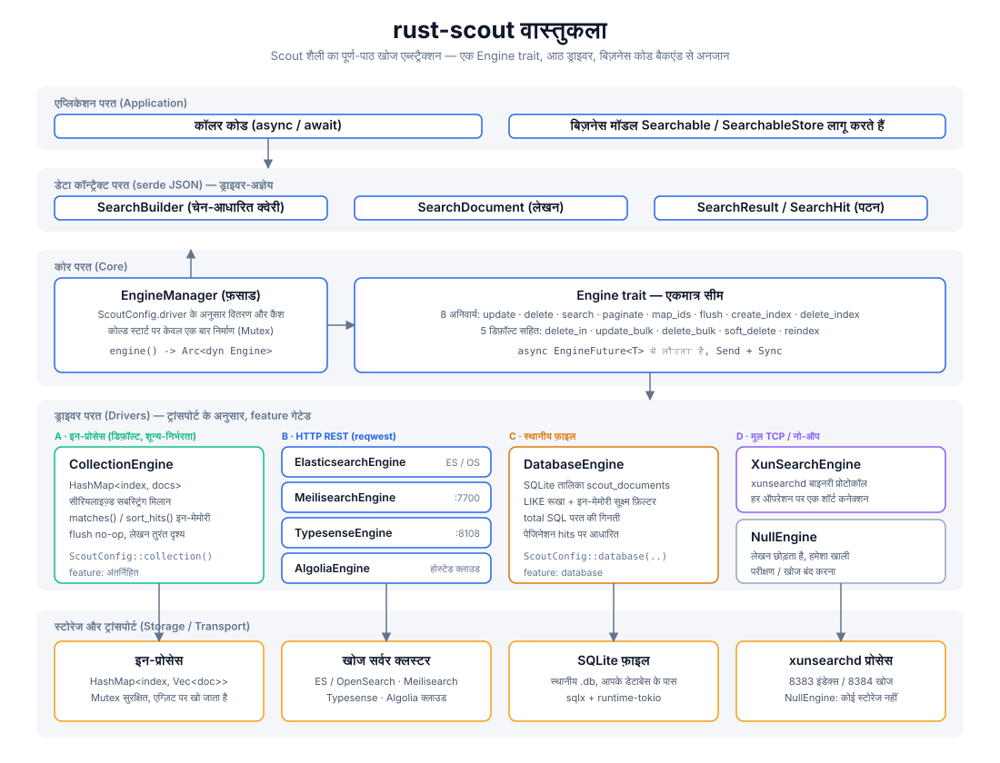
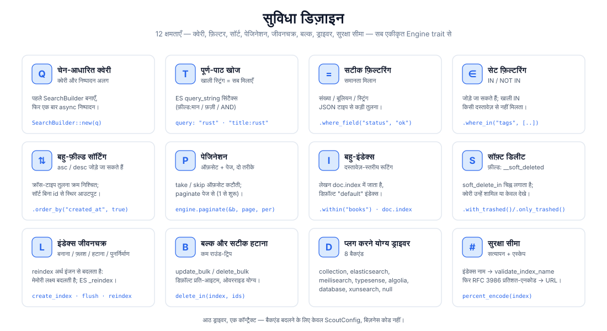
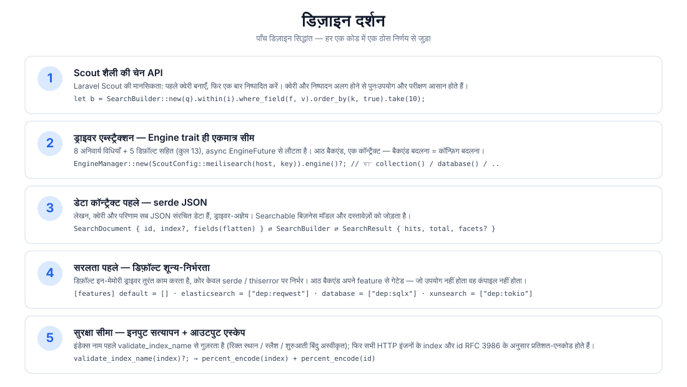
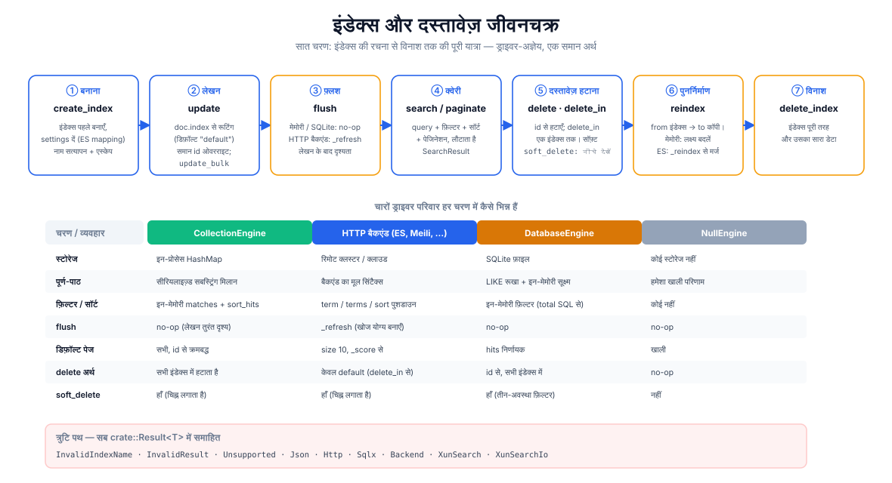

# rust-scout

[](https://crates.io/crates/rust-scout)
[](https://docs.rs/rust-scout)
[](../../../LICENSE)

[简体中文](../../../README.md) · [English](../en/README.md) · [日本語](../ja/README.md) · [한국어](../ko/README.md) · [Bahasa Indonesia](../id/README.md) · [Русский](../ru/README.md) · [Deutsch](../de/README.md) · [Français](../fr/README.md) · [Español](../es/README.md) · [Português](../pt/README.md) · हिन्दी · [العربية](../ar/README.md) · [বাংলা](../bn/README.md)

**rust-scout — पूर्ण-पाठ खोज लाइब्रेरी एब्स्ट्रैक्शन** — Rust के लिए एक हल्की पूर्ण-पाठ खोज (full-text search) इंटरफ़ेस परत। [Laravel Scout](https://laravel.com/docs/scout) की चेन-आधारित क्वेरी शैली से प्रेरित, यह एकीकृत `Engine` trait के माध्यम से **8 बैकएंड** (इन-मेमोरी, Elasticsearch/OpenSearch, Meilisearch, Typesense, Algolia, SQLite, XunSearch, Null) को एब्स्ट्रैक्ट करता है: **डेवलपमेंट के लिए शून्य-निर्भरता वाला इन-मेमोरी ड्राइवर, प्रोडक्शन में बिना एक भी पंक्ति बदले किसी भी बैकएंड पर सहज स्विच।**


> प्रोजेक्ट पेट **सर्च हाउंड Scout** — दस्तावेज़ों को सूंघता है, इंडेक्स का पीछा करता है।
> यह केवल दस्तावेज़ों में ही नहीं: टर्मिनल बैनर और त्रुटि संकेतों में भी मौजूद है,
> देखें [प्रोजेक्ट पेट](#प्रोजेक्ट-पेट)।

```rust
let result = engine.search(
    SearchBuilder::new("rust 异步")
        .within("articles")
        .where_field("status", "published")
        .order_by("created_at", true)
        .take(10),
).await?;
```

## विशेषताएँ

| क्षमता | विवरण |
|------|------|
| 🔍 पूर्ण-पाठ खोज | इन-मेमोरी ड्राइवर सबस्ट्रिंग मिलान; HTTP ड्राइवर बैकएंड का मूल सिंटैक्स (ES के लिए `query_string`, `फ़ील्ड:मान`) |
| ⚙️ चेन-आधारित क्वेरी | `SearchBuilder`: query / within / where_field / where_in / where_not_in / order_by / take / skip / option |
| 🎯 सटीक फ़िल्टरिंग | समानता मिलान (ES → `term`), सेट मिलान (ES → `terms` / `must_not`) |
| 📄 बहु-फ़ील्ड सॉर्टिंग | asc / desc जोड़े जा सकते हैं, JSON टाइपों के बीच क्रम निश्चित |
| 📃 पेजिनेशन | `take`/`skip` ऑफ़सेट कटौती + `paginate(page, per_page)` पेज-आधारित पेजिनेशन |
| 🗂️ बहु-इंडेक्स | दस्तावेज़-स्तरीय `index` फ़ील्ड रूटिंग, डिफ़ॉल्ट इंडेक्स `"default"` |
| 🔄 इंडेक्स जीवनचक्र | `create_index` / `flush` / `reindex` / `delete_index` पूरा वर्कफ़्लो |
| 🗑️ सॉफ़्ट डिलीट | `soft_delete_in(index, ids)` द्वारा `__soft_deleted` चिह्न; `with_trashed()` / `only_trashed()` तीन-अवस्था फ़िल्टरिंग |
| 📦 बल्क ऑपरेशन | `update_bulk` / `delete_bulk` से राउंड-ट्रिप कम; `delete_in` किसी एक इंडेक्स पर सटीक |
| 🔌 प्लग करने योग्य ड्राइवर | डिफ़ॉल्ट शून्य-निर्भरता; 8 बैकएंड, हर एक अपने feature द्वारा गेटेड — जो उपयोग नहीं होता वह कंपाइल नहीं होता |
| 🔒 सुरक्षा सीमा | इंडेक्स नाम सत्यापन (`validate_index_name`) + RFC 3986 प्रतिशत-एन्कोडिंग, पाथ इंजेक्शन रोकने के लिए |
| 🐕 प्रोजेक्ट पेट | सर्च हाउंड Scout: टर्मिनल बैनर + हर त्रुटि के लिए निदान संकेत (`rust_scout::pet`) |

## वास्तुकला डिज़ाइन



पाँच परतें: एप्लिकेशन → डेटा कॉन्ट्रैक्ट (serde JSON) → कोर (`EngineManager` + `Engine` trait)
→ ड्राइवर (ट्रांसपोर्ट के अनुसार चार समूह, कुल 8) → स्टोरेज। परतों को पार करने वाला एकमात्र सीम `Engine` trait है।

## सुविधा डिज़ाइन



12 क्षमताएँ: चेन-आधारित क्वेरी, पूर्ण-पाठ, सटीक/सेट फ़िल्टरिंग, सॉर्टिंग, पेजिनेशन, बहु-इंडेक्स,
सॉफ़्ट डिलीट, इंडेक्स जीवनचक्र, बल्क और सटीक हटाना, प्लग करने योग्य ड्राइवर, सुरक्षा सीमा।

## डिज़ाइन दर्शन



## जीवनचक्र



सात चरण: बनाना → लिखना → फ़्लश → क्वेरी → दस्तावेज़ हटाना → पुनर्निर्माण → नष्ट करना।
आरेख का निचला भाग दर्शाता है कि चारों ड्राइवर परिवार हर चरण में कैसे भिन्न व्यवहार करते हैं।

## प्रोजेक्ट संरचना

```
rust-scout/
├── Cargo.toml              # निर्भरताएँ और feature घोषणाएँ (default = [], शून्य-निर्भरता)
├── src/
│   ├── lib.rs              # crate रूट: मॉड्यूल निर्यात + feature-गेटेड सार्वजनिक प्रकार पुनर्निर्यात
│   │
│   ├── engine.rs           # Engine trait: एकमात्र ड्राइवर कॉन्ट्रैक्ट (8 अनिवार्य + 5 डिफ़ॉल्ट)
│   ├── manager.rs          # EngineManager: फ़साड, driver के अनुसार वितरण और Arc<dyn Engine> कैश
│   ├── config.rs           # ScoutConfig (8 कंस्ट्रक्टर) + validate_index_name + percent_encode
│   │
│   ├── builder.rs          # SearchBuilder / Where / Order / TrashedFilter: चेन-आधारित क्वेरी
│   ├── document.rs         # SearchDocument: लिखा जाने वाला दस्तावेज़ (serde JSON कॉन्ट्रैक्ट)
│   ├── result.rs           # SearchResult / SearchHit: क्वेरी परिणाम
│   ├── searchable.rs       # Searchable / SearchableStore: बिज़नेस मॉडल ब्रिज
│   ├── error.rs            # ScoutError + Result<T> + pet_hint()
│   ├── pet.rs              # प्रोजेक्ट पेट: सर्च हाउंड Scout (बैनर + त्रुटि संकेत)
│   │
│   ├── collection_engine.rs    # इन-मेमोरी ड्राइवर (डिफ़ॉल्ट, शून्य-निर्भरता)
│   ├── null_engine.rs          # नो-ऑप ड्राइवर: लेखन छोड़ता है, हमेशा खाली        [null]
│   ├── elasticsearch_engine.rs # ES / OpenSearch (REST)                        [elasticsearch]
│   │   └── query.rs            #   query_string निर्माण और प्रतिक्रिया पार्सिंग
│   ├── meilisearch_engine.rs   # Meilisearch (REST)                            [meilisearch]
│   ├── typesense_engine.rs     # Typesense (REST)                              [typesense]
│   │   └── typesense_query.rs  #   खोज पैरामीटर और filter_by निर्माण
│   ├── algolia_engine.rs       # Algolia (होस्टेड क्लाउड REST)                  [algolia]
│   ├── database_engine.rs      # SQLite (sqlx, LIKE रूखा फ़िल्टर + इन-मेमोरी सूक्ष्म) [database]
│   ├── xunsearch_engine.rs     # XunSearch: xunsearchd मूल TCP प्रोटोकॉल      [xunsearch]
│   │   ├── xunsearch_query.rs  #   पैकेट कोडेक + ini फ़ील्ड योजना
│   │   └── xunsearch_tests.rs  #   mock सर्वर के साथ एंड-टू-एंड परीक्षण
│   │
│   └── (यूनिट टेस्ट हर मॉड्यूल के अंत में #[cfg(test)] mod tests के अंतर्गत)
├── tests/                  # इंटीग्रेशन टेस्ट (अभी खाली, टेस्ट src में इनलाइन हैं)
├── examples/
│   └── pet.rs              # cargo run --example pet: पेट बैनर + त्रुटि-संकेत डेमो
└── docs/
    ├── svg/                # पेट + वास्तुकला / सुविधा / डिज़ाइन / जीवनचक्र आरेख
    ├── i18n/               # 12 भाषाओं के README और उनके SVG
    ├── coin/               # दान QR कोड
    └── superpowers/specs/  # डिज़ाइन दस्तावेज़
```

> `[feature]` उस Cargo feature को दर्शाता है जो उस ड्राइवर के लिए आवश्यक है। सक्रिय न होने पर
> `EngineManager` चुपचाप घटने के बजाय `ScoutError::Unsupported` लौटाता है।

### ड्राइवर क्षमता अंतर

डिफ़ॉल्ट इन-मेमोरी ड्राइवर ही अर्थपूर्ण आधार-रेखा है। जहाँ कोई बैकएंड कोई काम नहीं कर
सकता, वह चुपचाप गलत परिणाम लौटाने के बजाय **साफ़-साफ़ बता देता है**:

| ड्राइवर | सीमा | व्यवहार |
|--------|-----------|-----------|
| Algolia | सॉर्टिंग के लिए पहले से बने रेप्लिका इंडेक्स चाहिए; इसे हर क्वेरी के लिए चुना नहीं जा सकता | `order_by` **अनदेखा** किया जाता है (परिणाम फिर भी आते हैं, बस क्रम अनिर्दिष्ट रहता है) |
| XunSearch | `where_in` / `where_not_in` के लिए कोई प्रोटोकॉल कमांड नहीं | `Unsupported` लौटाता है; `where_field` इस्तेमाल करें |
| XunSearch | सर्वर केवल एक ही सॉर्ट फ़ील्ड का समर्थन करता है | कई `order_by` देने पर `Unsupported` लौटाता है |
| XunSearch | सॉफ़्ट डिलीट लागू नहीं है | `soft_delete` / `only_trashed` `Unsupported` लौटाते हैं |
| XunSearch | इंडेक्स बनाने के लिए फ़ील्ड-स्कीम ini चाहिए | `create_index` `Unsupported` लौटाता है (`XunSearchEngine::new` को एक ini दें) |

दो जानबूझकर किए गए अर्थ-मेल:

- **जब ES को ख़राब क्वेरी सिंटैक्स मिलता है** (`"("`, `"foo AND"`) तो वह त्रुटि के बजाय
  खाली परिणाम लौटाता है — इन-मेमोरी ड्राइवर उसी इनपुट पर सबस्ट्रिंग मैच करता है, और 400
  लौटाने से "बैकएंड बदलो, कोड वही रखो" टूट जाता।
- **`delete` और `soft_delete` कोई इंडेक्स जानकारी नहीं रखते**, इसलिए वे कई इंडेक्स पर
  फैलेंगे या नहीं, यह बैकएंड पर निर्भर है। किसी एक इंडेक्स को लक्षित करने के लिए हमेशा
  `delete_in` / `soft_delete_in` इस्तेमाल करें।

## त्वरित आरंभ

### 1. निर्भरता जोड़ें

```toml
[dependencies]
rust-scout = "0.6"
tokio = { version = "1", features = ["macros", "rt"] }   # केवल उदाहरण के लिए
```

### 2. न्यूनतम उदाहरण (डिफ़ॉल्ट इन-मेमोरी ड्राइवर)

```rust
use rust_scout::{Engine, EngineManager, ScoutConfig, SearchBuilder, SearchDocument};

#[tokio::main]
async fn main() -> rust_scout::Result<()> {
    // डिफ़ॉल्ट ड्राइवर: इन-मेमोरी CollectionEngine, शून्य निर्भरताएँ
    let engine = EngineManager::new(ScoutConfig::collection()).engine()?;

    // दस्तावेज़ लिखें
    let mut book = SearchDocument::new(
        "book-1",
        serde_json::json!({
            "title": "Programming Rust",
            "author": "Blandy & Orendorff",
            "tags": ["rust", "systems"],
            "status": "published",
        }),
    )?;
    book.index = Some("books".to_string());
    engine.update(&[book]).await?;

    // क्वेरी
    let result = engine
        .search(
            SearchBuilder::new("rust")
                .within("books")
                .where_field("status", "published")
                .order_by("title", false)
                .take(10),
        )
        .await?;

    println!("total = {}", result.total);
    for hit in &result.hits {
        println!("  [{}] {:?}", hit.id, hit.source);
    }
    Ok(())
}
```

## उपयोग गाइड

### क्वेरी निर्माण (SearchBuilder)

सभी क्वेरी ऑपरेशन चेन में जोड़े जाते हैं और अंत में `engine.search(&builder)` को सौंपे जाते हैं:

```rust
let builder = SearchBuilder::new("पूर्ण-पाठ कीवर्ड")   // पूर्ण-पाठ खोज (वैकल्पिक, खाली स्ट्रिंग = सब मिलाएँ)
    .within("articles")                          // लक्ष्य इंडेक्स (वैकल्पिक, डिफ़ॉल्ट "default")
    .where_field("status", "published")          // समानता फ़िल्टर
    .where_in("tags", ["rust", "async"])         // IN सेट
    .where_not_in("category", ["draft"])         // NOT IN सेट
    .order_by("created_at", true)                // बहु-फ़ील्ड सॉर्ट (true = desc)
    .order_by("title", false)
    .take(20)                                    // प्रति पेज आइटम
    .skip(40)                                    // ऑफ़सेट
    .option("highlight", true)                   // ड्राइवर-विशिष्ट पासथ्रू विकल्प
    .with_trashed();                             // सॉफ़्ट डिलीट तीन-अवस्था: बाहर रखें / सहित / केवल
```

> `query` Lucene `query_string` सिंटैक्स का समर्थन करता है (ES ड्राइवर में पूरी तरह लागू):
> `"rust"`, `"title:rust AND tags:async"`, `"rust~2"` (फ़ज़ी)। बाकी ड्राइवर अपने मूल
> सिंटैक्स या सबस्ट्रिंग मिलान से काम चलाते हैं।

### पेजिनेशन

```rust
// तरीका 1: ऑफ़सेट कटौती
let page2 = SearchBuilder::new("rust").within("books").skip(10).take(10);
// तरीका 2: पेज-आधारित (पेज 1 से शुरू)
let page2 = engine.paginate(&SearchBuilder::new("rust").within("books"), 2, 10).await?;
```

### बहु-इंडेक्स और जीवनचक्र

```rust
engine.create_index("books", serde_json::json!({})).await?;    // इंडेक्स बनाएँ
engine.update(&docs).await?;                                   // दस्तावेज़ लिखें
engine.update_bulk(&docs).await?;                              // बल्क लेखन (बैकएंड समर्थित हो तो bulk API)
engine.flush("books").await?;                                  // दृश्यता रीफ़्रेश करें
engine.search(&builder).await?;                                // क्वेरी
engine.delete_in("books", &["book-1".to_string()]).await?;     // एक इंडेक्स से दस्तावेज़ हटाएँ
engine.soft_delete_in("books", &["book-2".to_string()]).await?;            // सॉफ़्ट डिलीट (चिह्न लगाएँ)
engine.reindex("books", "books_v2").await?;                    // इंडेक्स पुनर्निर्मित करें
engine.delete_index("books").await?;                           // इंडेक्स हटाएँ
```

> `delete` के साथ इंडेक्स की जानकारी नहीं जाती, इसलिए इसका अर्थ इंजन के अनुसार बदलता है
> (इन-मेमोरी ड्राइवर सभी इंडेक्स में हटाता है, ES केवल `default` को छूता है)। किसी
> निश्चित इंडेक्स के लिए `delete_in` इस्तेमाल करें।
>
> सॉफ़्ट डिलीट का भी यही हाल: **`soft_delete_in(index, ids)` ही वह है जो हर इंजन पर भरोसेमंद है**।
> बिना इंडेक्स वाला `soft_delete` केवल सिंक्रोनस बैकएंड (`collection` / `database`) पर ही सभी
> इंडेक्स में चिह्न लगा सकता है; HTTP बैकएंड यह नहीं कर सकते और `ScoutError::Unsupported`
> लौटाते हैं (चुपचाप कुछ न करने के बजाय)।
>
> `flush` का अनुबंध है लिखाई की दृश्यता रीफ़्रेश करना — **कोई भी ड्राइवर इंडेक्स को खाली नहीं करता**:
> ES `_refresh` करता है, बाक़ी ड्राइवरों में लिखाई तुरंत दिखती है, यानी वह no-op है। इंडेक्स
> खाली करना हो तो `delete_index` इस्तेमाल करें।

### Elasticsearch / OpenSearch पर स्विच करना

```bash
cargo add rust-scout --features elasticsearch
```

```rust
use rust_scout::{Engine, EngineManager, ScoutConfig};

let config = ScoutConfig::elasticsearch(
    "http://127.0.0.1:9200",      // या OpenSearch एंडपॉइंट
    Some("your-api-key".into()),   // वैकल्पिक: ApiKey प्रमाणीकरण
);
let engine = EngineManager::new(config).engine()?;
// —— इसके बाद सभी ऑपरेशन इन-मेमोरी ड्राइवर के समान हैं ——
```

| मद | CollectionEngine (डिफ़ॉल्ट) | ElasticsearchEngine |
|--------|--------------------------|---------------------|
| निर्भरताएँ | केवल serde / thiserror | reqwest (feature सक्रिय) |
| पूर्ण-पाठ | सीरियलाइज़्ड सबस्ट्रिंग मिलान | `query_string` |
| फ़िल्टरिंग | इन-मेमोरी matches() | term / terms / must_not |
| सॉर्टिंग | इन-मेमोरी sort_hits() | sort ऐरे |
| flush | no-op | `_refresh` |
| डिफ़ॉल्ट पेजिनेशन | सभी परिणाम | size 10 |
| डिफ़ॉल्ट सॉर्टिंग | id के अनुसार | _score के अनुसार |

### Meilisearch पर स्विच करना

```bash
cargo add rust-scout --features meilisearch
```

```rust
use rust_scout::{Engine, EngineManager, ScoutConfig};

let config = ScoutConfig::meilisearch(
    "http://127.0.0.1:7700",   // Meilisearch एंडपॉइंट
    "your-master-key",          // वैकल्पिक: API कुंजी
);
let engine = EngineManager::new(config).engine()?;
// —— इसके बाद सभी ऑपरेशन इन-मेमोरी ड्राइवर के समान हैं ——
```

### इंजन तुलना

| इंजन | driver | feature | ट्रांसपोर्ट | स्थिति |
|------|--------|---------|------|------|
| इन-मेमोरी (डिफ़ॉल्ट) | `collection` | अंतर्निहित | इन-प्रोसेस | पूर्ण |
| Elasticsearch / OpenSearch | `elasticsearch` / `opensearch` | `elasticsearch` | HTTP REST | पूर्ण |
| Meilisearch | `meilisearch` | `meilisearch` | HTTP REST | पूर्ण |
| Typesense | `typesense` | `typesense` | HTTP REST | पूर्ण |
| Algolia | `algolia` | `algolia` | HTTP REST | पूर्ण |
| SQLite | `database` | `database` | स्थानीय फ़ाइल | पूर्ण |
| XunSearch | `xunsearch` | `xunsearch` | मूल TCP | पूर्ण |
| Null (परीक्षण/खोज अक्षम) | `null` | `null` | — | पूर्ण |

बाकी इंजनों के कॉन्फ़िगरेशन कंस्ट्रक्टर [docs.rs](https://docs.rs/rust-scout) पर देखें: `ScoutConfig::typesense(host, api_key)`, `ScoutConfig::algolia(app_id, api_key)`, `ScoutConfig::database(url, fields)`, `ScoutConfig::null()`, `ScoutConfig::xunsearch(host, project)`।

> SQLite इंजन (`database`) में `total` SQL परत की गिनती है (इंडेक्स + LIKE रूखा फ़िल्टर);
> wheres / सॉफ़्ट डिलीट इन-मेमोरी फ़िल्टरिंग के बाद `hits.len() < total` कर सकते हैं,
> और पेजिनेशन hits पर आधारित होता है।

### आरक्षित फ़ील्ड

`__soft_deleted` सॉफ़्ट डिलीट सुविधा (`Engine::soft_delete_in`, `SearchBuilder::with_trashed()`
/ `only_trashed()`) का आरक्षित फ़ील्ड नाम है, जिसके आधार पर इंजन सॉफ़्ट-डिलीट किए गए
दस्तावेज़ों को फ़िल्टर करते हैं। उपयोगकर्ता के दस्तावेज़ों को इस फ़ील्ड नाम का उपयोग
बिज़नेस फ़ील्ड के रूप में **नहीं** करना चाहिए।

### त्रुटि प्रबंधन

सभी ऑपरेशन `crate::Result<T>` लौटाते हैं, और त्रुटियाँ एकीकृत `ScoutError` में समाहित होती हैं:

| वेरिएंट | कब उत्पन्न होता है | feature |
|------|----------|---------|
| `InvalidIndexName` | इंडेक्स नाम में रिक्त स्थान / `/` / `\` हो, `.` से शुरू हो, या खाली हो (लिखने से पहले सत्यापन) | अंतर्निहित |
| `InvalidResult` | दस्तावेज़ फ़ील्ड JSON ऑब्जेक्ट न हो | अंतर्निहित |
| `Unsupported` | ड्राइवर का feature सक्रिय न हो, आवश्यक कॉन्फ़िग गायब हो, या इंजन वह ऑपरेशन समर्थित न करे | अंतर्निहित |
| `Json` | serde सीरियलाइज़ेशन / डीसीरियलाइज़ेशन त्रुटि | अंतर्निहित |
| `Http` | HTTP अनुरोध विफल (कनेक्शन, टाइमआउट, स्टेटस कोड) | HTTP चारों इंजन |
| `Sqlx` | SQLite त्रुटि | `database` |
| `Backend` | बैकएंड ने त्रुटि प्रतिक्रिया लौटाई, मूल संदेश ज्यों का त्यों | HTTP चारों इंजन / `xunsearch` |
| `XunSearch` / `XunSearchIo` | प्रोटोकॉल पार्सिंग विफल / TCP I/O विफल | `xunsearch` |

प्रत्येक वेरिएंट के साथ एक निदान संकेत जुड़ा है, देखें [`ScoutError::pet_hint()`](#प्रोजेक्ट-पेट)।

### बिज़नेस मॉडल ब्रिजिंग (Searchable)

`Searchable` लागू करके अपने बिज़नेस स्ट्रक्चर को इंडेक्स-योग्य दस्तावेज़ में मैप करें, और
`SearchableStore` लागू करके तीन ऑपरेशन — `index_documents` / `remove_documents` / `search` —
को समाहित करें:

```rust
use rust_scout::{Searchable, SearchableStore, SearchDocument, SearchResult};

struct Article { id: String, title: String, body: String }

impl Searchable for Article {
    fn searchable_id(&self) -> String { self.id.clone() }
    fn to_searchable_json(&self) -> serde_json::Value {
        serde_json::json!({ "title": self.title, "body": self.body })
    }
}
```

## प्रोजेक्ट पेट


**Scout · सर्च हाउंड** — दस्तावेज़ों को सूंघता है, इंडेक्स का पीछा करता है। जहाँ क्वेरी है,
वहीं वह मौजूद है। चित्र रूप में [`svg/pet.svg`](svg/pet.svg) देखें; टर्मिनल में वह ऐसा दिखता है:

```console
$ cargo run --example pet
```

```

      ___              ___
     /   \            /   \
    |     |__________|     |
    |     /          \     |
    |    |   o    o   |    |
    |    |     __     |    |
    |     \   /  \   /     |
     \     \  \__/  /     /
      \     \________/    /
       \_________________/
         \   ~~~~~~   /
          \__________/
             |    |
            _|    |_
           |__|  |__|


   ,^.     ,^.     ,^.     ,^.

  Scout · 嗅探猎犬 · rust-scout
  嗅探文档，追踪索引 —— 哪里有查询，哪里就有它
```

पेट [`rust_scout::pet`](../../../src/pet.rs) मॉड्यूल में रहता है और **कोई निर्भरता नहीं जोड़ता**:

| मद | विवरण |
|----|------|
| `pet::NAME` / `pet::SPECIES` / `pet::TAGLINE` | नाम-पट्टिका की जानकारी |
| `pet::ART` | ASCII चित्र (जानबूझकर केवल 7-बिट ASCII, ताकि CJK टर्मिनल में कभी टेढ़ा न दिखे) |
| `pet::banner()` | टर्मिनल बैनर, शुद्ध टेक्स्ट, कोई एस्केप सीक्वेंस नहीं, लॉग में सुरक्षित |
| `pet::hint(&err)` | हर त्रुटि के लिए निदान संकेत, `&'static str` लौटाता है |
| `pet::format_error(&err)` | मूल त्रुटि + संकेत, मनुष्यों के लिए पठनीय रूप में |
| `ScoutError::pet_hint()` | वही संकेत, सीधे त्रुटि प्रकार पर |

```rust
use rust_scout::{pet, ScoutError};

println!("{}", pet::banner());

let err = ScoutError::Unsupported("missing feature".into());
eprintln!("{}", pet::format_error(&err));
// error: unsupported operation: missing feature
//
//   [o_o] Scout：这个后端我还没找到路 —— Cargo.toml 里对应的 feature 启用了吗？
```

> **त्रुटि संकेत को सीधे `Display` में क्यों नहीं डाला गया?** `ScoutError` का `Display`
> एक-पंक्ति और मशीन-पठनीय रहता है — `?` प्रसार, लॉग संग्रह और CI में त्रुटि स्ट्रिंग
> grep करना सब इसी पर निर्भर हैं। पेट संकेत सहित मानव-पठनीय आउटपुट के लिए
> `pet::format_error()` इस्तेमाल करें।

## समर्थन और दान

अगर यह प्रोजेक्ट आपके काम आया है, तो दान देकर समर्थन करें ☕ — आपका समर्थन निरंतर रखरखाव की प्रेरणा है!

### वीचैट / अलीपे


वीचैट से स्कैन करें · अलीपे से स्कैन करें

### क्रिप्टोकरेंसी दान

| नेटवर्क | वॉलेट पता | QR कोड |
|------|----------|--------|
| BNB Smart Chain (BEP20) | `0x355d429f97511897ccb4e271ec888205f9ab6629` |  |
| Tron (TRC20) | `TEdDHWLajt1XvqtPDWmQctdrJaC3pzZZzz` |  |
| Ethereum (ERC20) | `0x355d429f97511897ccb4e271ec888205f9ab6629` |  |
| Aptos | `0x836e3780edfc3f7b2372b39e2a1a3a5d7adfaccd96c726f21cfde1b50dd68030` |  |
| Plasma | `0x355d429f97511897ccb4e271ec888205f9ab6629` |  |
| Polygon POS | `0x355d429f97511897ccb4e271ec888205f9ab6629` |  |
| Solana | `2hfhboHdmdrYsY25XfQSsEWxq5ip4EQsR7f4AzSRMUyr` |  |
| The Open Network (TON) | `UQB9kFQohzmXUir9QSSZq01iwl9aQZIDdBpNmDklljRtCoGK` |  |
| Arbitrum One | `0x355d429f97511897ccb4e271ec888205f9ab6629` |  |
| AVAX C-Chain | `0x355d429f97511897ccb4e271ec888205f9ab6629` |  |

### वैश्विक स्थानांतरण (बैंक रेमिटेंस)

**प्राप्तकर्ता की जानकारी**

- प्राप्तकर्ता का नाम: WANG KEXUN
- खाता संख्या: 881015918251

**प्राप्तकर्ता बैंक (ZA Bank)**

- SWIFT Code: `AABLHKHHXXX`
- बैंक का नाम: ZA Bank Limited
- बैंक कोड: 387
- बैंक पता: Core F, Cyberport 3, 100 Cyberport Road, Hong Kong

> नीचे दी गई कॉरेस्पॉन्डेंट बैंक (मध्यस्थ बैंक) जानकारी सीमा-पार रेमिटेंस के लिए है, यह
> प्राप्तकर्ता बैंक की जानकारी नहीं है। कृपया अपने रेमिटिंग बैंक से पूछें कि यह आवश्यक है या नहीं।

- HKD, CNY और USD में भेजे गए धन के लिए कॉरेस्पॉन्डेंट बैंक **Citibank** है:
  - बैंक का नाम: Citibank N.A. Hong Kong
  - SWIFT Code: `CITIHKHXXXX`
  - बैंक कोड: 006 / शाखा कोड: 391
  - शाखा का नाम: Hong Kong Branch
  - बैंक पता: Citibank Tower, Citibank Plaza, 3 Garden Road, Central, Hong Kong
- अन्य मुद्राओं में भेजे गए धन के लिए कॉरेस्पॉन्डेंट बैंक **BNY Mellon** है:
  - बैंक का नाम: THE BANK OF NEW YORK MELLON
  - SWIFT Code: `IRVTUS3NXXX`
  - बैंक पता: THE BANK OF NEW YORK MELLON, 240 GREENWICH STREET, NEW YORK, United States

## लाइसेंस

MIT License। विवरण के लिए [LICENSE](../../../LICENSE) देखें।
