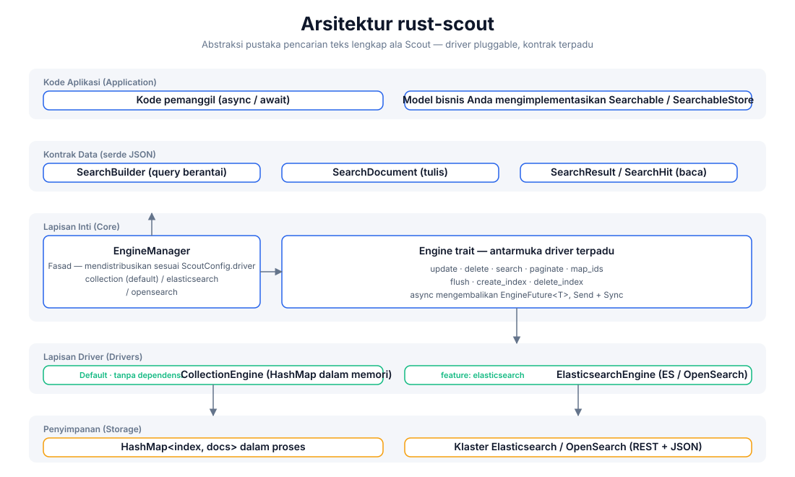
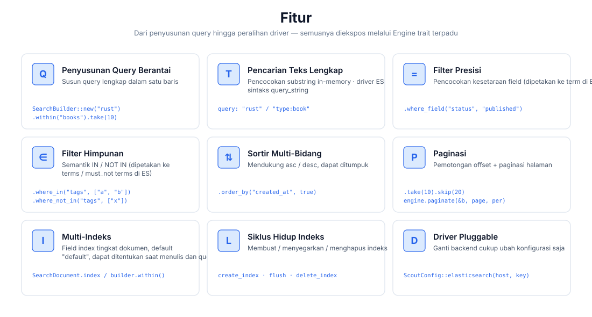
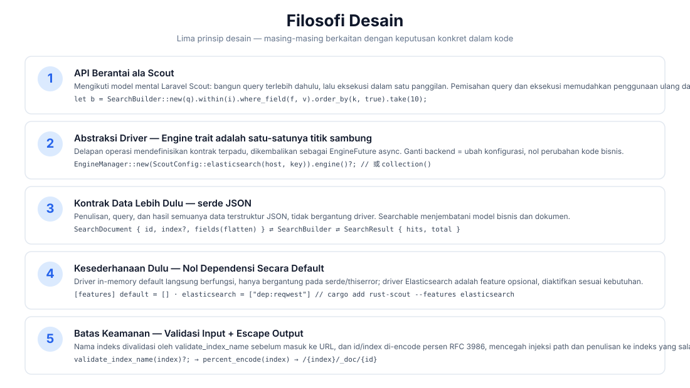
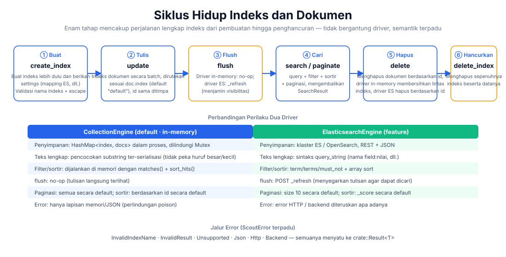

# rust-scout

[](https://crates.io/crates/rust-scout)
[](https://docs.rs/rust-scout)
[](../../../LICENSE)

[简体中文](../../../README.md) · [English](../en/README.md) · [日本語](../ja/README.md) · [한국어](../ko/README.md) · Bahasa Indonesia · [Русский](../ru/README.md) · [Deutsch](../de/README.md) · [Français](../fr/README.md) · [Español](../es/README.md) · [Português](../pt/README.md) · [हिन्दी](../hi/README.md) · [العربية](../ar/README.md) · [বাংলা](../bn/README.md)

**Abstraksi pustaka pencarian teks lengkap rust-scout** — lapisan antarmuka pencarian teks lengkap yang ringan untuk Rust. Terinspirasi oleh model mental query berantai [Laravel Scout](https://laravel.com/docs/scout), lapisan ini mengabstraksi berbagai backend seperti in-memory, Elasticsearch/OpenSearch, Meilisearch, Typesense, Algolia, SQLite melalui satu trait `Engine`: **driver in-memory tanpa dependensi untuk pengembangan, beralih ke backend apa pun secara mulus di produksi, tanpa mengubah satu baris pun kode bisnis.**

```rust
let result = engine.search(
    SearchBuilder::new("rust 异步")
        .within("articles")
        .where_field("status", "published")
        .order_by("created_at", true)
        .take(10),
).await?;
```

## Fitur

| Kemampuan | Deskripsi |
|------|------|
| 🔍 Pencarian teks lengkap | Driver in-memory: pencocokan substring; driver ES: sintaks `query_string` (`field:nilai`) |
| ⚙️ Query berantai | `SearchBuilder`: query / within / where_field / where_in / where_not_in / order_by / take / skip |
| 🎯 Filter presisi | Pencocokan kesetaraan (ES → `term`), pencocokan himpunan (ES → `terms` / `must_not`) |
| 📄 Sortir multi-bidang | asc / desc dapat ditumpuk |
| 📃 Paginasi | `take`/`skip` pemotongan offset + paginasi halaman `paginate(page, per_page)` |
| 🗂️ Multi-indeks | Penentuan rute lewat field `index` tingkat dokumen, indeks default `"default"` |
| 🔄 Siklus hidup indeks | Alur lengkap `create_index` / `flush` / `delete_index` |
| 🔌 Driver pluggable | Default in-memory tanpa dependensi; feature `elasticsearch` / `meilisearch` / `typesense` / `algolia` / `database` / `null` dapat diaktifkan sesuai kebutuhan; `xunsearch` adalah stub placeholder |
| 🔒 Batas keamanan | Validasi nama indeks (`validate_index_name`) + percent-encoding RFC 3986 untuk mencegah injeksi path |

## Arsitektur



## Ringkasan Fitur



## Filosofi Desain



## Siklus Hidup



## Struktur Proyek

```
rust-scout/
├── Cargo.toml            # 依赖与 feature 声明（elasticsearch 可选）
├── src/
│   ├── lib.rs            # crate 根：模块导出 + 公开类型再导出
│   ├── engine.rs         # Engine trait：驱动统一接口（8 个操作）
│   ├── manager.rs        # EngineManager：门面，按配置分发驱动
│   ├── config.rs         # ScoutConfig + validate_index_name
│   ├── builder.rs        # SearchBuilder：链式查询构建与匹配/排序逻辑
│   ├── document.rs       # SearchDocument：写入文档（serde JSON 契约）
│   ├── result.rs         # SearchResult / SearchHit：查询结果
│   ├── searchable.rs     # Searchable / SearchableStore：业务模型桥接
│   ├── error.rs          # ScoutError + Result<T>
│   ├── collection_engine.rs  # 内存驱动（默认）
│   └── elasticsearch_engine.rs # ES/OpenSearch 驱动（feature 可选）
├── tests/                # 集成测试（当前为空）
├── examples/             # 示例（当前为空）
└── docs/
    ├── svg/              # 本 README 引用的架构/功能/设计/生命周期图
    └── superpowers/specs/ # 设计文档
```

## Memulai dengan Cepat

### 1. Tambahkan dependensi

```toml
[dependencies]
rust-scout = "0.1"
tokio = { version = "1", features = ["macros", "rt"] }   # 仅示例需要
```

### 2. Contoh minimal (driver in-memory default)

```rust
use rust_scout::{Engine, EngineManager, ScoutConfig, SearchBuilder, SearchDocument};

#[tokio::main]
async fn main() -> rust_scout::Result<()> {
    // 默认驱动：内存 CollectionEngine，零依赖开箱即用
    let engine = EngineManager::new(ScoutConfig::collection()).engine()?;

    // 写入文档
    let mut book = SearchDocument::new(
        "book-1",
        serde_json::json!({
            "title": "Programming Rust",
            "author": "Blandy & Orendorff",
            "tags": ["rust", "systems"],
            "status": "published",
        }),
    )?;
    book.index = Some("books".to_string());
    engine.update(&[book]).await?;

    // 查询
    let result = engine
        .search(
            SearchBuilder::new("rust")
                .within("books")
                .where_field("status", "published")
                .order_by("title", false)
                .take(10),
        )
        .await?;

    println!("total = {}", result.total);
    for hit in &result.hits {
        println!("  [{}] {:?}", hit.id, hit.source);
    }
    Ok(())
}
```

## Panduan Penggunaan

### Penyusunan Query (SearchBuilder)

Semua operasi query disusun secara berantai dan akhirnya diserahkan ke `engine.search(&builder)`:

```rust
let builder = SearchBuilder::new("全文关键词")   // 全文搜索（可选，空串 = 匹配全部）
    .within("articles")                          // 指定索引（可选，默认 "default"）
    .where_field("status", "published")          // 等值过滤
    .where_in("tags", ["rust", "async"])         // IN 集合
    .where_not_in("category", ["draft"])         // NOT IN 集合
    .order_by("created_at", true)                // 多字段排序（true = desc）
    .order_by("title", false)
    .take(20)                                    // 每页条数
    .skip(40);                                   // 偏移
```

> `query` mendukung sintaks Lucene `query_string` (berfungsi penuh pada driver ES): `"rust"`, `"title:rust AND tags:async"`, `"rust~2"` (fuzzy). Driver in-memory memprosesnya sebagai pencocokan substring.

### Paginasi

```rust
// 方式一：偏移截取
let page2 = SearchBuilder::new("rust").within("books").skip(10).take(10);
// 方式二：页码分页（page 从 1 起）
let page2 = engine.paginate(&SearchBuilder::new("rust").within("books"), 2, 10).await?;
```

### Multi-indeks dan Siklus Hidup

```rust
engine.create_index("books", serde_json::json!({})).await?;   // 建索引
engine.update(&docs).await?;                                  // 写文档
engine.flush("books").await?;                                 // 刷新可见性
engine.delete(&["book-1".to_string()]).await?;                // 删文档
engine.delete_index("books").await?;                          // 删索引
```

### Beralih ke Elasticsearch / OpenSearch

```bash
cargo add rust-scout --features elasticsearch
```

```rust
use rust_scout::{Engine, EngineManager, ScoutConfig};

let config = ScoutConfig::elasticsearch(
    "http://127.0.0.1:9200",      // 或 OpenSearch 地址
    Some("your-api-key".into()),   // 可选：ApiKey 认证
);
let engine = EngineManager::new(config).engine()?;
// —— 之后所有操作与内存驱动完全一致 ——
```

| Item Perbandingan | CollectionEngine (default) | ElasticsearchEngine |
|--------|--------------------------|---------------------|
| Dependensi | Hanya serde / thiserror | reqwest (saat feature diaktifkan) |
| Teks lengkap | Pencocokan substring ter-serialisasi | `query_string` |
| Filter | matches() di memori | term / terms / must_not |
| Sortir | sort_hits() di memori | array sort |
| flush | no-op | `_refresh` |
| Paginasi default | Semua hasil | size 10 |
| Sortir default | Berdasarkan id | Berdasarkan _score |

### Beralih ke Meilisearch

```bash
cargo add rust-scout --features meilisearch
```

```rust
use rust_scout::{Engine, EngineManager, ScoutConfig};

let config = ScoutConfig::meilisearch(
    "http://127.0.0.1:7700",   // Meilisearch 服务地址
    "your-master-key",          // 可选：API 密钥
);
let engine = EngineManager::new(config).engine()?;
// —— 之后所有操作与内存驱动完全一致 ——
```

### Perbandingan Mesin

| Mesin | driver | feature | Status |
|------|--------|---------|------|
| In-memory (default) | `collection` | bawaan | Lengkap |
| Elasticsearch / OpenSearch | `elasticsearch` / `opensearch` | `elasticsearch` | Lengkap |
| Meilisearch | `meilisearch` | `meilisearch` | Lengkap |
| Typesense | `typesense` | `typesense` | Lengkap |
| Algolia | `algolia` | `algolia` | Lengkap |
| SQLite | `database` | `database` | Lengkap |
| Null (pengujian/penonaktifan pencarian) | `null` | `null` | Lengkap |
| XunSearch | `xunsearch` | `xunsearch` | stub (belum diimplementasikan) |

Konstruktor konfigurasi untuk mesin lainnya dapat dilihat di [docs.rs](https://docs.rs/rust-scout): `ScoutConfig::typesense(host, api_key)`, `ScoutConfig::algolia(app_id, api_key)`, `ScoutConfig::database(url, fields)`, `ScoutConfig::null()`, `ScoutConfig::xunsearch(host, project)`.

> Untuk mesin SQLite (`database`), `total` dihitung di lapisan SQL (indeks + filter kasar LIKE); wheres / soft delete dapat membuat `hits.len() < total` setelah penyaringan di memori — paginasi berdasarkan hits.

### Field Cadangan

`__soft_deleted` adalah nama field cadangan yang digunakan oleh fitur soft-delete (`Engine::soft_delete`, `SearchBuilder::with_trashed()` / `only_trashed()`), yang dipakai mesin untuk menyaring dokumen yang di-soft-delete. Dokumen pengguna **tidak boleh** menggunakan nama field ini sebagai field bisnis.

### Penanganan Error

Semua operasi mengembalikan `crate::Result<T>`, dengan error yang menyatu ke `ScoutError` terpadu:

- `InvalidIndexName` — nama indeks mengandung spasi / `/` / diawali `.`, dll. (divalidasi sebelum penulisan)
- `InvalidResult` — field dokumen bukan objek JSON
- `Unsupported` — feature tidak diaktifkan, dll.
- `Json` — error serde
- `Http` / `Backend` — error jaringan dan backend driver ES (saat feature diaktifkan)

### Menjembatani Model Bisnis (Searchable)

Implementasikan `Searchable` untuk memetakan struktur bisnis menjadi dokumen yang dapat diindeks, dan implementasikan `SearchableStore` untuk merangkum tiga operasi `index_documents` / `remove_documents` / `search`:

```rust
use rust_scout::{Searchable, SearchableStore, SearchDocument, SearchResult};

struct Article { id: String, title: String, body: String }

impl Searchable for Article {
    fn searchable_id(&self) -> String { self.id.clone() }
    fn to_searchable_json(&self) -> serde_json::Value {
        serde_json::json!({ "title": self.title, "body": self.body })
    }
}
```

## Dukungan dan Donasi

Jika proyek ini bermanfaat bagi Anda, silakan dukung dengan donasi ☕ — dukungan Anda adalah motivasi untuk pemeliharaan yang berkelanjutan!

### WeChat / Alipay


Pindai WeChat · Pindai Alipay

### Donasi Mata Uang Kripto

| Jaringan | Alamat Dompet | Kode QR |
|------|----------|--------|
| BNB Smart Chain (BEP20) | `0x355d429f97511897ccb4e271ec888205f9ab6629` |  |
| Tron (TRC20) | `TEdDHWLajt1XvqtPDWmQctdrJaC3pzZZzz` |  |
| Ethereum (ERC20) | `0x355d429f97511897ccb4e271ec888205f9ab6629` |  |
| Aptos | `0x836e3780edfc3f7b2372b39e2a1a3a5d7adfaccd96c726f21cfde1b50dd68030` |  |
| Plasma | `0x355d429f97511897ccb4e271ec888205f9ab6629` |  |
| Polygon POS | `0x355d429f97511897ccb4e271ec888205f9ab6629` |  |
| Solana | `2hfhboHdmdrYsY25XfQSsEWxq5ip4EQsR7f4AzSRMUyr` |  |
| The Open Network (TON) | `UQB9kFQohzmXUir9QSSZq01iwl9aQZIDdBpNmDklljRtCoGK` |  |
| Arbitrum One | `0x355d429f97511897ccb4e271ec888205f9ab6629` |  |
| AVAX C-Chain | `0x355d429f97511897ccb4e271ec888205f9ab6629` |  |

### Transfer Global (Transfer Bank)

**Informasi Penerima**

- Nama Penerima: WANG KEXUN
- Nomor Rekening: 881015918251

**Bank Penerima (ZA Bank)**

- Kode SWIFT: `AABLHKHHXXX`
- Nama Bank: ZA Bank Limited
- Kode Bank: 387
- Alamat Bank: Core F, Cyberport 3, 100 Cyberport Road, Hong Kong

> Berikut adalah informasi bank koresponden (bank perantara) untuk transfer lintas negara, bukan informasi bank penerima. Silakan tanyakan kepada bank pengirim apakah perlu disediakan.

- Bank koresponden untuk transfer masuk dalam HKD, CNY, dan USD adalah **Citibank**:
  - Nama Bank: Citibank N.A. Hong Kong
  - Kode SWIFT: `CITIHKHXXXX`
  - Kode Bank: 006 / Kode Cabang: 391
  - Nama Cabang: Hong Kong Branch
  - Alamat Bank: Citibank Tower, Citibank Plaza, 3 Garden Road, Central, Hong Kong
- Bank koresponden untuk transfer masuk dalam mata uang lain adalah **BNY Mellon**:
  - Nama Bank: THE BANK OF NEW YORK MELLON
  - Kode SWIFT: `IRVTUS3NXXX`
  - Alamat Bank: THE BANK OF NEW YORK MELLON, 240 GREENWICH STREET, NEW YORK, United States

## Lisensi

MIT License. Lihat [LICENSE](../../../LICENSE) untuk detail.
