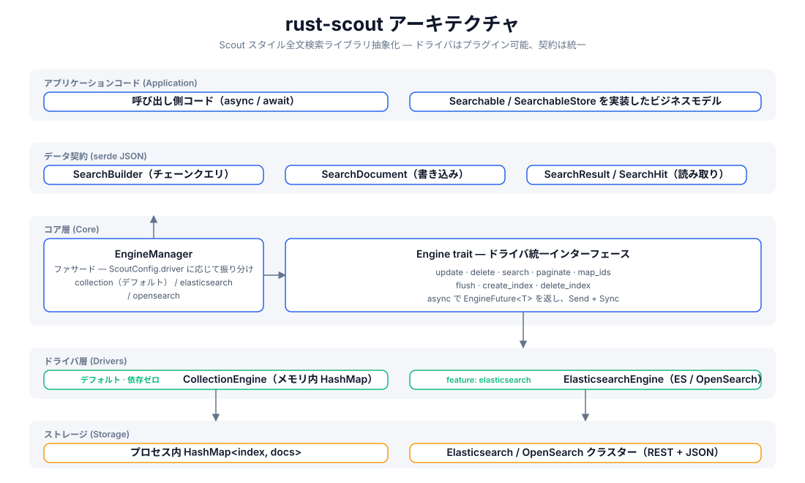
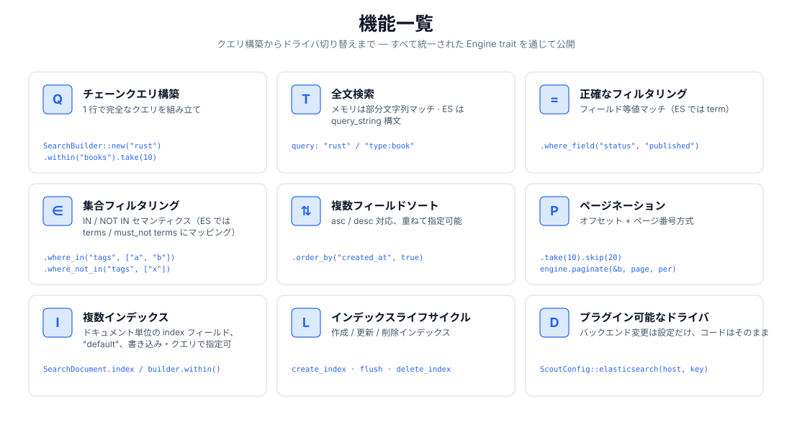
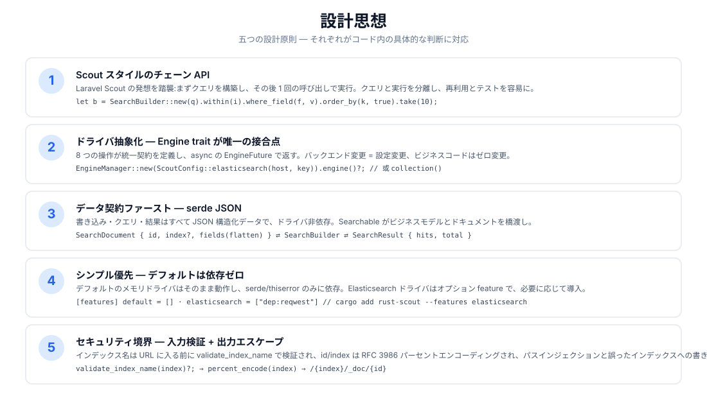
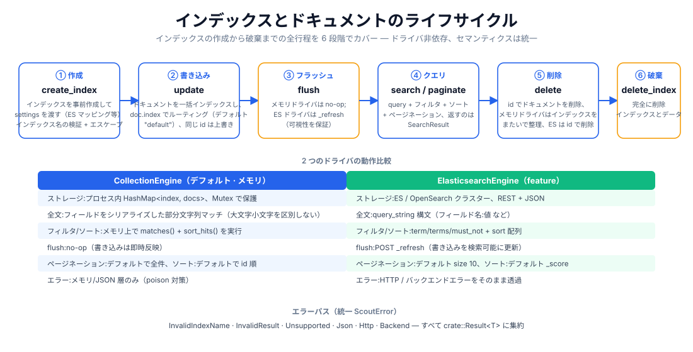

# rust-scout

[](https://crates.io/crates/rust-scout)
[](https://docs.rs/rust-scout)
[](../../../LICENSE)

[简体中文](../../../README.md) · [English](../en/README.md) · 日本語 · [한국어](../ko/README.md) · [Bahasa Indonesia](../id/README.md) · [Русский](../ru/README.md) · [Deutsch](../de/README.md) · [Français](../fr/README.md) · [Español](../es/README.md) · [Português](../pt/README.md) · [हिन्दी](../hi/README.md) · [العربية](../ar/README.md) · [বাংলা](../bn/README.md)

**rust-scout 全文検索ライブラリ抽象化** — Rust 向けの軽量全文検索インターフェース層。[Laravel Scout](https://laravel.com/docs/scout) のチェーンクエリの発想を踏襲し、統一された `Engine` trait でメモリ、Elasticsearch/OpenSearch、Meilisearch、Typesense、Algolia、SQLite などの複数バックエンドを抽象化します:**開発時は依存ゼロのメモリドライバ、本番では任意のバックエンドにシームレスに切り替え可能。ビジネスコードは一切変更不要。**

```rust
let result = engine.search(
    SearchBuilder::new("rust 异步")
        .within("articles")
        .where_field("status", "published")
        .order_by("created_at", true)
        .take(10),
).await?;
```

## 機能一覧

| 機能 | 説明 |
|------|------|
| 🔍 全文検索 | メモリドライバは部分文字列マッチング、ES ドライバは `query_string` 構文（`フィールド:値`） |
| ⚙️ チェーンクエリ | `SearchBuilder`: query / within / where_field / where_in / where_not_in / order_by / take / skip |
| 🎯 正確なフィルタリング | 等値マッチ（ES → `term`）、集合マッチ（ES → `terms` / `must_not`） |
| 📄 複数フィールドソート | asc / desc を重ねて指定可能 |
| 📃 ページネーション | `take`/`skip` オフセット + `paginate(page, per_page)` ページ番号方式 |
| 🗂️ 複数インデックス | ドキュメント単位の `index` フィールドでルーティング、デフォルトインデックスは `"default"` |
| 🔄 インデックスライフサイクル | `create_index` / `flush` / `delete_index` の一連の流れ |
| 🔌 プラグイン可能なドライバ | デフォルトはメモリで依存ゼロ、`elasticsearch` / `meilisearch` / `typesense` / `algolia` / `database` / `null` feature は必要に応じて有効化、`xunsearch` はプレースホルダーの stub |
| 🔒 セキュリティ境界 | インデックス名検証（`validate_index_name`）+ RFC 3986 パーセントエンコーディングでパスインジェクションを防止 |

## アーキテクチャ



## 機能概要



## 設計思想



## ライフサイクル



## プロジェクト構造

```
rust-scout/
├── Cargo.toml            # 依赖与 feature 声明（elasticsearch 可选）
├── src/
│   ├── lib.rs            # crate 根：模块导出 + 公开类型再导出
│   ├── engine.rs         # Engine trait：驱动统一接口（8 个操作）
│   ├── manager.rs        # EngineManager：门面，按配置分发驱动
│   ├── config.rs         # ScoutConfig + validate_index_name
│   ├── builder.rs        # SearchBuilder：链式查询构建与匹配/排序逻辑
│   ├── document.rs       # SearchDocument：写入文档（serde JSON 契约）
│   ├── result.rs         # SearchResult / SearchHit：查询结果
│   ├── searchable.rs     # Searchable / SearchableStore：业务模型桥接
│   ├── error.rs          # ScoutError + Result<T>
│   ├── collection_engine.rs  # 内存驱动（默认）
│   └── elasticsearch_engine.rs # ES/OpenSearch 驱动（feature 可选）
├── tests/                # 集成测试（当前为空）
├── examples/             # 示例（当前为空）
└── docs/
    ├── svg/              # 本 README 引用的架构/功能/设计/生命周期图
    └── superpowers/specs/ # 设计文档
```

## クイックスタート

### 1. 依存関係を追加

```toml
[dependencies]
rust-scout = "0.1"
tokio = { version = "1", features = ["macros", "rt"] }   # 仅示例需要
```

### 2. 最小限の例（デフォルトのメモリドライバ）

```rust
use rust_scout::{Engine, EngineManager, ScoutConfig, SearchBuilder, SearchDocument};

#[tokio::main]
async fn main() -> rust_scout::Result<()> {
    // 默认驱动：内存 CollectionEngine，零依赖开箱即用
    let engine = EngineManager::new(ScoutConfig::collection()).engine()?;

    // 写入文档
    let mut book = SearchDocument::new(
        "book-1",
        serde_json::json!({
            "title": "Programming Rust",
            "author": "Blandy & Orendorff",
            "tags": ["rust", "systems"],
            "status": "published",
        }),
    )?;
    book.index = Some("books".to_string());
    engine.update(&[book]).await?;

    // 查询
    let result = engine
        .search(
            SearchBuilder::new("rust")
                .within("books")
                .where_field("status", "published")
                .order_by("title", false)
                .take(10),
        )
        .await?;

    println!("total = {}", result.total);
    for hit in &result.hits {
        println!("  [{}] {:?}", hit.id, hit.source);
    }
    Ok(())
}
```

## 使用ガイド

### クエリ構築（SearchBuilder）

すべてのクエリ操作はチェーンで組み立て、最後に `engine.search(&builder)` に渡します:

```rust
let builder = SearchBuilder::new("全文关键词")   // 全文搜索（可选，空串 = 匹配全部）
    .within("articles")                          // 指定索引（可选，默认 "default"）
    .where_field("status", "published")          // 等值过滤
    .where_in("tags", ["rust", "async"])         // IN 集合
    .where_not_in("category", ["draft"])         // NOT IN 集合
    .order_by("created_at", true)                // 多字段排序（true = desc）
    .order_by("title", false)
    .take(20)                                    // 每页条数
    .skip(40);                                   // 偏移
```

> `query` は Lucene の `query_string` 構文をサポート（ES ドライバでは完全に有効）:`"rust"`、`"title:rust AND tags:async"`、`"rust~2"`（あいまい検索）。メモリドライバは部分文字列マッチングとして処理します。

### ページネーション

```rust
// 方式一：偏移截取
let page2 = SearchBuilder::new("rust").within("books").skip(10).take(10);
// 方式二：页码分页（page 从 1 起）
let page2 = engine.paginate(&SearchBuilder::new("rust").within("books"), 2, 10).await?;
```

### 複数インデックスとライフサイクル

```rust
engine.create_index("books", serde_json::json!({})).await?;   // 建索引
engine.update(&docs).await?;                                  // 写文档
engine.flush("books").await?;                                 // 刷新可见性
engine.delete(&["book-1".to_string()]).await?;                // 删文档
engine.delete_index("books").await?;                          // 删索引
```

### Elasticsearch / OpenSearch に切り替える

```bash
cargo add rust-scout --features elasticsearch
```

```rust
use rust_scout::{Engine, EngineManager, ScoutConfig};

let config = ScoutConfig::elasticsearch(
    "http://127.0.0.1:9200",      // 或 OpenSearch 地址
    Some("your-api-key".into()),   // 可选：ApiKey 认证
);
let engine = EngineManager::new(config).engine()?;
// —— 之后所有操作与内存驱动完全一致 ——
```

| 比較項目 | CollectionEngine（デフォルト） | ElasticsearchEngine |
|--------|--------------------------|---------------------|
| 依存 | serde / thiserror のみ | reqwest（feature 有効時） |
| 全文 | シリアライズした部分文字列マッチング | `query_string` |
| フィルタ | メモリ内 matches() | term / terms / must_not |
| ソート | メモリ内 sort_hits() | sort 配列 |
| flush | no-op | `_refresh` |
| 分頁デフォルト | 全件 | size 10 |
| ソートデフォルト | id 順 | _score 順 |

### Meilisearch に切り替える

```bash
cargo add rust-scout --features meilisearch
```

```rust
use rust_scout::{Engine, EngineManager, ScoutConfig};

let config = ScoutConfig::meilisearch(
    "http://127.0.0.1:7700",   // Meilisearch 服务地址
    "your-master-key",          // 可选：API 密钥
);
let engine = EngineManager::new(config).engine()?;
// —— 之后所有操作与内存驱动完全一致 ——
```

### エンジン比較

| エンジン | driver | feature | 状態 |
|------|--------|---------|------|
| メモリ（デフォルト） | `collection` | 組み込み | 完全 |
| Elasticsearch / OpenSearch | `elasticsearch` / `opensearch` | `elasticsearch` | 完全 |
| Meilisearch | `meilisearch` | `meilisearch` | 完全 |
| Typesense | `typesense` | `typesense` | 完全 |
| Algolia | `algolia` | `algolia` | 完全 |
| SQLite | `database` | `database` | 完全 |
| Null（テスト/検索無効化） | `null` | `null` | 完全 |
| XunSearch | `xunsearch` | `xunsearch` | stub（未実装） |

その他のエンジンの設定コンストラクタは [docs.rs](https://docs.rs/rust-scout) を参照:`ScoutConfig::typesense(host, api_key)`、`ScoutConfig::algolia(app_id, api_key)`、`ScoutConfig::database(url, fields)`、`ScoutConfig::null()`、`ScoutConfig::xunsearch(host, project)`。

> SQLite エンジン（`database`）の `total` は SQL レイヤーのカウント（インデックス + LIKE による粗いフィルタ）で、wheres / ソフトデリートはメモリ内フィルタ後に `hits.len() < total` になる場合があり、ページネーションは hits に基づきます。

### 予約フィールド

`__soft_deleted` はソフトデリート機能（`Engine::soft_delete`、`SearchBuilder::with_trashed()` / `only_trashed()`）が使用する予約フィールド名で、エンジンはこれに基づいてソフトデリートされたドキュメントを除外します。ユーザーのドキュメントでビジネスフィールドとしてこのフィールド名を**使わないでください**。

### エラー処理

すべての操作は `crate::Result<T>` を返し、エラーは統一された `ScoutError` に集約されます:

- `InvalidIndexName` — インデックス名に空白 / `/` が含まれる、`.` で始まる等（書き込み前に検証）
- `InvalidResult` — ドキュメントフィールドが JSON オブジェクトではない
- `Unsupported` — feature が有効でない等
- `Json` — serde エラー
- `Http` / `Backend` — ES ドライバのネットワーク・バックエンドエラー（feature 有効時）

### ビジネスモデルのブリッジ（Searchable）

`Searchable` を実装してビジネス構造をインデックス可能なドキュメントにマッピングし、`SearchableStore` を実装して `index_documents` / `remove_documents` / `search` の 3 つの操作をカプセル化します:

```rust
use rust_scout::{Searchable, SearchableStore, SearchDocument, SearchResult};

struct Article { id: String, title: String, body: String }

impl Searchable for Article {
    fn searchable_id(&self) -> String { self.id.clone() }
    fn to_searchable_json(&self) -> serde_json::Value {
        serde_json::json!({ "title": self.title, "body": self.body })
    }
}
```

## サポートと寄付

このプロジェクトが役に立ったなら、寄付で応援していただけると嬉しいです ☕ —— あなたのサポートが継続的なメンテナンスの原動力です!

### WeChat / 支付宝（Alipay）


WeChat でスキャン · Alipay でスキャン

### 仮想通貨による寄付

| メインネット | ウォレットアドレス | QR コード |
|------|----------|--------|
| BNB Smart Chain (BEP20) | `0x355d429f97511897ccb4e271ec888205f9ab6629` |  |
| Tron (TRC20) | `TEdDHWLajt1XvqtPDWmQctdrJaC3pzZZzz` |  |
| Ethereum (ERC20) | `0x355d429f97511897ccb4e271ec888205f9ab6629` |  |
| Aptos | `0x836e3780edfc3f7b2372b39e2a1a3a5d7adfaccd96c726f21cfde1b50dd68030` |  |
| Plasma | `0x355d429f97511897ccb4e271ec888205f9ab6629` |  |
| Polygon POS | `0x355d429f97511897ccb4e271ec888205f9ab6629` |  |
| Solana | `2hfhboHdmdrYsY25XfQSsEWxq5ip4EQsR7f4AzSRMUyr` |  |
| The Open Network (TON) | `UQB9kFQohzmXUir9QSSZq01iwl9aQZIDdBpNmDklljRtCoGK` |  |
| Arbitrum One | `0x355d429f97511897ccb4e271ec888205f9ab6629` |  |
| AVAX C-Chain | `0x355d429f97511897ccb4e271ec888205f9ab6629` |  |

### 海外送金（銀行振込）

**受取人情報**

- 受取人名:WANG KEXUN
- 受取口座番号:881015918251

**受取銀行（ZA Bank）**

- SWIFT コード:`AABLHKHHXXX`
- 銀行名:ZA Bank Limited
- 銀行番号:387
- 銀行住所:Core F, Cyberport 3, 100 Cyberport Road, Hong Kong

> 以下は海外送金時の代理銀行（中継銀行）情報であり、受取銀行の情報ではありません。送金銀行に提供が必要かどうかお問い合わせください。

- 香港ドル・人民元・米ドルの入金時の代理銀行は **Citibank**:
  - 銀行名:Citibank N.A. Hong Kong
  - SWIFT コード:`CITIHKHXXXX`
  - 銀行番号:006 / 支店番号:391
  - 支店名:Hong Kong Branch
  - 銀行住所:Citibank Tower, Citibank Plaza, 3 Garden Road, Central, Hong Kong
- その他の通貨の入金時の代理銀行は **BNY Mellon**:
  - 銀行名:THE BANK OF NEW YORK MELLON
  - SWIFT コード:`IRVTUS3NXXX`
  - 銀行住所:THE BANK OF NEW YORK MELLON, 240 GREENWICH STREET, NEW YORK, United States

## ライセンス

MIT License。詳細は [LICENSE](../../../LICENSE) を参照してください。
