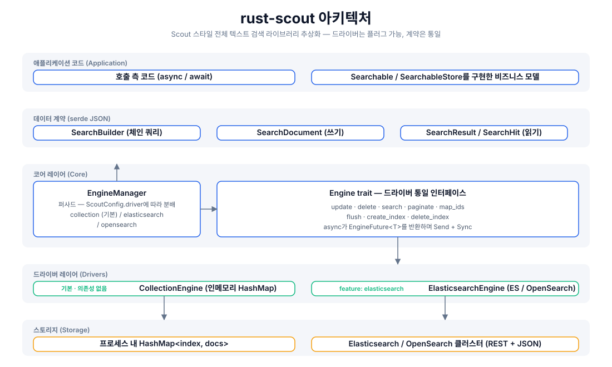
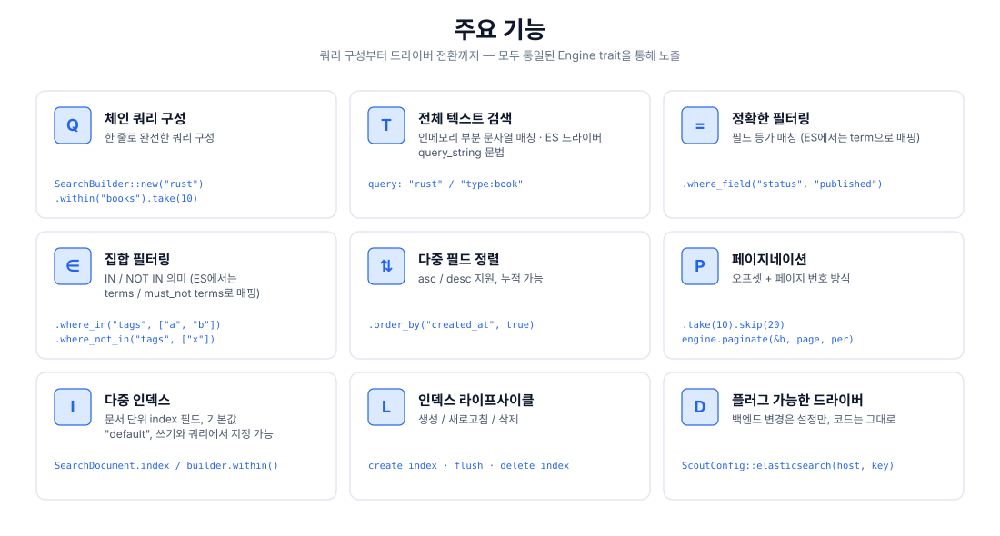
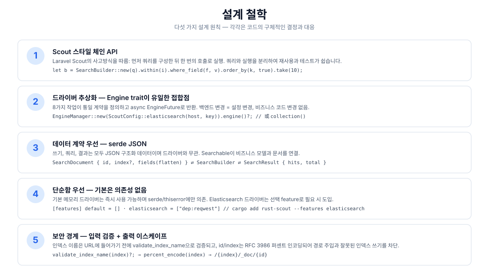
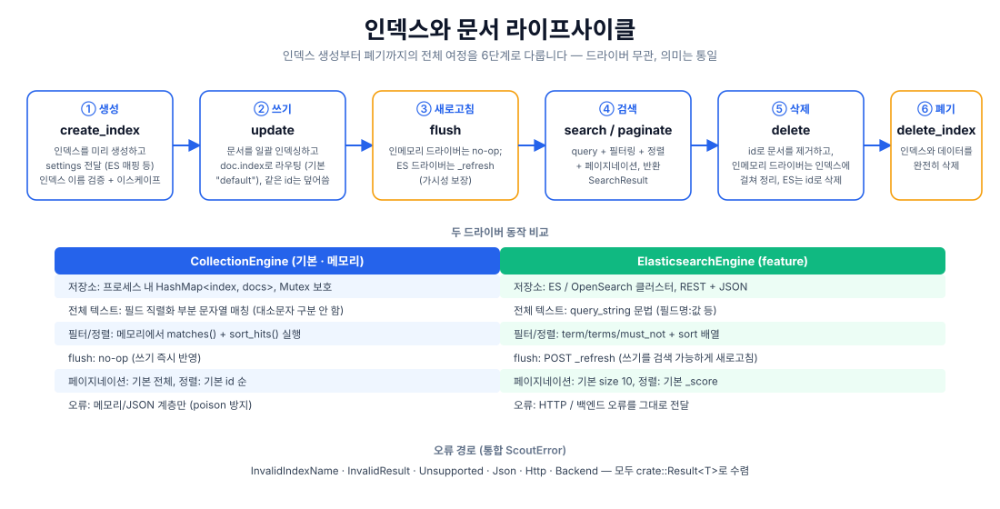

# rust-scout

[](https://crates.io/crates/rust-scout)
[](https://docs.rs/rust-scout)
[](../../../LICENSE)

[简体中文](../../../README.md) · [English](../en/README.md) · [日本語](../ja/README.md) · 한국어 · [Bahasa Indonesia](../id/README.md) · [Русский](../ru/README.md) · [Deutsch](../de/README.md) · [Français](../fr/README.md) · [Español](../es/README.md) · [Português](../pt/README.md) · [हिन्दी](../hi/README.md) · [العربية](../ar/README.md) · [বাংলা](../bn/README.md)

**rust-scout 전체 텍스트 검색 라이브러리 추상화** — Rust를 위한 경량 전체 텍스트 검색 인터페이스 계층.[Laravel Scout](https://laravel.com/docs/scout)의 체인 쿼리 사고방식을 따르며, 통일된 `Engine` trait으로 메모리, Elasticsearch/OpenSearch, Meilisearch, Typesense, Algolia, SQLite 등 다양한 백엔드를 추상화합니다:**개발 시에는 의존성 없는 메모리 드라이버, 프로덕션에서는 아무 백엔드로나 원활하게 전환 가능, 비즈니스 코드는 한 줄도 수정할 필요 없습니다.**

```rust
let result = engine.search(
    SearchBuilder::new("rust 异步")
        .within("articles")
        .where_field("status", "published")
        .order_by("created_at", true)
        .take(10),
).await?;
```

## 주요 기능

| 기능 | 설명 |
|------|------|
| 🔍 전체 텍스트 검색 | 메모리 드라이버는 부분 문자열 매칭, ES 드라이버는 `query_string` 문법(`필드:값`) |
| ⚙️ 체인 쿼리 | `SearchBuilder`: query / within / where_field / where_in / where_not_in / order_by / take / skip |
| 🎯 정확한 필터링 | 등가 매칭(ES → `term`), 집합 매칭(ES → `terms` / `must_not`) |
| 📄 다중 필드 정렬 | asc / desc 누적 지정 가능 |
| 📃 페이지네이션 | `take`/`skip` 오프셋 + `paginate(page, per_page)` 페이지 번호 방식 |
| 🗂️ 다중 인덱스 | 문서 단위 `index` 필드 라우팅, 기본 인덱스 `"default"` |
| 🔄 인덱스 라이프사이클 | `create_index` / `flush` / `delete_index` 전체 흐름 |
| 🔌 플러그 가능한 드라이버 | 기본 메모리 의존성 없음, `elasticsearch` / `meilisearch` / `typesense` / `algolia` / `database` / `null` feature를 필요에 따라 활성화, `xunsearch`는 자리 표시자 stub |
| 🔒 보안 경계 | 인덱스 이름 검증(`validate_index_name`) + RFC 3986 퍼센트 인코딩으로 경로 주입 방지 |

## 아키텍처



## 기능 개요



## 설계 철학



## 라이프사이클



## 프로젝트 구조

```
rust-scout/
├── Cargo.toml            # 依赖与 feature 声明（elasticsearch 可选）
├── src/
│   ├── lib.rs            # crate 根：模块导出 + 公开类型再导出
│   ├── engine.rs         # Engine trait：驱动统一接口（8 个操作）
│   ├── manager.rs        # EngineManager：门面，按配置分发驱动
│   ├── config.rs         # ScoutConfig + validate_index_name
│   ├── builder.rs        # SearchBuilder：链式查询构建与匹配/排序逻辑
│   ├── document.rs       # SearchDocument：写入文档（serde JSON 契约）
│   ├── result.rs         # SearchResult / SearchHit：查询结果
│   ├── searchable.rs     # Searchable / SearchableStore：业务模型桥接
│   ├── error.rs          # ScoutError + Result<T>
│   ├── collection_engine.rs  # 内存驱动（默认）
│   └── elasticsearch_engine.rs # ES/OpenSearch 驱动（feature 可选）
├── tests/                # 集成测试（当前为空）
├── examples/             # 示例（当前为空）
└── docs/
    ├── svg/              # 本 README 引用的架构/功能/设计/生命周期图
    └── superpowers/specs/ # 设计文档
```

## 빠른 시작

### 1. 의존성 추가

```toml
[dependencies]
rust-scout = "0.1"
tokio = { version = "1", features = ["macros", "rt"] }   # 仅示例需要
```

### 2. 최소 예제(기본 메모리 드라이버)

```rust
use rust_scout::{Engine, EngineManager, ScoutConfig, SearchBuilder, SearchDocument};

#[tokio::main]
async fn main() -> rust_scout::Result<()> {
    // 默认驱动：内存 CollectionEngine，零依赖开箱即用
    let engine = EngineManager::new(ScoutConfig::collection()).engine()?;

    // 写入文档
    let mut book = SearchDocument::new(
        "book-1",
        serde_json::json!({
            "title": "Programming Rust",
            "author": "Blandy & Orendorff",
            "tags": ["rust", "systems"],
            "status": "published",
        }),
    )?;
    book.index = Some("books".to_string());
    engine.update(&[book]).await?;

    // 查询
    let result = engine
        .search(
            SearchBuilder::new("rust")
                .within("books")
                .where_field("status", "published")
                .order_by("title", false)
                .take(10),
        )
        .await?;

    println!("total = {}", result.total);
    for hit in &result.hits {
        println!("  [{}] {:?}", hit.id, hit.source);
    }
    Ok(())
}
```

## 사용 가이드

### 쿼리 구성(SearchBuilder)

모든 쿼리 작업은 체인으로 구성한 뒤 마지막에 `engine.search(&builder)`에 전달합니다:

```rust
let builder = SearchBuilder::new("全文关键词")   // 全文搜索（可选，空串 = 匹配全部）
    .within("articles")                          // 指定索引（可选，默认 "default"）
    .where_field("status", "published")          // 等值过滤
    .where_in("tags", ["rust", "async"])         // IN 集合
    .where_not_in("category", ["draft"])         // NOT IN 集合
    .order_by("created_at", true)                // 多字段排序（true = desc）
    .order_by("title", false)
    .take(20)                                    // 每页条数
    .skip(40);                                   // 偏移
```

> `query`는 Lucene `query_string` 문법을 지원합니다(ES 드라이버에서 완전히 유효): `"rust"`, `"title:rust AND tags:async"`, `"rust~2"`(퍼지). 메모리 드라이버는 부분 문자열 매칭으로 처리합니다.

### 페이지네이션

```rust
// 方式一：偏移截取
let page2 = SearchBuilder::new("rust").within("books").skip(10).take(10);
// 方式二：页码分页（page 从 1 起）
let page2 = engine.paginate(&SearchBuilder::new("rust").within("books"), 2, 10).await?;
```

### 다중 인덱스와 라이프사이클

```rust
engine.create_index("books", serde_json::json!({})).await?;   // 建索引
engine.update(&docs).await?;                                  // 写文档
engine.flush("books").await?;                                 // 刷新可见性
engine.delete(&["book-1".to_string()]).await?;                // 删文档
engine.delete_index("books").await?;                          // 删索引
```

### Elasticsearch / OpenSearch로 전환

```bash
cargo add rust-scout --features elasticsearch
```

```rust
use rust_scout::{Engine, EngineManager, ScoutConfig};

let config = ScoutConfig::elasticsearch(
    "http://127.0.0.1:9200",      // 或 OpenSearch 地址
    Some("your-api-key".into()),   // 可选：ApiKey 认证
);
let engine = EngineManager::new(config).engine()?;
// —— 之后所有操作与内存驱动完全一致 ——
```

| 비교 항목 | CollectionEngine(기본) | ElasticsearchEngine |
|--------|--------------------------|---------------------|
| 의존성 | serde / thiserror뿐 | reqwest(feature 활성화 시) |
| 전체 텍스트 | 직렬화 부분 문자열 매칭 | `query_string` |
| 필터링 | 메모리 내 matches() | term / terms / must_not |
| 정렬 | 메모리 내 sort_hits() | sort 배열 |
| flush | no-op | `_refresh` |
| 기본 페이지네이션 | 전체 결과 | size 10 |
| 기본 정렬 | id 순 | _score 순 |

### Meilisearch로 전환

```bash
cargo add rust-scout --features meilisearch
```

```rust
use rust_scout::{Engine, EngineManager, ScoutConfig};

let config = ScoutConfig::meilisearch(
    "http://127.0.0.1:7700",   // Meilisearch 服务地址
    "your-master-key",          // 可选：API 密钥
);
let engine = EngineManager::new(config).engine()?;
// —— 之后所有操作与内存驱动完全一致 ——
```

### 엔진 비교

| 엔진 | driver | feature | 상태 |
|------|--------|---------|------|
| 메모리(기본) | `collection` | 내장 | 완전 |
| Elasticsearch / OpenSearch | `elasticsearch` / `opensearch` | `elasticsearch` | 완전 |
| Meilisearch | `meilisearch` | `meilisearch` | 완전 |
| Typesense | `typesense` | `typesense` | 완전 |
| Algolia | `algolia` | `algolia` | 완전 |
| SQLite | `database` | `database` | 완전 |
| Null(테스트/검색 비활성화) | `null` | `null` | 완전 |
| XunSearch | `xunsearch` | `xunsearch` | stub(미구현) |

나머지 엔진의 설정 생성자는 [docs.rs](https://docs.rs/rust-scout)를 참조하세요: `ScoutConfig::typesense(host, api_key)`, `ScoutConfig::algolia(app_id, api_key)`, `ScoutConfig::database(url, fields)`, `ScoutConfig::null()`, `ScoutConfig::xunsearch(host, project)`.

> SQLite 엔진(`database`)의 `total`은 SQL 계층 카운트(인덱스 + LIKE 대략 필터)이며, wheres / 소프트 삭제 후 메모리 필터링으로 `hits.len() < total`이 될 수 있습니다. 페이지네이션은 hits를 기준으로 합니다.

### 예약 필드

`__soft_deleted`는 소프트 삭제 기능(`Engine::soft_delete`, `SearchBuilder::with_trashed()` / `only_trashed()`)에서 사용하는 예약 필드 이름으로, 엔진은 이를 기준으로 소프트 삭제된 문서를 걸러냅니다. 사용자 문서는 이 필드 이름을 비즈니스 필드로 **사용하면 안 됩니다**.

### 오류 처리

모든 작업은 `crate::Result<T>`를 반환하며, 오류는 통합된 `ScoutError`로 수렴합니다:

- `InvalidIndexName` — 인덱스 이름에 공백 / `/` 포함, `.`로 시작 등(쓰기 전 검증)
- `InvalidResult` — 문서 필드가 JSON 객체가 아님
- `Unsupported` — feature가 활성화되지 않음 등
- `Json` — serde 오류
- `Http` / `Backend` — ES 드라이버 네트워크 및 백엔드 오류(feature 활성화 시)

### 비즈니스 모델 브리징(Searchable)

`Searchable`을 구현하여 비즈니스 구조를 인덱싱 가능한 문서로 매핑하고, `SearchableStore`를 구현하여 `index_documents` / `remove_documents` / `search` 세 가지 작업을 캡슐화합니다:

```rust
use rust_scout::{Searchable, SearchableStore, SearchDocument, SearchResult};

struct Article { id: String, title: String, body: String }

impl Searchable for Article {
    fn searchable_id(&self) -> String { self.id.clone() }
    fn to_searchable_json(&self) -> serde_json::Value {
        serde_json::json!({ "title": self.title, "body": self.body })
    }
}
```

## 지원 및 후원

이 프로젝트가 도움이 되었다면 후원으로 응원해 주세요 ☕ — 여러분의 지원이 지속적인 유지보수의 원동력입니다!

### WeChat / Alipay


WeChat 스캔 · Alipay 스캔

### 암호화폐 후원

| 네트워크 | 지갑 주소 | QR 코드 |
|------|----------|--------|
| BNB Smart Chain (BEP20) | `0x355d429f97511897ccb4e271ec888205f9ab6629` |  |
| Tron (TRC20) | `TEdDHWLajt1XvqtPDWmQctdrJaC3pzZZzz` |  |
| Ethereum (ERC20) | `0x355d429f97511897ccb4e271ec888205f9ab6629` |  |
| Aptos | `0x836e3780edfc3f7b2372b39e2a1a3a5d7adfaccd96c726f21cfde1b50dd68030` |  |
| Plasma | `0x355d429f97511897ccb4e271ec888205f9ab6629` |  |
| Polygon POS | `0x355d429f97511897ccb4e271ec888205f9ab6629` |  |
| Solana | `2hfhboHdmdrYsY25XfQSsEWxq5ip4EQsR7f4AzSRMUyr` |  |
| The Open Network (TON) | `UQB9kFQohzmXUir9QSSZq01iwl9aQZIDdBpNmDklljRtCoGK` |  |
| Arbitrum One | `0x355d429f97511897ccb4e271ec888205f9ab6629` |  |
| AVAX C-Chain | `0x355d429f97511897ccb4e271ec888205f9ab6629` |  |

### 해외 송금(은행 송금)

**수취인 정보**

- 수취인 이름: WANG KEXUN
- 수취 계좌 번호: 881015918251

**수취 은행(ZA Bank)**

- SWIFT 코드: `AABLHKHHXXX`
- 은행 이름: ZA Bank Limited
- 은행 번호: 387
- 은행 주소: Core F, Cyberport 3, 100 Cyberport Road, Hong Kong

> 아래는 해외 송금 시 중개 은행(대행 은행) 정보로, 수취 은행 정보가 아닙니다. 송금 은행에 제공이 필요한지 문의하세요.

- 홍콩 달러, 위안화, 미국 달러 송금 시 중개 은행은 **Citibank**입니다:
  - 은행 이름: Citibank N.A. Hong Kong
  - SWIFT 코드: `CITIHKHXXXX`
  - 은행 번호: 006 / 지점 번호: 391
  - 지점 이름: Hong Kong Branch
  - 은행 주소: Citibank Tower, Citibank Plaza, 3 Garden Road, Central, Hong Kong
- 기타 통화 송금 시 중개 은행은 **BNY Mellon**입니다:
  - 은행 이름: THE BANK OF NEW YORK MELLON
  - SWIFT 코드: `IRVTUS3NXXX`
  - 은행 주소: THE BANK OF NEW YORK MELLON, 240 GREENWICH STREET, NEW YORK, United States

## 라이선스

MIT License. 자세한 내용은 [LICENSE](../../../LICENSE)를 참조하세요.
