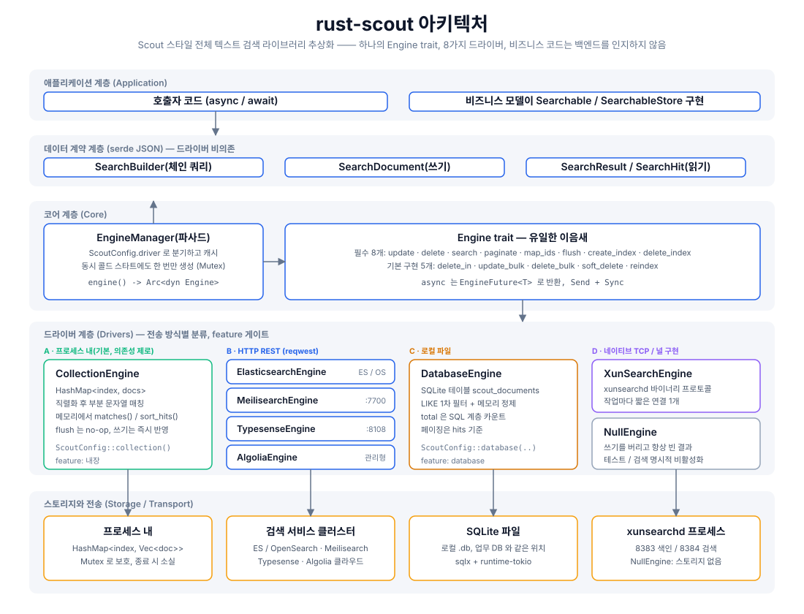
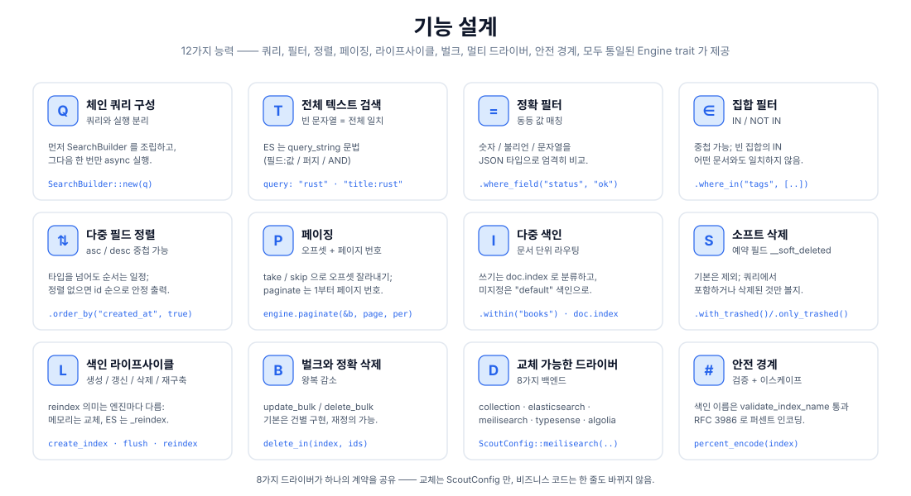
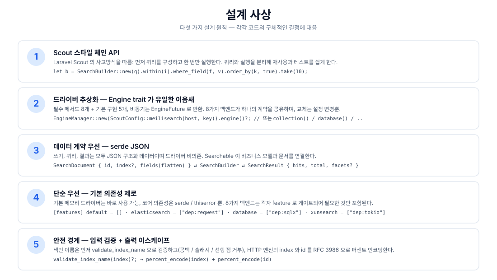
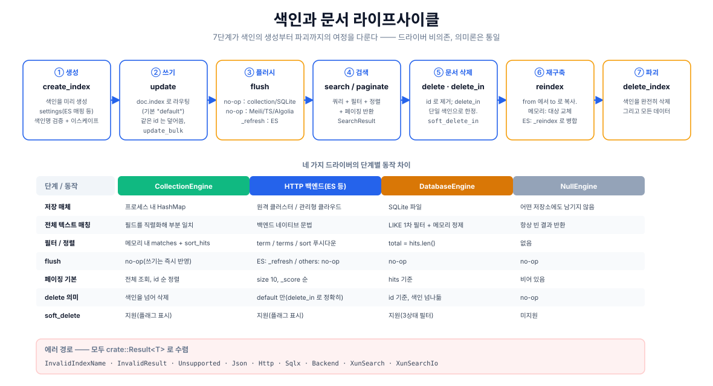

# rust-scout

[](https://crates.io/crates/rust-scout)
[](https://docs.rs/rust-scout)
[](../../../LICENSE)

[简体中文](../../../README.md) · [English](../en/README.md) · [日本語](../ja/README.md) · 한국어 · [Bahasa Indonesia](../id/README.md) · [Русский](../ru/README.md) · [Deutsch](../de/README.md) · [Français](../fr/README.md) · [Español](../es/README.md) · [Português](../pt/README.md) · [हिन्दी](../hi/README.md) · [العربية](../ar/README.md) · [বাংলা](../bn/README.md)

**rust-scout 전체 텍스트 검색 라이브러리 추상화** —— Rust를 위한 가벼운 전체 텍스트 검색
인터페이스 계층. [Laravel Scout](https://laravel.com/docs/scout)의 체인 쿼리 사고방식을 따르며,
통일된 `Engine` trait으로 **8가지 백엔드**(메모리, Elasticsearch/OpenSearch, Meilisearch,
Typesense, Algolia, SQLite, XunSearch, Null)를 추상화한다: **개발 시에는 의존성 없는 메모리
드라이버, 프로덕션에서는 아무 백엔드로나 매끄럽게 전환, 비즈니스 코드는 한 줄도 수정하지 않는다.**


> 프로젝트 펫 **탐색 사냥개 Scout**(Search Hound) —— 문서를 맡고 색인을 쫓는다.
> 문서 안뿐 아니라 터미널 배너와 에러 안내에도 등장한다. 자세한 내용은
> [프로젝트 펫](#프로젝트-펫) 참고.

```rust
let result = engine.search(
    SearchBuilder::new("rust 异步")
        .within("articles")
        .where_field("status", "published")
        .order_by("created_at", true)
        .take(10),
).await?;
```

## 기능

| 능력 | 설명 |
|------|------|
| 🔍 전체 텍스트 검색 | 메모리 드라이버는 부분 문자열 일치. HTTP 드라이버는 백엔드 고유 문법(ES는 `query_string`, `필드:값`) |
| ⚙️ 체인 쿼리 | `SearchBuilder`: query / within / where_field / where_in / where_not_in / order_by / take / skip / option |
| 🎯 정확 필터 | 동등 값 매칭(ES → `term`), 집합 매칭(ES → `terms` / `must_not`) |
| 📄 다중 필드 정렬 | asc / desc 를 겹쳐 쌓을 수 있고, JSON 타입을 넘어도 순서가 일정 |
| 📃 페이징 | `take`/`skip` 오프셋 잘라내기 + `paginate(page, per_page)` 페이지 번호 방식 |
| 🗂️ 다중 색인 | 문서 단위 `index` 필드로 라우팅, 기본 색인은 `"default"` |
| 🔄 색인 라이프사이클 | `create_index` / `flush` / `reindex` / `delete_index` 전 과정 |
| 🗑️ 소프트 삭제 | `soft_delete` 가 `__soft_deleted` 를 표시하고, `with_trashed()` / `only_trashed()` 로 3상태 필터 |
| 📦 벌크 작업 | `update_bulk` / `delete_bulk` 로 왕복 감소. `delete_in` 은 지정 색인만 정확히 삭제 |
| 🔌 교체 가능한 드라이버 | 기본은 의존성 없음. 8가지 백엔드는 각자 feature 로 게이트되어 안 쓰는 것은 컴파일되지 않음 |
| 🔒 안전 경계 | 색인 이름 검증(`validate_index_name`) + RFC 3986 퍼센트 인코딩으로 경로 주입 차단 |
| 🐕 프로젝트 펫 | 탐색 사냥개 Scout: 터미널 배너 + 에러별 점검 힌트(`rust_scout::pet`) |

## 아키텍처 설계



5계층 구조: 애플리케이션 계층 → 데이터 계약 계층(serde JSON) → 코어 계층(`EngineManager` + `Engine` trait)
→ 드라이버 계층(전송 방식으로 4그룹, 총 8개 드라이버) → 스토리지 계층. 계층을 가로지르는 이음새는 `Engine` trait 하나뿐이다.

## 기능 설계



12가지 능력: 체인 쿼리, 전체 텍스트, 정확/집합 필터, 정렬, 페이징, 다중 색인,
소프트 삭제, 색인 라이프사이클, 벌크와 지정 삭제, 교체 가능한 드라이버, 안전 경계.

## 설계 사상



## 라이프사이클



7단계: 생성 → 쓰기 → 플러시 → 검색 → 문서 삭제 → 재구축 → 파괴. 그림 아래쪽은
네 가지 드라이버 계열이 각 단계에서 어떻게 다른지 비교한 표다.

## 프로젝트 구조

```
rust-scout/
├── Cargo.toml              # 의존성과 feature 선언 (기본 default = [], 의존성 없음)
├── src/
│   ├── lib.rs              # crate 루트: 모듈 공개 + feature 게이트 재내보내기
│   │
│   ├── engine.rs           # Engine trait: 유일한 드라이버 계약 (필수 8 + 기본 구현 5)
│   ├── manager.rs          # EngineManager: 파사드, driver 로 분기하고 Arc<dyn Engine> 캐시
│   ├── config.rs           # ScoutConfig (생성자 8개) + validate_index_name + percent_encode
│   │
│   ├── builder.rs          # SearchBuilder / Where / Order / TrashedFilter: 체인 쿼리
│   ├── document.rs         # SearchDocument: 쓰기 문서 (serde JSON 계약)
│   ├── result.rs           # SearchResult / SearchHit: 검색 결과
│   ├── searchable.rs       # Searchable / SearchableStore: 비즈니스 모델 브리지
│   ├── error.rs            # ScoutError + Result<T> + pet_hint()
│   ├── pet.rs              # 프로젝트 펫: 탐색 사냥개 Scout (배너 + 에러 힌트)
│   │
│   ├── collection_engine.rs    # 메모리 드라이버 (기본, 의존성 없음)
│   ├── null_engine.rs          # 널 드라이버: 쓰기를 버리고 항상 빈 결과        [null]
│   ├── elasticsearch_engine.rs # ES / OpenSearch (REST)                       [elasticsearch]
│   │   └── query.rs            #   query_string 생성과 응답 파싱
│   ├── meilisearch_engine.rs   # Meilisearch (REST)                           [meilisearch]
│   ├── typesense_engine.rs     # Typesense (REST)                             [typesense]
│   │   └── typesense_query.rs  #   검색 파라미터와 filter_by 생성
│   ├── algolia_engine.rs       # Algolia (관리형 클라우드 REST)                 [algolia]
│   ├── database_engine.rs      # SQLite (sqlx, LIKE 1차 필터 + 메모리 정제)      [database]
│   ├── xunsearch_engine.rs     # XunSearch: xunsearchd 네이티브 TCP 프로토콜     [xunsearch]
│   │   ├── xunsearch_query.rs  #   패킷 코덱 + ini 필드 정의
│   │   └── xunsearch_tests.rs  #   mock 서버를 사용한 E2E 테스트
│   │
│   └── (단위 테스트는 각 모듈 하단의 #[cfg(test)] mod tests 에 내장)
├── tests/                  # 통합 테스트 (현재 비어 있음, 테스트는 src 에 내장)
├── examples/
│   └── pet.rs              # cargo run --example pet: 펫 배너 + 에러 힌트 데모
└── docs/
    ├── svg/                # 프로젝트 펫 + 아키텍처 / 기능 / 설계 / 라이프사이클 그림
    ├── i18n/               # 12개 언어의 README 와 대응 SVG
    ├── coin/               # 후원 QR 코드
    └── superpowers/specs/  # 설계 문서
```

> `[feature]` 는 해당 드라이버에 필요한 Cargo feature 를 뜻한다. 활성화되지 않으면
> `EngineManager` 는 조용히 성능을 떨어뜨리는 대신 `ScoutError::Unsupported` 를 반환한다.

## 빠른 시작

### 1. 의존성 추가

```toml
[dependencies]
rust-scout = "0.3"
tokio = { version = "1", features = ["macros", "rt"] }   # 예제에서만 필요
```

### 2. 최소 예제(기본 메모리 드라이버)

```rust
use rust_scout::{Engine, EngineManager, ScoutConfig, SearchBuilder, SearchDocument};

#[tokio::main]
async fn main() -> rust_scout::Result<()> {
    // 기본 드라이버: 메모리 CollectionEngine, 의존성 없이 바로 사용
    let engine = EngineManager::new(ScoutConfig::collection()).engine()?;

    // 문서 쓰기
    let mut book = SearchDocument::new(
        "book-1",
        serde_json::json!({
            "title": "Programming Rust",
            "author": "Blandy & Orendorff",
            "tags": ["rust", "systems"],
            "status": "published",
        }),
    )?;
    book.index = Some("books".to_string());
    engine.update(&[book]).await?;

    // 검색
    let result = engine
        .search(
            SearchBuilder::new("rust")
                .within("books")
                .where_field("status", "published")
                .order_by("title", false)
                .take(10),
        )
        .await?;

    println!("total = {}", result.total);
    for hit in &result.hits {
        println!("  [{}] {:?}", hit.id, hit.source);
    }
    Ok(())
}
```

## 사용법

### 쿼리 빌드(SearchBuilder)

모든 검색 작업은 체인으로 조립하고 마지막에 `engine.search(&builder)` 에 넘긴다:

```rust
let builder = SearchBuilder::new("전체 텍스트 키워드")  // 전체 텍스트 (선택, 빈 문자열 = 전체 일치)
    .within("articles")                          // 대상 색인 (선택, 기본 "default")
    .where_field("status", "published")          // 동등 값 필터
    .where_in("tags", ["rust", "async"])         // IN 집합
    .where_not_in("category", ["draft"])         // NOT IN 집합
    .order_by("created_at", true)                // 다중 필드 정렬 (true = desc)
    .order_by("title", false)
    .take(20)                                    // 페이지당 건수
    .skip(40)                                    // 오프셋
    .option("highlight", true)                   // 드라이버별 전달 옵션
    .with_trashed();                             // 소프트 삭제 3상태: 제외 / 포함 / 삭제된 것만
```

> `query` 는 Lucene `query_string` 문법을 지원한다(ES 드라이버에서 완전히 동작):
> `"rust"`, `"title:rust AND tags:async"`, `"rust~2"`(퍼지). 나머지 드라이버는 각자의
> 고유 문법이나 부분 문자열 일치로 처리한다.

### 페이징

```rust
// 방법 1: 오프셋 잘라내기
let page2 = SearchBuilder::new("rust").within("books").skip(10).take(10);
// 방법 2: 페이지 번호 방식 (page 는 1부터)
let page2 = engine.paginate(&SearchBuilder::new("rust").within("books"), 2, 10).await?;
```

### 다중 색인과 라이프사이클

```rust
engine.create_index("books", serde_json::json!({})).await?;    // 색인 생성
engine.update(&docs).await?;                                   // 문서 쓰기
engine.update_bulk(&docs).await?;                              // 벌크 쓰기 (지원 백엔드는 bulk API)
engine.flush("books").await?;                                  // 가시성 갱신
engine.search(&builder).await?;                                // 검색
engine.delete_in("books", &["book-1".to_string()]).await?;     // 색인을 지정해 문서 삭제
engine.soft_delete(&["book-2".to_string()]).await?;            // 소프트 삭제 (플래그 표시)
engine.reindex("books", "books_v2").await?;                    // 색인 재구축
engine.delete_index("books").await?;                           // 색인 삭제
```

> `delete` 는 색인 정보를 갖지 않으므로 의미가 엔진마다 다르다(메모리 드라이버는 색인을 가로질러
> 삭제하고, ES 는 `default` 색인만 본다). 특정 색인으로 한정하려면 `delete_in` 을 사용한다.

### Elasticsearch / OpenSearch 로 전환

```bash
cargo add rust-scout --features elasticsearch
```

```rust
use rust_scout::{Engine, EngineManager, ScoutConfig};

let config = ScoutConfig::elasticsearch(
    "http://127.0.0.1:9200",      // 또는 OpenSearch 주소
    Some("your-api-key".into()),   // 선택: ApiKey 인증
);
let engine = EngineManager::new(config).engine()?;
// —— 이후 모든 작업은 메모리 드라이버와 완전히 동일 ——
```

| 항목 | CollectionEngine(기본) | ElasticsearchEngine |
|--------|--------------------------|---------------------|
| 의존성 | serde / thiserror 만 | reqwest (feature 활성 시) |
| 전체 텍스트 | 직렬화 후 부분 문자열 일치 | `query_string` |
| 필터 | 메모리 내 matches() | term / terms / must_not |
| 정렬 | 메모리 내 sort_hits() | sort 배열 |
| flush | no-op | `_refresh` |
| 기본 페이징 | 전체 결과 | size 10 |
| 기본 정렬 | id 순 | _score 순 |

### Meilisearch 로 전환

```bash
cargo add rust-scout --features meilisearch
```

```rust
use rust_scout::{Engine, EngineManager, ScoutConfig};

let config = ScoutConfig::meilisearch(
    "http://127.0.0.1:7700",   // Meilisearch 주소
    "your-master-key",          // 선택: API 키
);
let engine = EngineManager::new(config).engine()?;
// —— 이후 모든 작업은 메모리 드라이버와 완전히 동일 ——
```

### 엔진 비교

| 엔진 | driver | feature | 전송 | 상태 |
|------|--------|---------|------|------|
| 메모리(기본) | `collection` | 내장 | 프로세스 내 | 완전 |
| Elasticsearch / OpenSearch | `elasticsearch` / `opensearch` | `elasticsearch` | HTTP REST | 완전 |
| Meilisearch | `meilisearch` | `meilisearch` | HTTP REST | 완전 |
| Typesense | `typesense` | `typesense` | HTTP REST | 완전 |
| Algolia | `algolia` | `algolia` | HTTP REST | 완전 |
| SQLite | `database` | `database` | 로컬 파일 | 완전 |
| XunSearch | `xunsearch` | `xunsearch` | 네이티브 TCP | 완전 |
| Null(테스트 / 검색 비활성화) | `null` | `null` | — | 완전 |

나머지 엔진의 설정 생성자는 [docs.rs](https://docs.rs/rust-scout) 참고: `ScoutConfig::typesense(host, api_key)`, `ScoutConfig::algolia(app_id, api_key)`, `ScoutConfig::database(url, fields)`, `ScoutConfig::null()`, `ScoutConfig::xunsearch(host, project)`.

> SQLite 엔진(`database`)의 `total` 은 SQL 계층 집계(색인 + LIKE 1차 필터)이며,
> wheres / 소프트 삭제를 메모리에서 걸러내면 `hits.len() < total` 이 될 수 있다. 페이징은 hits 를 기준으로 한다.

### 예약 필드

`__soft_deleted` 는 소프트 삭제 기능(`Engine::soft_delete`, `SearchBuilder::with_trashed()`
/ `only_trashed()`)이 사용하는 예약 필드 이름이며, 엔진은 이 값을 보고 소프트 삭제된 문서를 걸러낸다.
사용자 문서에서 이 필드 이름을 비즈니스 필드로 **사용해서는 안 된다**.

### 에러 처리

모든 작업은 `crate::Result<T>` 를 반환하고, 에러는 통일된 `ScoutError` 로 수렴한다:

| 변형 | 발생 상황 | feature |
|------|----------|---------|
| `InvalidIndexName` | 색인 이름에 공백 / `/` / `\` 포함, `.` 로 시작, 또는 빈 문자열 (쓰기 전 검증) | 내장 |
| `InvalidResult` | 문서 필드가 JSON 객체가 아님 | 내장 |
| `Unsupported` | 드라이버에 필요한 feature 비활성, 필수 설정 누락, 엔진이 지원하지 않는 작업 | 내장 |
| `Json` | serde 직렬화 / 역직렬화 오류 | 내장 |
| `Http` | HTTP 요청 실패 (연결, 타임아웃, 상태 코드) | HTTP 4개 엔진 |
| `Sqlx` | SQLite 오류 | `database` |
| `Backend` | 백엔드가 오류 응답을 반환, 원본 정보를 그대로 전달 | HTTP 4개 엔진 / `xunsearch` |
| `XunSearch` / `XunSearchIo` | 프로토콜 파싱 실패 / TCP I/O 실패 | `xunsearch` |

모든 변형이 점검 힌트를 함께 갖는다. 자세한 내용은 [`ScoutError::pet_hint()`](#프로젝트-펫) 참고.

### 비즈니스 모델 브리지(Searchable)

`Searchable` 을 구현해 비즈니스 구조를 색인 가능한 문서로 매핑하고, `SearchableStore` 를 구현해
`index_documents` / `remove_documents` / `search` 세 작업을 감싼다:

```rust
use rust_scout::{Searchable, SearchableStore, SearchDocument, SearchResult};

struct Article { id: String, title: String, body: String }

impl Searchable for Article {
    fn searchable_id(&self) -> String { self.id.clone() }
    fn to_searchable_json(&self) -> serde_json::Value {
        serde_json::json!({ "title": self.title, "body": self.body })
    }
}
```

## 프로젝트 펫


**Scout · 탐색 사냥개**(Search Hound) —— 문서를 맡고 색인을 쫓는다. 쿼리가 있는 곳에 늘 함께 있다.
그림 버전은 [`svg/pet.svg`](svg/pet.svg), 터미널에서는 이렇게 보인다:

```console
$ cargo run --example pet
```

```

      ___              ___
     /   \            /   \
    |     |__________|     |
    |     /          \     |
    |    |   o    o   |    |
    |    |     __     |    |
    |     \   /  \   /     |
     \     \  \__/  /     /
      \     \________/    /
       \_________________/
         \   ~~~~~~   /
          \__________/
             |    |
            _|    |_
           |__|  |__|


   ,^.     ,^.     ,^.     ,^.

  Scout · 嗅探猎犬 · rust-scout
  嗅探文档，追踪索引 —— 哪里有查询，哪里就有它
```

펫은 [`rust_scout::pet`](../../../src/pet.rs) 모듈에 살며 **어떤 의존성도 추가하지 않는다**:

| 항목 | 설명 |
|----|------|
| `pet::NAME` / `pet::SPECIES` / `pet::TAGLINE` | 명패 정보 |
| `pet::ART` | ASCII 모습 (의도적으로 7비트 ASCII 만 사용, CJK 터미널에서도 어긋나지 않음) |
| `pet::banner()` | 터미널 배너, 순수 텍스트에 이스케이프 시퀀스가 없어 로그에 안전하게 기록 가능 |
| `pet::hint(&err)` | 에러별 점검 힌트, `&'static str` 반환 |
| `pet::format_error(&err)` | 원본 에러 + 힌트를 사람이 읽기 좋게 렌더링 |
| `ScoutError::pet_hint()` | 같은 힌트를 에러 타입에 직접 붙인 것 |

```rust
use rust_scout::{pet, ScoutError};

println!("{}", pet::banner());

let err = ScoutError::Unsupported("feature 가 없음".into());
eprintln!("{}", pet::format_error(&err));
// error: unsupported operation: feature 가 없음
//
//   [o_o] Scout：这个后端我还没找到路 —— Cargo.toml 里对应的 feature 启用了吗？
```

> **에러 힌트를 `Display` 에 바로 넣지 않는 이유는?** `ScoutError` 의 `Display` 는 한 줄로
> 기계가 읽을 수 있게 유지된다 —— `?` 전파, 로그 수집, CI 에서의 에러 문자열 grep 이 모두
> 이것에 의존한다. 펫 힌트가 포함된 사람이 읽는 출력이 필요하면 `pet::format_error()` 를 쓴다.

## 지원 및 후원

이 프로젝트가 도움이 되었다면 후원으로 지원해 주세요 ☕ —— 여러분의 지원이 지속적인 유지보수의 원동력입니다!

### WeChat / Alipay


WeChat 스캔 · Alipay 스캔

### 가상화폐 후원

| 메인넷 | 지갑 주소 | QR 코드 |
|------|----------|--------|
| BNB Smart Chain (BEP20) | `0x355d429f97511897ccb4e271ec888205f9ab6629` |  |
| Tron (TRC20) | `TEdDHWLajt1XvqtPDWmQctdrJaC3pzZZzz` |  |
| Ethereum (ERC20) | `0x355d429f97511897ccb4e271ec888205f9ab6629` |  |
| Aptos | `0x836e3780edfc3f7b2372b39e2a1a3a5d7adfaccd96c726f21cfde1b50dd68030` |  |
| Plasma | `0x355d429f97511897ccb4e271ec888205f9ab6629` |  |
| Polygon POS | `0x355d429f97511897ccb4e271ec888205f9ab6629` |  |
| Solana | `2hfhboHdmdrYsY25XfQSsEWxq5ip4EQsR7f4AzSRMUyr` |  |
| The Open Network (TON) | `UQB9kFQohzmXUir9QSSZq01iwl9aQZIDdBpNmDklljRtCoGK` |  |
| Arbitrum One | `0x355d429f97511897ccb4e271ec888205f9ab6629` |  |
| AVAX C-Chain | `0x355d429f97511897ccb4e271ec888205f9ab6629` |  |

### 해외 송금(은행 이체)

**수취인 정보**

- 수취인 이름: WANG KEXUN
- 수취 계좌 번호: 881015918251

**수취 은행(ZA Bank)**

- SWIFT Code: `AABLHKHHXXX`
- 은행 이름: ZA Bank Limited
- 은행 번호: 387
- 은행 주소: Core F, Cyberport 3, 100 Cyberport Road, Hong Kong

> 아래는 국경 간 송금의 대리 은행(중계 은행) 정보이며, 수취 은행 정보가 아니다. 필요한지 여부는 송금하는 은행에 문의하시기 바란다.

- 홍콩 달러, 위안화, 미국 달러 입금 시 대리 은행은 **Citibank**:
  - 은행 이름: Citibank N.A. Hong Kong
  - SWIFT Code: `CITIHKHXXXX`
  - 은행 번호: 006 / 지점 번호: 391
  - 지점 이름: Hong Kong Branch
  - 은행 주소: Citibank Tower, Citibank Plaza, 3 Garden Road, Central, Hong Kong
- 그 외 통화 입금 시 대리 은행은 **BNY Mellon**:
  - 은행 이름: THE BANK OF NEW YORK MELLON
  - SWIFT Code: `IRVTUS3NXXX`
  - 은행 주소: THE BANK OF NEW YORK MELLON, 240 GREENWICH STREET, NEW YORK, United States

## 라이선스

MIT License. 자세한 내용은 [LICENSE](../../../LICENSE) 참고.
