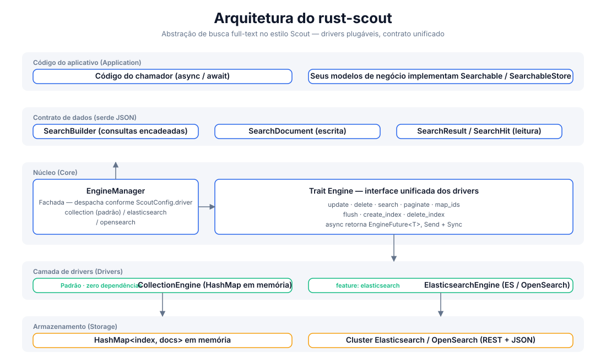
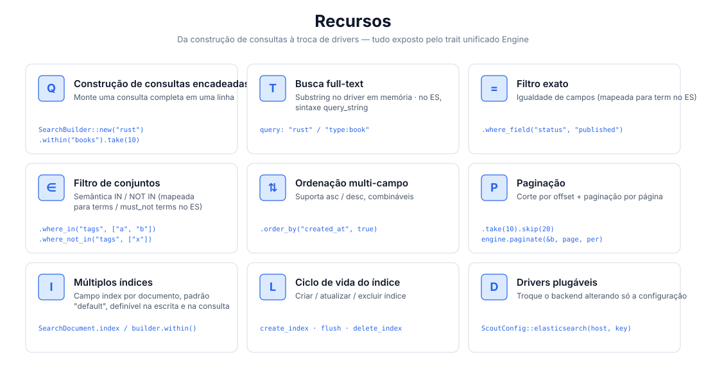
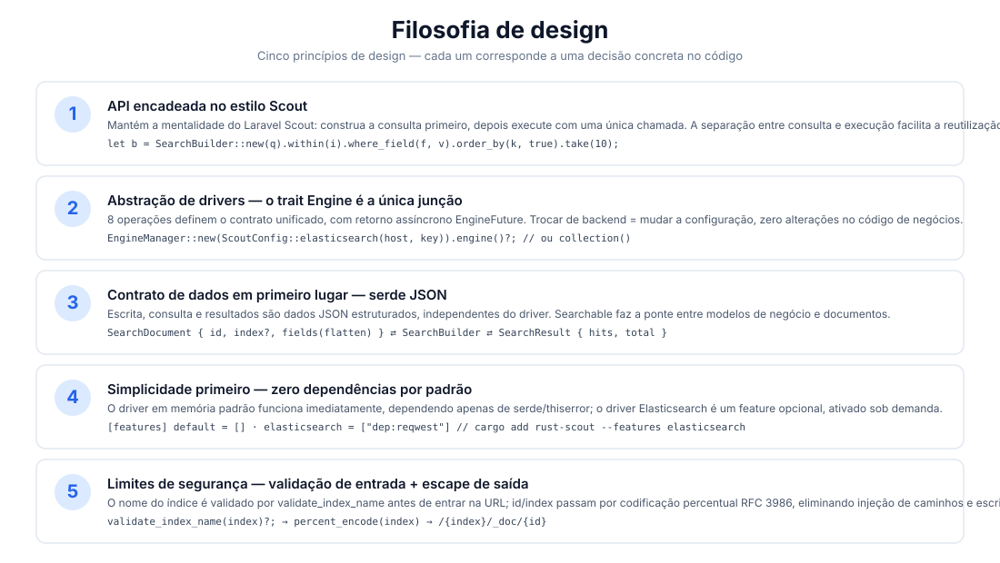
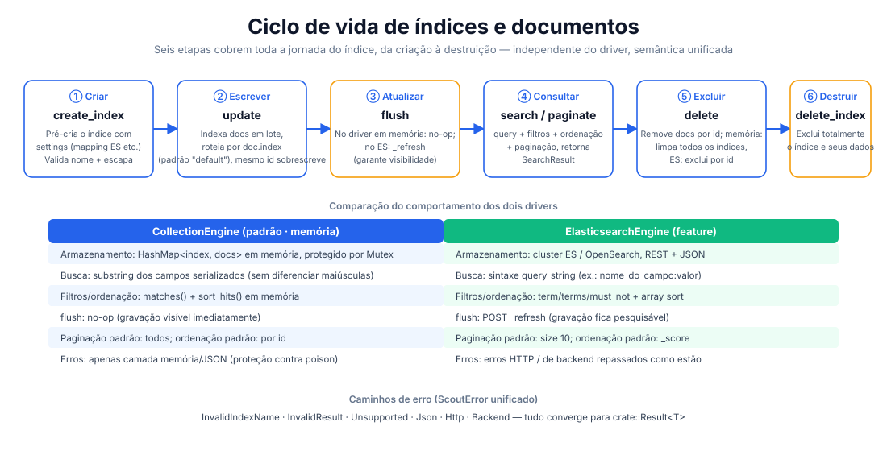

# rust-scout

[](https://crates.io/crates/rust-scout)
[](https://docs.rs/rust-scout)
[](../../../LICENSE)

[简体中文](../../../README.md) · [English](../en/README.md) · [日本語](../ja/README.md) · [한국어](../ko/README.md) · [Русский](../ru/README.md) · [Deutsch](../de/README.md) · [Français](../fr/README.md) · [Español](../es/README.md) · Português · [हिन्दी](../hi/README.md) · [العربية](../ar/README.md) · [বাংলা](../bn/README.md) · [Bahasa Indonesia](../id/README.md)

**rust-scout — abstração de biblioteca de busca full-text** — uma camada de interface de busca full-text leve para Rust. Inspirada na mentalidade de consultas encadeadas do [Laravel Scout](https://laravel.com/docs/scout), abstrai vários backends por meio do trait unificado `Engine`: memória, Elasticsearch/OpenSearch, Meilisearch, Typesense, Algolia, SQLite etc. **No desenvolvimento, use o driver em memória sem dependências; em produção, troque para qualquer backend sem alterar uma linha sequer do código de negócios.**

```rust
let result = engine.search(
    SearchBuilder::new("rust 异步")
        .within("articles")
        .where_field("status", "published")
        .order_by("created_at", true)
        .take(10),
).await?;
```

## Recursos

| Capacidade | Descrição |
|------|------|
| 🔍 Busca full-text | Correspondência de substrings no driver em memória; sintaxe `query_string` no driver ES (`campo:valor`) |
| ⚙️ Consultas encadeadas | `SearchBuilder`: query / within / where_field / where_in / where_not_in / order_by / take / skip |
| 🎯 Filtro exato | Correspondência de igualdade (ES → `term`), correspondência de conjuntos (ES → `terms` / `must_not`) |
| 📄 Ordenação multi-campo | asc / desc podem ser combinados |
| 📃 Paginação | Corte por offset com `take`/`skip` + paginação por página com `paginate(page, per_page)` |
| 🗂️ Múltiplos índices | Roteamento pelo campo `index` em nível de documento, índice padrão `"default"` |
| 🔄 Ciclo de vida do índice | Fluxo completo de `create_index` / `flush` / `delete_index` |
| 🔌 Drivers plugáveis | Padrão em memória sem dependências; features `elasticsearch` / `meilisearch` / `typesense` / `algolia` / `database` / `null` habilitadas sob demanda; `xunsearch` é um stub provisório |
| 🔒 Limites de segurança | Validação do nome do índice (`validate_index_name`) + codificação percentual RFC 3986, eliminando injeção de caminhos |

## Arquitetura



## Visão geral dos recursos



## Filosofia de design



## Ciclo de vida



## Estrutura do projeto

```
rust-scout/
├── Cargo.toml            # 依赖与 feature 声明（elasticsearch 可选）
├── src/
│   ├── lib.rs            # crate 根：模块导出 + 公开类型再导出
│   ├── engine.rs         # Engine trait：驱动统一接口（8 个操作）
│   ├── manager.rs        # EngineManager：门面，按配置分发驱动
│   ├── config.rs         # ScoutConfig + validate_index_name
│   ├── builder.rs        # SearchBuilder：链式查询构建与匹配/排序逻辑
│   ├── document.rs       # SearchDocument：写入文档（serde JSON 契约）
│   ├── result.rs         # SearchResult / SearchHit：查询结果
│   ├── searchable.rs     # Searchable / SearchableStore：业务模型桥接
│   ├── error.rs          # ScoutError + Result<T>
│   ├── collection_engine.rs  # 内存驱动（默认）
│   └── elasticsearch_engine.rs # ES/OpenSearch 驱动（feature 可选）
├── tests/                # 集成测试（当前为空）
├── examples/             # 示例（当前为空）
└── docs/
    ├── svg/              # 本 README 引用的架构/功能/设计/生命周期图
    └── superpowers/specs/ # 设计文档
```

## Início rápido

### 1. Adicionar a dependência

```toml
[dependencies]
rust-scout = "0.1"
tokio = { version = "1", features = ["macros", "rt"] }   # necessário apenas nos exemplos
```

### 2. Exemplo mínimo (driver em memória padrão)

```rust
use rust_scout::{Engine, EngineManager, ScoutConfig, SearchBuilder, SearchDocument};

#[tokio::main]
async fn main() -> rust_scout::Result<()> {
    // Driver padrão: CollectionEngine em memória, funciona imediatamente sem dependências
    let engine = EngineManager::new(ScoutConfig::collection()).engine()?;

    // Escrever documentos
    let mut book = SearchDocument::new(
        "book-1",
        serde_json::json!({
            "title": "Programming Rust",
            "author": "Blandy & Orendorff",
            "tags": ["rust", "systems"],
            "status": "published",
        }),
    )?;
    book.index = Some("books".to_string());
    engine.update(&[book]).await?;

    // Consultar
    let result = engine
        .search(
            SearchBuilder::new("rust")
                .within("books")
                .where_field("status", "published")
                .order_by("title", false)
                .take(10),
        )
        .await?;

    println!("total = {}", result.total);
    for hit in &result.hits {
        println!("  [{}] {:?}", hit.id, hit.source);
    }
    Ok(())
}
```

## Guia de uso

### Construção de consultas (SearchBuilder)

Todas as operações de consulta são encadeadas e, por fim, passadas a `engine.search(&builder)`:

```rust
let builder = SearchBuilder::new("全文关键词")   // Busca full-text (opcional; string vazia = corresponder a tudo)
    .within("articles")                          // Especificar índice (opcional; padrão "default")
    .where_field("status", "published")          // Filtro de igualdade
    .where_in("tags", ["rust", "async"])         // Conjunto IN
    .where_not_in("category", ["draft"])         // Conjunto NOT IN
    .order_by("created_at", true)                // Ordenação multi-campo (true = desc)
    .order_by("title", false)
    .take(20)                                    // Quantidade por página
    .skip(40);                                   // Offset
```

> `query` aceita a sintaxe `query_string` do Lucene (completa no driver ES):
> `"rust"`, `"title:rust AND tags:async"`, `"rust~2"` (difuso). O driver em memória faz correspondência por substring.

### Paginação

```rust
// Forma 1: corte por offset
let page2 = SearchBuilder::new("rust").within("books").skip(10).take(10);
// Forma 2: paginação por página (page começa em 1)
let page2 = engine.paginate(&SearchBuilder::new("rust").within("books"), 2, 10).await?;
```

### Múltiplos índices e ciclo de vida

```rust
engine.create_index("books", serde_json::json!({})).await?;   // Criar índice
engine.update(&docs).await?;                                  // Escrever documentos
engine.flush("books").await?;                                 // Atualizar visibilidade
engine.delete(&["book-1".to_string()]).await?;                // Excluir documentos
engine.delete_index("books").await?;                          // Excluir índice
```

### Alternar para Elasticsearch / OpenSearch

```bash
cargo add rust-scout --features elasticsearch
```

```rust
use rust_scout::{Engine, EngineManager, ScoutConfig};

let config = ScoutConfig::elasticsearch(
    "http://127.0.0.1:9200",      // ou endereço do OpenSearch
    Some("your-api-key".into()),   // opcional: autenticação por ApiKey
);
let engine = EngineManager::new(config).engine()?;
// —— a partir daqui, todas as operações são idênticas às do driver em memória ——
```

| Item | CollectionEngine (padrão) | ElasticsearchEngine |
|--------|--------------------------|---------------------|
| Dependências | apenas serde / thiserror | reqwest (feature habilitada) |
| Full-text | correspondência por substring serializada | `query_string` |
| Filtros | matches() em memória | term / terms / must_not |
| Ordenação | sort_hits() em memória | array sort |
| flush | no-op | `_refresh` |
| Paginação padrão | todos os resultados | size 10 |
| Ordenação padrão | por id | por _score |

### Alternar para Meilisearch

```bash
cargo add rust-scout --features meilisearch
```

```rust
use rust_scout::{Engine, EngineManager, ScoutConfig};

let config = ScoutConfig::meilisearch(
    "http://127.0.0.1:7700",   // Endereço do serviço Meilisearch
    "your-master-key",          // opcional: chave da API
);
let engine = EngineManager::new(config).engine()?;
// —— a partir daqui, todas as operações são idênticas às do driver em memória ——
```

### Comparação de engines

| Engine | driver | feature | Status |
|------|--------|---------|------|
| Em memória (padrão) | `collection` | embutido | Completo |
| Elasticsearch / OpenSearch | `elasticsearch` / `opensearch` | `elasticsearch` | Completo |
| Meilisearch | `meilisearch` | `meilisearch` | Completo |
| Typesense | `typesense` | `typesense` | Completo |
| Algolia | `algolia` | `algolia` | Completo |
| SQLite | `database` | `database` | Completo |
| Null (testes/desativar busca) | `null` | `null` | Completo |
| XunSearch | `xunsearch` | `xunsearch` | stub (a implementar) |

Os construtores de configuração dos demais engines estão em [docs.rs](https://docs.rs/rust-scout): `ScoutConfig::typesense(host, api_key)`, `ScoutConfig::algolia(app_id, api_key)`, `ScoutConfig::database(url, fields)`, `ScoutConfig::null()`, `ScoutConfig::xunsearch(host, project)`.

> No engine SQLite (`database`), `total` é a contagem no nível do SQL (índice + pré-filtro LIKE);
> após a filtragem em memória dos wheres / soft delete, `hits.len()` pode ser menor que `total`; a paginação usa hits.

### Campos reservados

`__soft_deleted` é o nome de campo reservado usado pelo recurso de soft delete (`Engine::soft_delete`, `SearchBuilder::with_trashed()`
/ `only_trashed()`), por meio do qual o engine filtra documentos excluídos logicamente. Documentos de usuários **não devem**
usar esse nome de campo como campo de negócio.

### Tratamento de erros

Todas as operações retornam `crate::Result<T>`, e os erros convergem para o `ScoutError` unificado:

- `InvalidIndexName` —— nome de índice contém espaços / `/` / começa com `.` etc. (validado antes da escrita)
- `InvalidResult` —— campo de documento não é um objeto JSON
- `Unsupported` —— feature não habilitada etc.
- `Json` —— erros do serde
- `Http` / `Backend` —— erros de rede e de backend do driver ES (quando o feature está habilitado)

### Integração com modelos de negócio (Searchable)

Implemente `Searchable` para mapear estruturas de negócio em documentos indexáveis e implemente `SearchableStore` para encapsular
as três operações `index_documents` / `remove_documents` / `search`:

```rust
use rust_scout::{Searchable, SearchableStore, SearchDocument, SearchResult};

struct Article { id: String, title: String, body: String }

impl Searchable for Article {
    fn searchable_id(&self) -> String { self.id.clone() }
    fn to_searchable_json(&self) -> serde_json::Value {
        serde_json::json!({ "title": self.title, "body": self.body })
    }
}
```

## Suporte e doações

Se este projeto foi útil para você, considere fazer uma doação ☕ — seu apoio mantém o desenvolvimento!

### WeChat / Alipay


Escaneie para WeChat · Escaneie para Alipay

### Doações em criptomoedas

| Rede | Endereço da carteira | QR code |
|------|----------|--------|
| BNB Smart Chain (BEP20) | `0x355d429f97511897ccb4e271ec888205f9ab6629` |  |
| Tron (TRC20) | `TEdDHWLajt1XvqtPDWmQctdrJaC3pzZZzz` |  |
| Ethereum (ERC20) | `0x355d429f97511897ccb4e271ec888205f9ab6629` |  |
| Aptos | `0x836e3780edfc3f7b2372b39e2a1a3a5d7adfaccd96c726f21cfde1b50dd68030` |  |
| Plasma | `0x355d429f97511897ccb4e271ec888205f9ab6629` |  |
| Polygon POS | `0x355d429f97511897ccb4e271ec888205f9ab6629` |  |
| Solana | `2hfhboHdmdrYsY25XfQSsEWxq5ip4EQsR7f4AzSRMUyr` |  |
| The Open Network (TON) | `UQB9kFQohzmXUir9QSSZq01iwl9aQZIDdBpNmDklljRtCoGK` |  |
| Arbitrum One | `0x355d429f97511897ccb4e271ec888205f9ab6629` |  |
| AVAX C-Chain | `0x355d429f97511897ccb4e271ec888205f9ab6629` |  |

### Transferência internacional (remessa bancária)

**Dados do beneficiário**

- Nome do beneficiário: WANG KEXUN
- Número da conta do beneficiário: 881015918251

**Banco receptor (ZA Bank)**

- Código SWIFT: `AABLHKHHXXX`
- Nome do banco: ZA Bank Limited
- Número do banco: 387
- Endereço do banco: Core F, Cyberport 3, 100 Cyberport Road, Hong Kong

> Informações do banco correspondente (intermediário) para remessas transfronteiriças, não do banco do beneficiário. Verifique com seu banco se essas informações são necessárias.

- Para remessas em dólar de Hong Kong (HKD), renminbi (CNY) e dólar americano (USD), o banco correspondente é o **Citibank**:
  - Nome do banco: Citibank N.A. Hong Kong
  - Código SWIFT: `CITIHKHXXXX`
  - Número do banco: 006 / Número da agência: 391
  - Nome da agência: Hong Kong Branch
  - Endereço do banco: Citibank Tower, Citibank Plaza, 3 Garden Road, Central, Hong Kong
- Para remessas em outras moedas, o banco correspondente é o **BNY Mellon**:
  - Nome do banco: THE BANK OF NEW YORK MELLON
  - Código SWIFT: `IRVTUS3NXXX`
  - Endereço do banco: THE BANK OF NEW YORK MELLON, 240 GREENWICH STREET, NEW YORK, United States

## Licença

Licença MIT. Consulte [LICENSE](../../../LICENSE) para mais detalhes.
