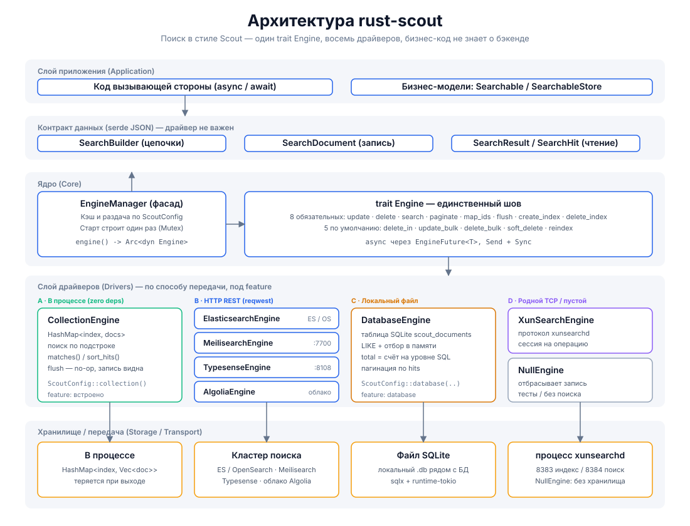
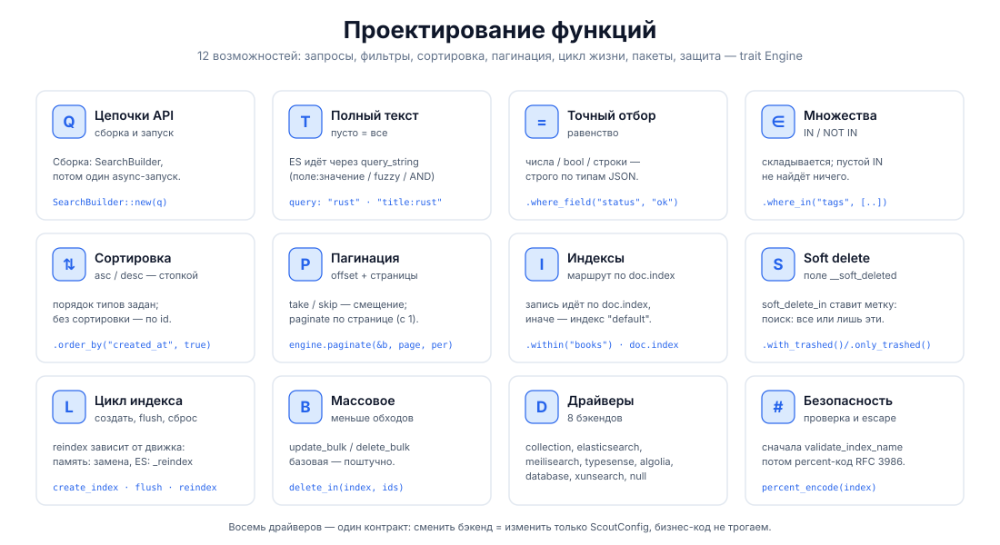
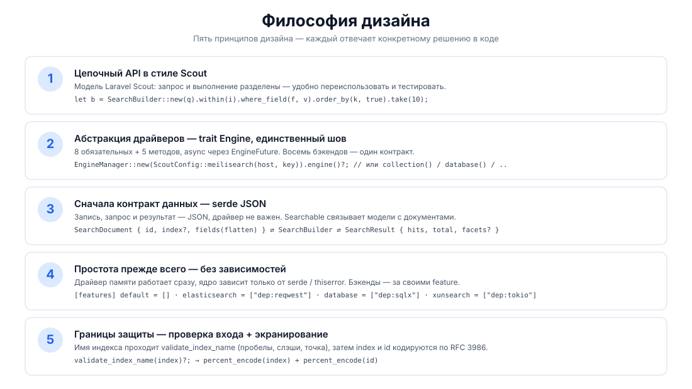
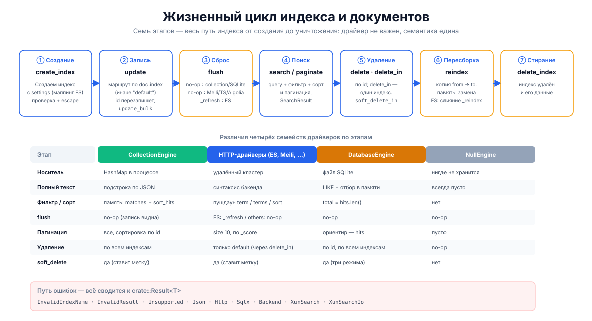

# rust-scout

[](https://crates.io/crates/rust-scout)
[](https://docs.rs/rust-scout)
[](../../../LICENSE)

[简体中文](../../../README.md) · [English](../en/README.md) · [日本語](../ja/README.md) · [한국어](../ko/README.md) · [Bahasa Indonesia](../id/README.md) · Русский · [Deutsch](../de/README.md) · [Français](../fr/README.md) · [Español](../es/README.md) · [Português](../pt/README.md) · [हिन्दी](../hi/README.md) · [العربية](../ar/README.md) · [বাংলা](../bn/README.md)

**rust-scout — абстракция библиотеки полнотекстового поиска** — лёгкий слой интерфейса
полнотекстового поиска для Rust. Заимствуя модель цепочечных запросов
[Laravel Scout](https://laravel.com/docs/scout), он через единый trait `Engine`
абстрагирует **8 бэкендов** (память, Elasticsearch/OpenSearch, Meilisearch,
Typesense, Algolia, SQLite, XunSearch, Null): **драйвер в памяти без зависимостей
для разработки, бесшовное переключение на любой бэкенд в продакшене, без изменения
ни одной строки бизнес-кода.**


> Питомец проекта **ищейка Scout** (Search Hound) — вынюхивает документы, отслеживает индексы.
> Он не только в документации: он есть в баннере терминала и в подсказках к ошибкам,
> см. [Питомец проекта](#питомец-проекта).

```rust
let result = engine.search(
    SearchBuilder::new("rust 异步")
        .within("articles")
        .where_field("status", "published")
        .order_by("created_at", true)
        .take(10),
).await?;
```

## Возможности

| Возможность | Описание |
|------|------|
| 🔍 Полнотекстовый поиск | В драйвере памяти — сопоставление подстрок; HTTP-драйверы используют родной синтаксис бэкенда (ES: `query_string`, `поле:значение`) |
| ⚙️ Цепочки запросов | `SearchBuilder`: query / within / where_field / where_in / where_not_in / order_by / take / skip / option |
| 🎯 Точная фильтрация | Сравнение на равенство (ES → `term`), фильтрация по множеству (ES → `terms` / `must_not`) |
| 📄 Сортировка по полям | Складываемые asc / desc, детерминированный порядок при сравнении разных типов JSON |
| 📃 Пагинация | Смещение `take`/`skip` + постраничная `paginate(page, per_page)` |
| 🗂️ Несколько индексов | Маршрутизация по полю `index` документа, индекс по умолчанию `"default"` |
| 🔄 Жизненный цикл индекса | Полный цикл `create_index` / `flush` / `reindex` / `delete_index` |
| 🗑️ Мягкое удаление | `soft_delete_in(index, ids)` ставит метку `__soft_deleted`; три режима фильтрации `with_trashed()` / `only_trashed()` |
| 📦 Пакетные операции | `update_bulk` / `delete_bulk` сокращают число обращений; `delete_in` удаляет точно в указанном индексе |
| 🔌 Сменные драйверы | По умолчанию память без зависимостей; 8 бэкендов за своими feature — неиспользуемое не компилируется |
| 🔒 Границы безопасности | Проверка имени индекса (`validate_index_name`) + процентное кодирование RFC 3986 против инъекций в путь |
| 🐕 Питомец проекта | Ищейка Scout: баннер в терминале + подсказки по каждой ошибке (`rust_scout::pet`) |

## Архитектура



Пять слоёв: приложение → контракт данных (serde JSON) → ядро (`EngineManager` + trait `Engine`)
→ драйверы (по способу передачи — четыре группы, всего 8 драйверов) → хранилище. Единственный
шов между слоями — trait `Engine`.

## Проектирование функций



12 возможностей: цепочки запросов, полный текст, точная фильтрация и по множеству, сортировка,
пагинация, несколько индексов, мягкое удаление, жизненный цикл индекса, пакетное и точное
удаление, сменные драйверы, границы безопасности.

## Философия дизайна



## Жизненный цикл



Семь этапов: создание → запись → сброс → поиск → удаление документов → переиндексация → уничтожение.
Нижняя половина схемы сравнивает поведение четырёх семейств драйверов на каждом этапе.

## Структура проекта

```
rust-scout/
├── Cargo.toml              # зависимости и features (default = [], без зависимостей)
├── src/
│   ├── lib.rs              # корень crate: экспорт модулей + реэкспорт публичных типов под feature
│   │
│   ├── engine.rs           # trait Engine: единственный контракт драйвера (8 обязательных + 5 по умолчанию)
│   ├── manager.rs          # EngineManager: фасад, диспетчеризация по driver и кэш Arc<dyn Engine>
│   ├── config.rs           # ScoutConfig (8 конструкторов) + validate_index_name + percent_encode
│   │
│   ├── builder.rs          # SearchBuilder / Where / Order / TrashedFilter: цепочки запросов
│   ├── document.rs         # SearchDocument: записываемый документ (контракт serde JSON)
│   ├── result.rs           # SearchResult / SearchHit: результаты запроса
│   ├── searchable.rs       # Searchable / SearchableStore: мост к бизнес-моделям
│   ├── error.rs            # ScoutError + Result<T> + pet_hint()
│   ├── pet.rs              # питомец проекта: ищейка Scout (баннер + подсказки к ошибкам)
│   │
│   ├── collection_engine.rs    # драйвер в памяти (по умолчанию, без зависимостей)
│   ├── null_engine.rs          # пустой драйвер: отбрасывает запись, всегда пусто   [null]
│   ├── elasticsearch_engine.rs # ES / OpenSearch (REST)                            [elasticsearch]
│   │   └── query.rs            #   построение query_string и разбор ответа
│   ├── meilisearch_engine.rs   # Meilisearch (REST)                                [meilisearch]
│   ├── typesense_engine.rs     # Typesense (REST)                                  [typesense]
│   │   └── typesense_query.rs  #   параметры поиска и построение filter_by
│   ├── algolia_engine.rs       # Algolia (облачный REST)                           [algolia]
│   ├── database_engine.rs      # SQLite (sqlx, грубый отбор LIKE + точный в памяти) [database]
│   ├── xunsearch_engine.rs     # XunSearch: родной TCP-протокол xunsearchd         [xunsearch]
│   │   ├── xunsearch_query.rs  #   кодек пакетов + схема полей ini
│   │   └── xunsearch_tests.rs  #   сквозные тесты с mock-сервером
│   │
│   └── (модульные тесты встроены в конец каждого модуля: #[cfg(test)] mod tests)
├── tests/                  # интеграционные тесты (пока пусто, тесты внутри src)
├── examples/
│   └── pet.rs              # cargo run --example pet: баннер питомца + демо подсказок
└── docs/
    ├── svg/                # питомец + схемы архитектуры / функций / дизайна / жизненного цикла
    ├── i18n/               # README и соответствующие SVG для 12 языков
    ├── coin/               # QR-коды для донатов
    └── superpowers/specs/  # проектные документы
```

> Метка `[feature]` указывает Cargo feature, необходимую драйверу. Если она выключена,
> `EngineManager` вернёт `ScoutError::Unsupported`, а не деградирует молча.

### Различия в возможностях драйверов

Драйвер в памяти по умолчанию — семантический эталон. Если бэкенд чего-то не умеет, он **говорит
об этом прямо**, а не молча возвращает неверный результат:

| Драйвер | Ограничение | Поведение |
|--------|-----------|-----------|
| Algolia | Сортировка требует заранее построенных индексов-реплик; выбрать её для отдельного запроса нельзя | `order_by` **игнорируется** (результаты всё равно возвращаются, порядок просто не определён) |
| XunSearch | Нет команды протокола для `where_in` / `where_not_in` | возвращает `Unsupported`; используйте `where_field` |
| XunSearch | Сервер поддерживает только одно поле сортировки | несколько `order_by` возвращают `Unsupported` |
| XunSearch | Мягкое удаление не реализовано | `soft_delete` / `only_trashed` возвращают `Unsupported` |
| XunSearch | Для создания индекса нужен ini со схемой полей | `create_index` возвращает `Unsupported` (передайте ini в `XunSearchEngine::new`) |

Есть два намеренных семантических соответствия:

- **Когда ES получает некорректный синтаксис запроса** (`"("`, `"foo AND"`), он возвращает
  пустой результат, а не ошибку — драйвер в памяти для того же ввода ищет подстроку, а ответ
  400 сломал бы принцип «меняешь бэкенд — код остаётся».
- **`delete` и `soft_delete` не несут информации об индексе**, поэтому охватывают ли они
  несколько индексов — зависит от бэкенда. Чтобы нацелиться на один индекс, всегда используйте
  `delete_in` / `soft_delete_in`.

## Быстрый старт

### 1. Добавьте зависимость

```toml
[dependencies]
rust-scout = "0.6"
tokio = { version = "1", features = ["macros", "rt"] }   # только для примера
```

### 2. Минимальный пример (драйвер в памяти по умолчанию)

```rust
use rust_scout::{Engine, EngineManager, ScoutConfig, SearchBuilder, SearchDocument};

#[tokio::main]
async fn main() -> rust_scout::Result<()> {
    // драйвер по умолчанию: CollectionEngine в памяти, без зависимостей
    let engine = EngineManager::new(ScoutConfig::collection()).engine()?;

    // записываем документ
    let mut book = SearchDocument::new(
        "book-1",
        serde_json::json!({
            "title": "Programming Rust",
            "author": "Blandy & Orendorff",
            "tags": ["rust", "systems"],
            "status": "published",
        }),
    )?;
    book.index = Some("books".to_string());
    engine.update(&[book]).await?;

    // запрос
    let result = engine
        .search(
            SearchBuilder::new("rust")
                .within("books")
                .where_field("status", "published")
                .order_by("title", false)
                .take(10),
        )
        .await?;

    println!("total = {}", result.total);
    for hit in &result.hits {
        println!("  [{}] {:?}", hit.id, hit.source);
    }
    Ok(())
}
```

## Использование

### Построение запроса (SearchBuilder)

Все операции запроса собираются в цепочку и затем передаются в `engine.search(&builder)`:

```rust
let builder = SearchBuilder::new("ключевые слова")  // полный текст (необязательно, пусто = все)
    .within("articles")                          // целевой индекс (необязательно, по умолчанию "default")
    .where_field("status", "published")          // фильтр по равенству
    .where_in("tags", ["rust", "async"])         // множество IN
    .where_not_in("category", ["draft"])         // множество NOT IN
    .order_by("created_at", true)                // сортировка по полям (true = desc)
    .order_by("title", false)
    .take(20)                                    // размер страницы
    .skip(40)                                    // смещение
    .option("highlight", true)                   // сквозные опции конкретного драйвера
    .with_trashed();                             // три состояния мягкого удаления: скрыть / с ними / только они
```

> `query` поддерживает синтаксис Lucene `query_string` (полностью работает в драйвере ES):
> `"rust"`, `"title:rust AND tags:async"`, `"rust~2"` (нечёткий поиск). Остальные драйверы
> используют родной синтаксис или сопоставление подстрок.

### Пагинация

```rust
// Вариант 1: усечение по смещению
let page2 = SearchBuilder::new("rust").within("books").skip(10).take(10);
// Вариант 2: постранично (page начинается с 1)
let page2 = engine.paginate(&SearchBuilder::new("rust").within("books"), 2, 10).await?;
```

### Несколько индексов и жизненный цикл

```rust
engine.create_index("books", serde_json::json!({})).await?;    // создать индекс
engine.update(&docs).await?;                                   // записать документы
engine.update_bulk(&docs).await?;                              // пакетная запись (родной bulk, если поддерживается)
engine.flush("books").await?;                                  // обновить видимость
engine.search(&builder).await?;                                // запрос
engine.delete_in("books", &["book-1".to_string()]).await?;     // удалить документы из одного индекса
engine.soft_delete_in("books", &["book-2".to_string()]).await?;            // мягкое удаление (ставит метку)
engine.reindex("books", "books_v2").await?;                    // перестроить индекс
engine.delete_index("books").await?;                           // удалить индекс
```

> `delete` не несёт информации об индексе, поэтому его семантика зависит от движка
> (драйвер памяти удаляет по всем индексам, ES затрагивает только `default`).
> Чтобы указать индекс точно, используйте `delete_in`.
>
> Мягкое удаление — так же: **`soft_delete_in(index, ids)` надёжен независимо от движка**.
> `soft_delete` без индекса может помечать документы по всем индексам только на
> синхронном бэкенде (`collection` / `database`); HTTP-бэкенды так не умеют и возвращают
> `ScoutError::Unsupported` (а не молча ничего не делают).
>
> Контракт `flush` — «обновить видимость записей», **ни один драйвер не очищает индекс**:
> ES выполняет `_refresh`, остальные драйверы делают записи видимыми сразу, поэтому это
> no-op. Чтобы очистить индекс, используйте `delete_index`.

### Переключение на Elasticsearch / OpenSearch

```bash
cargo add rust-scout --features elasticsearch
```

```rust
use rust_scout::{Engine, EngineManager, ScoutConfig};

let config = ScoutConfig::elasticsearch(
    "http://127.0.0.1:9200",      // или адрес OpenSearch
    Some("your-api-key".into()),  // необязательно: аутентификация ApiKey
);
let engine = EngineManager::new(config).engine()?;
// —— дальше все операции полностью совпадают с драйвером в памяти ——
```

| Пункт | CollectionEngine (по умолчанию) | ElasticsearchEngine |
|--------|--------------------------|---------------------|
| Зависимости | только serde / thiserror | reqwest (при включённой feature) |
| Полный текст | Сопоставление подстрок по сериализации | `query_string` |
| Фильтрация | matches() в памяти | term / terms / must_not |
| Сортировка | sort_hits() в памяти | массив sort |
| flush | no-op | `_refresh` |
| Пагинация по умолчанию | Все результаты | size 10 |
| Сортировка по умолчанию | По id | По _score |

### Переключение на Meilisearch

```bash
cargo add rust-scout --features meilisearch
```

```rust
use rust_scout::{Engine, EngineManager, ScoutConfig};

let config = ScoutConfig::meilisearch(
    "http://127.0.0.1:7700",   // адрес Meilisearch
    "your-master-key",          // необязательно: API-ключ
);
let engine = EngineManager::new(config).engine()?;
// —— дальше все операции полностью совпадают с драйвером в памяти ——
```

### Сравнение движков

| Движок | driver | feature | Передача | Состояние |
|------|--------|---------|-----------|--------|
| В памяти (по умолчанию) | `collection` | встроено | В процессе | Полный |
| Elasticsearch / OpenSearch | `elasticsearch` / `opensearch` | `elasticsearch` | HTTP REST | Полный |
| Meilisearch | `meilisearch` | `meilisearch` | HTTP REST | Полный |
| Typesense | `typesense` | `typesense` | HTTP REST | Полный |
| Algolia | `algolia` | `algolia` | HTTP REST | Полный |
| SQLite | `database` | `database` | Локальный файл | Полный |
| XunSearch | `xunsearch` | `xunsearch` | Родной TCP | Полный |
| Null (тесты / отключение поиска) | `null` | `null` | — | Полный |

Конструкторы конфигурации остальных движков описаны на [docs.rs](https://docs.rs/rust-scout): `ScoutConfig::typesense(host, api_key)`, `ScoutConfig::algolia(app_id, api_key)`, `ScoutConfig::database(url, fields)`, `ScoutConfig::null()`, `ScoutConfig::xunsearch(host, project)`.

> В движке SQLite (`database`) `total` считается на уровне SQL (индекс + грубый отбор LIKE);
> после фильтрации wheres / мягких удалений в памяти возможно `hits.len() < total`,
> а пагинация опирается на hits.

### Зарезервированные поля

`__soft_deleted` — имя зарезервированного поля, используемого мягким удалением
(`Engine::soft_delete_in`, `SearchBuilder::with_trashed()` / `only_trashed()`); по нему движки
отфильтровывают мягко удалённые документы. Пользовательским документам **не следует**
использовать это имя поля как бизнес-поле.

### Обработка ошибок

Все операции возвращают `crate::Result<T>`, а ошибки сводятся к единому `ScoutError`:

| Вариант | Когда возникает | feature |
|---------|--------------|---------|
| `InvalidIndexName` | имя индекса содержит пробел / `/` / `\`, начинается с `.` или пусто (проверяется перед записью) | встроено |
| `InvalidResult` | поле документа не является JSON-объектом | встроено |
| `Unsupported` | нужная драйверу feature выключена, не хватает обязательной конфигурации или движок не поддерживает операцию | встроено |
| `Json` | ошибка сериализации / десериализации serde | встроено |
| `Http` | HTTP-запрос не удался (соединение, таймаут, код состояния) | четыре HTTP-движка |
| `Sqlx` | ошибка SQLite | `database` |
| `Backend` | бэкенд вернул ответ с ошибкой, исходное сообщение передано как есть | четыре HTTP-движка / `xunsearch` |
| `XunSearch` / `XunSearchIo` | сбой разбора протокола / сбой TCP I/O | `xunsearch` |

Каждый вариант несёт подсказку по устранению — см. [`ScoutError::pet_hint()`](#питомец-проекта).

### Мост к бизнес-моделям (Searchable)

Реализуйте `Searchable`, чтобы отобразить бизнес-структуру в индексируемый документ,
и `SearchableStore`, чтобы инкапсулировать три операции `index_documents` /
`remove_documents` / `search`:

```rust
use rust_scout::{Searchable, SearchableStore, SearchDocument, SearchResult};

struct Article { id: String, title: String, body: String }

impl Searchable for Article {
    fn searchable_id(&self) -> String { self.id.clone() }
    fn to_searchable_json(&self) -> serde_json::Value {
        serde_json::json!({ "title": self.title, "body": self.body })
    }
}
```

## Питомец проекта


**Scout · ищейка** (Search Hound) — вынюхивает документы, отслеживает индексы: где запрос, там и он.
Графическая версия — в [`svg/pet.svg`](svg/pet.svg); в терминале он выглядит так:

```console
$ cargo run --example pet
```

```

      ___              ___
     /   \            /   \
    |     |__________|     |
    |     /          \     |
    |    |   o    o   |    |
    |    |     __     |    |
    |     \   /  \   /     |
     \     \  \__/  /     /
      \     \________/    /
       \_________________/
         \   ~~~~~~   /
          \__________/
             |    |
            _|    |_
           |__|  |__|


   ,^.     ,^.     ,^.     ,^.

  Scout · 嗅探猎犬 · rust-scout
  嗅探文档，追踪索引 —— 哪里有查询，哪里就有它
```

Питомец живёт в модуле [`rust_scout::pet`](../../../src/pet.rs) и **не приносит зависимостей**:

| Пункт | Описание |
|----|------|
| `pet::NAME` / `pet::SPECIES` / `pet::TAGLINE` | данные бейджа |
| `pet::ART` | ASCII-портрет (намеренно только 7-битный ASCII, чтобы не «плыл» в CJK-терминалах) |
| `pet::banner()` | баннер для терминала; чистый текст без escape-последовательностей, безопасен для логов |
| `pet::hint(&err)` | подсказка по каждой ошибке, возвращает `&'static str` |
| `pet::format_error(&err)` | исходная ошибка + подсказка, отрендеренные для человека |
| `ScoutError::pet_hint()` | та же подсказка, привязанная к самому типу ошибки |

```rust
use rust_scout::{pet, ScoutError};

println!("{}", pet::banner());

let err = ScoutError::Unsupported("нет feature".into());
eprintln!("{}", pet::format_error(&err));
// error: unsupported operation: нет feature
//
//   [o_o] Scout：这个后端我还没找到路 —— Cargo.toml 里对应的 feature 启用了吗？
```

> **Почему подсказки не встроены прямо в `Display`?** `Display` у `ScoutError` остаётся
> однострочным и машиночитаемым — от него зависят распространение через `?`, сбор логов
> и grep по строкам ошибок в CI. Для человекочитаемого вывода с подсказкой питомца
> вызывайте `pet::format_error()`.

## Поддержка и донаты

Если проект оказался вам полезен, поддержите его донатом ☕ — ваша поддержка движет дальнейшую разработку!

### WeChat / Alipay


Сканируйте в WeChat · Сканируйте в Alipay

### Донат в криптовалюте

| Сеть | Адрес кошелька | QR-код |
|------|----------|--------|
| BNB Smart Chain (BEP20) | `0x355d429f97511897ccb4e271ec888205f9ab6629` |  |
| Tron (TRC20) | `TEdDHWLajt1XvqtPDWmQctdrJaC3pzZZzz` |  |
| Ethereum (ERC20) | `0x355d429f97511897ccb4e271ec888205f9ab6629` |  |
| Aptos | `0x836e3780edfc3f7b2372b39e2a1a3a5d7adfaccd96c726f21cfde1b50dd68030` |  |
| Plasma | `0x355d429f97511897ccb4e271ec888205f9ab6629` |  |
| Polygon POS | `0x355d429f97511897ccb4e271ec888205f9ab6629` |  |
| Solana | `2hfhboHdmdrYsY25XfQSsEWxq5ip4EQsR7f4AzSRMUyr` |  |
| The Open Network (TON) | `UQB9kFQohzmXUir9QSSZq01iwl9aQZIDdBpNmDklljRtCoGK` |  |
| Arbitrum One | `0x355d429f97511897ccb4e271ec888205f9ab6629` |  |
| AVAX C-Chain | `0x355d429f97511897ccb4e271ec888205f9ab6629` |  |

### Переводы по всему миру (банковский перевод)

**Данные получателя**

- Имя получателя: WANG KEXUN
- Номер счёта получателя: 881015918251

**Банк-получатель (ZA Bank)**

- SWIFT Code: `AABLHKHHXXX`
- Название банка: ZA Bank Limited
- Код банка: 387
- Адрес банка: Core F, Cyberport 3, 100 Cyberport Road, Hong Kong

> Информация о банке-корреспонденте ниже относится к трансграничным переводам, а не к банку-получателю. Уточните в банке-отправителе, требуется ли её указывать.

- Банк-корреспондент для переводов в гонконгских долларах, юанях и долларах США — **Citibank**:
  - Название банка: Citibank N.A. Hong Kong
  - SWIFT Code: `CITIHKHXXXX`
  - Код банка: 006 / Код отделения: 391
  - Название отделения: Hong Kong Branch
  - Адрес банка: Citibank Tower, Citibank Plaza, 3 Garden Road, Central, Hong Kong
- Банк-корреспондент для переводов в других валютах — **BNY Mellon**:
  - Название банка: THE BANK OF NEW YORK MELLON
  - SWIFT Code: `IRVTUS3NXXX`
  - Адрес банка: THE BANK OF NEW YORK MELLON, 240 GREENWICH STREET, NEW YORK, United States

## Лицензия

MIT License. Подробности в [LICENSE](../../../LICENSE).
